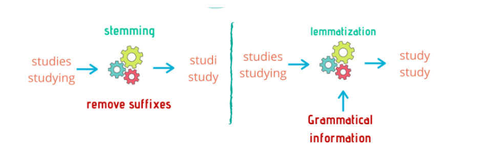

# Normalization

## What is Normalization and why is it Important?

**Normalization** in text pre-processing refers to the process of transforming text into a consistent, standardized format so that natural language processing (NLP) systems, like AI chatbots, can analyze and interpret it accurately. Since the same word or phrase can appear in many forms—such as “Help,” “help,” or “HELP!”—normalization reduces these variations by applying transformations like **lowercasing**, **removing punctuation**, and **stripping extra whitespace**. It also involves more advanced techniques such as **stemming** and **lemmatization**. **Stemming** reduces words to their base or root form by chopping off prefixes or suffixes (e.g., “helping” → “help”), often without regard for proper grammar, while **lemmatization** goes a step further by converting words to their dictionary root form (lemma) using linguistic rules (e.g., “better” → “good”). Normalization may also expand contractions (e.g., “don’t” → “do not”) and standardize spelling (e.g., “colour” → “color”). These steps are critical in chatbot development because they ensure that semantically equivalent inputs are treated uniformly, improving intent detection, entity extraction, and overall conversational accuracy.

## Stopwords, what are they and why remove them?

**Stopwords** are common words in a language—such as “the,” “is,” “and,” “in,” “on,” and “at”—that typically carry little meaningful information on their own when it comes to tasks like intent recognition or text classification in AI chatbots. While these words are essential for human communication, they often act as **noise** in natural language processing because they occur so frequently that they don't help differentiate between user intents or key entities. Removing stopwords during text pre-processing helps reduce the amount of data the model has to analyze, allowing it to focus on the most informative words that convey the core meaning of a user’s input. For example, in the sentence *"What is the weather like in New York?"*, removing stopwords leaves *"weather,"* *"like,"* and *"New York,"* which are much more relevant for determining intent. This improves computational efficiency and can enhance the chatbot's ability to match inputs with the correct responses or actions. However, stopword removal should be done carefully, as in some contexts certain stopwords might carry important meaning (e.g., in sentiment analysis or when working with specific commands).

## Removing Stopwords with NLTK

To accomplish this task we need to accomplish a couple of steps

1. We need to import `stopwords` class from `nltk.corpus`
2. We need to grab the words from the right language and save them onto a set
3. We will utilize a list literal to iterate through a set of tokenized words and build a new list holding all words that are not in stopwords.

```python
from nltk.tokenize import sent_tokenize, word_tokenize
from nltk.corpus import stopwords 
import re

file = open("./resources/full-stack-quest.md")
text_from_file = file.read()
file.close()

clean_text = re.sub(r'[#|*|-|_|\U0001F525]', '', text_from_file)

story_tokenized_by_word = word_tokenize(clean_text)
print(len(story_tokenized_by_word))

stop_words = set(stopwords.words("english"))
stopwords_removed = [word for word in story_tokenized_by_word if word not in stop_words]

print(len(stopwords_removed))
```

## Stemming

**Stemming** is a text normalization technique in natural language processing (NLP) that reduces words to their base or root form by stripping away prefixes or suffixes, without necessarily ensuring that the resulting stem is a valid word in the language. For example, stemming might reduce words like *“running”*, *“runner”*, and *“runs”* to *“run”*, or even more crudely to *“runn”*, depending on the stemming algorithm used. One of the most common algorithms is the **Porter Stemmer**, which applies a set of heuristic rules to perform this reduction. The importance of stemming in text normalization lies in its ability to group together different forms of a word so that they can be treated as the same feature by machine learning models. This simplifies the vocabulary the chatbot has to work with and improves its ability to recognize patterns across variations of words, enhancing tasks like intent classification and keyword matching. By consolidating word forms, stemming helps chatbots generalize better from training data, reduces computational complexity, and improves efficiency during both training and inference. However, since stemming can sometimes produce non-dictionary stems, it’s important to balance its use with other techniques like lemmatization when grammatical correctness is needed.

### Applying Stemming with NLTK

```python
from nltk.stem import PorterStemmer
stemmer = PorterStemmer()
stemmed_words = [stemmer.stem(w) for w in stopwords_removed]
print(stemmed_words)
```

## Lemmatization

**Lemmatization** is a text normalization technique in natural language processing (NLP) that reduces words to their base or **dictionary form** (known as a lemma) using linguistic knowledge, such as a word’s part of speech and meaning. Unlike stemming, which simply chops off word endings based on heuristics, lemmatization ensures that the resulting word is a valid word in the language. For example, lemmatization would reduce *“running”* to *“run”* and *“better”* to *“good”*, recognizing their grammatical relationships. In chatbot development, lemmatization plays an important role in improving intent detection and entity recognition by ensuring that semantically identical or related words are treated as the same concept. This helps the model focus on the true meaning of the user’s input while maintaining grammatical correctness. Although lemmatization is generally more computationally expensive than stemming, it often leads to more accurate and natural language understanding, making it particularly valuable in applications where precise language structure matters.

> Since lemmatization requires the part of speech, it is a less efficient approach than stemming.

### Applying Lemmatization with NLTK

First lets apply the obvious pattern at this point of importing the Lemmatizer creating an instance of said Lemmatizer and lemmatizing each word within `stopwords_removed`.

```python
from nltk.stem import WordNetLemmatizer

lemmatizer = WordNetLemmatizer()

# Lemmatize each word 
lemmatized_words = [lemmatizer.lemmatize(word) for word in stopwords_removed]

print(lemmatized_words)
```

You'll notice that unlike the `Stemmer` Lemmatizer didn't really change anything to the word itself. This happened because lemmatize() treats every word as a noun. To take advantage of the power of lemmatization, we need to tag each word in our text with the most likely part of speech.

#### Part of Speech Tagging

In this context, **part of speech (POS)** refers to the grammatical category that a word belongs to based on its role within a sentence. Examples of parts of speech include **nouns** (people, places, things), **verbs** (actions or states), **adjectives** (describing words), **adverbs** (words that modify verbs or adjectives), **pronouns**, **prepositions**, and more. When we apply **lemmatization** in text pre-processing, knowing the part of speech of each word is important because it determines how the word should be reduced to its base or dictionary form (lemma). For instance, the word *“better”* would lemmatize to *“good”* if it’s identified as an adjective, but it wouldn’t change if mistakenly treated as a noun. Similarly, *“running”* would reduce to *“run”* if recognized as a verb, but stay as *“running”* if incorrectly treated as a noun. Therefore, identifying parts of speech allows NLP tools like the **WordNetLemmatizer** to perform more accurate and meaningful text normalization, helping chatbots better understand and process user input.

To properly apply lemmatization, we need to supply the correct part of speech (POS) for each word so the lemmatizer can accurately reduce words to their true lemmas. We can achieve this by using `nltk.pos_tag`, which tags each word in our list with its most probable POS.

```python
from nltk import pos_tag

# Tag each word with its part of speech
tagged_words = pos_tag(stopwords_removed)

print(tagged_words)
```

This will output something like:

```python
[('weather', 'NN'), ('like', 'IN'), ('New', 'NNP'), ('York', 'NNP')]
```

where `NN` stands for noun, `IN` for preposition, `NNP` for proper noun, etc.

#### Mapping NLTK POS Tags to WordNet POS

Since `WordNetLemmatizer` uses WordNet POS tags (`n`, `v`, `a`, `r` for noun, verb, adjective, adverb respectively), we need to manually connect the NLTK POS tags to these WordNet tags.

```python
from nltk.corpus import wordnet

def get_wordnet_pos(treebank_tag):
    if treebank_tag.startswith('J'):
        return wordnet.ADJ
    elif treebank_tag.startswith('V'):
        return wordnet.VERB
    elif treebank_tag.startswith('N'):
        return wordnet.NOUN
    elif treebank_tag.startswith('R'):
        return wordnet.ADV
    else:
        return wordnet.NOUN  # Default to noun if unknown
```

##### Final Lemmatization with POS

Now we can lemmatize each word using its POS for more accurate results:

```python
lemmatized_words_with_pos = [
    lemmatizer.lemmatize(word, get_wordnet_pos(pos_tag))
    for word, pos_tag in tagged_words
]

print(lemmatized_words_with_pos)
```

This will produce a more meaningful reduction of words, taking their grammatical role into account.



## Conclusion

In this lecture, we've explored the crucial steps of text preprocessing and normalization, fundamental for preparing raw text data for effective analysis by Natural Language Processing (NLP) systems, particularly AI chatbots. We began by understanding normalization as the process of transforming varied text inputs into a consistent, standardized format, which is vital for accurate interpretation.

We then delved into stopwords, identifying them as common words that often add noise rather than meaning to text analysis. Their removal helps focus the model on more informative terms, improving efficiency and relevance in tasks like intent detection.

Finally, we examined two key techniques for word reduction: stemming and lemmatization. While stemming offers a quicker, rule-based approach to reduce words to their root form, lemmatization provides a more linguistically informed and accurate reduction to a word's dictionary form (lemma) by considering its part of speech. We saw how NLTK facilitates the practical application of these techniques, including the necessary step of Part-of-Speech (POS) tagging for effective lemmatization.

By applying these normalization techniques—from lowercasing and punctuation removal to stopword elimination, stemming, and lemmatization—we ensure that our NLP models can process user inputs uniformly, leading to more robust intent detection, precise entity extraction, and ultimately, more accurate and intelligent conversational AI systems. These steps are indispensable for building chatbots that truly understand and respond effectively to human language.