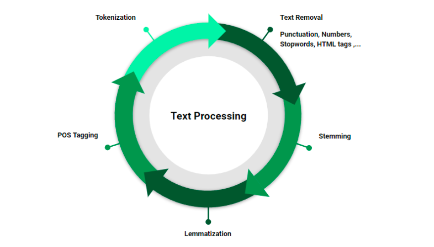
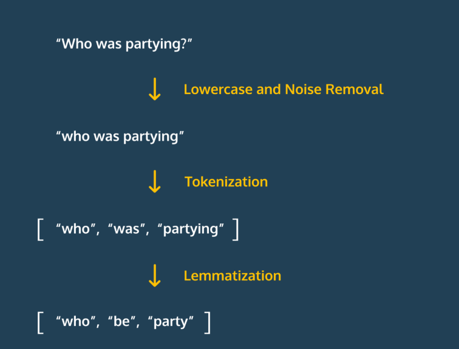
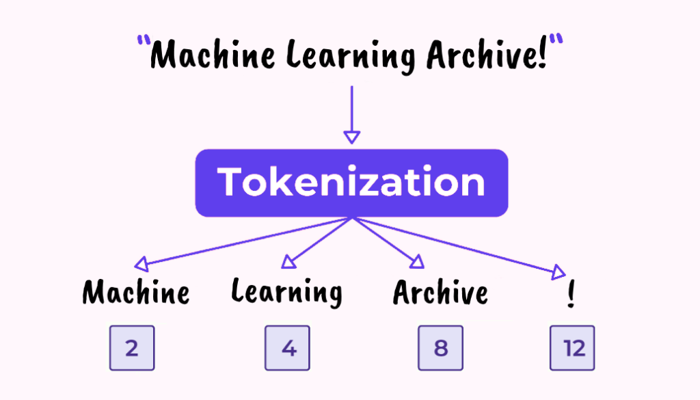

# Intro to Text Pre-Processing

## What is Text Pre-Processing



**Text pre-processing** is the foundational step in preparing raw textual data for use in AI chatbot models, ensuring that the input is clean, consistent, and structured in a way that machine learning algorithms can effectively understand. In the context of chatbot development, raw user inputs are often noisy—they may contain typos, slang, inconsistent casing, punctuation, or irrelevant information. Pre-processing involves a series of steps such as **lowercasing text**, **removing punctuation**, **tokenization** (splitting text into words or subwords), **stop-word removal** (filtering out common but uninformative words like “the” or “is”), **stemming or lemmatization** (reducing words to their root forms), and in some cases, **normalizing emojis or contractions** (e.g., “can’t” → “cannot”).

This process is critically important because it directly affects how accurately a chatbot can interpret a user’s intent and generate meaningful responses. For example, a model trained on clean, standardized text is more likely to recognize similar patterns across inputs, improving both intent classification and dialogue generation. Additionally, reducing noise in the input data can decrease model complexity and training time while increasing generalization. In retrieval-based or generative models, especially those powered by neural networks, well-preprocessed text can significantly improve both training efficiency and model performance. In short, text pre-processing ensures that the AI has the best possible understanding of what the user is trying to communicate—forming the backbone of accurate, context-aware chatbot interactions.

## Noise Removal with Regex.sub()



### What is Noise and why is it important to remove noise from text input?

In the context of text pre-processing for AI chatbots, **noise** refers to any irrelevant, redundant, or inconsistent elements within the input text that do not contribute meaningful information for understanding user intent or generating a response. This can include typos, unnecessary punctuation, HTML tags, excessive whitespace, filler words, irrelevant symbols, or inconsistent casing. Removing noise is crucial because it helps ensure that the chatbot focuses on the most important parts of the input, reducing confusion and improving the accuracy of tasks like intent recognition, entity extraction, and response generation. By eliminating noise, we make the data cleaner and more consistent, allowing machine learning models to learn better patterns, generalize more effectively, and deliver faster, more reliable, and contextually appropriate responses.

### Examples of common types of Noise

| **Noise Type**             | **Example**                          | **Why It’s Considered Noise**                                                                   |
| -------------------------- | ------------------------------------ | ----------------------------------------------------------------------------------------------- |
| Excess punctuation         | `Hello!!! How are you???`            | Adds no value to intent or meaning; can confuse tokenization and intent detection.              |
| Typos and misspellings     | `Helo, I ned help`                   | Makes it harder for the model to match patterns or understand the input correctly.              |
| HTML tags                  | `<div>Hello</div>`                   | Formatting artifacts that have no conversational value and clutter the text.                    |
| Special characters/symbols | `%%%, @@@, ###`                      | Irrelevant symbols that don't contribute to the meaning of the text.                            |
| Excess whitespace          | `I need    help`                     | Visually insignificant but can interfere with tokenization and text normalization.              |
| Case inconsistency         | `HELP` vs `help` vs `Help`           | Can cause the model to treat identical words as different, reducing accuracy if not normalized. |
| Emojis (in some contexts)  | `👍 I agree 😂`                      | While sometimes meaningful, they may be irrelevant in domains where sentiment isn't analyzed.   |
| Filler words               | `um, uh, you know, like`             | Do not add meaning and can distract from the actual intent of the user’s input.                 |
| URLs                       | `Check this out: http://example.com` | Often irrelevant to the chatbot’s task unless explicitly required for the conversation logic.   |
| Stop words (in some cases) | `the, is, at, on, in`                | Common words that generally don’t help identify intent or key entities in basic NLP tasks.      |

### Utilizing Regex.sub()

Now that we have some examples about Noise lets talk about how we can address said noise utilizing the `.sub()` method from `re`.

```python
import re
"""
The re.sub() method takes in a total of 3 parameters
1. the raw string pattern to match
2. the string utilized to replace all matches
3. the string that will be searched for matches
The method then returns a new string with all matches of the raw string replaced by the string value of the second parameter
"""
html_noise = '<div>Hello</div>'
remove_html = re.sub(r'<.?div>', '', html_noise)
print(remove_html) #=> Hello
```

Lets apply the same concept onto removing some excess spaces within a dirty string.

```python
dirty_string = "I need    help"
clean_string = re.sub(r' {2,9}', ' ', dirty_string)
print(clean_string) #=> I need help
```

## Tokenization with NLTK (Natural Language ToolKit)



### What is Tokenization and why is it necessary?

**Tokenization** is the process of breaking down a string of text into smaller, meaningful units called **tokens**—typically words, subwords, or sentences—so that they can be more easily processed by a machine learning model. In the context of AI chatbot development and text pre-processing, tokenization serves as a critical first step in converting raw text into a structured format that algorithms can work with. For example, the sentence *"How can I help you?"* might be tokenized into `["How", "can", "I", "help", "you", "?"]`. This is necessary because language models and NLP algorithms operate on these tokens rather than raw character sequences; they need to understand which parts of the input correspond to distinct linguistic elements. Tokenization helps in tasks like intent recognition, entity extraction, and response generation by ensuring that words, phrases, and symbols are correctly segmented and represented. It also enables downstream processes—such as embedding generation, syntactic parsing, or frequency analysis—to work effectively, ultimately contributing to more accurate and context-aware chatbot interactions.

### What is NLTK and why is it important within Text-Preprocessing?

**NLTK** (Natural Language Toolkit) is a widely-used open-source Python library that provides tools, datasets, and utilities for working with human language data. Within the context of **text pre-processing**, NLTK is especially important because it offers a comprehensive suite of functions that simplify and standardize many common pre-processing tasks. These include **tokenization** (splitting text into words or sentences), **stop-word removal**, **stemming**, **lemmatization**, **part-of-speech tagging**, and more. NLTK also provides access to corpora and lexical resources (like WordNet) that help enrich text analysis. For chatbot development, NLTK’s tools are essential in preparing raw text data so that it can be effectively fed into machine learning models—ensuring cleaner, more consistent inputs that improve intent recognition, entity extraction, and overall conversational accuracy. Its flexibility and rich functionality make it a go-to library for developers and researchers aiming to build robust NLP pipelines for AI chatbots.

### Installing NLTK

1. first lets install `nltk` by running the following command on your terminal while your python venv is activated:

    ```bash
    pip install nltk
    ```

2. Now since this is our first time ever utilizing `nltk` we actually have to explicitly download some of its commonly used content onto our machines `nltk`s version. Lets do so by opening a Python shell within the terminal and executing the following commands:

    ```python
    Python 3.13.3 (main, Apr  8 2025, 13:54:08) [Clang 16.0.0 (clang-1600.0.26.6)] on darwin
    Type "help", "copyright", "credits" or "license" for more information.
    >>> import nltk
    >>> nltk.download('punkt')      # Tokenizer models returns True
    >>> nltk.download('stopwords')  # List of common stopwords returns True
    >>> nltk.download('wordnet')    # For lemmatization returns True
    >>> nltk.download('averaged_perceptron_tagger')  # For POS tagging returns True
    ```

### Utilizing NLTK to Tokenize text by Sentences or Words

- Lets tokenize some text by sentence utilizing the `sent_tokenize` function from the `nltk` library. We will utilize the open function to grab some text from the `full-stack-quest.md` file within the `resources` directory and apply these concepts:

    ```python
    from nltk.tokenize import sent_tokenize

    file = open("./resources/full-stack-quest.md")
    text_from_file = file.read()
    file.close()

    story_tokenized_by_sent = sent_tokenize(text_from_file)
    print(story_tokenized_by_sent) #=> This will print a list of sentences neatly broken up by the sent_tokenize function
    ```

- Lets see the difference between `sent_tokenize` and `word_tokenize` with the same text along with a bit of Noise removal:

    ```python
    from nltk.tokenize import sent_tokenize, word_tokenize
    import re

    file = open("./resources/full-stack-quest.md")
    text_from_file = file.read()
    file.close()

    clean_text = re.sub(r'[#|*|-|_|\U0001F525]', '', text_from_file)

    story_tokenized_by_word = word_tokenize(clean_text)
    print(story_tokenized_by_word) #=> this returns a list of words and special characters separated at each independent index
    ```

Now our text is broken up into smaller more manageable pieces!

## Normalization

### What is Normalization and why is it Important?

**Normalization** in text pre-processing refers to the process of transforming text into a consistent, standardized format so that natural language processing (NLP) systems, like AI chatbots, can analyze and interpret it accurately. Since the same word or phrase can appear in many forms—such as “Help,” “help,” or “HELP!”—normalization reduces these variations by applying transformations like **lowercasing**, **removing punctuation**, and **stripping extra whitespace**. It also involves more advanced techniques such as **stemming** and **lemmatization**. **Stemming** reduces words to their base or root form by chopping off prefixes or suffixes (e.g., “helping” → “help”), often without regard for proper grammar, while **lemmatization** goes a step further by converting words to their dictionary root form (lemma) using linguistic rules (e.g., “better” → “good”). Normalization may also expand contractions (e.g., “don’t” → “do not”) and standardize spelling (e.g., “colour” → “color”). These steps are critical in chatbot development because they ensure that semantically equivalent inputs are treated uniformly, improving intent detection, entity extraction, and overall conversational accuracy.

### Stopwords, what are they and why remove them?

**Stopwords** are common words in a language—such as “the,” “is,” “and,” “in,” “on,” and “at”—that typically carry little meaningful information on their own when it comes to tasks like intent recognition or text classification in AI chatbots. While these words are essential for human communication, they often act as **noise** in natural language processing because they occur so frequently that they don't help differentiate between user intents or key entities. Removing stopwords during text pre-processing helps reduce the amount of data the model has to analyze, allowing it to focus on the most informative words that convey the core meaning of a user’s input. For example, in the sentence *"What is the weather like in New York?"*, removing stopwords leaves *"weather,"* *"like,"* and *"New York,"* which are much more relevant for determining intent. This improves computational efficiency and can enhance the chatbot's ability to match inputs with the correct responses or actions. However, stopword removal should be done carefully, as in some contexts certain stopwords might carry important meaning (e.g., in sentiment analysis or when working with specific commands).

### Removing Stopwords with NLTK

To accomplish this task we need to accomplish a couple of steps

1. We need to import `stopwords` class from `nltk.corpus`
2. We need to grab the words from the right language and save them onto a set
3. We will utilize a list literal to iterate through a set of tokenized words and build a new list holding all words that are not in stopwords.

```python
from nltk.tokenize import sent_tokenize, word_tokenize
from nltk.corpus import stopwords 
import re

file = open("./resources/full-stack-quest.md")
text_from_file = file.read()
file.close()

clean_text = re.sub(r'[#|*|-|_|\U0001F525]', '', text_from_file)

story_tokenized_by_word = word_tokenize(clean_text)
print(len(story_tokenized_by_word))

stop_words = set(stopwords.words("english"))
stopwords_removed = [word for word in story_tokenized_by_word if word not in stop_words]

print(len(stopwords_removed))
```

### Stemming

**Stemming** is a text normalization technique in natural language processing (NLP) that reduces words to their base or root form by stripping away prefixes or suffixes, without necessarily ensuring that the resulting stem is a valid word in the language. For example, stemming might reduce words like *“running”*, *“runner”*, and *“runs”* to *“run”*, or even more crudely to *“runn”*, depending on the stemming algorithm used. One of the most common algorithms is the **Porter Stemmer**, which applies a set of heuristic rules to perform this reduction. The importance of stemming in text normalization lies in its ability to group together different forms of a word so that they can be treated as the same feature by machine learning models. This simplifies the vocabulary the chatbot has to work with and improves its ability to recognize patterns across variations of words, enhancing tasks like intent classification and keyword matching. By consolidating word forms, stemming helps chatbots generalize better from training data, reduces computational complexity, and improves efficiency during both training and inference. However, since stemming can sometimes produce non-dictionary stems, it’s important to balance its use with other techniques like lemmatization when grammatical correctness is needed.

#### Applying Stemming with NLTK

```python
from nltk.stem import PorterStemmer
stemmer = PorterStemmer()
stemmed_words = [stemmer.stem(w) for w in stopwords_removed]
print(stemmed_words)
```

### Lemmatization

**Lemmatization** is a text normalization technique in natural language processing (NLP) that reduces words to their base or **dictionary form** (known as a lemma) using linguistic knowledge, such as a word’s part of speech and meaning. Unlike stemming, which simply chops off word endings based on heuristics, lemmatization ensures that the resulting word is a valid word in the language. For example, lemmatization would reduce *“running”* to *“run”* and *“better”* to *“good”*, recognizing their grammatical relationships. In chatbot development, lemmatization plays an important role in improving intent detection and entity recognition by ensuring that semantically identical or related words are treated as the same concept. This helps the model focus on the true meaning of the user’s input while maintaining grammatical correctness. Although lemmatization is generally more computationally expensive than stemming, it often leads to more accurate and natural language understanding, making it particularly valuable in applications where precise language structure matters.

> Since lemmatization requires the part of speech, it is a less efficient approach than stemming.

#### Applying Lemmatization with NLTK

First lets apply the obvious pattern at this point of importing the Lemmatizer creating an instance of said Lemmatizer and lemmatizing each word within `stopwords_removed`.

```python
from nltk.stem import WordNetLemmatizer

lemmatizer = WordNetLemmatizer()

# Lemmatize each word 
lemmatized_words = [lemmatizer.lemmatize(word) for word in stopwords_removed]

print(lemmatized_words)
```

You'll notice that unlike the `Stemmer` Lemmatizer didn't really change anything to the word itself. This happened because lemmatize() treats every word as a noun. To take advantage of the power of lemmatization, we need to tag each word in our text with the most likely part of speech.

##### Part of Speech Tagging

In this context, **part of speech (POS)** refers to the grammatical category that a word belongs to based on its role within a sentence. Examples of parts of speech include **nouns** (people, places, things), **verbs** (actions or states), **adjectives** (describing words), **adverbs** (words that modify verbs or adjectives), **pronouns**, **prepositions**, and more. When we apply **lemmatization** in text pre-processing, knowing the part of speech of each word is important because it determines how the word should be reduced to its base or dictionary form (lemma). For instance, the word *“better”* would lemmatize to *“good”* if it’s identified as an adjective, but it wouldn’t change if mistakenly treated as a noun. Similarly, *“running”* would reduce to *“run”* if recognized as a verb, but stay as *“running”* if incorrectly treated as a noun. Therefore, identifying parts of speech allows NLP tools like the **WordNetLemmatizer** to perform more accurate and meaningful text normalization, helping chatbots better understand and process user input.

To properly apply lemmatization, we need to supply the correct part of speech (POS) for each word so the lemmatizer can accurately reduce words to their true lemmas. We can achieve this by using `nltk.pos_tag`, which tags each word in our list with its most probable POS.

```python
from nltk import pos_tag

# Tag each word with its part of speech
tagged_words = pos_tag(stopwords_removed)

print(tagged_words)
```

This will output something like:

```python
[('weather', 'NN'), ('like', 'IN'), ('New', 'NNP'), ('York', 'NNP')]
```

where `NN` stands for noun, `IN` for preposition, `NNP` for proper noun, etc.

##### Mapping NLTK POS Tags to WordNet POS

Since `WordNetLemmatizer` uses WordNet POS tags (`n`, `v`, `a`, `r` for noun, verb, adjective, adverb respectively), we need to manually connect the NLTK POS tags to these WordNet tags.

```python
from nltk.corpus import wordnet

def get_wordnet_pos(treebank_tag):
    if treebank_tag.startswith('J'):
        return wordnet.ADJ
    elif treebank_tag.startswith('V'):
        return wordnet.VERB
    elif treebank_tag.startswith('N'):
        return wordnet.NOUN
    elif treebank_tag.startswith('R'):
        return wordnet.ADV
    else:
        return wordnet.NOUN  # Default to noun if unknown
```

###### Final Lemmatization with POS

Now we can lemmatize each word using its POS for more accurate results:

```python
lemmatized_words_with_pos = [
    lemmatizer.lemmatize(word, get_wordnet_pos(pos_tag))
    for word, pos_tag in tagged_words
]

print(lemmatized_words_with_pos)
```

This will produce a more meaningful reduction of words, taking their grammatical role into account.


## Conclusion

Conclusion
In this lecture, we've laid the groundwork for understanding text pre-processing, a vital initial step in preparing raw textual data for effective use in AI chatbot models. We began by defining text pre-processing as the essential process of cleaning, standardizing, and structuring noisy user inputs, which is critical for accurate interpretation by machine learning algorithms.

We then explored the concept of noise in text, identifying common types such as excess punctuation, typos, HTML tags, and inconsistent casing. We demonstrated how the re.sub() method from Python's re module can be effectively utilized to remove this noise, making our text data cleaner and more consistent.

Finally, we delved into tokenization, the process of breaking down text into smaller, meaningful units like words or sentences. We introduced NLTK (Natural Language Toolkit) as an indispensable Python library for text pre-processing, highlighting its importance and guiding you through its installation and basic usage. We saw how NLTK's sent_tokenize and word_tokenize functions allow us to efficiently segment text, transforming raw input into manageable tokens ready for further analysis.

By mastering these foundational pre-processing techniques—noise removal and tokenization—you are now equipped to prepare textual data in a way that significantly enhances the performance, accuracy, and overall intelligence of your AI chatbot applications. These steps are the bedrock upon which more advanced NLP functionalities are built.
