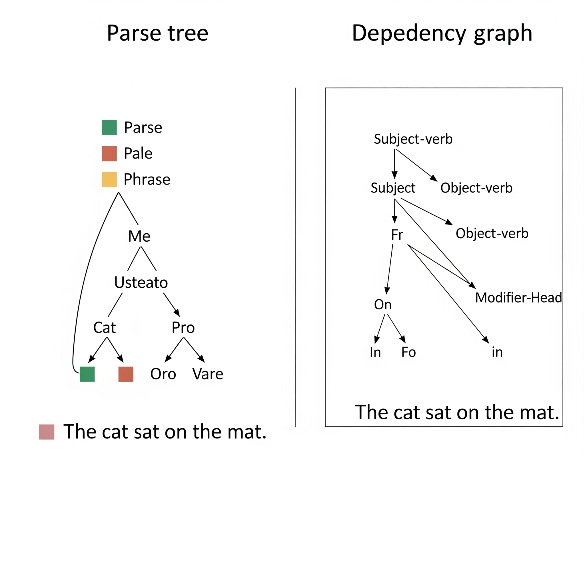

# Intro to Language Parsing



## What is Language Parsing in NLP?

**Language parsing in Natural Language Processing (NLP)** refers to the process of analyzing and breaking down a text or sentence into its grammatical components to understand its structure and meaning. Parsing involves identifying the roles that individual words play (such as nouns, verbs, adjectives, etc.) and how they relate to one another within the sentence, typically by generating a syntactic representation like a parse tree or dependency graph. This structured representation helps machines interpret the hierarchical relationships and dependencies between words—such as which noun a verb is acting upon or how clauses are connected. Parsing is essential for many NLP tasks including machine translation, question answering, sentiment analysis, and chatbot intent detection, as it enables systems to move beyond simple word matching and towards understanding the syntax and, indirectly, the semantics of a sentence. There are different types of parsing approaches in NLP, such as **constituency parsing** (which focuses on dividing a sentence into nested sub-phrases) and **dependency parsing** (which focuses on the direct relationships between words). Accurate language parsing allows NLP systems to grasp the meaning and intent behind human language with greater precision, facilitating more natural and contextually appropriate responses.

## Reviewing Regex Methods

In this section we will review key methods of Python’s built-in `re` module, which help us search, match, and extract patterns from text. These tools are valuable for cleaning and analyzing large text files, like our science fiction story.

### `re.match`

`re.match()` checks if a pattern appears at the **very beginning** of a string. If it finds a match at the start, it returns a match object; otherwise, it returns `None`.

```python
import re

with open("./resources/sci_fi_story.txt", "r") as file:
    text = file.read()

# Check if the text starts with 'Title'
match_result = re.match(r"Title", text)

if match_result:
    print("Match found at start of text:", match_result.group())
else:
    print("No match found at start of text.")
```

### `re.search`

`re.search()` scans the **entire string** and returns a match object for the **first occurrence** of the pattern it finds, or `None` if no match exists.

```python
# Search for the first occurrence of 'machine'
search_result = re.search(r"machine", text)

if search_result:
    print(f"'machine' found at position {search_result.start()}: {search_result.group()}")
else:
    print("No occurrence of 'machine' found.")
```

### `re.findall`

`re.findall()` searches the full string and returns a **list of all non-overlapping matches** of the pattern.

```python
# Find all instances of 'Elara'
all_elara = re.findall(r"Elara", text)
print(f"'Elara' appears {len(all_elara)} times in the text.")
```

By mastering these methods, you can efficiently analyze, clean, and process textual data in your NLP projects.

## Part-of-Speech (POS) Tagging with NLTK

In traditional grammar and NLP, **Part of Speech (POS)** refers to the category a word belongs to based on its role in a sentence. While there are many fine-grained tags (like `NNP` or `VBG` in NLTK), they map to **9 core parts of speech** that form the foundation of English grammar. These are:

1. **Noun (N)** – Names a person, place, thing, or idea.
   *Example:* `cat`, `London`, `happiness`

2. **Pronoun (PRON)** – Replaces a noun to avoid repetition.
   *Example:* `he`, `she`, `they`, `it`

3. **Verb (V)** – Expresses action, state, or being.
   *Example:* `run`, `is`, `study`

4. **Adjective (ADJ)** – Describes or modifies a noun.
   *Example:* `happy`, `blue`, `large`

5. **Adverb (ADV)** – Modifies a verb, adjective, or other adverb, often showing how, when, where, or to what extent.
   *Example:* `quickly`, `very`, `happily`

6. **Preposition (PREP)** – Shows the relationship between a noun (or pronoun) and another word.
   *Example:* `on`, `in`, `at`, `by`

7. **Conjunction (CONJ)** – Connects words, phrases, or clauses.
   *Example:* `and`, `but`, `or`

8. **Interjection (INTJ)** – Expresses emotion or exclamation.
   *Example:* `Wow!`, `Oh!`, `Hey!`

9. **Determiner (DET)** – Introduces a noun and specifies it as known or unknown.
   *Example:* `the`, `a`, `this`, `those`

In **NLTK POS tagging**, these 9 core parts of speech are expanded into detailed tags (like `NN` for singular noun or `VBP` for plural verb) that offer more specific grammatical information.

**Part-of-Speech (POS) tagging** is the process of labeling each word in a sentence with its grammatical role—such as noun, verb, adjective, or adverb—based on its context and function within the sentence. This step is essential in NLP because it helps models understand the structure and meaning of text, supporting tasks like parsing, intent recognition, and lemmatization.

Let’s look at an example sentence and apply POS tagging using NLTK:

```python
from nltk.tokenize import word_tokenize
from nltk import pos_tag

sentence = "Wow! Ramona and her class are happily studying the new textbook she has on NLP."
tokens = word_tokenize(sentence)
tagged = pos_tag(tokens)

print(tagged)
```

The output might look like this:

```python
[('Wow', 'UH'),
 ('!', '.'),
 ('Ramona', 'NNP'),
 ('and', 'CC'),
 ('her', 'PRP$'),
 ('class', 'NN'),
 ('are', 'VBP'),
 ('happily', 'RB'),
 ('studying', 'VBG'),
 ('the', 'DT'),
 ('new', 'JJ'),
 ('textbook', 'NN'),
 ('she', 'PRP'),
 ('has', 'VBZ'),
 ('on', 'IN'),
 ('NLP', 'NNP'),
 ('.', '.')]
```

### Breakdown of POS Abbreviations

| **Tag** | **Part of Speech**                  | **Example from Sentence**                         |
| ------- | ----------------------------------- | ------------------------------------------------- |
| `UH`    | Interjection                        | `Wow` – shows surprise or emotion                 |
| `.`     | Punctuation                         | `!`, `.` – punctuation marks                      |
| `NNP`   | Proper Noun                         | `Ramona`, `NLP` – names of specific people/things |
| `CC`    | Coordinating Conjunction            | `and` – connects words or phrases                 |
| `PRP$`  | Possessive Pronoun                  | `her` – shows ownership                           |
| `NN`    | Noun (Singular)                     | `class`, `textbook` – names of things             |
| `VBP`   | Verb (Present, plural)              | `are` – plural present tense verb                 |
| `RB`    | Adverb                              | `happily` – modifies the verb `studying`          |
| `VBG`   | Verb (Gerund/Participle)            | `studying` – verb ending in -ing                  |
| `DT`    | Determiner                          | `the` – specifies a noun                          |
| `JJ`    | Adjective                           | `new` – describes the noun `textbook`             |
| `PRP`   | Personal Pronoun                    | `she` – refers to a person                        |
| `VBZ`   | Verb (Present, 3rd person singular) | `has` – present tense verb for `she`              |
| `IN`    | Preposition                         | `on` – shows relationship (e.g., `on NLP`)        |

POS tagging with NLTK assigns these tags automatically using built-in models trained on large corpora. The tags help define **how each word functions** in its sentence context, enabling deeper analysis like parsing, dependency resolution, or lemmatization based on grammar. This detailed labeling is fundamental in building NLP systems that can accurately interpret and generate human-like language.

## Chunking Techniques with NLTK's RegexParser

### What is chunking?

**Chunking** in NLP refers to the process of grouping individual tokens (usually words) into larger, meaningful units called **chunks**. These chunks typically represent **phrases**, such as noun phrases (NP), verb phrases (VP), or prepositional phrases (PP). While **part-of-speech (POS) tagging** labels each word with its grammatical role (e.g., noun, verb), chunking combines these POS-tagged tokens into coherent segments, like `"the new textbook"` → NP. In simple terms, chunking helps identify and extract small structures that represent parts of meaning within a sentence.

### Why is chunking an important step of NLP?

* It helps capture **phrase-level structures** rather than just word-level details, enabling deeper syntactic and semantic analysis.
* Many NLP tasks—such as **entity recognition**, **question answering**, and **relation extraction**—rely on phrase-level understanding.
* It reduces complexity by organizing sequences of tokens into higher-order units, making it easier for models to process relationships and patterns in text.
* By identifying key phrases (like subject noun phrases or object noun phrases), chunking improves downstream tasks like intent detection in chatbots or parsing for machine translation.

### Types of Chunking in NLP

| **Phrase Type**                | **Tag (Conventional)**                | **What It Represents**                                                  | **Example**                             |
| ------------------------------ | ------------------------------------- | ----------------------------------------------------------------------- | --------------------------------------- |
| **Noun Phrase (NP)**           | `NP`                                  | A group centered around a noun, possibly with determiners or adjectives | *"the big spaceship"*                   |
| **Verb Phrase (VP)**           | `VP`                                  | A main verb plus its auxiliaries, adverbs, and objects                  | *"has been running quickly"*            |
| **Prepositional Phrase (PP)**  | `PP`                                  | A preposition followed by its object (usually a NP)                     | *"on the table"*, *"under the stars"*   |
| **Adjective Phrase (ADJP)**    | `ADJP`                                | A phrase with an adjective as its head, possibly modified               | *"very happy"*, *"extremely difficult"* |
| **Adverb Phrase (ADVP)**       | `ADVP`                                | A phrase with an adverb as its head, possibly modified                  | *"quite slowly"*, *"too fast"*          |
| **Determiner Phrase (DP)**     | `DP` (less common in shallow parsing) | A phrase centered around a determiner                                   | *"some of the"*                         |
| **Quantifier Phrase (QP)**     | `QP`                                  | A phrase expressing quantity                                            | *"many of these"*, *"all the books"*    |
| **Conjunction Phrase (CONJP)** | `CONJP`                               | A conjunction with modifiers                                            | *"as well as"*, *"but not"*             |

## Finding Chunks with `RegexpParser`

In NLTK, **chunking** can be done using the `RegexpParser`, which allows you to define chunk patterns using **regular expressions applied to POS tags**. This is powerful because you can:

* Write **customizable patterns** to match specific phrase structures (e.g., noun phrases: determiner + adjectives + noun).
* Quickly prototype rule-based chunking without training a statistical model.
* Apply domain-specific grammar rules tailored to your dataset or application.

### Different Regex Phrase Patterns

#### `NP: {<DT>?<JJ.*>*<NN.*>+}` → *Noun Phrases (NP)*

* `<DT>?` → Matches an **optional determiner** (e.g., *the*, *a*, *an*). The `?` means it can appear zero or one time.
* `<JJ.*>*` → Matches **zero or more adjectives** (`JJ` for adjective, `JJ.*` matches all adjective POS tags like `JJ`, `JJR` (comparative), or `JJS` (superlative)).
* `<NN.*>+` → Matches **one or more nouns** (`NN.*` covers `NN`, `NNS`, `NNP`, `NNPS` for singular, plural, proper nouns, etc.).
This rule identifies a phrase that centers around a noun, possibly with a determiner and descriptors.

#### `PP: {<IN><NP>}` → *Prepositional Phrases (PP)*

* `<IN>` → Matches a **preposition** (e.g., *in*, *on*, *by*, *with*).
* `<NP>` → Requires the preposition to be immediately followed by a **noun phrase** (as defined by our `NP` chunk rule).
This captures prepositional structures like *“on the table”* or *“by the river.”*

#### `VP: {<VB.*><NP|PP|CLAUSE>*}` → *Verb Phrases (VP)

* `<VB.*>` → Matches any verb form (`VB`, `VBD`, `VBG`, `VBN`, `VBP`, `VBZ`).
* `<NP|PP|CLAUSE>*` → Matches **zero or more noun phrases, prepositional phrases, or clauses** after the verb.
This identifies structures that start with a verb and may be followed by objects or complements, e.g., *“eats the cake”* or *“is sitting on the chair.”*

#### `ADJP: {<RB.*>*<JJ.*>}` → *Adjective Phrases (ADJP)*

* `<RB.*>*` → Matches **zero or more adverbs** (`RB`, `RBR`, `RBS` — basic, comparative, superlative adverbs).
* `<JJ.*>` → Followed by an **adjective**.
Captures phrases where adjectives are optionally modified by adverbs, e.g., *“extremely bright”*, *“very small.”*

#### `ADVP: {<RB.*>+}` → *Adverb Phrases (ADVP)*

* `<RB.*>+` → Matches **one or more adverbs**.
Recognizes strings of adverbs like *“very quickly”* or *“so easily.”*

### Applying RegexpParser

```python
import nltk
from nltk import word_tokenize, pos_tag
from nltk.chunk import RegexpParser

text = "Wow! Ramona and her class are happily studying the new textbook she has on NLP."

# Tokenize and POS tag
tokens = word_tokenize(text)
tagged_tokens = pos_tag(tokens)

# Define a chunk grammar (Noun Phrase: optional determiner + adjectives + noun)
chunk_grammar = r"""
  NP: {<DT>?<JJ.*>*<NN.*>+}         # Noun Phrases
  PP: {<IN><NP>}                    # Prepositional Phrases
  VP: {<VB.*><NP|PP|CLAUSE>*}       # Verb Phrases
  ADJP: {<RB.*>*<JJ.*>}             # Adjective Phrases
  ADVP: {<RB.*>+}                   # Adverb Phrases
"""

# Create parser and apply
parser = RegexpParser(chunk_grammar)
chunked_tree = parser.parse(tagged_tokens)

# Visualize or print the result
chunked_tree.pretty_print()
```

In this example:

* The **pattern `NP: {<DT>?<JJ.*>*<NN.*>+}`** means: an optional determiner (`<DT>`), followed by any number of adjectives (`<JJ.*>`), ending with one or more nouns (`<NN.*>`).
* `RegexpParser` applies this pattern to the POS-tagged tokens and builds a chunk tree.

#### Why use `RegexpParser`?

* **Flexibility**: You define exactly the patterns that matter for your task.
* **Control**: No need for large annotated datasets or training; it’s rule-based.
* **Transparency**: The logic is explicit and interpretable—ideal for teaching, prototyping, or domain-specific pipelines.
* **Efficiency**: Lightweight and fast for small- to medium-scale NLP tasks.

### 🌳 What is a tree?

When you run `chunked_tree.pretty_print()`, you’re visualizing the **hierarchical structure** of the sentence as understood by your parser.

A **tree** is a data structure that represents how your sentence is grouped into chunks based on the grammar rules you provided. Each node (or branch) in the tree can represent:

* A **chunk label** (e.g., `NP`, `VP`) — a phrase your grammar matched.
* A **leaf node** — individual tokens and their POS tags.

The tree shows which words have been combined into phrases and how these phrases relate within the larger sentence.

Example (simplified):

```python
(S
  (NP Ramona)
  (CONJ and)
  (NP her class)
  (VP are (ADVP happily) (VP studying (NP the new textbook)))
  ...)
```

### 🌿 What are subtrees?

A **subtree** is any smaller tree within the larger chunk tree. A subtree could represent an individual noun phrase, verb phrase, etc., that was matched according to your grammar.

When you run:

```python
list(chunked_tree.subtrees(filter=lambda t: t.label() == 'NP'))
```

you’re:

* Iterating through all the **subtrees** in the tree.
* **Filtering** to return only those subtrees labeled `'NP'` (noun phrases).
* Converting them into a list for inspection or further processing.

Each `NP` subtree is itself a mini-tree containing all the tokens that formed that chunk.

### 🌳 Tree vs. 🌿 Subtree

| Feature    | Tree                                                  | Subtree                                                    |
| ---------- | ----------------------------------------------------- | ---------------------------------------------------------- |
| Represents | The entire parsed sentence with all chunks and tokens | A specific portion (e.g., a phrase) within the larger tree |
| Scope      | Global structure                                      | Local structure                                            |
| Purpose    | Visualize full sentence structure                     | Focus on and process individual phrases                    |

### Creating a Counter to See Most Common Phrases

In many real-world NLP tasks—such as **information extraction**, **document summarization**, or **chatbot intent modeling**—understanding which **phrase patterns appear most frequently** can reveal meaningful insights. For example:

* In a support ticket system, common **noun phrases** might be *“account issue”*, *“login error”*, or *“payment method”*.
* In a chatbot, recurring **verb phrases** might help identify typical user intents, such as *“want to order”* or *“need help with”*.

By analyzing which chunks (like `NP`, `VP`, or `PP`) show up most often across multiple sentences, we can **quantify patterns in language use**, **build knowledge bases**, or even **fine-tune our chatbot's rule set**.

Here’s a reusable Python function that does exactly that:

```python
from collections import Counter

# function that pulls chunks out of chunked sentence and finds the most common chunks
def chunk_counter(chunked_sentences, label):

    # create a list to hold chunks
    chunks = list()

    # for-loop through each chunked sentence to extract noun phrase chunks
    for chunked_sentence in chunked_sentences:
        for subtree in chunked_sentence.subtrees(filter=lambda t: t.label() == label):
            chunks.append(tuple(subtree))

    # create a Counter object
    chunk_counter = Counter()

    # for-loop through the list of chunks
    for chunk in chunks:
        # increase counter of specific chunk by 1
        chunk_counter[chunk] += 1

    # return 30 most frequent chunks
    return chunk_counter.most_common(30)
```

#### Code Breakdown

| Line                                                             | Explanation                                                                                         |
| ---------------------------------------------------------------- | --------------------------------------------------------------------------------------------------- |
| `chunks = list()`                                                | Initialize an empty list to store the matched phrase chunks.                                        |
| `for chunked_sentence in chunked_sentences:`                     | Loop through each sentence that’s already been parsed by a `RegexpParser`.                          |
| `chunked_sentence.subtrees(filter=lambda t: t.label() == label)` | Extract only the **subtrees** (phrases) matching the target label (e.g., `'NP'`, `'VP'`).           |
| `chunks.append(tuple(subtree))`                                  | Convert each subtree into a tuple and store it. This makes it hashable and storable in a `Counter`. |
| `chunk_counter = Counter()`                                      | Create a new `Counter` from Python’s `collections` module to tally phrases.                         |
| `chunk_counter[chunk] += 1`                                      | Increment the count for each unique chunk.                                                          |
| `return chunk_counter.most_common(30)`                           | Return the **30 most frequent chunks** found across all sentences.                                  |

#### Why Is This Important?

Using this function allows you to:

* **Quantify language use** across documents or dialogue.
* **Identify key noun/verb patterns** for knowledge extraction.
* **Refine rule-based chatbot grammars** by targeting the most common linguistic structures.
* **Build features** for machine learning models (e.g., common phrase embeddings).

This strategy helps **move from raw text to structured insights**, giving you data-driven direction in your NLP pipeline.

### Chunk Filtering

**Chunk filtering** in NLP refers to the process of removing or isolating specific types of chunks (phrases) from a chunked parse tree based on their labels or structural patterns. This is important because not all detected chunks are relevant for a given task — for example, you might only care about noun phrases when extracting entities, or verb phrases when analyzing actions. By filtering out unnecessary chunks, you reduce noise and focus your analysis on meaningful structures, improving the efficiency and accuracy of downstream processes like relation extraction, intent detection, or question answering. In practice, chunk filtering can be accomplished by traversing the chunk tree generated by tools like NLTK’s `RegexpParser` and selectively keeping or discarding subtrees based on their `label()` (e.g., `"NP"`, `"VP"`, `"PP"`).

#### Why is chunk filtering important?

When chunking with generous or broad grammar rules:

* You might capture too many phrases, including irrelevant ones.
* Some phrases may overlap or include tokens that dilute their usefulness.
* The result set could become too large or noisy for practical use.

**Chunk filtering lets you refine the output** and concentrate only on phrases that truly align with your project’s goals (e.g., extracting entities, product names, or intent indicators).

#### When to use chunk filtering?

* When extracting **targeted phrase types** (e.g., only noun phrases, verb phrases).
* When cleaning up results from flexible or greedy chunking grammars.
* When preparing for analysis, reporting, or machine learning feature extraction.

#### Example of chunk filtering: Noun Phrases with Exclusion

Suppose you want to extract **noun phrases** while excluding phrases that start or end with certain parts of speech (e.g., verbs or prepositions).
We can use this custom chunk grammar:

```python
np_filter = r"""
    NP: {<.*>+}              # Chunk sequences of one or more POS tags
        }<VB.?|IN>+{         # Exclude chunks that start or end with verbs or prepositions
"""
```

This grammar:

* Tries to create chunks from any sequence of POS tags (`<.*>+`).
* Then applies **chink patterns** (`}<VB.?|IN>+{`) to exclude parts that contain or border on verbs (`VB.?`) or prepositions (`IN`).

#### Code Example

```python
from nltk import word_tokenize, pos_tag
from nltk.chunk import RegexpParser

text = "The quick brown fox jumps over the lazy dog near the river."

# Tokenize and POS tag
tokens = word_tokenize(text)
tagged_tokens = pos_tag(tokens)

# Apply our custom grammar
np_filter = r\"\"\"
    NP: {<.*>+}
        }<VB.?|IN>+{
\"\"\"

parser = RegexpParser(np_filter)
chunked_tree = parser.parse(tagged_tokens)

# Filter: Extract and display NP subtrees
noun_phrases = [
    ' '.join(word for word, tag in subtree.leaves())
    for subtree in chunked_tree.subtrees(filter=lambda t: t.label() == 'NP')
]

print(noun_phrases)
```

* **Possible Output:**

```python
['The quick brown fox', 'the lazy dog', 'the river']
```

Here we:

* Formed chunks from all sequences of tags.
* Stripped out sequences that included or were bounded by verbs (`jumps`) and prepositions (`over`, `near`).
* Cleanly isolated only meaningful noun phrases.

## Conclusion

Language parsing is a foundational skill in Natural Language Processing (NLP), enabling us to break down raw text into structured, meaningful components that machines can understand and work with. Throughout this lecture, we explored how parsing works—from identifying individual parts of speech to grouping words into higher-order chunks like noun phrases, verb phrases, and prepositional phrases. We saw how tools like **regular expressions**, **POS tagging**, and **chunking with NLTK's `RegexpParser`** help us systematically analyze sentence structure.

Parsing is more than just a technical step—it’s what allows NLP systems to move beyond simple word lists and begin to grasp the relationships between words, phrases, and ideas. Whether you're building a chatbot, performing information extraction, or preparing data for machine learning models, understanding parsing gives you the power to create systems that interact with language in a more natural, human-like way.

As you continue practicing with regex, POS tagging, and chunk filtering, remember: mastering parsing equips you to tackle a wide range of NLP tasks, from intent recognition to semantic analysis. It’s a critical bridge between raw language data and intelligent applications.
