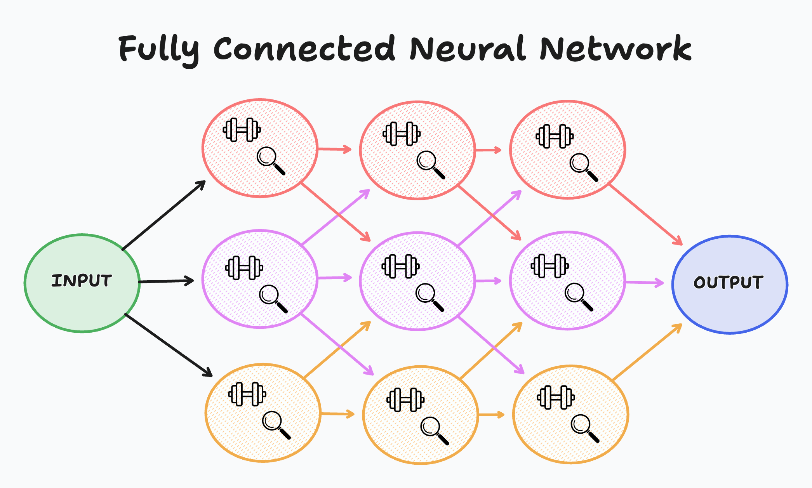
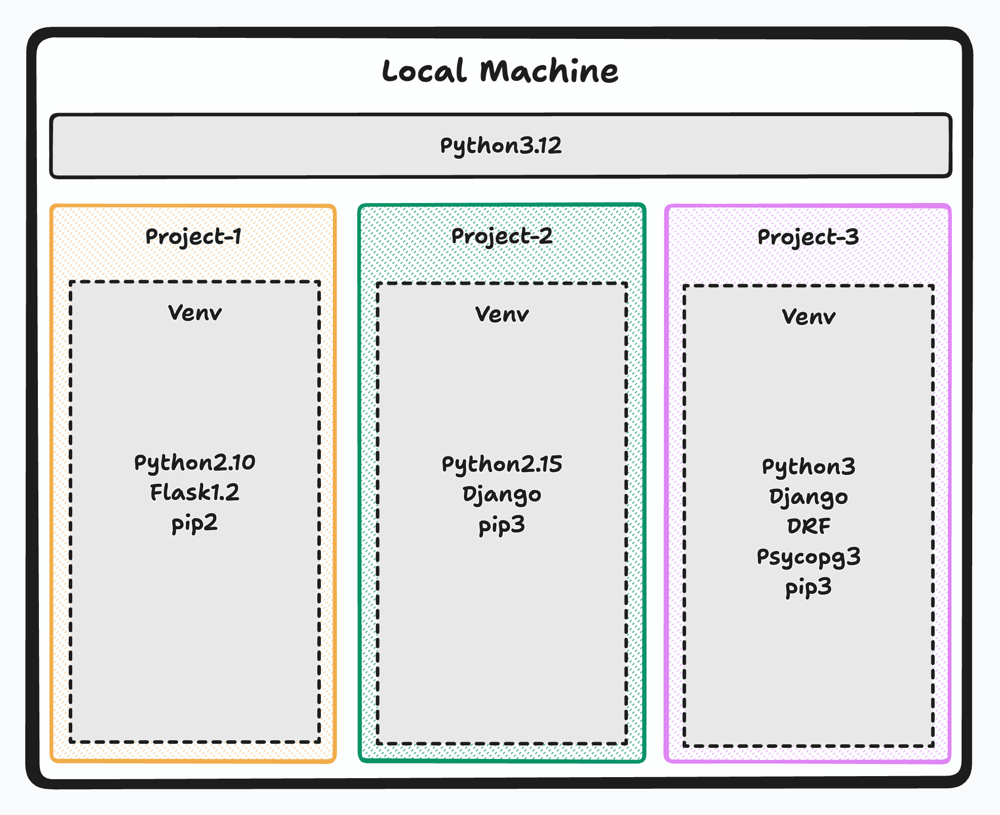

# Working with Data

## Introduction

In this lecture, we will focus on preparing data for a learning model. We'll discuss the importance of data preprocessing, explore common preprocessing techniques, and apply these concepts to a practical example using a dataset on water potability. By the end of this lecture, you'll have a solid understanding of how to clean, transform, and prepare your data to feed into a machine learning model.

## Lesson Content

### What are Learning Models?

Learning models are algorithms that enable machines to learn from data and make decisions or predictions based on that data. These models range from simple linear regressions to complex neural networks. Neural networks, inspired by the human brain, consist of interconnected nodes (neurons) that process data in layers.

- **Input Layer**: This is where the network receives its input data. Each node in this layer represents a feature of the input data.
- **Linear Layers | Hidden Layers**: These layers, also known as dense or fully connected layers, perform linear transformations on the input data. Each neuron in a linear layer is connected to every neuron in the previous layer.
- **Activation Layers**: After linear transformations, activation functions are applied to introduce non-linearity into the model. Common activation functions include ReLU (Rectified Linear Unit), sigmoid, and tanh.
- **Fully Connected Neural Networks**: These networks have multiple layers of interconnected neurons, allowing them to model complex relationships in data. The output layer provides the final prediction or classification.

Neural networks learn by adjusting the weights of the connections between neurons based on the error of their predictions. This process is called backpropagation and is crucial for the training of the model.



### Python Virtual Environments, what are they? And why do we need them?

A Python virtual environment is an isolated environment that allows you to manage dependencies for different projects separately. This ensures that the packages required for one project do not interfere with those of another. Virtual environments are essential for maintaining clean and manageable project setups, especially when working on multiple projects with different dependencies.



#### Capabilities of Python Virtual Environments

- Isolation of dependencies: Each virtual environment has its own independent set of installed packages.
- Version control: Different projects can use different versions of the same package without conflicts.
- Easy setup and removal: Virtual environments can be created and deleted without affecting the global Python installation.

#### Limitations of Python Virtual Environments

- Resource consumption: Each virtual environment can consume disk space, which can add up if many environments are created.
- Management overhead: Keeping track of multiple virtual environments can become cumbersome.

#### Creating a Python Virtual Environment

Here are the steps to create a Python virtual environment on a Linux terminal:

1. **Install `venv` (if not already installed)**:

    ```bash
    # wsl users only
    sudo apt-get install python3-venv
    ```

2. **Create a virtual environment**:

    ```bash
    python3 -m venv myenv
    ```

3. **Activate the virtual environment**:

    ```bash
    source myenv/bin/activate
    ```

   > You'll see (myenv) on the lower left hand corner of your terminal.

4. **Upgrade your current version of pip**:

   ```bash
     pip install --upgrade pip
   ```

5. **Deactivate the virtual environment**:

    ```bash
    deactivate
    ```

#### Breakdown of Python Virtual Environment Files and Scripts

- `bin/`: Contains the executables for the virtual environment.
  - activate and deactivate bash scripts
  - pip python scripts
  - Python C level COMPILED scripts
- `lib/`: Contains the site-packages directory where all the installed libraries are stored.
- `include/`: Contains C headers that are needed to build Python packages.
- `pyvenv.cfg`: A configuration file for the virtual environment.

### Installing PyTorch

PyTorch is an open-source deep learning framework that provides a flexible and efficient platform for building and training neural networks. It is widely used for both research and production due to its ease of use and dynamic computation graph capabilities.

#### Why Use PyTorch?

- **Ease of use**: PyTorch has a straightforward API that is easy to learn and use.
- **Dynamic computation graph**: Unlike static graphs used by other frameworks, PyTorch allows you to change the graph on the fly, making it more intuitive for debugging and experimentation.
- **Community and ecosystem**: PyTorch has a strong community and a rich ecosystem of tools and libraries.

#### Installing PyTorch in a Python Virtual Environment

1. **Activate your virtual environment**:

    ```bash
    source myenv/bin/activate
    ```

2. **Install PyTorch**:

    ```bash
    pip install torch torchvision torchaudio
    ```

3. **Verify the installation**:

    ```bash
    python -c "import torch; print(torch.__version__)"
    ```

### Installing Jupyter Notebooks in VSCode

Jupyter Notebooks are an open-source web application that allows you to create and share documents containing live code, equations, visualizations, and narrative text. They are widely used in data science and machine learning for exploratory data analysis and prototyping.

#### Why Use Jupyter Notebooks?

- **Interactive coding**: Allows for real-time feedback and visualization of code results.
- **Documentation and visualization**: Combine code with rich text and visualizations for better documentation and presentation.
- **Reproducibility**: Share notebooks with others to reproduce the analysis or experiments.

#### Installing Jupyter Notebooks

1. **Install Jupyter**:

    ```bash
    pip install jupyter
    ```

2. **Install the Jupyter extension in VSCode**:
    - Open VSCode.
    - Go to the Extensions view by clicking the square icon in the sidebar or pressing `Ctrl+Shift+X`.
    - Search for "Jupyter" and install the extension.

3. **Install dependencies for Jupyter Notebooks**:

     JupyterNotebooks does not operate like regular Python files, so it needs a different kernel to manage memory allocations, references, and compile Python code.

    ```bash
    pip install ipykernel
    ```

4. **Connecting a virtual environment to a Jupyter Notebook**:

    - Open a new Jupyter Notebook in VSCode:

      ```bash
       touch <name_of_file>.ipynb
      ```

    - On the upper right hand corner click on select kernel
    - Select `myvenv` as your kernel

5. **Proof that Jupyter Notebook is running with PyTorch installed**:

    - In a new notebook cell, type and run the following code:

        ```python
        import torch
        print(torch.__version__)
        ```

    - If PyTorch is correctly installed, it will print the version number.

### Set-Up Overview

We will see more about the power of Jupyter Notebooks through out this module but for now this will be our stop where we confirm the following:

- Created and understand Python Virtual Environments
- Installed and created a Jupyter Notebook that can execute Python Code.
- Installed Pytorch to start building Learning Models.

### Importance of Data Preprocessing

Data preprocessing is a critical step in the machine learning pipeline. It involves cleaning and transforming raw data to improve the quality and performance of a model. Proper preprocessing ensures that the data is consistent, relevant, and ready for analysis.

#### Why Preprocess Data?

- **Consistency**: Handle missing values and outliers to ensure the dataset is uniform.
- **Relevance**: Select and engineer features that are most relevant to the problem.
- **Efficiency**: Normalize or scale data to improve model convergence and performance.

### Common Data Preprocessing Techniques

#### Handling Missing Values

Missing data can lead to incorrect model predictions. Common strategies include:

- **Removal**: Discard rows or columns with missing values.
- **Imputation**: Replace missing values with mean, median, mode, or other values.
- **Interpolation**: Estimate missing values based on other data points.

#### Scaling and Normalization

Different features may have different scales, which can affect model performance. Common techniques include:

- **Min-Max Scaling**: Scales data to a fixed range, typically [0, 1].
- **Standardization**: Centers data around the mean with a unit standard deviation.

#### Splitting Data

Split the dataset into training and testing sets to evaluate model performance. Common splits are:

- **Training Set**: Used to train the model.
- **Testing Set**: Used to evaluate the model's performance.

> If you train your model on all of the data you have available it will memorize your data but not make accurate predictions. Try to follow the 80%(training) 20%(testing) rule.

### Practical Example: Student Performance

#### Loading the Data

Our typical approach to CSV files up to this point has been strictly oriented to `python csv` and it works well, but when we are working with data there is definitely a more efficient way to communicate with these files and extract each row as a tensor.

##### Utilizing Pandas to read csv files

Let's make sure we have Pandas installed within our Python Virtual Environment.

```bash
  pip install pandas
```

Now that we have Pandas available within our Python venv, we can utilize it within Jupyter Notebook to work with our csv data.

```python
import pandas as pd
# Load the dataset
data = pd.read_csv('./resources/student_performance.csv')
print(data) 
```

You can see how our data is being analyzed and printed onto our JupyterNotebook file almost as if it were the return statement of an SQL query. Well, just like in SQL we can select specific columns utilizing the header of the column we want to grab.

```python
data['<header'] # grabs a column
data.iloc[<num_row>] #grabs the row matching said num
data.iloc[<from_row>:<to_row>] # returns a slice of rows
```

We will see a couple of other methods Pandas has to offer when handling data.

##### Handle Missing Values

First lets determine how many values are null and this could help us decide how to handle our null values.

```python
# Check for missing values
print(data.isnull().sum())
```

If there were a considerable amount of missing data, we may want to utilize `imputation` by replacing the null values by the mean of the column.

```python
# Impute missing values with the mean of each column
data.fillna(data.mean(), inplace=True)
```

##### Scale/Normalize our Data

Unfortunately, Pandas doesn't have this capability easily built in. Instead we will utilize a tool from `scikit-learn` to standardize and scale our data.

```python
from sklearn.preprocessing import StandardScaler

# Select features and target
features = data.drop('StudentID', axis=1)
features = features.drop("GradeClass", axis=1)
labels = data["GradeClass"].astype(int)

# Standardize the features
scaler = StandardScaler()
scaled_features = scaler.fit_transform(features)
```

##### Splitting Data and Placing it within Tensors

Split the dataset into training and testing sets.

```python
from sklearn.model_selection import train_test_split

# Split the data
training_f, testing_f, training_l, testing_l = train_test_split(scaled_features, labels, test_size=0.2, random_state=42) #[training_f, testing_f, training_l, testing_l]
```

Lets take some time and break down the command above:

- **scaled_features**: This is typically a 2D array or DataFrame containing the features (independent variables) that you want to use for training your model.
target: This is usually a 1D array or Series containing the labels or targets (dependent variables) corresponding to the features.
- **test_size=0.2**: This specifies the proportion of the dataset to include in the test split. In this case, 20% of the data will be used for testing, while 80% will be used for training.
- **random_state=42**: This sets a seed for the random number generator. By specifying a random_state, you ensure that the split is reproducible; you'll get the same split every time you run the code.

```python
# Convert to PyTorch tensors
training_f = tensor(training_f, dtype=torch.float32)
testing_f = tensor(testing_f, dtype=torch.float32)
training_l = tensor(training_l.to_numpy(), dtype=torch.long) # long = whole numbers
testing_l = tensor(testing_l.to_numpy(), dtype=torch.long)
```

#### Creating DataSets

To begin, we need to structure our data for efficient loading and batching. PyTorch provides the `Dataset` and `DataLoader` classes to facilitate this process. Here's how we can create datasets from our preprocessed data and use data loaders to handle batching:

```python
from torch.utils.data import DataLoader, TensorDataset

# Create TensorDatasets
training_dataset = TensorDataset(training_f, training_l) # aligns features and labels
testing_dataset = TensorDataset(testing_f, testing_l)

# Create DataLoaders
training_loader = DataLoader(training_dataset, batch_size=32, shuffle=True)
testing_loader = DataLoader(testing_dataset, batch_size=32, shuffle=True)
```

- **TensorDataset** : Creates a tensor of 2 indexed tensors
  - `index 0`: holds the features for said sample
  - `index 1`: holds the label for said sample
  
  ```python
    [
        [[features], [labels]],
        [[features], [labels]],
        [[features], [labels]],
    ]
  ```

- **DataLoader** : Creates an iterable object that takes in the original TensorDataset and "shuffles" the nested samples every time it's called.
