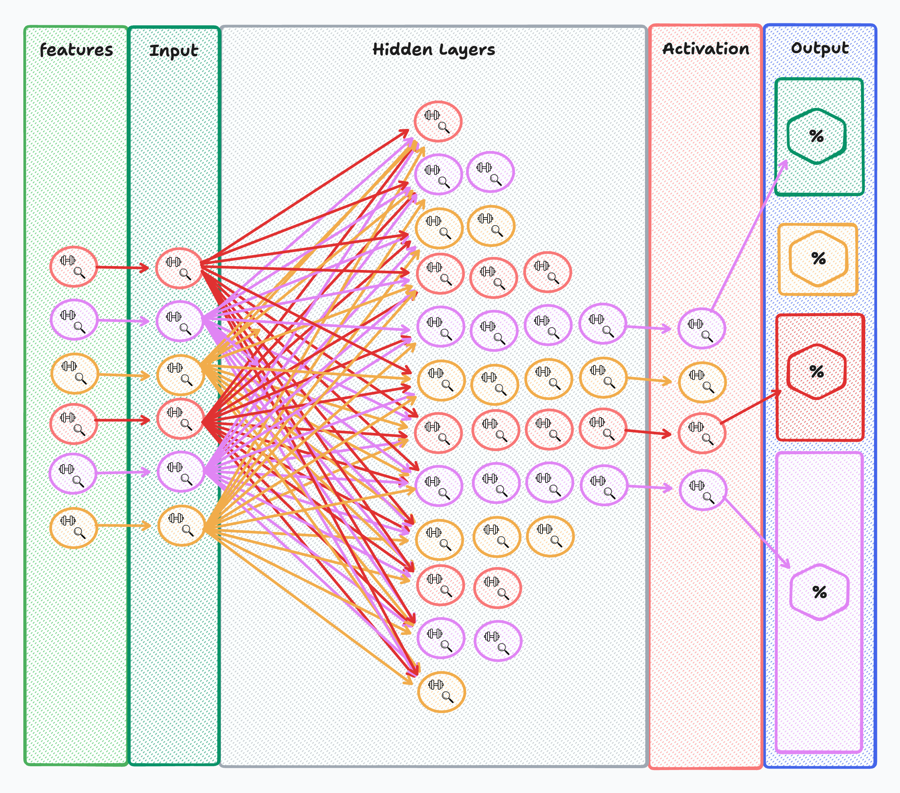

# Multi-Classification Models

## Introduction

In this lecture, we will explore multi-classification models, expanding upon the concepts learned in previous lectures on binary classification models. While binary classification deals with distinguishing between two classes, multi-class classification involves categorizing inputs into more than two classes. This lecture will provide a thorough understanding of the differences, theoretical concepts, and practical implementation of multi-classification models using PyTorch.

## Lecture

### Model Structure



#### What is Softmax

Softmax is an activation function used in the output layer of a neural network for multi-class classification. It converts raw output scores (logits) into probabilities, ensuring that the sum of probabilities for all classes is 1.

**Analogy:** Think of Softmax as a normalizer that turns a list of exam scores into a percentage distribution. If a student scores 50, 75, and 100 in three subjects, Softmax converts these scores into relative percentages like 20%, 30%, and 50%, making it easier to compare.

### Building the Model

Let's build a multi-classification model using PyTorch:

#### What is `torch.nn`?

`torch.nn` is a module in PyTorch that provides classes and functions to build neural networks. It includes layers, loss functions, and other tools necessary for building and training models.

- **`nn.Linear`**: This layer applies a linear transformation to the input data. It is defined as `nn.Linear(in_features, out_features)`, where `in_features` is the number of input features and `out_features` is the number of output features. It has parameters (weights and biases) that are learned during training.
  - **Capabilities**: Linear transformation of input data.
  - **Limitations**: Cannot capture non-linear relationships in the data.
  - **Weaknesses**: Limited in modeling complex patterns without activation functions.
  - **Type**: It is a hidden layer when placed between input and output layers.
  - **Data Transfer**: It transforms data through a weighted sum and adds a bias.

#### Defining a Model with `nn.Module`

```python
import torch.nn as n

class StudentPerformanceModel(n.Module): # Module there is a requirement for the existence of a method named forward
  
  def __init__(self):
    super(StudentPerformanceModel, self).__init__()
    # ly = layer
    self.ly1 = n.Linear(13,30) #=> 30
    self.ly2 = n.Linear(30,25) #=> 25
    self.ly3 = n.Linear(25, 20)
    self.ly4 = n.Linear(20, 15)
    self.ly5 = n.Linear(15, 10)
    self.ly6 = n.Linear(10,5)
    self.act = n.Softmax(dim=1) #tgt is an int

  def forward(self, x):
    x = self.ly1(x)
    x = self.ly2(x)
    x = self.ly3(x)
    x = self.ly4(x)
    x = self.ly5(x)
    x = self.ly6(x)
    return self.act(x)

  # def forward(self, features):
  #   output_from_ly1 = self.ly1(features)
  #   output_from_ly2 = self.ly2(output_from_ly1)
  #   output_from_ly3 = self.ly3(output_from_ly2)
  #   output_from_ly4 = self.ly4(output_from_ly3)
  #   output_from_ly5 = self.ly5(output_from_ly4)
  #   output_from_ly6 = self.ly6(output_from_ly5)
  #   result = self.act(output_from_ly6)
  #   return result

LearningModel = StudentPerformanceModel()
```

- **`super(BinaryModel, self).__init__()`**: This initializes the parent class `nn.Module`. It is a way to call the constructor of the parent class and ensure that all necessary initialization is done.

#### Viewing Weights and Biases

Weights and biases are parameters of the linear layer that are learned during training. You can inspect them as follows:

```python
# View weights and biases
for name, param in model.named_parameters():
    if param.requires_grad:
        print(name, param.data)
```

In a neural network, weights and biases are the learnable parameters that are adjusted during training to minimize the loss function and improve the model's predictions.

#### Explaining Model Predictions

Model predictions in a multi-class classification model are interpreted by finding the class with the highest probability. Here's how you can interpret the predictions:

```python
outputs = model(batch_features)
_, predicted = torch.max(outputs.data, 1)
print(_, predicted)
```

- `outputs`: Raw output from the model, representing class probabilities.
- `torch.max(outputs.data, 1)`: Finds the class index with the highest probability.
- `predicted`: The predicted class for each input sample.

### Training and Evaluating the Model

#### Cross Entropy Loss

Cross Entropy Loss is a common loss function for multi-class classification. It measures the performance of a classification model whose output is a probability value between 0 and 1. Cross Entropy Loss increases as the predicted probability diverges from the actual label.

**Analogy:** Imagine Cross Entropy Loss as a penalty score in a quiz game. If a contestant's answer (predicted probability) is far from the correct answer (actual label), the penalty is high. The goal is to minimize this penalty to improve accuracy.

#### Optimizers

Optimizers are crucial for training neural networks. They update the model's parameters to minimize the loss function. The optimal minimum refers to the point where the loss is the smallest. Learning rate and momentum are key parameters that affect this process:

- **Learning Rate**: Controls the step size of the parameter updates. A high learning rate can lead to overshooting the minimum, while a low learning rate can result in slow convergence.
- **Momentum**: Helps accelerate gradients vectors in the right directions, thus leading to faster converging.

We'll use the `optim.Adam` optimizer, which combines the advantages of two other extensions of stochastic gradient descent.

```python
optimizer = optim.Adam(model.parameters(), lr=0.01)
```

#### Backward Step (BackPropagation)

The backward step, or backpropagation, is a crucial phase in training neural networks. During backpropagation, the model adjusts its weights based on the error calculated in the forward pass. This is how the model "learns" to make better predictions.

- **Forward Step**: Passes the input data through the model to get the output.
- **Backward Step**: Computes the gradient of the loss with respect to each parameter, allowing the optimizer to update the model's weights.

#### Build the Training Loop

Here's a code sample for the training loop using Adam as the optimizer and CrossEntropyLoss as the criterion:

```python
import torch.optim as optim

# Define loss function and optimizer
criterion = nn.CrossEntropyLoss()
optimizer = optim.Adam(model.parameters(), lr=0.001)

# Training loop
LearningModel.train()
for epoch in range(200):
  running_loss = 0
  for features, labels in training_loader:
    optimizer.zero_grad()
    output = LearningModel(features)
    loss = criterion(output, labels)
    loss.backward()
    optimizer.step()
    running_loss += loss.item()
  average_los = running_loss / len(training_loader)
  if not (epoch+1) % 10:
    print(f"Average Loss {average_los} @ epoc {epoch+1}")
```

#### Build the Evaluation Loop

Here's a code sample for the evaluation loop using `Accuracy` from `torchmetrics`:

```python
from torchmetrics import Accuracy

# Initialize accuracy metric
accuracy = Accuracy(task='multiclass', num_classes=5)

# Evaluation loop
LearningModel.eval()
with torch.no_grad():
  for features, labels in testing_loader:
    output = LearningModel(features)
    _, predicted = torch.max(output.data, 1)
    print(predicted, labels)
    acc.update(predicted, labels)

print(f"Accuracy: {acc.compute().item()}")
```

## Conclusion

This lecture covered the fundamentals of multi-classification models, including differences from binary classification, model structure, data preprocessing, training tools, and building and evaluating the model. You should now have a good understanding of how to implement multi-classification models using PyTorch.

Multi-classification models expand the capabilities of neural networks to handle more complex classification tasks. By understanding the theoretical differences and practical implementations, you can now build and train multi-class models effectively. Practice with the provided examples and explore further to enhance your skills.
