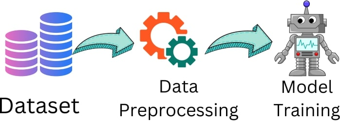

# Intro to Data Pre-Processing

## Introduction

In this lesson, titled "Intro to Data Pre-Processing," we'll explore the critical steps required to prepare raw data for use in a neural network. Data preprocessing is a foundational aspect of any machine learning project because the quality and structure of the input data significantly impact the performance of the model. Without proper preprocessing, even the most sophisticated models can yield inaccurate or unreliable results. In this lesson, we'll discuss the importance of data preprocessing, examine different types of data, and learn how to use Pandas—a powerful data manipulation library—to efficiently pre-process data stored in CSV files. By the end of this lesson, you'll have a clear understanding of how to clean, transform, and prepare data for use in PyTorch neural networks.

## Lesson

### What and Why Data Pre-Processing



#### What is Data Pre-Processing?

Data preprocessing refers to a series of steps designed to convert raw data into a format that can be readily used by a machine learning model. This process typically includes cleaning the data (removing or filling in missing values), transforming it (scaling, encoding, and normalizing), and organizing it into training and testing sets. These steps ensure that the data is clean, consistent, and appropriately structured, allowing the model to learn effectively.

#### Why is Data Pre-Processing Important?

The quality of the input data is directly proportional to the accuracy of the model's predictions. If the data contains inconsistencies, missing values, or is not properly scaled, the model might struggle to find patterns, leading to poor performance. For example, consider a dataset with wildly different scales—such as one column in dollars and another in percentages. Without scaling, the neural network might incorrectly prioritize one feature over another. Proper data preprocessing prevents such issues, making it a critical step in the development of neural networks with PyTorch.

### Types of Data

#### Numerical Data

Numerical data consists of numbers, such as integers or floats, and is often the easiest to pre-process. This type of data might represent measurements, such as height, weight, or temperature. In PyTorch, numerical data can be directly converted into tensors.

Lets say we wanted to create a study to find out how active people are just from the 3 attributes mentioned above. We would have a massive csv file that looks as such:

```csv
height,weight,temp
5.0, 142.54, 97.2
```

We could then utilize this csv file to generate PyTorch Tensors and prep them to be fed onto our Neural Network.

```python
import torch

# Example: Converting numerical data to a tensor
attributes = [5.0, 142.54, 97.2]
tensor_data = torch.tensor(attributes)
print(tensor_data)
```

#### Text Data

Text data represents discrete categories or labels, such as "red," "blue," or "green," or classes like "cat," "dog," or "mouse." Before feeding categorical data into a neural network, it often needs to be encoded into numerical values. This can be done using techniques like one-hot encoding or label encoding.

Text will get fed into our Machine and converted into a floating number. Our Neural Network only accepts tensors, so if we wanted it to accept text we would need to convert it utilizing this method.

```python
from sklearn.preprocessing import LabelEncoder

# Example: Encoding categorical data
color = ['red']
label_encoder = LabelEncoder()
encoded_data = label_encoder.fit_transform(color)
tensor_data = torch.tensor(encoded_data)
print(tensor_data)
```

In this example, we use `LabelEncoder` to convert the text data into numerical labels and then convert these labels into a PyTorch tensor.

#### Image Data

Image data is typically represented as pixel values and is often stored as arrays or matrices. Preprocessing image data involves resizing, normalizing, and augmenting the images before converting them into tensors. This process will create values corresponding to each pixels rgba values. Meaning each pixel will return a tensor that can be fed onto our neural network.

```python
from PIL import Image
import torchvision.transforms as transforms

# Example: Preprocessing an image
image = Image.open('image.jpg')
transform = transforms.Compose([
    transforms.Resize((128, 128)), #128px x 128px
    transforms.ToTensor(),  # Convert the image to a tensor
    transforms.Normalize((0.5,), (0.5,))  # Normalize the image
])
tensor_image = transform(image)
print(tensor_image.shape)
```

This code snippet demonstrates how to load an image, resize it, convert it into a tensor, and normalize its pixel values.

### Pandas and CSVs

#### Installing Pandas

Before diving into data manipulation, you'll need to install the Pandas library if you haven't already:

```bash
pip install pandas
```

Pandas is a versatile data manipulation library that excels at handling tabular data, such as data stored in CSV files.

#### Reading CSV Files with Pandas

Once Pandas is installed, you can easily read a CSV file into a DataFrame—a tabular data structure that makes it easy to manipulate and analyze data.

```python
import pandas as pd

# Example: Reading a CSV file
df = pd.read_csv('./resources/water_potability.csv')
print(df.head())  # Display the first five rows of the DataFrame
```

The `read_csv` function loads the CSV file into a DataFrame, and `df.head()` provides a quick look at the first few rows of data.

You can see how our data is being analyzed and printed onto our JupyterNotebook file almost as if it were the return statement of an SQL query. Well, just like in SQL we can select specific columns utilizing the header of the column we want to grab.

```python
df['<header'] # grabs a column
df.iloc[<num_row>] #grabs the row matching said num
df.iloc[<from_row>:<to_row>] # returns a slice of rows
```

#### DataFrame Methods for Data Manipulation

Pandas offers a wide range of methods to manipulate DataFrames. Some of the most commonly used methods include:

- **`df.info()`**: Provides a summary of the DataFrame, including data types and non-null values.
- **`df.describe()`**: Generates descriptive statistics of numerical columns.
- **`df.isnull()`**: Identifies null (missing) values in the DataFrame.
- **`df.dropna()`**: Removes rows or columns with null values.

#### Handling Missing Values

Missing data can lead to incorrect model predictions. Common strategies include:

- **Removal**: Discard rows or columns with missing values.
- **Imputation**: Replace missing values with mean, median, mode, or other values.
- **Interpolation**: Estimate missing values based on other data points.
- **`df.fillna()`**: Fills null values with specified values (e.g., mean or median).

```python
# Example: Handling null values and basic data inspection
print(df.info())  # Check for null values and data types
print(df.isnull().sum())
df.fillna(df.mean(), inplace=True)  # Fill missing values with the column mean
print(df.describe())  # Get a summary of the numerical columns
print(df.isnull().sum())
```

This code shows how to inspect the DataFrame, fill missing values, and generate summary statistics.

#### Working with Columns

You can easily select, rename, and create new columns in a Pandas DataFrame.

```python
# Example: Creating a new column and renaming existing ones
df['new_column'] = df['sulfate'] * 2
df.rename(columns={'new_column': 'sulfate_doubled'}, inplace=True)
print(df.head())
```

In this example, we create a new column by performing operations on an existing column and then rename the existing column.

## Conclusion

Data preprocessing is an essential step in preparing raw data for machine learning models. By understanding and applying the appropriate preprocessing techniques—whether handling numerical, categorical, or image data—you can ensure that your data is in optimal shape for model training. Tools like Pandas make the process of cleaning, transforming, and organizing data straightforward, particularly when working with CSV files. Mastering these techniques will enable you to build more accurate and effective neural networks in PyTorch, setting the foundation for successful machine learning projects.
