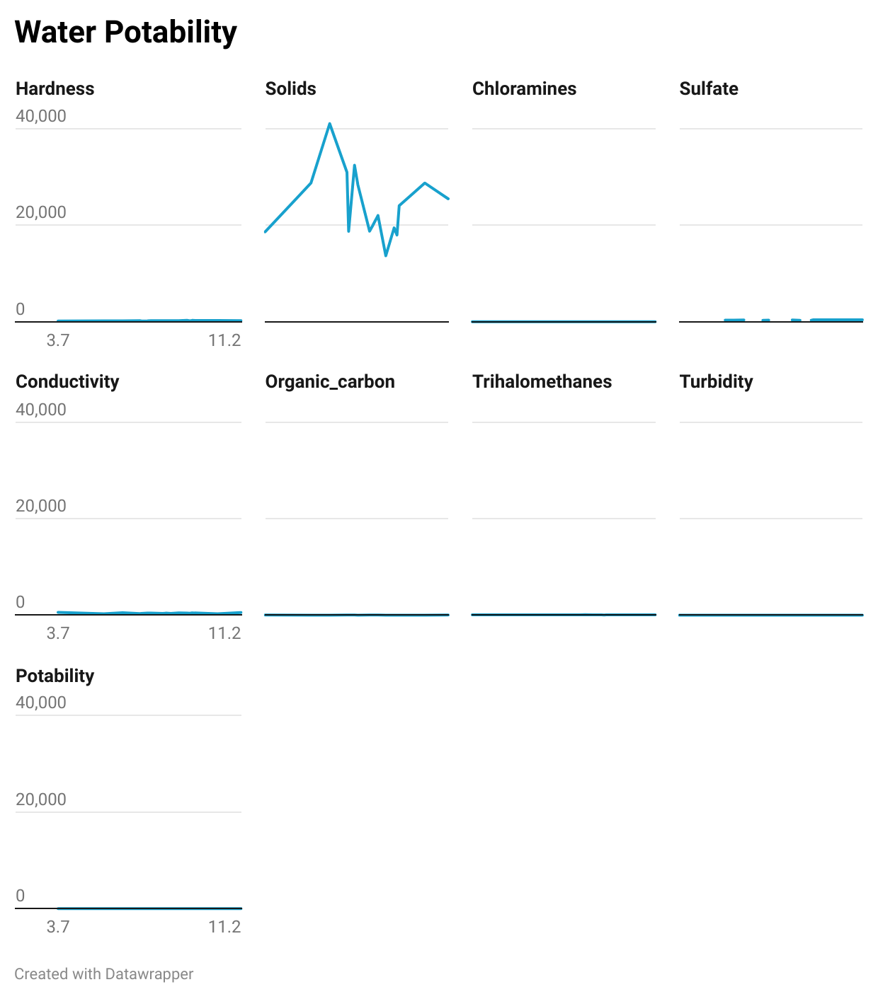
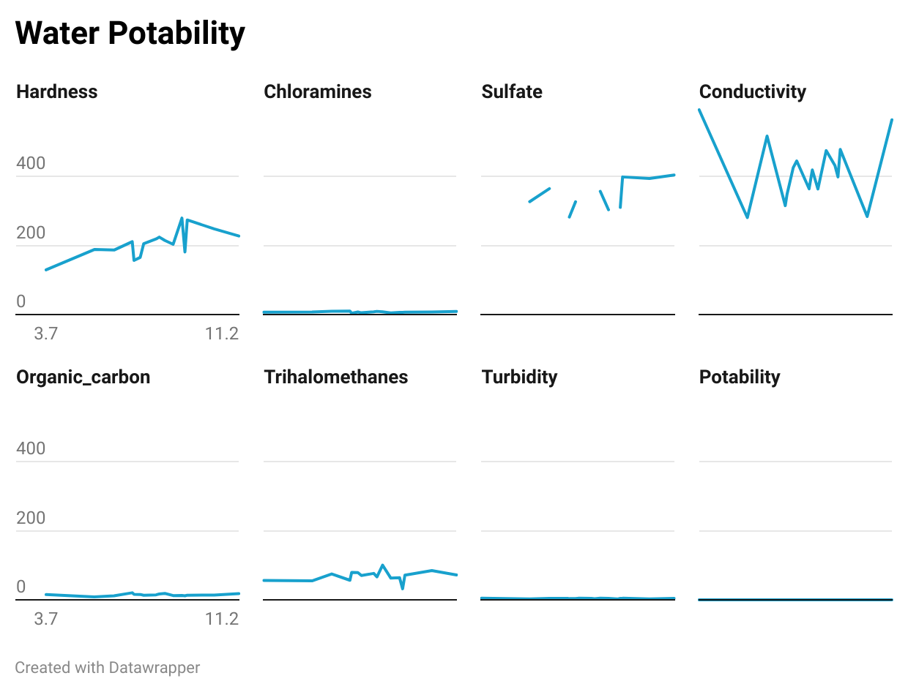
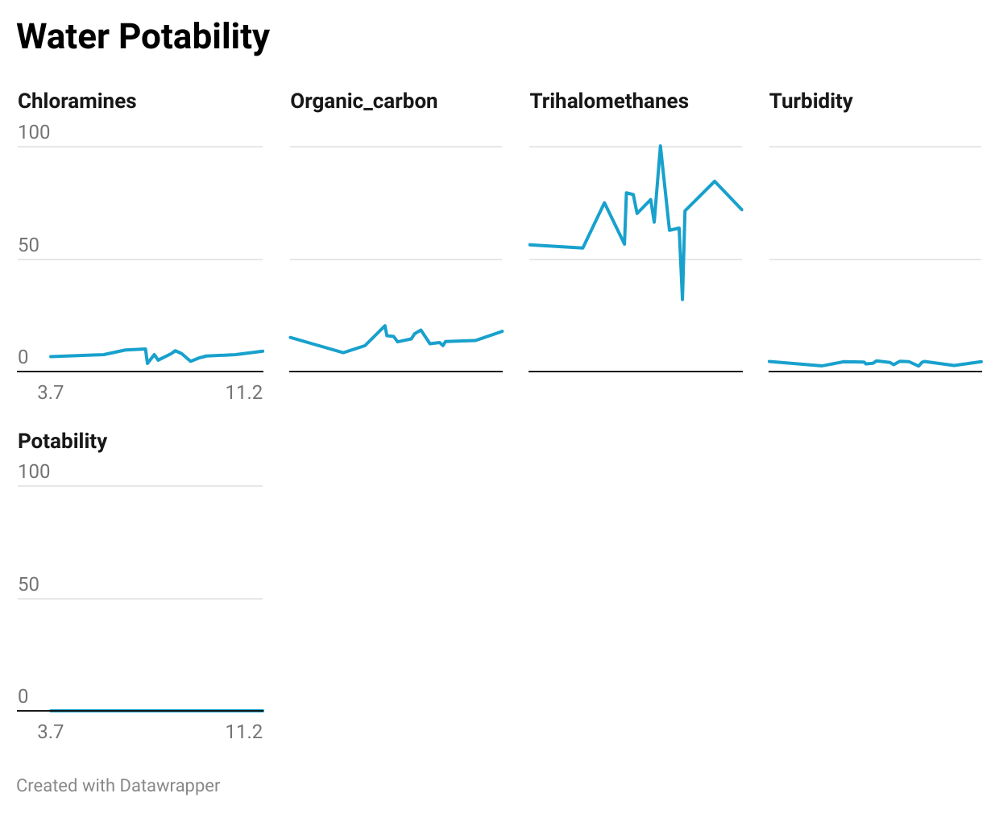

# Normalization and Scaling

## Introduction

In this lecture, we will explore the critical concepts of normalization and scaling—two fundamental techniques in data preprocessing that significantly impact the performance of machine learning models. These processes ensure that your data is consistent, properly formatted, and ready for use in neural networks. We will discuss the theory behind normalization and scaling, why they are crucial for effective model training, and how to implement these techniques using scikit-learn, a popular machine learning library. Additionally, we will cover the importance of splitting your data into training and testing sets, which is essential for evaluating the performance of your neural networks. By the end of this lecture, you'll have a clear understanding of how and why to normalize, scale, and split your data, setting the stage for successful model development.

## Lesson

### What is Normalization and Why is it Important When Pre-Processing Data?

Normalization is the process of adjusting the values in a dataset to a common scale without distorting differences in the ranges of values. This typically involves transforming the data so that its values fall within a specific range, such as [0, 1] or [-1, 1]. Normalization is particularly important in machine learning because it ensures that all features contribute equally to the model, preventing any single feature from dominating due to its scale.

For example, consider a dataset with two features: height in centimeters and income in dollars. Without normalization, the model might give undue weight to income simply because the numerical range is much larger than that of height. By normalizing these features, we ensure that the model considers the relative importance of each feature rather than their absolute magnitudes. In real-world scenarios, normalization is crucial when working with data that spans multiple orders of magnitude, such as comparing the pixel values of an image (ranging from 0 to 255) to audio signal amplitudes.

### What is Scaling and Why is it Important When Pre-Processing Data?

Scaling, similar to normalization, involves adjusting the range of feature values, but it specifically refers to transforming data so that it fits within a particular scale, often with a mean of 0 and a standard deviation of 1. This process is known as standardization. Scaling is important because many machine learning algorithms, including those used in neural networks, assume that the input data is centered around zero with equal variance.

For instance, in gradient-based optimization algorithms like stochastic gradient descent (SGD), features with different scales can lead to inefficient and slow learning, as the algorithm may have to take smaller steps in dimensions with larger scales. Scaling ensures that all features contribute equally to the learning process, leading to faster convergence and improved model accuracy. In practical terms, scaling is essential when dealing with features measured in different units, such as combining distance in kilometers and time in seconds in the same dataset.

#### Visualizing the problem

We are working with the [water potability](./resources/water_potability.csv) dataset where we have a collection of attributes in regards to water. Seems simple enough since we are working with numbers and turning them into tensors could be pretty simple. Lets place our data in a multi-line chart to see the difference between our attributes.



Currently the value of solids is extremely high. What we care about is the variance in between each point but we don't want it to be of such a large scale. This attribute of  `solids` would dominate the data and can possibly confuse our Model.



Here we removed solids but we still have 3 other attributes that are massive compared to the rest.



We could continue this pattern over and over again but the key concept to visualize is we want the variance in within each step but not the value itself. Instead we want to make our values fit within a top and bottom value cap while maintaining the height variation of each step.

#### Features and Labels

- **Features:** These are the input data points that the model uses to make predictions. Features often have different units, ranges, or distributions, which can affect the learning process. Normalization and scaling ensure that features contribute equally to the model's learning, improving performance and convergence.

- **Labels:** These are the target outputs that the model is trying to predict. In most cases, labels are left in their original form because the model needs to learn the relationship between the features and the actual target values. For instance, if you normalize a label in a regression task, you may end up distorting the real-world meaning of the predictions. However, in some cases like certain regression problems, labels might be scaled if the magnitude of the values affects the loss function, but this is less common.

Knowing this information, lets take our existing data and separate our features from our labels:

```python
features = data.drop('Potability', axis=1)
labels = data['Potability']
```

### What is Scikit-Learn?

Scikit-learn is a powerful and widely used machine learning library in Python, providing simple and efficient tools for data analysis and modeling. It includes a wide range of algorithms for classification, regression, clustering, and dimensionality reduction, as well as tools for preprocessing data, such as normalization, scaling, and splitting datasets. Scikit-learn's user-friendly interface and comprehensive documentation make it an excellent choice for implementing preprocessing techniques in machine learning projects.

#### How Does Scikit-Learn's `StandardScaler()` Work?

The `StandardScaler()` in scikit-learn is a preprocessing tool that standardizes features by removing the mean and scaling them to unit variance. In other words, it transforms the data so that each feature has a mean of 0 and a standard deviation of 1. This is done by subtracting the mean of each feature from the data points and then dividing by the standard deviation.

```python
from sklearn.preprocessing import StandardScaler

# Example: Scaling data using StandardScaler
scaler = StandardScaler()
scaled_features = scaler.fit_transform(features)
print(scaled_features)
```

In this code snippet, the `StandardScaler()` is applied to a small dataset. The output is a scaled version of the data where each feature has a mean of 0 and a standard deviation of 1, ensuring that the data is centered and has equal variance.

### Why Have Testing and Training Splits for Neural Networks?

Splitting your data into training and testing sets is a crucial step in building and evaluating neural networks. The training set is used to train the model, while the testing set is reserved for evaluating the model's performance on unseen data. This split allows you to assess how well your model generalizes to new data, which is essential for avoiding overfitting—where the model performs well on the training data but poorly on new data.

Having a separate testing set ensures that your model's performance metrics are not biased by the training data and provides a more accurate representation of how the model will perform in real-world scenarios. This practice is especially important in deep learning, where models are prone to overfitting due to their complexity and capacity to memorize the training data.

#### Applying Scikit-Learn's `train_test_split`

Scikit-learn's `train_test_split` function is a simple and effective way to split your dataset into training and testing sets.

```python
from sklearn.model_selection import train_test_split
# features_train + labels_train = 80% && features_test + labels_test = 20%
features_train, features_test, labels_train, labels_test = train_test_split(scaled_features, labels, test_size=0.2, random_state=42)

print("Training Data:", X_train)
print("Testing Data:", X_test)
```

Lets take some time and break down the command above:

- **scaled_features**: This is typically a 2D array or DataFrame containing the features (independent variables) that you want to use for training your model.
target: This is usually a 1D array or Series containing the labels or targets (dependent variables) corresponding to the features.
- **test_size=0.2**: This specifies the proportion of the dataset to include in the test split. In this case, 20% of the data will be used for testing, while 80% will be used for training.
- **random_state=42**: This sets a seed for the random number generator. By specifying a random_state, you ensure that the split is reproducible; you'll get the same split every time you run the code.

In this example, the dataset is split into training and testing sets using `train_test_split`. The `test_size` parameter determines the proportion of the data to be used as the testing set (in this case, 20%). The `random_state` parameter ensures reproducibility by controlling the shuffling applied to the data before the split.

Finally we will need to ensure that our testing and training data are turned into tensors of the correct type.

```python
features_train = tensor(features_train, dtype=torch.float32)
features_test = tensor(features_test, dtype=torch.float32)
labels_train = tensor(labels_train, dtype=torch.float32)
labels_test = tensor(labels_test, dtype=torch.float32)
```

Our data is now Scaled and Standardized making it ready for training and evaluating our future Learning Models.

## Conclusion

Normalization and scaling are vital preprocessing techniques that ensure your data is in the best possible format for training neural networks. By understanding the theory behind these processes and applying them using tools like scikit-learn, you can significantly improve your model's performance and efficiency. Additionally, splitting your data into training and testing sets is crucial for evaluating how well your model generalizes to new data. With these preprocessing techniques, you are well-equipped to prepare your data for successful machine learning projects in PyTorch.
