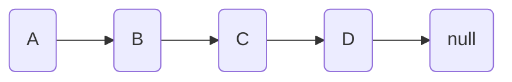
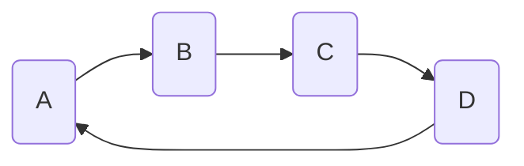

# Circular Linked Lists

## Intro

We've seen regular Linked Lists - let's explore a variation! A circular linked list is a linked list where the last node points back to the first node, creating a "circle". This means **there is no null reference at the "tail" (end) of the list** - every node has a valid next pointer.

Regular Linked List:



Circular Linked List:



The same diagrams in plain markdown, in case the mermaid diagrams don't render:

```
Regular Linked List:    A -> B -> C -> D -> null
Circular Linked List:   A -> B -> C -> D -┐
                       ^                   |
                       └-------------------┘
```

## Key Properties and Use Cases for Circular Linked Lists

Some key properties of a Circular Linked List are:

- The last node points to the first node
- You can traverse the list indefinitely, it 'loops'
- Every node always has a valid next point (the 'tail' node does not point to Null)
- Traversal requires extra effort to avoid infinite loops

Some use-case examples are:

- A Music player with repeat functionality (think "repeat" on a song playlist)
- Multiplayer games, managing turn-based games where players take turns in order, such as a card game or board game.
- Round-robin scheduling in operating systems
- Circular buffers in memory management*

*Circular buffers (aka ring buffers) are used for low-level memory mansgement by programs and operating systems. "Oldest" data is overwrtitten by "new" data once the buffer is full.

## Time Complexity Comparison

Let's look at the different time complexities for common linked list operations for singly, circular, and doubly linked lists:

Operation | Singly Linked | Circular | Doubly Linked
----------|---------------|----------|---------------
Insert at beginning | O(1) | O(1) | O(1)
Insert at end | O(n) | O(n) | O(1)*
Delete at beginning | O(1) | O(1) | O(1)
Delete at end | O(n) | O(n) | O(1)*
Forward traversal | O(n) | O(n) | O(n)
Backward traversal | O(n) | O(n) | O(n)

*With tail pointer

There are not differences in time complexity for singly vs Circular Linked Lists. Doubly Linked Lists we'll discuss later.

## Designing A Circular Linked List

Before we start writing code, let's do some designing and planning.

There are two possible 'states' our Linked List can be in when we insert a new node:

1. We are inserting a node into an *empty list.*

2. We are inserting a node into a *non-empty list.*

Our insertion code must handle for both scenarios.

We also need to make sure the last node in the list points to the *head* of the list. This means we need to keep track of the *head* of the list, and, when we insert a new node at the tail (end) of the list, have it point to the *head*.

Our pseudocode would look something like:

- Create 'Node' class
  - Holds data, pointer to next node
- Create main 'CircularLinkedList' class
  - Holds pointer to HEAD, set to None in init() method
- Create CircularLinkedList.append()
  - Handle inserting into empty list
    - Update HEAD
  - Handle inserting into existing list
    - Have new node point to HEAD to make the list circular
- Create CircularLinkedList.print()
  - We extra logic to know when we are at the end of the list and avoid an infinite loop

We will worry about deleting nodes, etc, later.

## How Does It Work? Implementing A Circular Linked List

Now that we have a plan, lets write our code:

```python
class Node:
    def __init__(self, data):
        self.data = data
        self.next = None

class CircularLinkedList:
    def __init__(self):
        self.head = None
    
    def append(self, data):
        new_node = Node(data)
        
        # If list is empty, make new node the head
        if not self.head:
            self.head = new_node
            new_node.next = self.head  # Point to itself
            return
            
        # Find the last node
        current = self.head
        while current.next != self.head:
            current = current.next
            
        # Add the new node and make it circular
        current.next = new_node
        new_node.next = self.head
    
    def print_list(self):
        if not self.head:
            return
            
        current = self.head
        while True:
            print(current.data, end=" -> ")
            current = current.next
            # avoid infinite loop
            if current == self.head:
                break
        print("(back to start)")

# Lets run our code:
my_list = CircularLinkedList()

my_list.append("hello")
my_list.append("world")
my_list.append("its")
my_list.append("sunny")

my_list.print_list()
```

## Challenge: Detecting Cycles

Here's a challenging problem: Write a function that determines whether a linked list is circular. This is a common interview question, and, highlights out a potential "gotcha" with Circular Linked Lists - you never reach the end of one! You could imagine how being able to determine if a Linked List is circular or not could be valuable.

```python
def has_cycle(head):
    if not head or not head.next:
        return False
        
    slow = head
    fast = head.next
    
    while fast and fast.next:
        if slow == fast:
            return True
        slow = slow.next
        fast = fast.next.next
    
    return False
```

We can test our `has_cycle` function with the Circular Linked List we made earlier:

```python
# Uses circular linked list code from before

print(has_cycle(my_list.head)) # True
```

*As a stretch challenge, implement a singular linked list and use `has_cycle()` on it.*

This solution uses the "Floyd's Cycle-Finding Algorithm" or "Tortoise and Hare Algorithm". Can you explain how it works?

## Conclusion

Circular Linked Lists give you another tool in your toolbox. Plus, we've learned how to detect 'cycles' in a Linked List with FLoyd's Algorithm and explored common use cases such as tracking player turns in a multiplayer game. 🚀 

