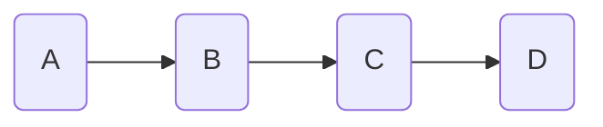

# Doubly Linked Lists

## Intro

We've seen regular Linked Lists - let's explore a variation! A Doubly Linked List is a linked list where each node points to the node **before** and **after** it in the list. You can traverse both 'left' and 'right' in the list!

To reiteriate, a doubly linked list extends the regular linked list by adding a reference to the previous node. Each node now has two pointers: one to the next node and one to the previous node.

Visualization:

Singly Linked List:



Doubly Linked List:

```mermaid
    %% Doubly Linked List with bidirectional arrows
    A2(A) <--> B2(B)
    B2 <--> C2(C)
    C2 <--> D2(D)
```

*The same diagram in plain markdown:*

```
Singly Linked List:     A -> B -> C -> D
Doubly Linked List:     A ⟷ B ⟷ C ⟷ D
```

## Key Properties and Use Cases for Doubly Linked Lists

Some key properties of Doubly Linked Lists are:

1. Bidirectional Traversal: Can move both forward and backward through the list
2. Efficient Deletions: No need to traverse to find the previous node
3. Quick Insertions: Can insert before or after a node in O(1) time
4. Memory Trade-off: Uses more memory per node but enables more efficient operations

Some use-case examples are:

- Browser history (forward/backward navigation)
- Text editors (undo/redo functionality)
- LRU (Least Recently Used) caches
- Music players (next/previous track)

## Time Complexity Comparison

Let's look at the different time complexities for common linked list operations for singly, circular, and doubly linked lists:

Operation | Singly Linked | Circular | Doubly Linked
----------|---------------|----------|---------------
Insert at beginning | O(1) | O(1) | O(1)
Insert at end | O(n) | O(n) | O(1)*
Delete at beginning | O(1) | O(1) | O(1)
Delete at end | O(n) | O(n) | O(1)*
Forward traversal | O(n) | O(n) | O(n)
Backward traversal | O(n) | O(n) | O(n)

*With tail pointer

Doubly Linked Lists aren't that much more efficient than Singly or Circular Linked Lists for common operations. But -- If we give the doubly linked list a "tail pointer", inserting or deleting at the end of the list becomes O(1) because we can use the tail pointer to go directly to the end of the list.

Singly linked lists nodes don't have a pointer to the "previous" node, so even with a tail pointer deleting/adding at the end of the list still requires us to traverse the list to find the second-to-last-node.

## Designing A Doubly Linked List

Our code for inserting a node in a doubly linked list must handle:

1. We are inserting a node into an *empty list.*

2. We are inserting a node into a *non-empty list.*

And when adding a new node we must *connect it and the previous node to each other.*

Our pseudocode would look something like:

- Create 'Node' class
  - data
  - prev
  - next
- Create main 'DoublyLinkedList' class
  - Holds pointer to HEAD, set to None in init() method
- Create DoublyLinkedList.append() to insert at end of list
  - new_node.next = None
  - Handle inserting into empty list
    - Update HEAD
  - Handle inserting into existing list
    - last_node.next = new_node
    - new_node.prev = last_node
- Create DoublyLinkedList.insert_after() to insert after a *specific* node
  - Find the target_node we are going to insert after
  - Make sure we add the new node in without breaking the chain:
     - Connect new node to next node:
       - target_node.next.prev  = new_node
       - new_node.next = target_node.next.prev
     - Connect new node to target node:
       - target_node.next = new_node
       - new_node.prev = target_node
- Create DoublyLinkedList.print()
  - loop thru and print until current_node.next is None

  Why is the order of operations important for `insert_after()`? What could go wrong if we change the order we connect the target, new, and next nodes?

## How Does It Work? Implementing A Doubly Linked List

```python
class Node:
    def __init__(self, data):
        self.data = data
        self.next = None
        # For connecting to the previous node. 
        self.prev = None

class DoublyLinkedList:
    def __init__(self):
        self.head = None
        self.tail = None
    
    def append(self, data):
        new_node = Node(data)
        
        # If list is empty
        if not self.head:
            self.head = new_node
            self.tail = new_node
            return
        
        # Add to end and update pointers
        new_node.prev = self.tail
        self.tail.next = new_node
        self.tail = new_node
    
    def insert_after(self, ref_node, data):
        if not ref_node:
            return
            
        new_node = Node(data)
        
        # Update next pointers
        new_node.next = ref_node.next
        ref_node.next = new_node
        
        # Update prev pointers
        new_node.prev = ref_node
        if new_node.next:
            new_node.next.prev = new_node
        else:
            self.tail = new_node
    
    def delete(self, node):
        if not node:
            return
            
        # Update head if needed
        if node == self.head:
            self.head = node.next
            
        # Update tail if needed
        if node == self.tail:
            self.tail = node.prev
            
        # Update surrounding nodes
        if node.prev:
            node.prev.next = node.next
        if node.next:
            node.next.prev = node.prev

    def print_forward(self):
        current = self.head
        while current:
            print(current.data, end=" ⟷ ")
            current = current.next
        print("None")

    def print_backward(self):
        current = self.tail
        while current:
            print(current.data, end=" ⟷ ")
            current = current.prev
        print("None")

my_list = DoublyLinkedList()
my_list.append("hello")
my_list.append("world")
my_list.append("its")
my_list.append("sunny")
my_list.insert_after(my_list.head.next, ",") # insert after "hello", "world"

my_list.print_forward() # hello world, its sunny
my_list.print_backward() # sunny its , world hello
```

## Challenge: Create `insert_at_beginning`

Here is some pseudo code for creating a method to insert a node at the beginning of the list:

- Create DoublyLinkedList.before() to insert at beginning of list
  - new_node.next = None
  - Handle inserting into empty list
    - Update HEAD
  - Handle inserting into existing list
    - new_node.next = HEAD
    - HEAD.prev = new_node
    - HEAD = new_node

Can you use it to write an implementation?

## Conclusion

In this lesson, we explored Doubly Linked Lists, where each node points to both its previous and next nodes. We learned how this structure, while using more memory per node, enables efficient bidirectional traversal and O(1) operations at both ends when using a tail pointer. We implemented core operations and saw how this data structure is particularly useful for applications like browser history and music players where backwards/forwards navigation is needed. We've added another tool to our data structures toolbox! 🚀