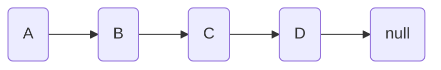
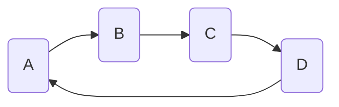
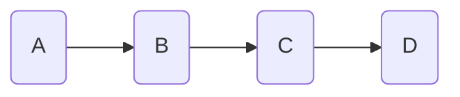

# Advanced Linked Lists: Circular and Doubly Linked Lists

## Introduction

Previously, we explored singly linked lists - a linear data structure where each node points to the next node in the sequence, eventually reaching a null reference that marks the end. Today, we'll explore two important variations: circular linked lists and doubly linked lists. These structures build upon the basic linked list concept but offer unique properties that make them better suited for certain problems.

## Circular Linked Lists

### What is a Circular Linked List?

A circular linked list is a variation of a linked list where the last node points back to the first node, creating a circle. This means there is no null reference at the end - every node has a valid next pointer.

Regular Linked List:



Circular Linked List:



The same diagrams in plain markdown:

```
Regular Linked List:    A -> B -> C -> D -> null
Circular Linked List:   A -> B -> C -> D -┐
                       ^                   |
                       └-------------------┘
```

### Circular Linked List Implementation

Let's implement a basic circular linked list in Python.

There are two possible 'states' our Linked List can be in when we insert a new node:

1. We are inserting a node into an *empty list.*

2. We are inserting a node into a *non-empty list.*

Our insertion code must handle for both scenarios.

We also need to make sure the last node in the list points to the *head* of the list. This means we need to keep track of the *head* of the list, and, when we insert a new node at the tail (end) of the list, have it point to the *head*.

Now that we have a plan, lets write our code:

```python
class Node:
    def __init__(self, data):
        self.data = data
        self.next = None

class CircularLinkedList:
    def __init__(self):
        self.head = None
    
    def append(self, data):
        new_node = Node(data)
        
        # If list is empty, make new node the head
        if not self.head:
            self.head = new_node
            new_node.next = self.head  # Point to itself
            return
            
        # Find the last node
        current = self.head
        while current.next != self.head:
            current = current.next
            
        # Add the new node and make it circular
        current.next = new_node
        new_node.next = self.head
    
    def print_list(self):
        if not self.head:
            return
            
        current = self.head
        while True:
            print(current.data, end=" -> ")
            current = current.next
            if current == self.head:
                break
        print("(back to start)")

# Lets run our code:
my_list = CircularLinkedList()

my_list.append("hello")
my_list.append("world")
my_list.append("its")
my_list.append("sunny")

my_list.print_list()
```

### Key Properties and Use Cases for Circular Linked Lists

Some key properties:

1. No null termination: The list never "ends" - you can keep traversing indefinitely
2. Natural for circular buffers: Perfect for round-robin scheduling or circular queues
3. Memory efficiency: No need to store null references
4. Requires careful traversal: Must check for returning to head to avoid infinite loops

Some use-case examples:

- Music players with repeat functionality
- Round-robin scheduling in operating systems
- Circular buffers in memory management
- Game loops where elements cycle continuously

### Challenge: Detecting Cycles

Here's a challenging problem: Write a function that determines whether a linked list is circular. This is a common interview question that helps understand both types of lists we've covered.

```python
def has_cycle(head):
    if not head or not head.next:
        return False
        
    slow = head
    fast = head.next
    
    while fast and fast.next:
        if slow == fast:
            return True
        slow = slow.next
        fast = fast.next.next
    
    return False
```

This solution uses the "Floyd's Cycle-Finding Algorithm" or "Tortoise and Hare Algorithm". Can you explain how it works?

## Doubly Linked Lists

### What is a Doubly Linked List?

A doubly linked list extends the regular linked list by adding a reference to the previous node. Each node now has two pointers: one to the next node and one to the previous node.

Visualization:

Singly Linked List:



Doubly Linked List:

```mermaid
    %% Doubly Linked List with bidirectional arrows
    A2(A) <--> B2(B)
    B2 <--> C2(C)
    C2 <--> D2(D)
```

*The same diagram in plain markdown:*

```
Singly Linked List:     A -> B -> C -> D
Doubly Linked List:     A ⟷ B ⟷ C ⟷ D
```

### Doubly Linked List Implementation

Again, our code for inserting a node in a doubly linked list must handle:

1. We are inserting a node into an *empty list.*

2. We are inserting a node into a *non-empty list.*

And when adding a new node we must *connect it and the previous node to each other.*

```python
class Node:
    def __init__(self, data):
        self.data = data
        self.next = None
        # For connecting to the previous node. 
        self.prev = None

class DoublyLinkedList:
    def __init__(self):
        self.head = None
        self.tail = None
    
    def append(self, data):
        new_node = Node(data)
        
        # If list is empty
        if not self.head:
            self.head = new_node
            self.tail = new_node
            return
        
        # Add to end and update pointers
        new_node.prev = self.tail
        self.tail.next = new_node
        self.tail = new_node
    
    def insert_after(self, ref_node, data):
        if not ref_node:
            return
            
        new_node = Node(data)
        
        # Update next pointers
        new_node.next = ref_node.next
        ref_node.next = new_node
        
        # Update prev pointers
        new_node.prev = ref_node
        if new_node.next:
            new_node.next.prev = new_node
        else:
            self.tail = new_node
    
    def delete(self, node):
        if not node:
            return
            
        # Update head if needed
        if node == self.head:
            self.head = node.next
            
        # Update tail if needed
        if node == self.tail:
            self.tail = node.prev
            
        # Update surrounding nodes
        if node.prev:
            node.prev.next = node.next
        if node.next:
            node.next.prev = node.prev

    def print_forward(self):
        current = self.head
        while current:
            print(current.data, end=" ⟷ ")
            current = current.next
        print("None")

    def print_backward(self):
        current = self.tail
        while current:
            print(current.data, end=" ⟷ ")
            current = current.prev
        print("None")
```

### Key Properties and Advantages of Doubly Linked Lists

Some key properties are:

1. Bidirectional Traversal: Can move both forward and backward through the list
2. Efficient Deletions: No need to traverse to find the previous node
3. Quick Insertions: Can insert before or after a node in O(1) time
4. Memory Trade-off: Uses more memory per node but enables more efficient operations

Some use-case examples are:

- Browser history (forward/backward navigation)
- Text editors (undo/redo functionality)
- LRU (Least Recently Used) caches
- Music players (next/previous track)

## Time Complexity Comparison

Let's look at the different time complexities for common linked list operations for singly, circular, and doubly linked lists:

Operation | Singly Linked | Circular | Doubly Linked
----------|---------------|----------|---------------
Insert at beginning | O(1) | O(1) | O(1)
Insert at end | O(n) | O(n) | O(1)*
Delete at beginning | O(1) | O(1) | O(1)
Delete at end | O(n) | O(n) | O(1)*
Forward traversal | O(n) | O(n) | O(n)
Backward traversal | O(n) | O(n) | O(n)

*With tail pointer

## Practice Problems

1. Add a `delete_node()` method to the circular linked list class
2. Add a `delete_node()` method to the doubly linked list class
3. Add a `reverse_list()` method to the doubly linked list class
4. Create a music playlist program with repeat functionality using a circular linked list
5. Implement a browser history program using a doubly linked list
6. Implement a circular queue using a circular linked list
