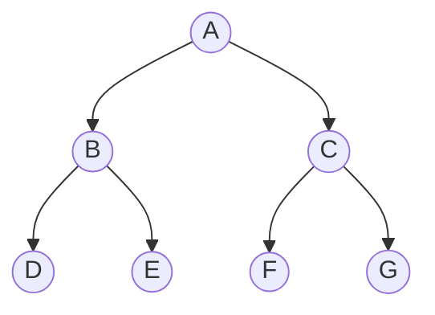
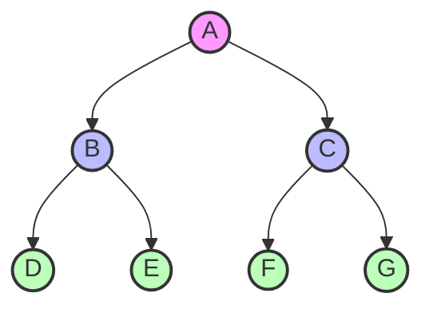
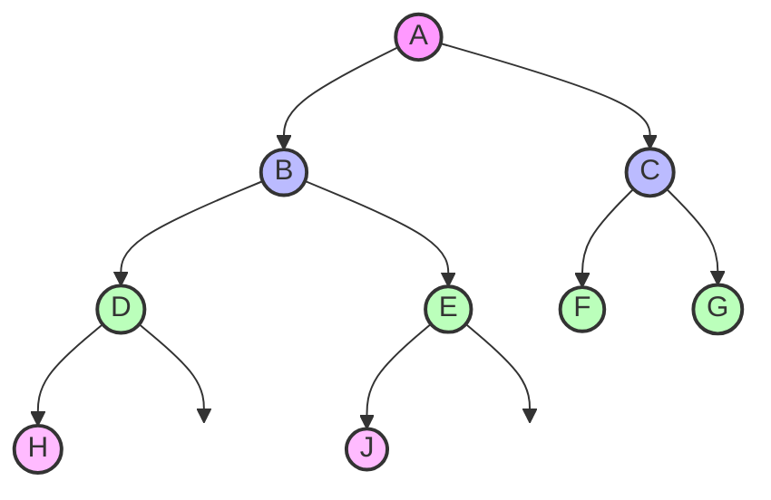
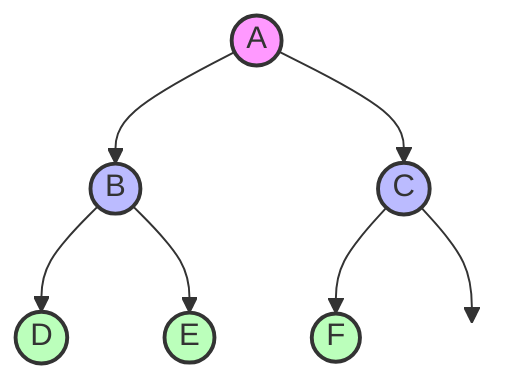
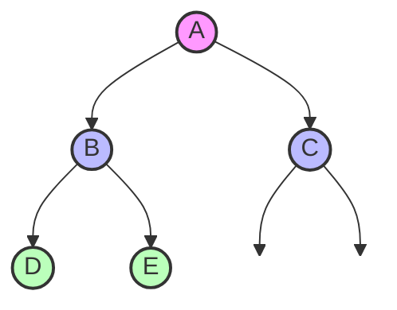
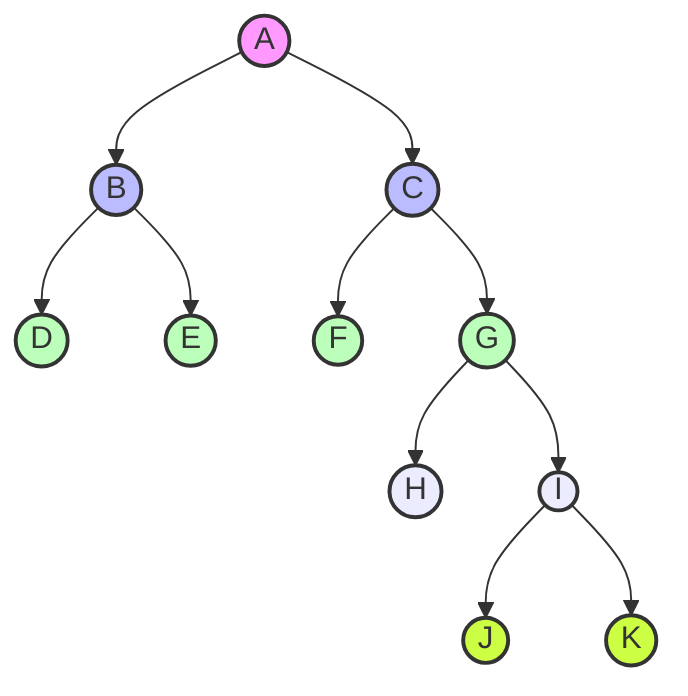
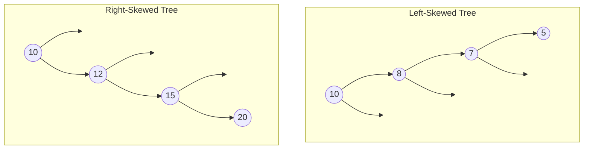
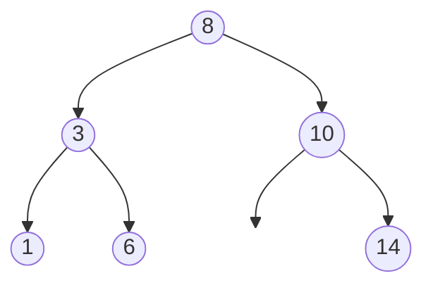
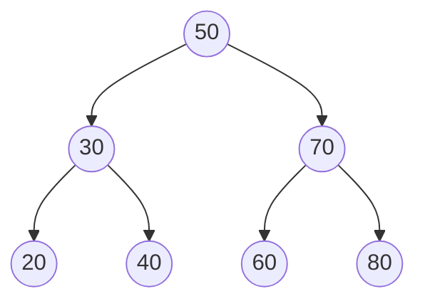
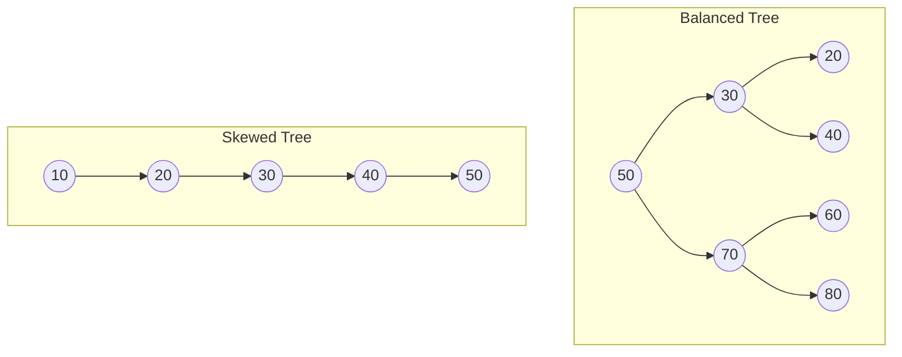

# Intro to Binary Trees

## Different Kinds of Trees

### What is a Tree?

A tree is a hierarchical data structure consisting of nodes connected by edges. Each tree has a root node, and every node (except the root) has exactly one parent node. Nodes can have multiple children.

### What is a Binary Tree?

A binary tree is a tree where each node has at most two children, typically called "left" and "right" children.



### Binary Tree Terminology

- **Node**: Each element in a tree containing data and references to child nodes
- **Root**: The topmost node in the tree
- **Parent**: A node that has one or more child nodes
- **Child**: A node directly connected to another node when moving away from the root
- **Leaf**: A node with no children (D, E, F, G in the diagram above)
- **Internal Node**: A node with at least one child (A, B, C in the diagram above)
- **Depth**: The length of the path from the root to a node
- **Height**: The length of the longest path from a node to a leaf

### Types of Binary Trees

#### Perfect Binary Tree

All internal nodes have exactly two children, and all leaf nodes are at the same level.



#### Balanced Binary Tree

The height difference between left and right subtrees of any node is at most 1.



#### Complete Binary Tree

All levels are filled except possibly the last, which is filled from left to right.



#### Full Binary Tree

Every node has either 0 or 2 children (no nodes with only one child).



#### Unbalanced Binary Tree 

The heights of the left and right subtrees of at least one node differ by more than one level. The imbalance can occur at any level or multiple levels.



#### Skewed Tree

A skewed binary tree is where the tree is dominated by either left nodes or right nodes.



#### Binary Search Tree (BST)

> This is an important kind of tree which we will learn more about later.

A special binary tree where for each node, all values in the left subtree are less than the node's value, and all values in the right subtree are greater.



## Writing a Simple Binary Tree in Python

Let's start by defining a basic node class:

```python
class Node:
    def __init__(self, value):
        self.value = value
        self.left = None
        self.right = None
```

Now, let's create a simple binary tree class:

```python
class BinaryTree:
    def __init__(self):
        self.root = None
    
    def insert(self, value):
        """Insert a value using level-order traversal (BFS)"""
        new_node = Node(value)
        
        # If tree is empty, make new node the root
        if not self.root:
            self.root = new_node
            return
        
        # Use breadth-first search (BFS) to find the first available position
        queue = []
        queue.append(self.root)
        
        while queue:
            node = queue.pop(0)
            
            # If left child is empty, add here
            if not node.left:
                node.left = new_node
                return
            else:
                queue.append(node.left)
            
            # If right child is empty, add here
            if not node.right:
                node.right = new_node
                return
            else:
                queue.append(node.right)
```

### Traversing a Binary Tree

There are different ways to traverse a binary tree:

1. **Pre-order traversal** (Root, Left, Right):

```python
def preorder_traversal(self):
    result = []
    
    def dfs(node):
        if node:
            result.append(node.value)  # Visit root
            dfs(node.left)             # Visit left subtree
            dfs(node.right)            # Visit right subtree
    
    dfs(self.root)
    return result
```

2. **In-order traversal** (Left, Root, Right):

```python
def inorder_traversal(self):
    result = []
    
    def dfs(node):
        if node:
            dfs(node.left)             # Visit left subtree
            result.append(node.value)  # Visit root
            dfs(node.right)            # Visit right subtree
    
    dfs(self.root)
    return result
```

3. **Post-order traversal** (Left, Right, Root):

```python
def postorder_traversal(self):
    result = []
    
    def dfs(node):
        if node:
            dfs(node.left)             # Visit left subtree
            dfs(node.right)            # Visit right subtree
            result.append(node.value)  # Visit root
    
    dfs(self.root)
    return result
```

4. **Level-order traversal** (BFS):

```python
def level_order_traversal(self):
    if not self.root:
        return []
    
    result = []
    queue = [self.root]
    
    while queue:
        node = queue.pop(0)
        result.append(node.value)
        
        if node.left:
            queue.append(node.left)
        if node.right:
            queue.append(node.right)
    
    return result
```

## Introduction to Binary Search Trees

A Binary Search Tree (BST) is a special type of binary tree that maintains an ordered structure:

- For any node, all values in its left subtree are less than the node's value
- For any node, all values in its right subtree are greater than the node's value

This ordering property makes operations like search, insertion, and deletion very efficient.



### Creating a Binary Search Tree

```python
class BST:
    def __init__(self):
        self.root = None
    
    def insert(self, value):
        """Insert a value into the BST maintaining the BST property"""
        if not self.root:
            self.root = Node(value)
            return
        
        def _insert(node, value):
            if value < node.value:
                if node.left is None:
                    node.left = Node(value)
                else:
                    _insert(node.left, value)
            else:
                if node.right is None:
                    node.right = Node(value)
                else:
                    _insert(node.right, value)
        
        _insert(self.root, value)
```

## Searching a Binary Search Tree

The BST property allows for efficient searching:

```python
def search(self, value):
    """Search for a value in the BST"""
    def _search(node, value):
        # Base case: empty tree or value found
        if node is None or node.value == value:
            return node
        
        # If value is less than node's value, search left subtree
        if value < node.value:
            return _search(node.left, value)
        
        # If value is greater than node's value, search right subtree
        return _search(node.right, value)
    
    return _search(self.root, value) is not None
```

### Iterative Search

```python
def iterative_search(self, value):
    """Iterative search in a BST"""
    current = self.root
    
    while current:
        if current.value == value:
            return True
        elif value < current.value:
            current = current.left
        else:
            current = current.right
    
    return False
```

### Time Complexity Analysis

For a balanced BST with n nodes:

- Search: O(log n)
- Insert: O(log n)
- Delete: O(log n)

For a skewed BST (worst case):

- Search: O(n)
- Insert: O(n)
- Delete: O(n)



A balanced tree provides O(log n) operations while a skewed tree degenerates to a linked list with O(n) operations.

## Complete Implementation Example

```python
class Node:
    def __init__(self, value):
        self.value = value
        self.left = None
        self.right = None

class BST:
    def __init__(self):
        self.root = None
    
    def insert(self, value):
        if not self.root:
            self.root = Node(value)
            return
        
        def _insert(node, value):
            if value < node.value:
                if node.left is None:
                    node.left = Node(value)
                else:
                    _insert(node.left, value)
            else:
                if node.right is None:
                    node.right = Node(value)
                else:
                    _insert(node.right, value)
        
        _insert(self.root, value)
    
    def search(self, value):
        def _search(node, value):
            if node is None or node.value == value:
                return node
            
            if value < node.value:
                return _search(node.left, value)
            
            return _search(node.right, value)
        
        return _search(self.root, value) is not None
    
    def inorder_traversal(self):
        result = []
        
        def _inorder(node):
            if node:
                _inorder(node.left)
                result.append(node.value)
                _inorder(node.right)
        
        _inorder(self.root)
        return result

# Example usage
bst = BST()
for value in [50, 30, 70, 20, 40, 60, 80]:
    bst.insert(value)

print("In-order traversal:", bst.inorder_traversal())  # Should print sorted order
print("Search for 40:", bst.search(40))  # Should be True
print("Search for 100:", bst.search(100))  # Should be False
```

## Practical Applications

Binary trees are used in many applications:
- Binary Search Trees for efficient search operations
- Decision trees in machine learning
- Huffman coding for data compression
- Expression trees for evaluating expressions
- Heap data structure for priority queues

## Quiz

1. What property defines a Binary Search Tree?
   a) Each node has exactly two children
   b) For any node, all values in its left subtree are less than the node's value, and all values in its right subtree are greater
   c) The tree is perfectly balanced
   d) All leaf nodes are at the same level

2. What is the time complexity for searching in a balanced BST?
   a) O(1)
   b) O(log n)
   c) O(n)
   d) O(n²)

3. Which traversal method visits the nodes in sorted order for a BST?
   a) Pre-order
   b) In-order
   c) Post-order
   d) Level-order

4. What is a complete binary tree?
   a) All levels are filled, except possibly the last which is filled from left to right
   b) Every node has exactly two children
   c) The tree has the minimum possible height
   d) All leaf nodes are at the same level

**Answers:**
1. b) For any node, all values in its left subtree are less than the node's value, and all values in its right subtree are greater
2. b) O(log n)
3. b) In-order
4. a) All levels are filled, except possibly the last which is filled from left to right
