# Binary Trees: Implementation and Operations

## What are we trying to accomplish?

By learning about binary trees, you'll gain understanding of a fundamental hierarchical data structure used throughout computer science. Binary trees are essential for organizing data in ways that allow for efficient operations and serve as building blocks for more complex tree structures.

This knowledge will enhance your problem-solving toolkit and provide insight into how many algorithms and systems efficiently manage and process data.

## TLO's (Terminal Learning Objectives)

## ELO's (Enabling Learning Objectives)

- Define what a binary tree is and explain its structural properties
- Distinguish between different types of binary trees (general, full, complete, perfect, BST)
- Code basic traversal algorithms (pre-order, in-order, post-order, level-order)
- Implement binary tree insertion using breadth-first search
- Implement binary search tree operations (insert, search) 
- Explain the binary search tree property and its performance advantages

## What is a Binary Tree?

A binary tree is a hierarchical data structure where each node has at most two children, called the left child and the right child. Unlike arrays or linked lists which are linear data structures, trees are non-linear, allowing for more complex relationships between data elements.

## Tree Terminology

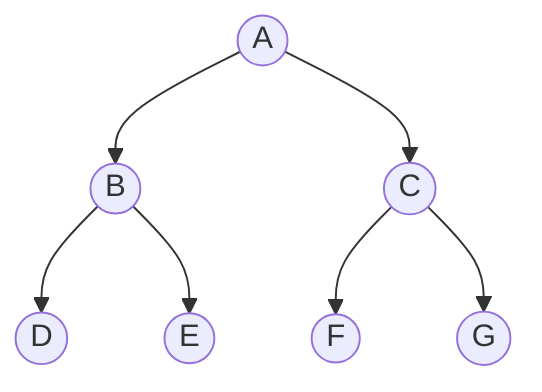

- **Node**: Each element in a tree containing data and references to child nodes
- **Root**: The topmost node in the tree (Node A in the diagram)
- **Parent Node**: A node that has one or more child nodes (A, B, C)
- **Child Node**: A node directly connected to another node when moving away from the root (B and C are children of A)
- **Siblings**: Nodes that share the same parent (B and C are siblings)
- **Leaf**: A node with no children (D, E, F, G)
- **Level**: The generation of a node relative to the root (root is at level 0)
- **Height**: The length of the longest path from root to a leaf
- **Depth**: The length of the path from the root to a particular node

## Types of Binary Trees

### Full Binary Tree
Every node has either 0 or 2 children (no nodes with just one child).


### Complete Binary Tree
All levels are filled except possibly the last, which is filled from left to right.

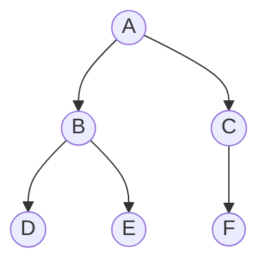

### Perfect Binary Tree
All internal nodes have exactly two children, and all leaf nodes are at the same level.


### Binary Search Tree (BST)

A special binary tree where for each node, all values in the left subtree are less than the node's value, and all values in the right subtree are greater.

> Binary Search Trees are particularly useful and we will discuss them more in depth in this lesson.

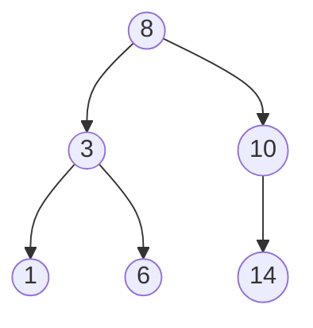

## Creating a Binary Tree in Python

Let's start by implementing a simple binary tree in Python:

```python
class Node:
    def __init__(self, value):
        self.value = value
        self.left = None
        self.right = None
```

We can create a simple tree manually:

```python
# Create root node
root = Node(1)

# Add children
root.left = Node(2)
root.right = Node(3)

# Add more nodes
root.left.left = Node(4)
root.left.right = Node(5)
```

This creates the following tree:

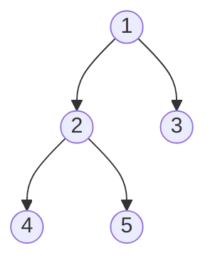

## Building a Binary Tree Class

Let's create a basic implementation of a binary tree:

```python
from collections import deque

class Node:
    def __init__(self, value):
        self.value = value
        self.left = None
        self.right = None

class BinaryTree:
    def __init__(self):
        self.root = None
    
    def insert(self, value):
        """Insert a value using Breadth-First Traversal/Search technique (BFS)"""
        new_node = Node(value)
        
        # If tree is empty, make new node the root
        if not self.root:
            self.root = new_node
            return
        
        # Use BFS to find the first available position
        queue = deque([self.root])
        while queue:
            node = queue.popleft()
            
            # If left child is empty, add here
            if not node.left:
                node.left = new_node
                return node.left
            else:
                queue.append(node.left)
            
            # If right child is empty, add here
            if not node.right:
                node.right = new_node
                return node.right
            else:
                queue.append(node.right)
```

## Understanding Breadth-First Search

The insertion method above uses Breadth-First Search (BFS), which is a traversal algorithm that explores a tree level by level.

How BFS works:

1. Start at the root node
2. Visit all nodes at the current level before moving to the next level
3. Use a queue data structure (First-In-First-Out) to keep track of nodes to visit

In our `insert` method:

- We start with the root node in the queue
- We process the first node in the queue (remove it with `popleft()`)
- We check if we can add our new node as a left or right child
- If we can't add it there, we add the current node's children to the queue
- The process continues until we find an empty spot

This ensures new nodes are added level by level, from left to right, creating a complete binary tree.

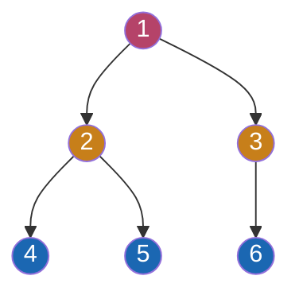

The colors indicate the order of insertion: red (first level), orange (second level), blue (third level).

## Adding More Functionality

Let's add some useful methods to our BinaryTree class!

### Calculating Tree Height

The height of a tree is the number of edges on the longest path from the root to a leaf node. 

We can calculate this by recursively calling the `calculate_height` function on the left and right subtrees, and returning the greater of the two heights plus 1 for the current node.

```python
def height(self):
    """Calculate the height of the tree"""
    
    def calculate_height(node):
        if not node:
            return 0
        
        # Use recursion to calculate the height of the left and right subtrees
        left_height = calculate_height(node.left)
        right_height = calculate_height(node.right)
        
        # Return the greater of the two heights plus 1 for the current node
        return max(left_height, right_height) + 1
    
    return calculate_height(self.root)
```

### Counting Total Nodes in Tree

We can count the total number of nodes in the tree by recursively calling the `count` function on the left and right subtrees and returning the sum of the two counts plus 1 for the current node.

```python
def count_nodes(self):
    """Count total nodes in the tree"""
    
    def count(node):
        if not node:
            return 0
        
        # Use recursion to count all the nodes in the tree
        return 1 + count(node.left) + count(node.right)
    
    return count(self.root)
```

### Search Tree for Value

We check if the tree contains a value by recursively calling the `search` function on the left and right subtrees, and returning the result of the search.

```python
def contains(self, value):
    """Check if the tree contains a value"""
    
    def search(node):
        if not node:
            return False
        
        if node.value == value:
            return True
        
        # Use recursion to search the left and right subtrees
        return search(node.left) or search(node.right)
    
    # Start the search from the root node
    return search(self.root)
```

## Tree Traversal Methods

There are two main approaches to traversing trees:

1. **Depth-First Search (DFS)**: Explore as far as possible along each branch before backtracking
2. **Breadth-First Search (BFS)**: Visit all nodes at the current depth before moving to the next depth

### Depth-First Traversal Algorithms

We use recursion to traverse the tree. A tree is actually a *recursive data structure*, which means that the tree is made up of smaller trees.

#### Pre-order Traversal (Root → Left → Right)

Pre-order traversal visits the root node first, then the left subtree, and then the right subtree.`

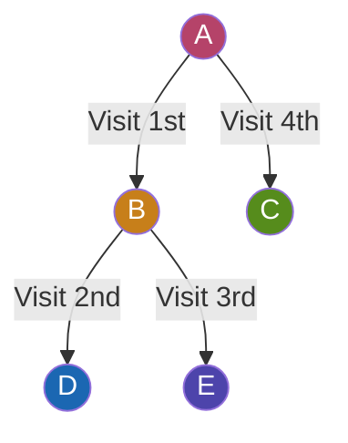

Let's write some code:

```python
def preorder_traversal(self):
    """Depth-first, pre-order traversal. Returns a list of values in the order of root, left, right."""
    result = []
    
    def dfs(node):
        if node:
            result.append(node.value)  # Process root
            print(f"Visiting node: {node.value}")
            dfs(node.left)             # Process left subtree
            dfs(node.right)            # Process right subtree
    
    dfs(self.root)
    return result
```

Traversal order: 1, 2, 4, 5, 3

#### In-order Traversal (Left → Root → Right)

In-order traversal visits the left subtree first, then the root node, and then the right subtree.

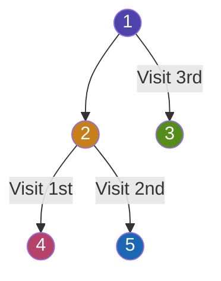

```python
def inorder_traversal(self):
    """Depth-first, in-order traversal"""
    result = []
    
    def dfs(node):
        if node:
            dfs(node.left)             # Process left subtree
            result.append(node.value)  # Process root
            dfs(node.right)            # Process right subtree
    
    dfs(self.root)
    return result
```

Traversal order: 4, 2, 5, 1, 3

#### Post-order Traversal (Left → Right → Root)

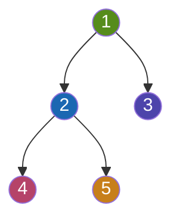

```python
def postorder_traversal(self):
    """Depth-first, post-order traversal"""
    result = []
    
    def dfs(node):
        if node:
            dfs(node.left)             # Process left subtree
            dfs(node.right)            # Process right subtree
            result.append(node.value)  # Process root
    
    dfs(self.root)
    return result
```

Traversal order: 4, 5, 2, 3, 1

### Breadth-First Traversal (Level-Order)

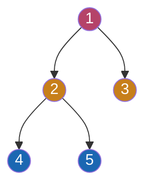

```python
from collections import deque

def level_order_traversal(self):
    """Breadth-first traversal"""
    result = []
    if not self.root:
        return result
    
    queue = deque([self.root])
    while queue:
        node = queue.popleft()
        result.append(node.value)
        
        if node.left:
            queue.append(node.left)
        if node.right:
            queue.append(node.right)
    
    return result
```

Traversal order: 1, 2, 3, 4, 5

Breadth-first traversal works by:
1. Starting at the root
2. Processing the current node
3. Adding its children to a queue
4. Moving to the next node in the queue

This ensures we visit all nodes level by level, from top to bottom, left to right.

## Binary Search Trees

A Binary Search Tree (BST) is a special type of binary tree that maintains an ordered structure:

- For any node, all values in its left subtree are less than the node's value
- For any node, all values in its right subtree are greater than the node's value

This ordering property makes operations like search, insertion, and deletion very efficient.

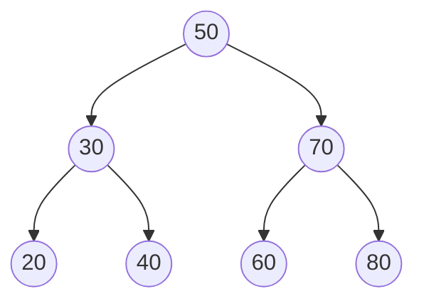

## Creating a Binary Search Tree

```python
class BST:
    def __init__(self):
        self.root = None
    
    def insert(self, value):
        """Insert a value into the BST maintaining the BST property"""
        if not self.root:
            self.root = Node(value)
            return
        
        def _insert(node, value):
            if value < node.value:
                if node.left is None:
                    node.left = Node(value)
                else:
                    _insert(node.left, value)
            else:
                if node.right is None:
                    node.right = Node(value)
                else:
                    _insert(node.right, value)
        
        _insert(self.root, value)
```

## Searching a Binary Search Tree

The BST property allows for efficient searching:

```python
def search(self, value):
    """Search for a value in the BST"""
    def _search(node, value):
        # Base case: empty tree or value found
        if node is None or node.value == value:
            return node
        
        # If value is less than node's value, search left subtree
        if value < node.value:
            return _search(node.left, value)
        
        # If value is greater than node's value, search right subtree
        return _search(node.right, value)
    
    return _search(self.root, value) is not None
```

### Iterative Search

```python
def iterative_search(self, value):
    """Iterative search in a BST"""
    current = self.root
    
    while current:
        if current.value == value:
            return True
        elif value < current.value:
            current = current.left
        else:
            current = current.right
    
    return False
```

## Time Complexity Analysis

For a balanced BST with n nodes:
- Search: O(log n)
- Insert: O(log n)
- Delete: O(log n)

For a skewed BST (worst case):
- Search: O(n)
- Insert: O(n)
- Delete: O(n)

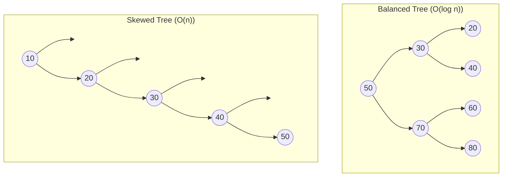

## Applications of Binary Trees

Binary trees are used in many real-world applications:

1. **File Systems**: Directories and files are organized in a hierarchical structure
2. **Database Indexing**: B-trees and B+ trees speed up database searches
3. **Decision Trees**: Used in machine learning for classification
4. **Huffman Coding**: Used for data compression
5. **Expression Evaluation**: Used to represent and evaluate mathematical expressions

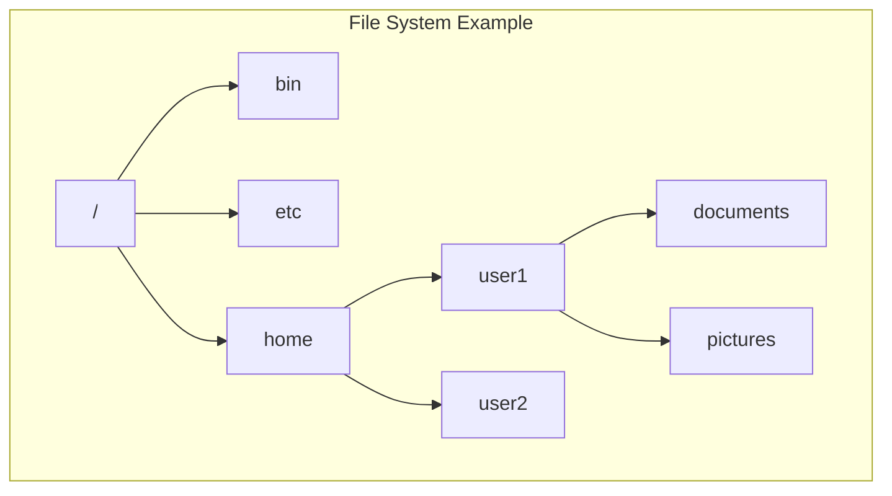

## Quiz

1. What is the maximum number of children a node can have in a binary tree?
   - a) 1
   - b) 2
   - c) 3
   - d) Unlimited

2. Which traversal method visits the root node first?
   - a) In-order traversal
   - b) Pre-order traversal
   - c) Post-order traversal
   - d) Level-order traversal

3. In a binary search tree, where are values greater than the root stored?
   - a) Left subtree
   - b) Right subtree
   - c) Either subtree
   - d) In the parent node

4. What is the time complexity of searching in a balanced binary search tree?
   - a) O(1)
   - b) O(log n)
   - c) O(n)
   - d) O(n²)

5. Which of these tree traversal algorithms is a breadth-first search?
   - a) Pre-order
   - b) In-order
   - c) Post-order
   - d) Level-order

**Answers:**
1. b) 2
2. b) Pre-order traversal
3. b) Right subtree
4. b) O(log n)
5. d) Level-order

## Summary

We've learned:
- What binary trees are and their properties
- Different types of binary trees (full, complete, perfect, BST)
- How to implement binary trees in Python
- Various traversal methods (pre-order, in-order, post-order, level-order)
- How to implement basic operations like insertion and search
- The time complexity of binary tree operations
- Applications of binary trees in the real world

These concepts form a foundation for understanding more complex tree structures and algorithms used in software engineering.