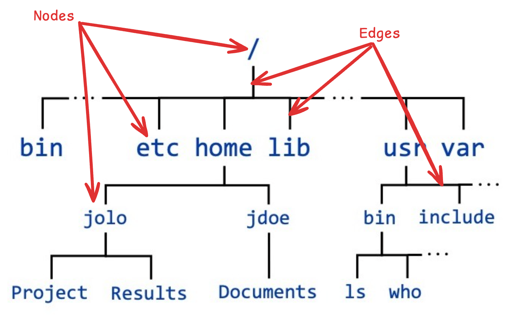
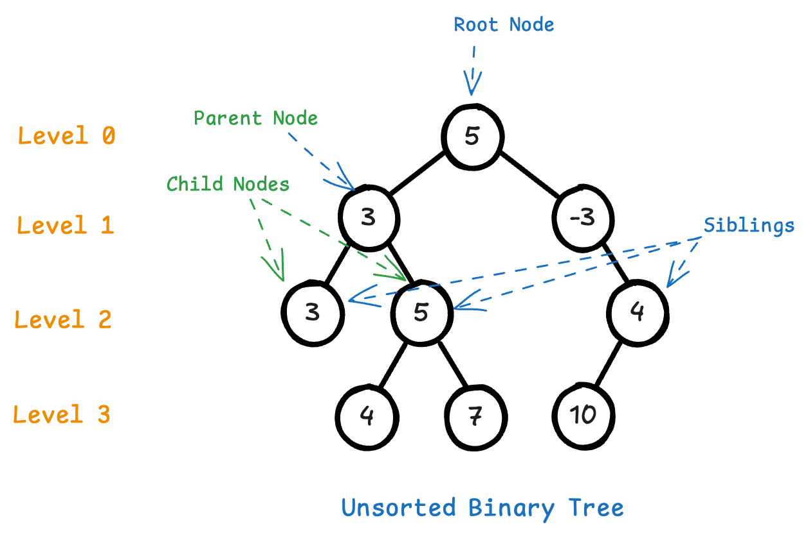
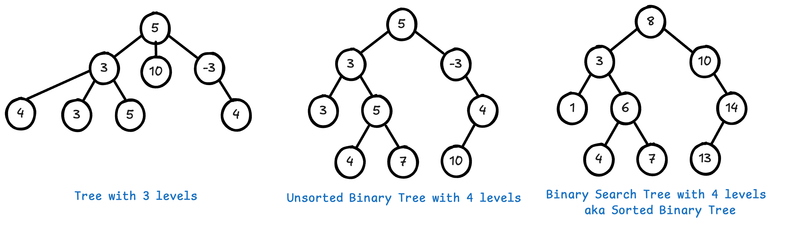
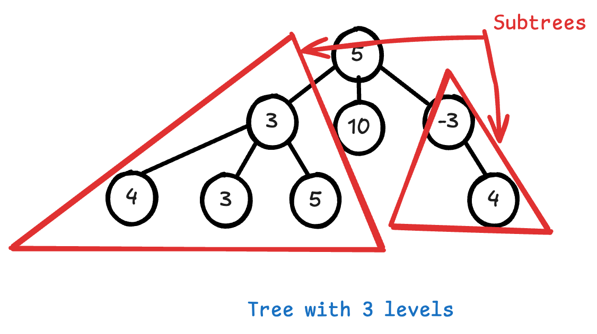

# Intro to Binary Trees

## Introduction

A *binary tree* data structure is a special kind of *tree*. A *tree* data structure is a special kind of *graph*. *Graphs* are used to model neural nets, for dynamic programming and optimization problems, for route-finding, and many other use-cases. A social network is modeled as a graph.

Trees are a particularly important kind of graph, because they are structured. The filesystem is a tree. The DOM in your browser is a tree.

Binary trees are even more structured, and are an excellent starting point for learning about trees and graphs. Binary trees can be used to make binary search more efficient, to very efficiently store and retrieve sorted information, and, in a special kind of binary tree called a *b-tree* are used to implement indexes in relational databases.

**Binary Search Trees** are efficient to search and insert new data into. They are used to implement priority queues, heaps, decision trees for machine learning, parsing in compilers, and to build self-balancing *AVL Trees* or *Red-Black Trees.*

Lastly, all sorts of ranked data can be represented in a Binary Search Tree.

## Lecture

### What is a Tree?

A *tree* data structure is a particular kind of *graph*. A tree is a *non-linear*, *hierarchial* data structure. It consists of:

- **Nodes** which contain data.
- **Edges** or links between nodes.

Your computer's filesystem is implemented with a tree:

#### Kinds of nodes in a Tree

There are different kinds of **nodes:**

- **Root Node:** The node at the "root" of the tree. All other nodes go "down" from this node and are child nodes of the root node. The root node has no parent.
- **Child Nodes:** Any non-root node is a child node relative to it's *parent*, the node "above" it that it is connected to.
- **Parent Nodes:** Any node connected to at least one node "below" it is a *parent* to that *child node*.
- **Sibling Nodes:** Nodes that share the same parent are sibling nodes.
- **Leaf Nodes:** Any childless node is a leaf node.
- **Level of a node:** This indicates the depth of the node in the tree. Depth starts at level 0 with the root node.
- **Ancestor:** Any predecssor nodes on the path between the node and the root node is an "ancestor", such as a parent node or a parent's parent, etc. 

Those are the most important terms - you can [see more terms here](https://www.geeksforgeeks.org/introduction-to-tree-data-structure/).

> Can you identify a *leaf node* in the above diagram?

### Kinds of Trees

These are the important kinds of trees we will focus on:

- **Tree:** Each parent node can have zero or more children. A tree **cannot have a cycle (or "loop")** - a node *cannot* be it's own ancestor.
- **Binary Tree:** A tree where each parent node can have **between zero and two** children.
- **Binary Search Tree:**  A binary tree that is *sorted*.
  - Each **left child** is *less than* the parent.
  - Each **right child** is *greater than* the parent.

All trees can contain any sort of data. Usually all the nodes in a tree will contain the same type of data.

> A tree with a depth of 2 we refer to as having three levels, as it has level 0, 1, and 2.

### Subtrees and the Recursive Nature of Trees

The last thing to know about trees is that they can have *subtrees.* A *subtree* is any node of a tree along with *all* its descendants. A subtree is a portion of a tree that *itself forms a tree.* If you select any node in the tree and consider it the root of a new tree (including all its child nodes and their descendants), that is a subtree.

This means a tree can be defined *in terms of smaller instances of itself.* It is a *recursive data structure.*

1. **Recursive Definition:** A tree is defined as a root node and a collection of subtrees, each of which is also a tree. Each subtree is essentially a smaller version of the original tree structure.

2. **Self-Similarity:** Each subtree in a tree is itself a tree, following the same structural rules as the entire tree. This means that the structure can be described in a recursive manner, where the same type of structure (tree) is used within itself.

3. **Base Case:** The recursion terminates at the base case, which is typically the empty tree or a tree with a single node (leaf node).

Because of this recursive algorithms often are a good choice for working with trees.

### Creating a Binary Search Tree
#### Inserting nodes

- Searching a binary tree
    - Depth-first search (DFS)
    - Breadth-first search (BFS)