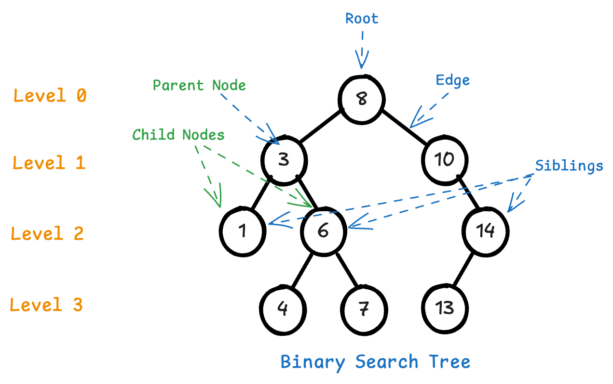

# Binary Trees

## What are we trying to accomplish?

You will learn about the *binary tree* data structure, how to implement it, it's real-world applications, and why it is a fundamental conceptual building block and an actual building block for more complex data structures.

You will learn about the time complexity for inserting or retrieving data from binary trees, about sorted vs unsorted binary trees, and the difference between a binary tree vs a normal tree vs a graph.

## Lesson & Assignments

1. [Lesson - Intro to Binary Trees](./1-intro-binary-trees.md)
2. Lesson - Binary Search Trees

## Tangible Learning Objectives

- N/A This will not be evaluated in Code Platoon

## Enabling Learning Objectives

- Explain the different nodes and parts of a tree
- Explain the differences between a tree, binary tree, and binary search tree (BST)
- Give some real-world use-cases of tree data structures
- Implement a binary search tree (creation & inserting nodes)
- Implement depth-first-search of a BST