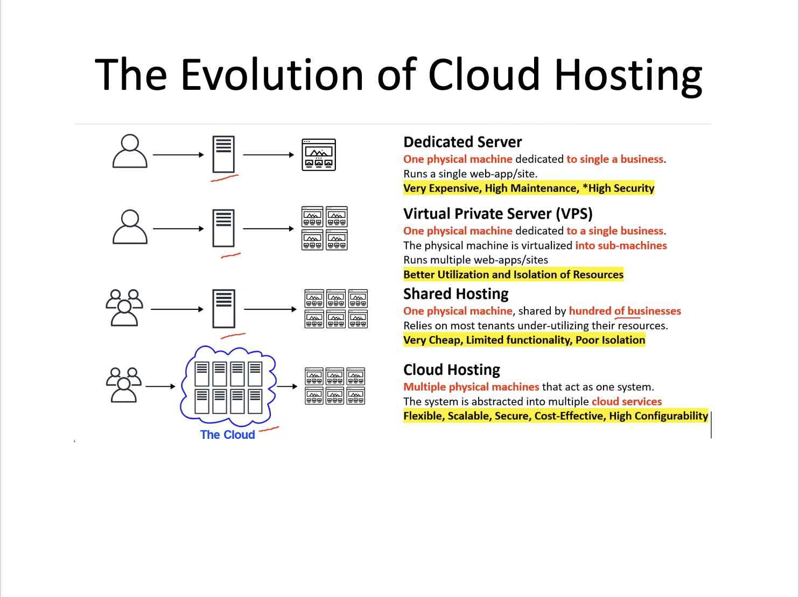

# Crash Course Overview + What is Cloud Computing?

---

## Crash Course Success Plan

This course is built to **get you through the AWS Cloud Practitioner (CLF-C02)** exam fast.

The plan is simple:

1. ✅ **Attend lectures** and understand the vocabulary.  
2. ✅ **Do the practice exams** — fail fast, then improve.  
3. ✅ **Use your own AWS account** when possible for hands-on understanding.  
4. ✅ Take advantage of free prep tools and guided instruction.

> 🎯 This is a **surface exam** — it doesn't go deep, but it expects clear conceptual understanding.

---

## Time Commitment to Prepare

🕒 Based on your experience level:

- **Beginners**: ~30 hours  
- **Experienced learners**: ~6 hours  
- **Average student**: ~24 hours total

Split evenly:

- 50% lectures and guided content  
- 50% practice exams and reflection

---

## AWS CCP Exam Details

- 📝 **65 total questions**
  - 50 are scored
  - 15 are unscored “test” questions
- 🕘 **90 minutes** to complete
- ⏱️ **120-minute seat time** (includes check-in)
- 🎯 **Passing score**: 700/1000
- ✅ Certification is **valid for 36 months**

> 💡 There is **no penalty for guessing**, and each question has 4 options.

---

## Examples AWS CCP Question

<strong>Question 1:</strong> What is the pricing model used by AWS cloud services?

✅ **Pay-As-You-Go**

<strong>Question 2:</strong> How many total questions are on the CLF-C02 exam?

✅ **65 (50 scored, 15 unscored)**

<strong>Question 3:</strong> Which AWS Support Plan offers a Technical Account Manager?

✅ **C) Enterprise**

---

## What is Cloud Computing?

AWS defines cloud computing as:

> “The on-demand delivery of IT resources over the Internet with pay-as-you-go pricing.”

Instead of maintaining your own servers, you rent computing power, databases, and storage from AWS — only when you need it.

---

## 6. How We Got Here: The Evolution of Hosting

To understand the power of the cloud, it helps to know what came before it. The diagram below shows the **evolution of hosting models** that led to cloud computing:

### Key Takeaways:

- **Dedicated Servers**: Great control, but very expensive and inflexible  
- **Virtual Private Servers**: Better isolation, but still manually managed  
- **Shared Hosting**: Cheap, but insecure and limiting  
- **Cloud Hosting**: Flexible, scalable, secure — and the default for modern tech

---

## Key AWS Cloud Concepts

- **On-Demand**: Access what you need, when you need it
- **Elasticity**: Scale up and down automatically
- **Agility**: Build and iterate quickly
- **Pay-As-You-Go**: No upfront costs or contracts
- **Global Infrastructure**: Regions, AZs, and edge locations (coming next)

---

## Vocabulary You Must Know for the Exam

- **Elasticity**
- **Agility**
- **CapEx vs OpEx**
- **Cloud Deployment Models** (Public, Private, Hybrid)
- **Cloud Service Models** (IaaS, PaaS, SaaS)

> 🧠 The exam will ask things like:  
> “Which benefit of cloud computing refers to scaling automatically?” ➝ Elasticity  
> “Which service model gives you full control over the OS?” ➝ IaaS

---

## ✅ Summary

You now understand:
- What the AWS CCP exam expects from you
- The core definition of cloud computing
- How AWS transformed traditional hosting into modern, elastic, pay-as-you-go services

---
