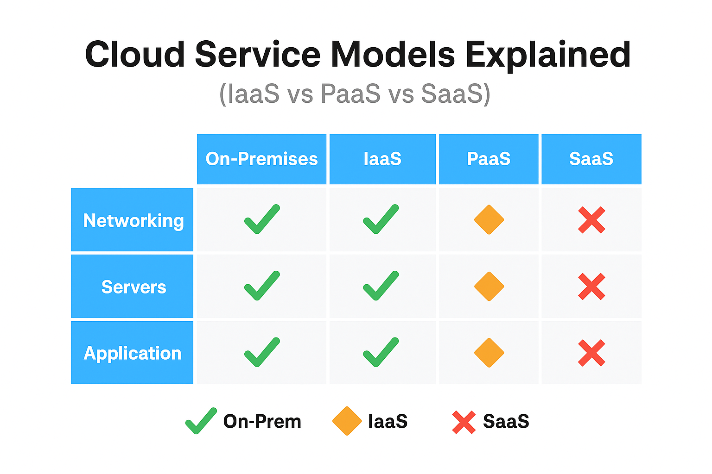

# Lesson 2: Cloud Service Models & Deployment Models

---

## Overview

Now that you understand the basic idea of cloud computing, we need to talk about how it’s **structured**. AWS delivers services at three different layers: **IaaS**, **PaaS**, and **SaaS** — and you’ll see these models referenced on the exam frequently.

Additionally, AWS services can be deployed in **Public**, **Private**, or **Hybrid** environments. These deployment models show up in scenario-based questions about architecture, cost, and control.

---

## Cloud Service Models

These models describe **what AWS manages vs. what you manage**. It’s critical to understand **how much responsibility you're offloading** as you move from IaaS ➝ SaaS.

### 🧱 Infrastructure as a Service (IaaS)

- You manage: the OS, patches, and applications  
- AWS manages: the hardware, virtualization, networking  
- **Examples**: Amazon EC2, VPC, EBS  
- Use when you need full control of the environment and flexibility

### 🧰 Platform as a Service (PaaS)

- You manage: just the code  
- AWS manages: runtime, scaling, servers, and infrastructure  
- **Examples**: AWS Lambda, Elastic Beanstalk  
- Use when you want to deploy code without managing servers

### 🌐 Software as a Service (SaaS)

- You manage: nothing  
- **Fully managed solutions** accessed via a web app  
- **Examples**: Salesforce, Dropbox, Google Workspace  
- Use when you just want to use the app — no infrastructure or config required

---

## Visual: Who Manages What?

The table below shows which party (you or AWS) is responsible for networking, servers, and application layers in each service model.

> ✅ Green = you manage  
> 🔶 Orange = AWS & You share  
> ❌ Red = AWS manages completely

This visual helps you quickly compare **On-Prem vs IaaS vs PaaS vs SaaS** responsibilities. Use it to remember:
- IaaS gives you **control** but requires setup
- PaaS is **easy to deploy**, but less flexible
- SaaS is **completely hands-off**

---

## Cloud Deployment Models

Cloud Deployment Models define **where** your services are hosted and **how they’re isolated**.

### ☁️ Public Cloud

- AWS owns and manages the infrastructure
- Shared hardware — logically isolated between customers
- Cost-effective and scalable
- **Default for most AWS services**

### 🏢 Private Cloud

- Dedicated hardware or isolated environments
- More control over compliance and security
- Higher cost and complexity
- Often used by governments or enterprises with strict requirements

### 🔗 Hybrid Cloud

- Combines on-prem infrastructure with cloud services
- Used during migrations or to meet specific business/data residency requirements
- Example: A local Oracle DB syncing to S3 or RDS in AWS

---

## Practice Questions

<strong>Question 1:</strong> Which cloud model gives full control over OS and network?

✅ **IaaS**

<strong>Question 2:</strong> What is a key advantage of SaaS?

✅ **No infrastructure management required**

<strong>Question 3:</strong> What type of cloud model allows a business to run on-prem and in AWS?

✅ **Hybrid Cloud**

<strong>Question 4:</strong> Which service model requires least customer responsibility?

✅ **SaaS**

<strong>Question 5:</strong> Which AWS service is most aligned with PaaS?

✅ **Elastic Beanstalk**

---

## ✅ Summary

You now understand:
- What IaaS, PaaS, and SaaS actually mean — and how they show up on the exam
- The responsibilities of each model and where AWS fits in
- The tradeoffs between Public, Private, and Hybrid cloud deployments

---
