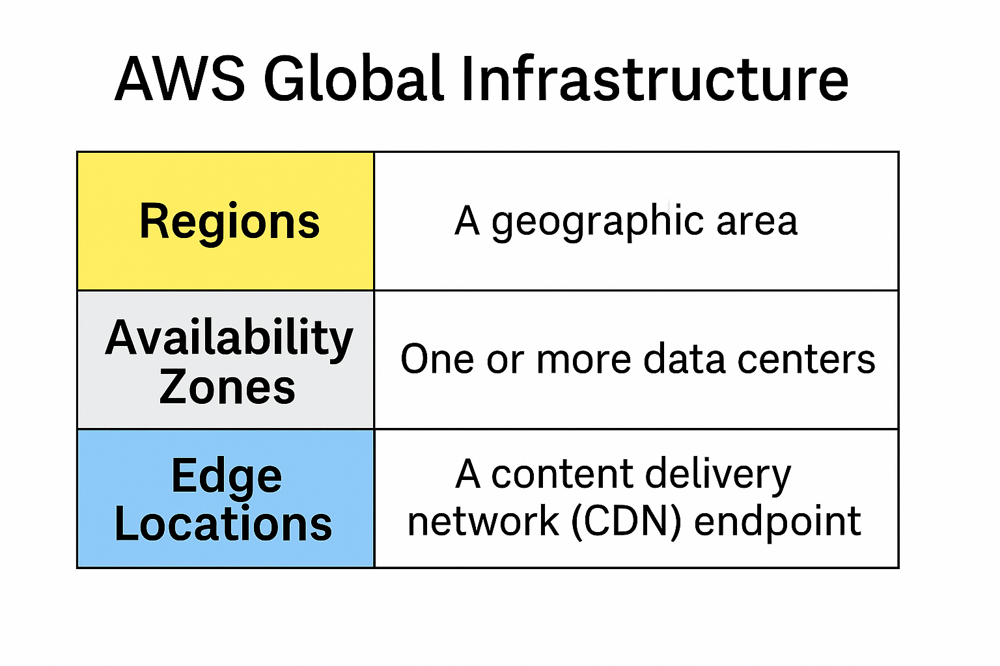

# Lesson 3: AWS Global Infrastructure

---

## Introduction

The cloud might feel abstract, but it’s still built on physical infrastructure. AWS has organized its global data center network in a way that provides **redundancy**, **fault tolerance**, and **low latency** access to users around the world.

This lesson walks through how AWS segments its infrastructure into **Regions**, **Availability Zones**, and **Edge Locations** — a structure that appears frequently on the CLF-C02 exam.

---

## AWS Regions

An **AWS Region** is a **geographic area** that contains a group of physical data centers. Each Region is isolated from the others to provide strong fault tolerance and support data sovereignty laws.

Key facts:
- There are **30+ Regions** worldwide
- Each Region includes **at least 3 Availability Zones**
- When you launch a service, you typically choose a Region

---

## Availability Zones (AZs)

An **Availability Zone** is one or more data centers within a Region, each with **independent power, cooling, and networking**.

Why they matter:
- If one AZ fails, others remain available
- Many AWS services (e.g. RDS, ALB, EC2 Auto Scaling) support multi-AZ deployment

---

## Edge Locations

**Edge Locations** are smaller, globally distributed endpoints designed to deliver content close to the end user. These are used by:

- **Amazon CloudFront** (CDN)
- **Route 53** (DNS)

They improve **performance and latency**, not durability or failover.

---

## Visual: Regions, AZs, and Edge Locations

The table below summarizes the three infrastructure components at the core of AWS’s architecture.

Use this to remember:

| Component         | Purpose                                       |
|------------------|-----------------------------------------------|
| **Regions**       | A geographic area of isolated infrastructure  |
| **Availability Zones** | Fault-tolerant data centers within a Region |
| **Edge Locations** | Performance endpoints for content & DNS       |

---

## Global vs Regional Services

You’ll often see questions asking whether a service is global or regional. This determines **scope and availability**.

| Scope            | Description                              | Examples                   |
|------------------|------------------------------------------|----------------------------|
| **Regional**      | Runs inside a single Region              | EC2, S3, Lambda, RDS       |
| **Global**        | Functions across all Regions             | IAM, Route 53, CloudFront  |

**Key exam takeaway**:  
Global services don’t require you to choose a Region. Regional services do.

---
## Quiz Yourself

<strong>Question 1:</strong> What is an AWS Region?

✅ **A geographic area with multiple AZs**

<strong>Question 2:</strong> What is the purpose of an Availability Zone?

✅ **To offer fault tolerance within a Region**

<strong>Question 3:</strong> Which service uses Edge Locations?

✅ **CloudFront**

<strong>Question 4:</strong> Is IAM a global or regional service?

✅ **Global**

---

## ✅ Summary

You now understand:

- The **physical layout** of AWS infrastructure
- How AWS achieves **high availability** with AZs
- Why services like CloudFront use Edge Locations
- Which AWS services are **global** vs **regional**

---
