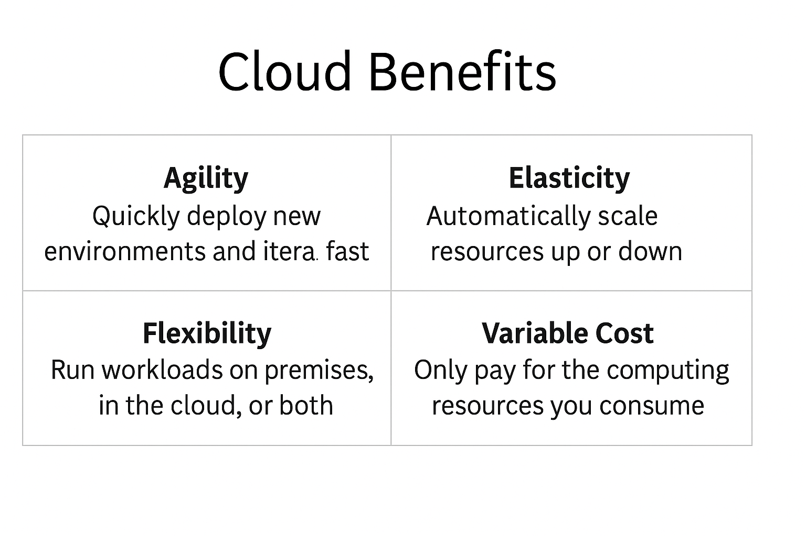

# Lesson 4: Benefits of Cloud Computing

---

## Overview

Cloud computing isn’t just a technical shift — it’s a business one. AWS defines the cloud’s primary value through four key benefits:

- **Agility**
- **Elasticity**
- **Flexibility**
- **Variable Cost**

These terms are central to understanding why companies move to the cloud and show up repeatedly on the CLF-C02 exam. You must be able to identify **which benefit applies in a given scenario**.

---

## Key Definitions

| Benefit         | What It Means                                                        |
|-----------------|----------------------------------------------------------------------|
| **Agility**       | Quickly experiment, deploy, and iterate without hardware delays       |
| **Elasticity**    | Add or remove resources dynamically to meet demand                   |
| **Flexibility**   | Use the tools, architectures, and environments that work for you     |
| **Variable Cost** | Pay for what you use (OpEx model), no up-front infrastructure spend  |

These concepts are central to how AWS positions its platform and services — and they appear frequently in exam questions.

---

## Visual Reference: Core Benefits at a Glance

The following graphic summarizes each benefit clearly and visually:

Use this visual to reinforce the differences between the benefits — especially how **Agility ≠ Elasticity**, and how **Pay-As-You-Go** means variable cost, not just “low cost.”

---

## Key Exam Phrasing Patterns

These benefits are often embedded into scenario questions. Here are common formats to be ready for:

> “Which AWS benefit helps you quickly test a new business idea?”  
> → **Agility**

> “What feature allows an application to scale up on Black Friday and back down afterward?”  
> → **Elasticity**

> “A company wants to move a few apps to the cloud while keeping others on-prem. Which benefit allows this?”  
> → **Flexibility**

> “How does AWS replace capital expenses?”  
> → **Variable Cost (Pay-As-You-Go)**

---
 ## Practice Questions

<strong>Question 1:</strong> Which benefit allows you to scale based on demand?

✅ **Elasticity**

<strong>Question 2:</strong> Which benefit allows you to deploy quickly without buying hardware?

✅ **Agility**

<strong>Question 3:</strong> A company wants to use multiple cloud and on-prem tools. What benefit does this refer to?

✅ **Flexibility**

<strong>Question 4:</strong> What is another name for Variable Cost?

✅ **Pay-As-You-Go**

---

## Assignment

**Take your full-length practice exam** and review any missed questions carefully.  Then do the Post-exam reflection prompt.  This is fast and easy, and will help you identify any gaps in your knowledge.

- [Practice Exam #1 (CLF-C02 Full-Length ExamPro)](https://www.exampro.co/clf-c02).
Copy into another browser tab if pop-up gets blocked.

- [Post-exam Reflection Prompt](../assignments/1-exam_reflection_prompt.md)

---

## ✅ Summary

You now understand how AWS frames the business case for the cloud:

- **Agility** ➝ move faster, iterate faster  
- **Elasticity** ➝ scale automatically  
- **Flexibility** ➝ use what works  
- **Variable Cost** ➝ no upfront commitment

These benefits are **embedded in exam scenarios** even when the question seems technical. Be prepared to match business priorities to the correct cloud value.

---
