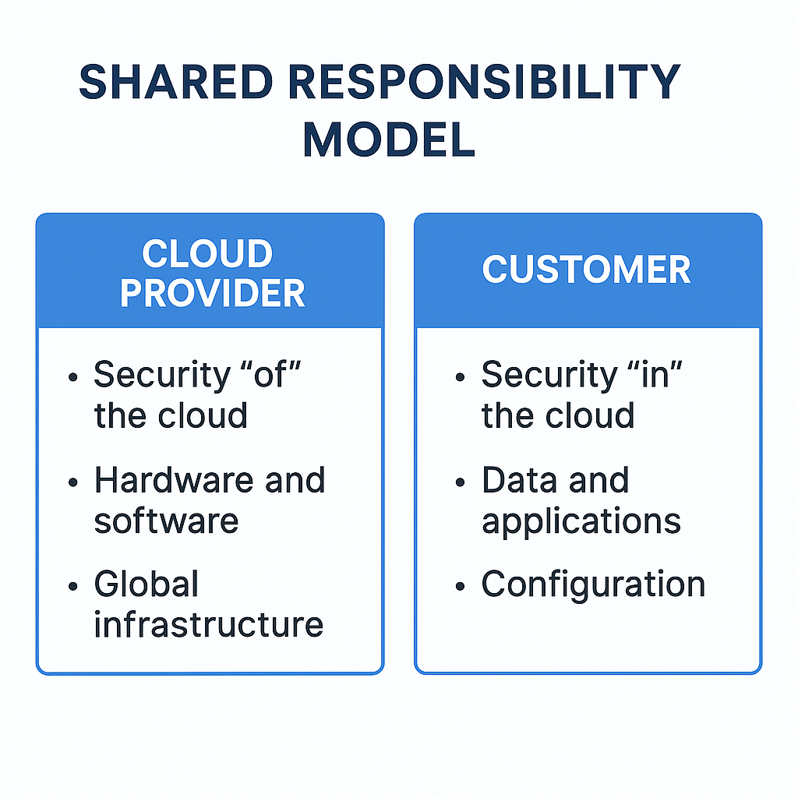

# Shared Responsibility Model

> **Summary**: This lesson explores one of the foundational security concepts in cloud computing: the Shared Responsibility Model. Understanding this model is **critical for passing the CLF-C02 exam** and for working safely in AWS environments.

---

## 🧠 Core Concept

AWS operates under a **Shared Responsibility Model**, which means that **security and compliance are a shared effort** between AWS and the customer.

| AWS is responsible for...           | The customer is responsible for...          |
|------------------------------------|---------------------------------------------|
| Securing the physical datacenters  | Securing the data inside AWS                |
| Maintaining global infrastructure  | Configuring Identity & Access policies      |
| Hypervisor and networking security | Updating and patching EC2 instances         |
| Hardware and facility monitoring   | Managing firewall rules (Security Groups)   |

---

## 🔐 Why It Matters

This model **defines the boundary of accountability**. Many exam questions test whether you understand *who does what*. If something goes wrong, you need to know whether it was an AWS-side failure (rare!) or a misconfiguration on the customer side (common!).

---

---

## 🧪 Hands-On Lab: Misconfigure a Security Group

Misconfigurations are **your responsibility** in the cloud — and they’re a top source of breaches.

### Try This Exercise

1. Create a new EC2 **Security Group** called `my-open-sg`
2. Add an **inbound rule** allowing **all traffic from 0.0.0.0/0**
3. Launch an EC2 instance and assign this Security Group
4. Browse to its public IP — it’s now exposed

⚠️ **Challenge Prompt**:  
Now disable the rule. What just happened?  
Who is responsible if this instance gets compromised?

---

## 🔎 Practice Questions

**Question 1:**  
Who is responsible for configuring Security Groups in an AWS environment?

A) AWS  
B) The data center operator  
C) The customer  
D) CloudFront

<strong>Show Answer</strong>

✅ **C) The customer**  
Security Groups are a virtual firewall that customers must configure — this falls under "security *in* the cloud."

---

**Question 2:**  
Which of the following is AWS responsible for under the Shared Responsibility Model?

A) Encrypting your application data  
B) Patching EC2 operating systems  
C) Managing physical access to data centers  
D) Defining IAM policies

<strong>Show Answer</strong>

✅ **C) Managing physical access to data centers**  
AWS handles the infrastructure — including facilities and hardware security.

---

**Question 3:**  
A company fails to enable encryption for customer data stored in S3. Who is responsible?

A) AWS  
B) The customer  
C) The AWS Partner  
D) Both AWS and the customer

<strong>Show Answer</strong>

✅ **B) The customer**  
Encrypting S3 objects is the customer’s responsibility — AWS provides tools, but you must configure them.

---

**Question 4:**  
Which of the following is a **shared** responsibility between AWS and the customer?

A) Physical security  
B) IAM role assignment  
C) Securing the hypervisor  
D) Network configuration (at the OS level)

<strong>Show Answer</strong>

✅ **D) Network configuration (at the OS level)**  
Network security is shared — AWS secures infrastructure-level networking; customers handle OS-level configs like firewalls and ports.

---

**Question 5:**  
True or False: AWS is responsible for patching the OS on your EC2 instances.

<strong>Show Answer</strong>

❌ **False**  
Customers are responsible for managing and patching their own EC2 instances — AWS only secures the underlying infrastructure.

---

## ✅ Summary

You now understand:

* The **division of responsibilities** between AWS and the customer
* Why this distinction matters for cloud security and exam success
* How to recognize misconfigurations and avoid the most common security failures

---
