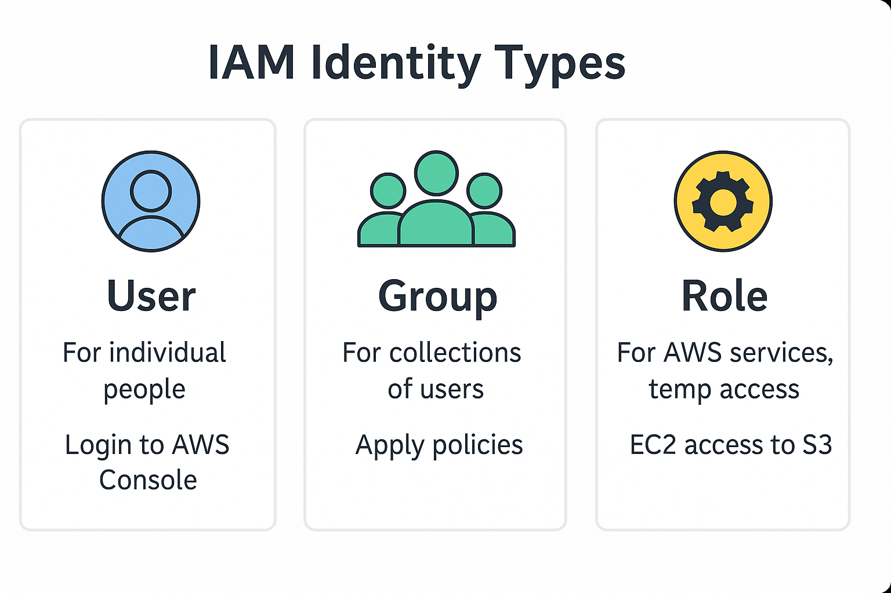

# IAM Introduction

# IAM Overview: Users, Roles, MFA

> **Summary**: This lesson introduces Identity and Access Management (IAM), the core AWS service for controlling **who can do what** in your cloud environment. The exam expects you to know how IAM **users**, **groups**, **roles**, **policies**, and **MFA** work — and how they relate to real-world security needs.

---

## 🔐 What Is IAM?

IAM (Identity and Access Management) is the **first service you should secure** in any AWS account.

It’s used to create **identities**, group them, and define what permissions they have.

IAM identities include:
- **Users**: For individual people
- **Groups**: To assign policies to collections of users
- **Roles**: Temporary access to AWS resources, often used by services or external users

IAM lets you write **policies** that allow or deny specific AWS actions based on conditions.

---

## 👥 Core Identity Types in IAM

| Identity Type | Who Uses It?                    | Use Case Example                         |
|---------------|----------------------------------|------------------------------------------|
| User          | Developers, admins, interns     | Login to AWS Console                     |
| Group         | Teams or job functions          | Apply same policy to all engineers       |
| Role          | AWS services or temp access     | EC2 assumes role to access S3            |

Each of these can be assigned **policies** to define exactly what actions are allowed (e.g., `s3:PutObject`, `ec2:StartInstances`).

---

---

## 🧾 IAM Policies

- Written in **JSON**
- Allow or deny specific AWS actions
- Can be **attached to users, groups, or roles**
- Most common mistake: **over-permissioning**

✅ Best Practice:  
Use **least privilege** — only allow exactly what is needed.

---

## 🔐 MFA and IAM Identity Center (SSO)

### MFA – Multi-Factor Authentication
- Requires a second device (e.g., mobile authenticator)
- Adds a layer of security beyond just a password
- Can be **required** for IAM users

### IAM Identity Center (SSO)
- Centralized sign-on to **multiple AWS accounts**
- Used for managing federated access
- Often paired with services like **Okta**, **Azure AD**, or **Google Workspace**

> On the exam, you may see questions about "centrally managing user access across multiple AWS accounts" — that’s **IAM Identity Center**.

---

## 🔎 Practice Questions

**Question 1**:  
You want to allow an EC2 instance to access an S3 bucket. Which IAM identity type should you use?

A) IAM Group  
B) IAM User  
C) IAM Policy  
D) IAM Role  

<strong>Show Answer</strong>

✅ **D) IAM Role**  
EC2 assumes a role to interact with other AWS services like S3.

---

**Question 2**:  
Which of the following allows a developer to log in to the AWS Management Console?

A) IAM Role  
B) IAM Group  
C) IAM User  
D) IAM Policy  

<strong>Show Answer</strong>

✅ **C) IAM User**  
Users are individual identities with login credentials.

---

**Question 3**:  
You want to apply the same permission set to all junior developers. What’s the best IAM strategy?

A) Create a user for each and attach policies individually  
B) Create a role and attach to each user  
C) Create a group, attach policies to the group, add users to group  
D) Use IAM Identity Center

<strong>Show Answer</strong>

✅ **C) Group with policies**  
This is the most scalable way to manage permissions for a team.

---

**Question 4**:  
Which AWS security feature requires a code from a mobile device in addition to a password?

A) KMS  
B) MFA  
C) IAM Group  
D) EC2 Role  

<strong>Show Answer</strong>

✅ **B) MFA**  
Multi-Factor Authentication requires a second factor beyond just the password.

---

**Question 5 (Trick Question)**:  
A user is assigned a policy that allows `s3:*` but is also part of a group that explicitly denies `s3:DeleteObject`. What happens?

A) The user can delete objects  
B) The user cannot delete objects  
C) It depends on service defaults  
D) Deny takes precedence only for roles

<strong>Show Answer</strong>

✅ **B) Deny takes precedence**  
Explicit Deny always overrides Allow.

---

## 🧪 Optional Hands-On Exercise

Create:

1. An IAM user with **no permissions**
2. A group with `AmazonS3ReadOnlyAccess` policy
3. Add the user to that group
4. Enable MFA for the user

Try logging in to the AWS Console with this identity and observe access patterns.

---

## ✅ Summary

In this lesson you learned:

* The **3 IAM identity types** and how they’re used
* What IAM policies are and how they work
* How MFA and Identity Center add security
* How to evaluate which IAM identity fits a scenario

Next up: **AWS security services** — Shield, WAF, GuardDuty, Macie, Inspector.

---
