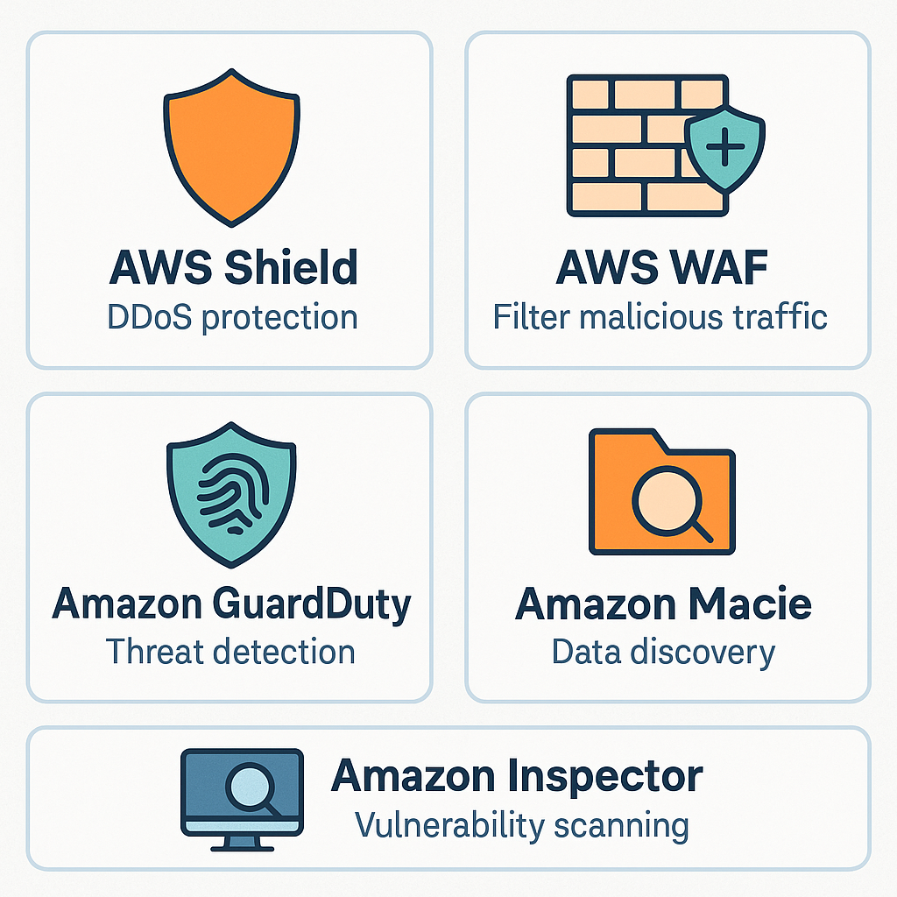

# AWS Security Services: Shield, WAF, GuardDuty, Macie, Inspector

> **Summary**: This lesson introduces key AWS services designed to protect your cloud environment from attacks and unauthorized activity. These services are tested heavily on the CLF-C02 exam — know what each one does in one sentence.

---

## 🛡️ Core Threat Protection Tools

| Service      | Purpose                                 | Key Use Case                        |
|--------------|------------------------------------------|-------------------------------------|
| **AWS Shield** | DDoS protection                         | Protect public-facing web apps      |
| **AWS WAF**    | Blocks malicious web traffic (layer 7) | Stop SQL injection, XSS             |
| **GuardDuty**  | Threat detection and anomaly alerts    | Monitor for account compromise      |
| **Macie**      | Sensitive data discovery (esp. PII)    | Scan S3 buckets for exposed PII     |
| **Inspector**  | Automated security assessments         | Scan EC2/ECR for CVEs & misconfigs  |

These tools often appear in **multiple-choice or scenario-based** exam questions.

---

---

## 🔐 Service Definitions at a Glance

Here’s how to remember each security tool by exam logic:

* **AWS Shield**: Built-in DDoS protection (Standard) + advanced features (Advanced)
* **AWS WAF**: Define web ACL rules to block traffic based on patterns (IP, SQLi, user-agent)
* **GuardDuty**: No agent required; monitors CloudTrail, VPC Flow Logs, and DNS
* **Macie**: Machine learning to find **PII in S3**, flag risky buckets
* **Inspector**: Scans EC2 and container images for vulnerabilities

---

## 🔎 Practice Questions

**Question 1**:
Which AWS service helps detect unusual API activity and potentially compromised credentials?

A) AWS WAF
B) AWS Shield
C) Amazon Macie
D) Amazon GuardDuty

<strong>Show Answer</strong>

✅ **D) Amazon GuardDuty**  
GuardDuty continuously monitors for suspicious behavior using ML and log data.

---

**Question 2**:
You need to protect a web app against SQL injection. Which AWS service should you use?

A) AWS Shield
B) AWS WAF
C) Amazon Inspector
D) IAM Identity Center

<strong>Show Answer</strong>

✅ **B) AWS WAF**  
WAF blocks malicious HTTP requests, including SQL injection and cross-site scripting.

---

**Question 3**:
Which service helps identify personally identifiable information (PII) stored in S3?

A) Amazon Inspector
B) AWS WAF
C) Amazon Macie
D) Amazon Athena

<strong>Show Answer</strong>

✅ **C) Amazon Macie**  
Macie uses ML to find sensitive data like credit card numbers and names in S3 buckets.

---

**Question 4**:
A company wants to scan their container images and EC2 instances for vulnerabilities. What service should they use?

A) AWS Shield
B) Amazon Inspector
C) AWS Config
D) GuardDuty

<strong>Show Answer</strong>

✅ **B) Amazon Inspector**  
Inspector runs automated assessments and provides CVE findings.

---

**Question 5 (Trick Question)**:
Which AWS service provides DDoS protection and is enabled by default?

A) AWS WAF
B) AWS Shield Standard
C) Amazon GuardDuty
D) Macie

<strong>Show Answer</strong>

✅ **B) AWS Shield Standard**  
Shield Standard is free and automatically active for all AWS customers.

---

## 🧪 Optional Hands-On Idea

Spin up a test ALB or CloudFront distribution and attach a **Web ACL** via **AWS WAF**. Try:

1. Creating a rule to block requests with a certain user-agent string
2. Observing blocked requests in **WAF logs or CloudWatch**

This reinforces how **WAF rules apply to edge services** like CloudFront.

---

## ✅ Summary

You now understand how to:

* Match each AWS security service to its function
* Differentiate between Shield, WAF, GuardDuty, Macie, and Inspector
* Recognize scenario phrasing that maps to each tool
* Prepare for common “Which AWS service…” exam questions

---
