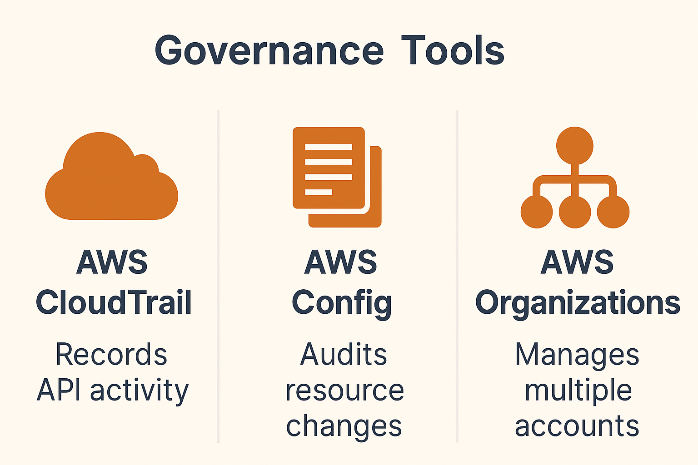

# Governance Tools: CloudTrail, Config, and AWS Organizations

> **Summary**: This lesson focuses on AWS governance tools that help organizations maintain visibility, compliance, and control across multiple accounts and resources. These services don't stop attacks — they **record, audit, and manage** what’s happening inside your cloud.

---

## 🛡️ What Are Governance Tools?

Governance tools are used to:

- Track **API-level activity** (who did what)
- Detect and audit **configuration drift**
- Manage **multi-account environments**

These services **don’t block** actions like WAF or IAM might — instead, they **monitor and document** behavior across your AWS environment.

---

## 📜 AWS CloudTrail

CloudTrail records **API calls** and activity made via:

- AWS Console  
- AWS CLI  
- SDKs and other AWS services

### Key Features:

- Automatically enabled on all AWS accounts
- Tracks **who did what**, **when**, and **from where**
- Records actions like `RunInstances`, `DeleteBucket`, `PutObject`
- Sends logs to S3 and optionally to CloudWatch

> 🧠 **CloudTrail ≠ CloudWatch**: CloudTrail is for API history; CloudWatch is for metrics/logs.

---

## ⚙️ AWS Config

AWS Config tracks **resource configuration changes over time**.

### Why Use It?

- Detect if your infrastructure **drifts from known-good state**
- See the **history of changes** to a specific resource (e.g., when a Security Group rule changed)
- Define **conformance packs** or rules to enforce compliance

> 🧠 Think of it as **version control for AWS infrastructure**.

---

## 🏢 AWS Organizations

AWS Organizations helps you manage **multiple AWS accounts** from a central admin account.

### Key Functions:

- Group accounts into **Organizational Units (OUs)**
- Apply **Service Control Policies (SCPs)** across accounts
- Consolidated billing across child accounts
- Great for separating prod/dev/security accounts while maintaining control

> SCPs don’t grant permissions — they define the **maximum permissions** allowed in an account.

---

---

## 🔎 Practice Questions

**Question 1**:  
Which service records all AWS API activity across an account?

A) CloudTrail  
B) CloudWatch  
C) Config  
D) IAM  

<strong>Show Answer</strong>

✅ **A) CloudTrail**  
CloudTrail logs all management-level events and API calls.

---

**Question 2**:  
You want to monitor whether your resources match approved configurations. Which service should you use?

A) CloudTrail  
B) CloudWatch  
C) AWS Config  
D) AWS Inspector  

<strong>Show Answer</strong>

✅ **C) AWS Config**  
Config tracks the state and changes of AWS resources.

---

**Question 3**:  
Which AWS service allows you to apply policies across multiple accounts?

A) IAM  
B) AWS Organizations  
C) GuardDuty  
D) Config  

<strong>Show Answer</strong>

✅ **B) AWS Organizations**  
This allows you to centrally manage and control multiple accounts.

---

**Question 4 (Trick Question)**:  
Can AWS Organizations grant a user permission to create EC2 instances?

A) Yes  
B) No  
C) Only with MFA  
D) Only with IAM Roles  

<strong>Show Answer</strong>

✅ **B) No**  
Service Control Policies (SCPs) in Organizations set permission boundaries — they don’t grant access by themselves.

---

**Question 5**:  
Which service helps detect configuration drift?

A) CloudWatch  
B) CloudTrail  
C) AWS Config  
D) IAM  

<strong>Show Answer</strong>

✅ **C) AWS Config**  
It's designed to track changes to resource configurations over time.

---

## Assignment

**Take your full-length practice exam** and review any missed questions carefully.  Then do the Post-exam reflection prompt.  This is fast and easy, and will help you identify any gaps in your knowledge.

 [Practice Exam #2 (CLF-C02 Full-Length) copy into a browser if popup is blocked](https://learn.cloudtraining.net/courses/Ultimate-AWS-Certified-Cloud-Practitioner-Certification-CLF-C02-Full-Practice-Exam-6697ad693279f931c6c5c303?COUPON=CP00XLPSZ)

 [Post-exam Reflection Prompt](../assignments/2-exam_reflection_prompt.md)

---

## 🧪 Optional Hands-On

- Enable CloudTrail in your AWS account
- Set up an S3 bucket to store logs
- Make a few changes in the console (create/delete EC2 or S3 resources)
- View CloudTrail logs to see your actions recorded

Then:

- Enable AWS Config
- Observe how it detects and records resource changes
- Try writing a rule that flags any EC2 instance with a public IP

---

## ✅ Summary

In this lesson, you learned:

- **CloudTrail**: Records all API-level activity across your account  
- **AWS Config**: Detects and audits configuration changes over time  
- **AWS Organizations**: Manages multi-account environments and permission boundaries  

These tools **don’t block** malicious activity — they help track, detect, and govern cloud behavior for better security posture and compliance.

---