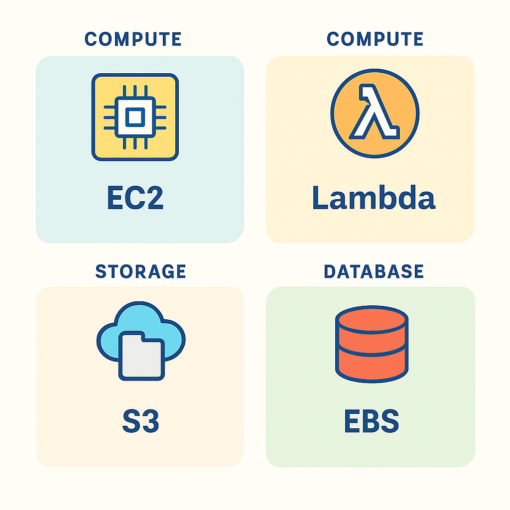

# Core AWS Services Overview

> **Summary**: This lesson introduces the most common AWS services you'll see on the exam — like EC2, Lambda, S3, EBS, and RDS. You don’t need to be an expert, but you do need to know **what each one does** and when you'd use them.

---

## AWS Compute Services

### EC2 – Elastic Compute Cloud
- Virtual machines (VMs) in the cloud
- You choose instance type (CPU, memory, storage, etc.)
- Common use: hosting apps, web servers, databases

### Lambda – Serverless Functions
- Run code **without provisioning servers**
- Event-driven (e.g., S3 upload, API call)
- Common use: automation, microservices, backend logic

---

## 💾 AWS Storage Services

### S3 – Simple Storage Service
- Object storage (files, videos, backups, etc.)
- Highly durable (11 9s)
- Pay-per-GB + request costs
- Common use: backup, static websites, media storage

### EBS – Elastic Block Store
- Block storage used **with EC2**
- Acts like a hard drive
- Required if EC2 needs persistent storage

---

## AWS Database Services

### RDS – Relational Database Service
- Fully managed database engine (MySQL, Postgres, etc.)
- Automated backups, scaling, patching
- Common use: app databases without admin overhead

### DynamoDB (preview only)
- NoSQL database (key-value / document)
- Fully serverless and fast
- Only **basic awareness** needed for the exam

---

---

## 🔎 Practice Questions

**Question 1**:
Which AWS service allows you to run code in response to events without provisioning infrastructure?

A) EC2
B) S3
C) Lambda
D) CloudFront

<strong>Show Answer</strong>

✅ **C) Lambda**  
Lambda runs serverless functions triggered by events.

---

**Question 2**:
You need object storage for images and video files. Which service should you choose?

A) EBS
B) RDS
C) S3
D) DynamoDB

<strong>Show Answer</strong>

✅ **C) S3**  
S3 is optimized for scalable object storage.

---

**Question 3**:
Which AWS service provides virtual machines with customizable instance types?

A) RDS
B) Lambda
C) EC2
D) CloudFormation

<strong>Show Answer</strong>

✅ **C) EC2**  
EC2 provides configurable compute capacity in the cloud.

---

**Question 4**:
Which service is used to provide persistent block-level storage to an EC2 instance?

A) CloudTrail
B) EBS
C) S3
D) CloudWatch

<strong>Show Answer</strong>

✅ **B) EBS**  
EBS volumes attach to EC2 like a virtual hard disk.

---

**Question 5** (Tricky):
Which service is **fully managed** and supports relational databases like MySQL and Postgres?

A) DynamoDB
B) Aurora only
C) RDS
D) EC2 with MySQL installed

<strong>Show Answer</strong>

✅ **C) RDS**  
RDS handles provisioning, scaling, patching, and backups for relational databases.

---

## ✅ Summary

In this lesson, you learned:

* What EC2, Lambda, S3, EBS, and RDS actually do
* When to choose one over the other
* How to recognize these services in scenario questions

---
