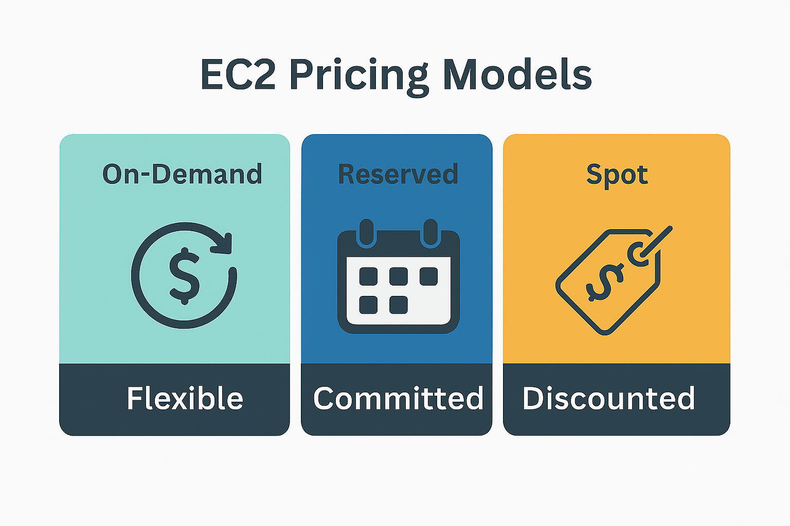

# EC2 Pricing Models (On-Demand, Reserved, Spot)

## Summary

Amazon EC2 offers multiple purchasing options to fit different cost and flexibility needs. Understanding the differences between **On-Demand**, **Reserved**, and **Spot** instances is essential for both passing the exam and optimizing real-world cloud costs.

| Model     | Ideal Use Case                     | Key Tradeoff                 |
| --------- | ---------------------------------- | ---------------------------- |
| On-Demand | Testing or unpredictable workloads | Most flexible, highest cost  |
| Reserved  | Steady-state workloads             | Commit upfront, lower cost   |
| Spot      | Fault-tolerant, flexible jobs      | Deep discount, interruptible |

---

## Visual

---

## Key Points

* **On-Demand**:

  * Pay per second, no long-term commitment
  * Best for unpredictable workloads, dev/test environments
  * Simple to use — default model when launching EC2
  * 💡 *Most expensive per hour*

* **Reserved Instances (RI)**:

  * Commit to 1-year or 3-year terms
  * Choose from:

    * Standard RI (best savings)
    * Convertible RI (can change instance family/type)
  * 💡 *Best for always-on workloads (e.g., production web servers)*

* **Spot Instances**:

  * Use unused AWS capacity — up to **90% off**
  * Can be **interrupted** with 2 minutes’ notice
  * Best for **batch jobs, big data, ML training**
  * 💡 *Not for critical workloads unless paired with auto-recovery*

---

## Bonus: Savings Plans (FYI)

* AWS now offers **Compute Savings Plans**, which apply to EC2, Lambda, and Fargate.
* Like Reserved Instances — but more **flexible** across instance families and services.
* Not directly tested, but good to **mention in class** or for advanced learners.

---

## Practice Questions

### 1. Which EC2 pricing model is best suited for workloads with predictable, long-term usage?

A. On-Demand
B. Reserved
C. Spot
D. Free Tier

<strong>Show Answer</strong>

✅ **B. Reserved**  
Reserved Instances are ideal for steady, long-term workloads and offer a discount for committing to a 1- or 3-year term.

---

### 2. What is a downside of using Spot Instances?

A. They are more expensive than Reserved
B. They require a multi-year contract
C. They can be interrupted by AWS
D. They are not available in most regions

<strong>Show Answer</strong>

✅ **C. They can be interrupted by AWS**  
Spot Instances can be reclaimed with just a 2-minute warning if AWS needs the capacity.

---

### 3. Which EC2 pricing model provides the most flexibility but at a higher cost?

A. Spot
B. Reserved
C. On-Demand
D. Savings Plan

<strong>Show Answer</strong>

✅ **C. On-Demand**  
On-Demand pricing is the most flexible with no upfront commitment, but it's also the most expensive.

---

### 4. A startup runs a batch job that can restart if interrupted. Which pricing model offers the best savings?

A. On-Demand
B. Reserved
C. Spot
D. Dedicated

<strong>Show Answer</strong>

✅ **C. Spot**  
Spot Instances are ideal for batch or flexible workloads that can tolerate interruptions.

---

### 5. What does AWS require from customers to receive the Reserved Instance discount?

A. A bidding strategy
B. Multi-region deployment
C. Upfront time commitment
D. Use of a specific OS

<strong>Show Answer</strong>

✅ **C. Upfront time commitment**  
Reserved Instances require a 1- or 3-year commitment to receive the cost savings.

---

## ✅ Summary

You now understand:

* The **three EC2 pricing models** and when to use each:

  * **On-Demand** for flexibility
  * **Reserved** for predictable savings
  * **Spot** for cost-efficient, interruptible workloads
* The **tradeoffs** between flexibility, commitment, and cost
* That **Savings Plans** are an optional advanced tool for broader compute savings

---
