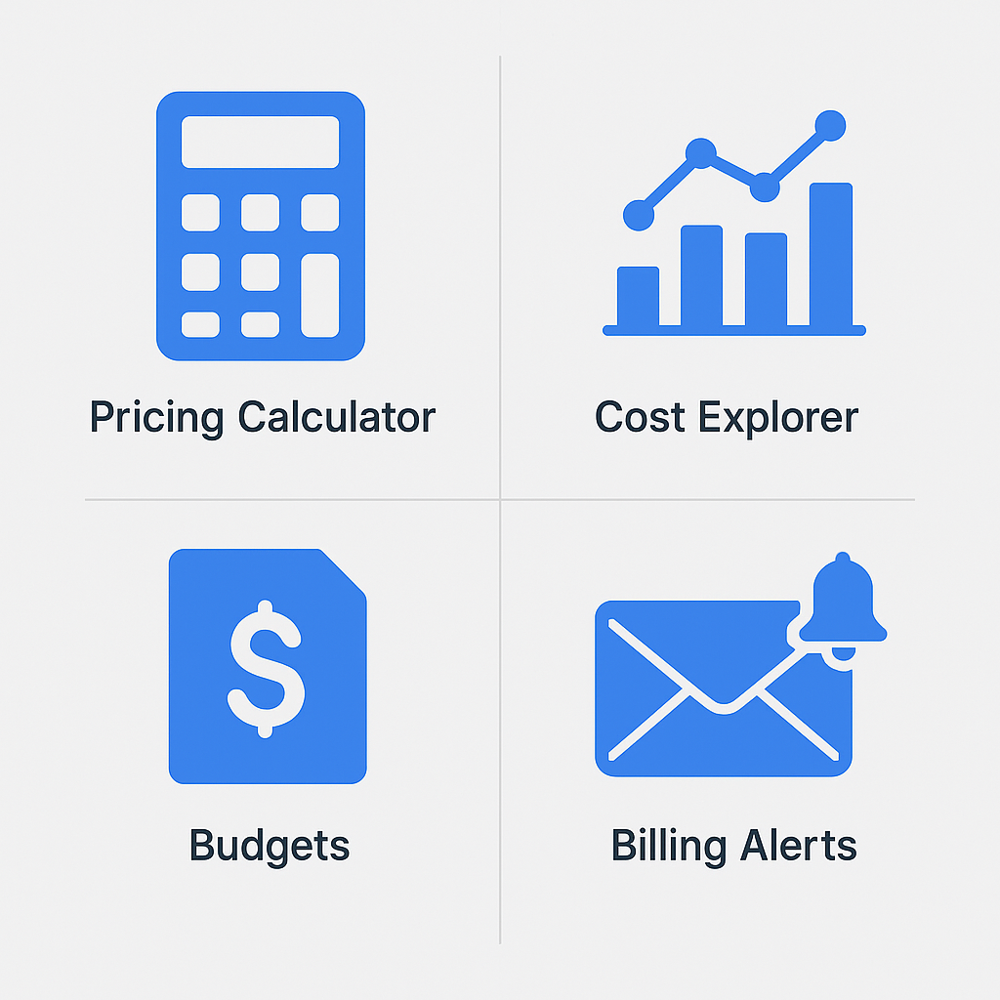

# AWS Billing Tools

> **Summary**: AWS provides several built-in tools to help you track, forecast, and control your cloud spending. Understanding these tools is key to **avoiding surprise bills** and **optimizing your AWS usage**. This lesson covers the **AWS Pricing Calculator**, **Cost Explorer**, **Budgets**, and **Billing Alerts** — all of which are mentioned on the CLF-C02 exam.

---

## 💰 Core Tools for Managing AWS Costs

| Tool                   | Purpose                                | Exam Trigger Phrase                  |
| ---------------------- | -------------------------------------- | ------------------------------------ |
| **Pricing Calculator** | Estimate costs before launching        | “Forecast cost before deploying”     |
| **Cost Explorer**      | Visualize past and current spending    | “Analyze monthly AWS usage”          |
| **AWS Budgets**        | Set spend limits and alerts            | “Notify when costs exceed X dollars” |
| **Billing Alerts**     | Email alert for charges over threshold | “Send email when bill exceeds limit” |

---

## 🛠️ Key Definitions and Use Cases

### 🧮 AWS Pricing Calculator

* **Use it before launching** resources
* Build estimates based on service configuration
* Export to PDF or share with stakeholders
* ✅ **Great for planning architecture costs**

### 📊 AWS Cost Explorer

* Tracks **historical usage and cost trends**
* Graphs by service, linked account, or tag
* View daily, monthly, or forecasted cost trends
* ✅ **Best for ongoing usage visibility**

### 🧾 AWS Budgets

* Set budget thresholds (e.g., `$200 per month`)
* Triggers **custom alerts** via email or SNS
* Can be set for **actual or forecasted** costs
* ✅ **Best for budget enforcement**

### ✉️ Billing Alerts (via CloudWatch)

* Enable billing alerts in your account preferences
* Create a **CloudWatch Alarm** for charges > \$X
* Sends notification to an email address
* ✅ **Quickest way to get notified of billing spikes**

---

---

## 🔎 Practice Questions

### 1. Which tool would you use to **estimate future AWS costs before launching** a new architecture?

A. Cost Explorer
B. AWS Budgets
C. AWS Pricing Calculator
D. Billing Alerts

<strong>Show Answer</strong>

✅ **C. AWS Pricing Calculator**  
It estimates future costs before resources are launched.

---

### 2. You want to **visualize how much EC2 cost your team last month**. What tool should you use?

A. Billing Alerts
B. AWS Cost Explorer
C. IAM
D. CloudTrail

<strong>Show Answer</strong>

✅ **B. AWS Cost Explorer**  
It shows historical spend across services.

---

### 3. A user wants to **receive an email when their AWS bill goes over \$100**. What should they use?

A. Cost Explorer
B. AWS Budgets or Billing Alerts
C. IAM Access Analyzer
D. AWS Inspector

<strong>Show Answer</strong>

✅ **B. AWS Budgets or Billing Alerts**  
Both can be configured to send billing threshold notifications.

---

### 4. What’s the key difference between **AWS Budgets** and **Billing Alerts**?

A. Budgets is real-time, Alerts is delayed
B. Budgets supports forecasting, Alerts does not
C. Alerts are only for S3 usage
D. Budgets only supports Reserved Instances

<strong>Show Answer</strong>

✅ **B. Budgets supports forecasting, Alerts does not**  
AWS Budgets can notify based on forecasted spend.

---

### 5. Which billing tool is best for sharing a cost estimate with a client or stakeholder?

A. AWS Budgets
B. AWS Pricing Calculator
C. AWS Cost Explorer
D. CloudTrail

<strong>Show Answer</strong>

✅ **B. AWS Pricing Calculator**  
It allows you to export and share cost estimates.

---

## 🧪 Optional Hands-On Exercise: Set a \$0 Budget in AWS

Prevent surprise charges by setting a budget alert before launching real resources. This is **a common student misstep** — and the exam expects you to know how budgets work.

### 🔧 Step-by-Step: Create a Zero-Dollar Budget

1. **Log in** to the [AWS Console](https://console.aws.amazon.com/)
2. Navigate to **Billing → Budgets**
3. Click **“Create budget”**
4. Choose **“Cost budget”** and click **Next**
5. Set the name as `ZeroDollarBudget`
6. For **Period**, select “Monthly”
7. For **Budgeted amount**, enter `0`
8. Choose **Linked accounts: All accounts** (or “My account” if single account)
9. Click **Next** until you reach **Notifications**
10. Under **Alerts**, choose:

    * **Threshold**: 100% of budgeted amount
    * **Email recipient**: Enter your email
11. Click **Next → Create budget**

✅ You will now receive an alert **any time costs exceed \$0**, helping you detect unwanted spending instantly — especially important for free-tier learners or sandbox accounts.

---

## ✅ Summary

You now understand:

* The **4 primary billing tools** AWS offers
* When to use **Calculator vs Cost Explorer**
* How to **set alerts** and stay within budget
* Common exam phrasing like “notify when usage exceeds” or “forecast costs”

---
