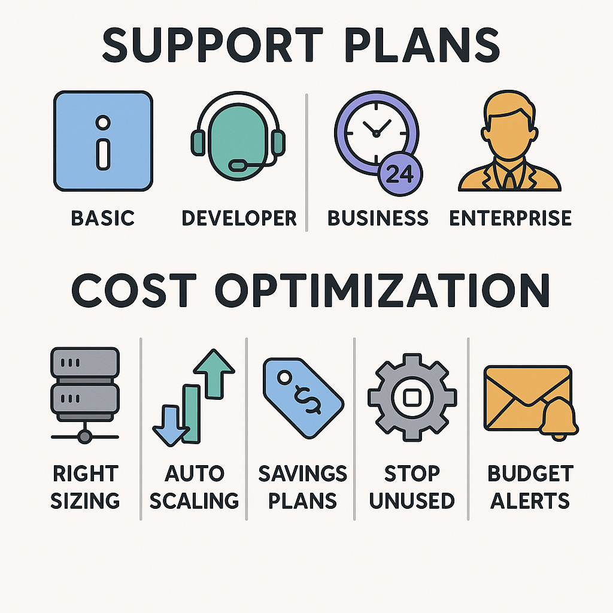

# Support Plans & Cost Optimization

> **Summary**: This lesson covers the **four AWS Support Plans** and introduces core ideas around **cost optimization**. Many exam questions ask which plan includes certain features (like 24/7 access or a TAM), so it’s important to know what each plan includes — and who they’re designed for.

---

## 📦 AWS Support Plans Overview

| Plan           | Includes Technical Support? | Key Features                         | Target Audience         |
| -------------- | --------------------------- | ------------------------------------ | ----------------------- |
| **Basic**      | ❌ No                        | Billing + documentation support only | Individuals, free-tier  |
| **Developer**  | ✅ Yes (email only)          | 12–24 hr response time, 1 contact    | Dev/test environments   |
| **Business**   | ✅ Yes (24/7 via chat/phone) | Trusted Advisor, Production support  | Small/medium businesses |
| **Enterprise** | ✅ Yes (24/7 + TAM)          | TAM, Concierge, architecture reviews | Large mission-critical  |

✅ **Key Differences**:

* **Developer Plan**: Email access only, no 24/7 chat/phone
* **Business Plan**: Adds **24/7 chat/phone**, and **Trusted Advisor**
* **Enterprise**: Adds **TAM** (Technical Account Manager) and Concierge services

---

## 💸 Cost Optimization Strategies

AWS wants customers to architect efficiently. Some key cost-optimization principles:

### 1. **Right Sizing**

* Use EC2 instance types that match workload needs
* Avoid over-provisioning memory/CPU

### 2. **Use Auto Scaling**

* Automatically add/remove instances based on demand
* Helps avoid paying for idle capacity

### 3. **Use Spot or Reserved Instances**

* Use Spot for fault-tolerant jobs
* Use Reserved for predictable workloads

### 4. **Turn Off Unused Resources**

* Stop unused EC2s or RDS instances
* Delete unattached EBS volumes

### 5. **Enable Budgets and Alerts**

* Set cost thresholds in AWS Budgets
* Receive alerts via email or SNS

---

---

## 🔎 Practice Questions

### 1. Which AWS Support Plan includes a Technical Account Manager (TAM)?

A. Basic
B. Developer
C. Business
D. Enterprise

<strong>Show Answer</strong>

✅ **D. Enterprise**  
TAMs are only included with the Enterprise plan.

---

### 2. A startup wants 24/7 chat and phone support but doesn’t need a TAM. Which support plan should they choose?

A. Developer
B. Business
C. Enterprise
D. Basic

<strong>Show Answer</strong>

✅ **B. Business**  
This plan provides 24/7 access without the added cost of a TAM.

---

### 3. Which of the following is NOT a recommended AWS cost optimization strategy?

A. Right-size instances
B. Use On-Demand for everything
C. Use Auto Scaling
D. Set up Billing Alerts

<strong>Show Answer</strong>

✅ **B. Use On-Demand for everything**  
On-Demand is the most expensive and not optimized for steady workloads.

---

### 4. What AWS tool can help enforce a monthly cost threshold?

A. Cost Explorer
B. AWS Budgets
C. IAM
D. AWS Shield

<strong>Show Answer</strong>

✅ **B. AWS Budgets**  
Budgets allow you to define thresholds and send alerts when they’re exceeded.

---

### 5. A developer wants minimal-cost access to technical support for a dev/test workload. What should they choose?

A. Basic Plan
B. Developer Plan
C. Business Plan
D. Enterprise Plan

<strong>Show Answer</strong>

✅ **B. Developer Plan**  
The Developer Plan is inexpensive and includes email support.

---

## Assignment

**Take your full-length practice exam** and review any missed questions carefully.  Then do the Post-exam reflection prompt.  This is fast and easy, and will help you identify any gaps in your knowledge.

 [Practice Exam #3 (CLF-C02 Full-Length) copy into a browser if popup is blocked](https://learn.cloudtraining.net/courses/Ultimate-AWS-Certified-Cloud-Practitioner-Certification-CLF-C02-Full-Practice-Exam-6697ad693279f931c6c5c303?COUPON=CP00XLPSZ)

 [Post-exam Reflection Prompt](../assignments/3-exam_reflection_prompt.md)

---

## ✅ Summary

You now understand:

* The **4 AWS Support Plans** and their key features
* What a **TAM** is and who gets one
* How to **optimize AWS spending** through right-sizing, auto scaling, Reserved/Spot usage, and alerts
* How the exam phrases support and cost-related questions

---
