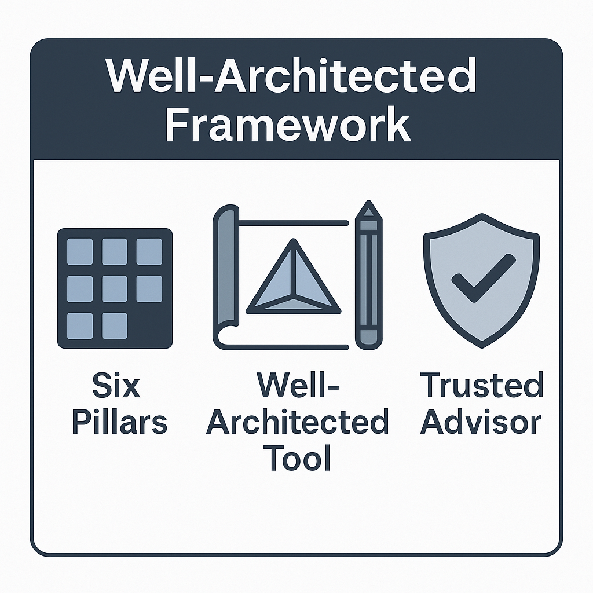

# Introduction to the Well-Architected Framework

> **Summary**: The AWS Well-Architected Framework helps cloud architects build secure, high-performing, resilient, and efficient infrastructure. It consists of **six pillars**, each representing a set of best practices for building in the cloud. This framework is referenced across many AWS exams — including the Cloud Practitioner.

---

## 🧱 What Is the Well-Architected Framework?

The Well-Architected Framework is a structured approach AWS provides to help you:

* **Design** and **evaluate** cloud workloads
* Follow **best practices** in architecture
* Ensure security, reliability, and cost-efficiency

It’s used by both new and experienced AWS users — and it’s referenced directly on the CLF-C02 exam, especially when choosing between different architectural options or tradeoffs.

---

## Core Goal

Help teams **build better cloud architectures** using consistent principles and decision-making tools.

---

##  How It Works

* The framework is divided into **six pillars**
* Each pillar has its own set of best practices, questions, and tradeoff considerations
* These are not rigid rules — they help you ask the *right questions*

> Example: “How do we design for failure?” ➝ part of the **Reliability** pillar
> “How do we avoid unnecessary cost?” ➝ part of **Cost Optimization**

---

## 🛠️ Trusted Advisor and Well-Architected Tool

* **Trusted Advisor**:

  * An AWS service that checks your account against core best practices
  * Evaluates areas like cost, performance, fault tolerance, security, and service limits
  * Provides actionable recommendations

* **Well-Architected Tool**:

  * A self-assessment tool in the AWS Console
  * Lets you review and improve your workload against the six pillars
  * Output includes risks and suggested improvements

---

---

## 🔎 Practice Questions

### 1. What is the purpose of the AWS Well-Architected Framework?

A. To monitor AWS billing
B. To enforce IAM policies
C. To guide cloud architecture best practices
D. To deploy applications globally

<strong>Show Answer</strong>

✅ **C. To guide cloud architecture best practices**  
It’s a framework for evaluating and improving cloud architectures.

---

### 2. Which tool helps you perform a self-assessment of your workload using the six pillars?

A. CloudTrail
B. AWS Config
C. Well-Architected Tool
D. Cost Explorer

<strong>Show Answer</strong>

✅ **C. Well-Architected Tool**  
This tool helps review workloads against the framework.

---

### 3. What is AWS Trusted Advisor primarily used for?

A. Deploying EC2 Instances
B. Monitoring CloudWatch Logs
C. Recommending best practices in your AWS account
D. Launching EKS Clusters

<strong>Show Answer</strong>

✅ **C. Recommending best practices in your AWS account**  
It checks for cost optimization, performance, security, and more.

---

### 4. How many pillars make up the AWS Well-Architected Framework?

A. 3
B. 4
C. 5
D. 6

<strong>Show Answer</strong>

✅ **D. 6**  
The six pillars are: Operational Excellence, Security, Reliability, Performance Efficiency, Cost Optimization, and Sustainability.

---

### 5. Which pillar focuses on minimizing waste and matching supply with demand?

A. Security
B. Cost Optimization
C. Reliability
D. Operational Excellence

<strong>Show Answer</strong>

✅ **B. Cost Optimization**  
This pillar is all about controlling spending and using resources efficiently.

---

## ✅ Summary

You now understand:

* What the Well-Architected Framework is and why it matters
* How AWS Trusted Advisor and the Well-Architected Tool support it
* Why the six pillars form the backbone of AWS architecture best practices
* How this framework maps to real-world and exam scenarios

---
