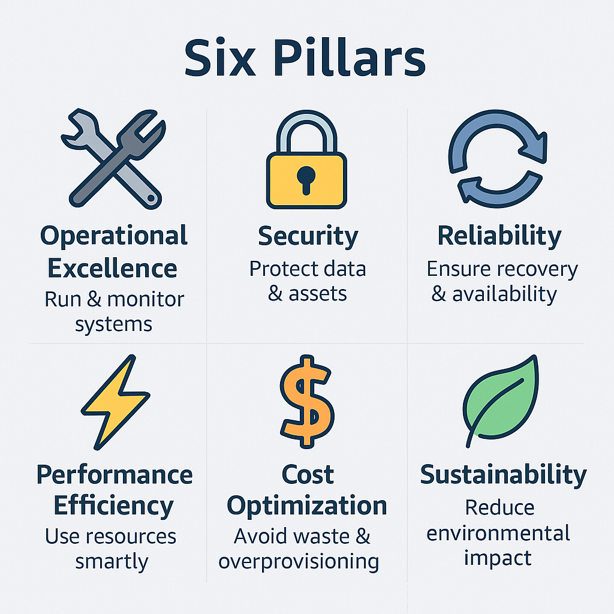

# Six Pillars of the AWS Well-Architected Framework

> **Summary**: The AWS Well-Architected Framework outlines **six core pillars** that guide how to design and operate reliable, secure, efficient, and sustainable systems in the cloud. These principles appear often on the CLF-C02 exam and are essential for building strong AWS architectures.

---

## What Is the Well-Architected Framework?

The Well-Architected Framework is AWS’s blueprint for cloud success. It provides **best practices and design principles** that help teams build systems that are:

* Secure
* High-performing
* Resilient
* Efficient
* Cost-effective
* Environmentally responsible

At the heart of this framework are six **pillars** — each representing a distinct area of architectural excellence.

---

## The Six Pillars (at a Glance)

| Pillar                     | Focus Area                                  | Example AWS Concepts                         |
| -------------------------- | ------------------------------------------- | -------------------------------------------- |
| 🛠️ Operational Excellence | Run, monitor, and improve systems           | Automation, observability, quick rollbacks   |
| 🔒 Security                | Protect data, systems, and assets           | IAM, encryption, CloudTrail                  |
| 🔁 Reliability             | Ensure workloads work as intended over time | Multi-AZ, backups, failover                  |
| ⚡ Performance Efficiency   | Use computing resources effectively         | Auto Scaling, right-sizing, managed services |
| 💰 Cost Optimization       | Avoid waste and control spending            | S3 lifecycle policies, billing alerts        |
| 🌱 Sustainability          | Reduce environmental impact of workloads    | Energy-efficient instances, green regions    |

---

---

## Pillar Descriptions

### 🛠️ Operational Excellence

Focuses on **operations and improvement**. Can your systems recover quickly? Are you automating common tasks?

> ✅ Use tools like **CloudWatch**, **CloudFormation**, and **CodeDeploy** for monitoring and automation.

---

### 🔒 Security

Ensure that your systems and data are **secure and protected**. This means managing access, encrypting data, and logging activity.

> ✅ Services like **IAM**, **KMS**, and **CloudTrail** support this pillar.

---

### 🔁 Reliability

Keep systems **available and functioning** through failures. Emphasizes backups, failovers, and auto-healing architecture.

> ✅ Multi-AZ deployment, **Route 53** for DNS failover, **Auto Scaling groups**.

---

### ⚡ Performance Efficiency

Use your compute resources **wisely** as your needs change. This includes choosing the right instance types and scaling strategies.

> ✅ Use **Auto Scaling**, **Lambda**, and **Amazon Aurora** to stay efficient.

---

### 💰 Cost Optimization

Minimize cost without sacrificing performance. The key is understanding usage patterns and turning off or archiving what you don’t need.

> ✅ Leverage **Cost Explorer**, **S3 lifecycle rules**, and **Savings Plans**.

---

### 🌱 Sustainability

The newest pillar — focused on minimizing environmental impact. Optimize workloads to consume less energy and choose greener regions.

> ✅ Choose **graviton-powered instances**, reduce **idle compute**, and **region selection** matters.

---

## 🔎 Practice Questions

---

**Question 1**
Which of the following is **not** one of the six pillars?

A) Cost Optimization
B) Reliability
C) Elasticity
D) Sustainability

<strong>Show Answer</strong>

✅ **C) Elasticity**  
Elasticity is a cloud benefit, not a Well-Architected pillar.

---

**Question 2**
Which pillar focuses on automation, monitoring, and continuous improvement?

A) Performance Efficiency
B) Operational Excellence
C) Security
D) Reliability

<strong>Show Answer</strong>

✅ **B) Operational Excellence**

---

**Question 3**
Which AWS service helps fulfill the Security pillar by auditing API activity?

A) AWS Config
B) Amazon GuardDuty
C) AWS CloudTrail
D) Amazon CloudWatch

<strong>Show Answer</strong>

✅ **C) AWS CloudTrail**  
CloudTrail tracks API calls for governance and compliance.

---

**Question 4**
Which pillar is concerned with minimizing your environmental impact?

A) Cost Optimization
B) Performance Efficiency
C) Sustainability
D) Operational Excellence

<strong>Show Answer</strong>

✅ **C) Sustainability**

---

**Question 5**
Which practice best supports the Reliability pillar?

A) Encrypting S3 data
B) Using Multi-AZ deployments
C) Applying IAM policies
D) Enabling CloudTrail

<strong>Show Answer</strong>

✅ **B) Using Multi-AZ deployments**  
This ensures availability during failures.

---

## ✅ Summary

You now understand:

* What each **pillar of the Well-Architected Framework** means
* How **AWS services** align with each pillar
* Which pillar maps to key architectural decisions and exam questions

> Remember: On the exam, questions may describe a **situation or failure** and ask which pillar was violated or which AWS service supports a specific principle.

---
