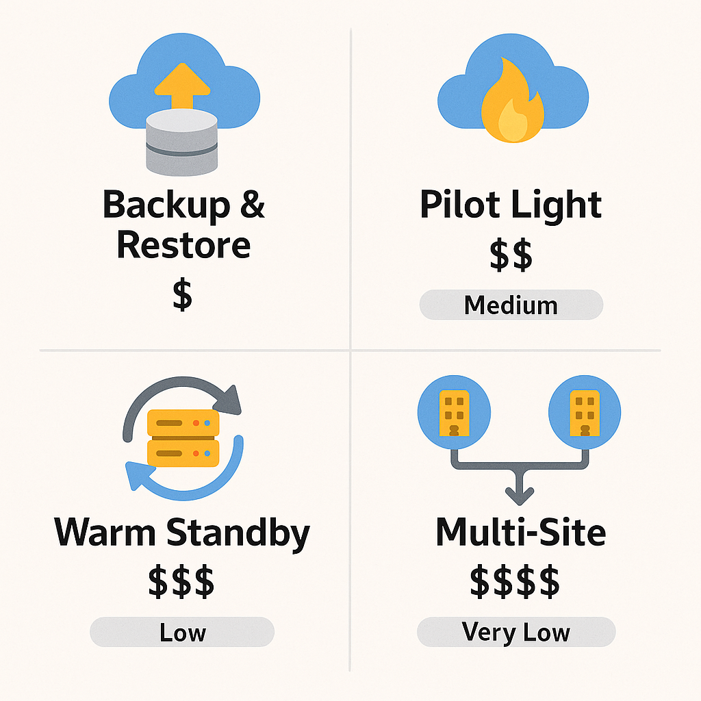

# Disaster Recovery & High Availability

> **Summary**: Disaster Recovery (DR) is about ensuring business continuity in the face of failures. AWS provides multiple strategies to recover workloads quickly and cost-effectively — and the CLF-C02 exam will test whether you understand which one fits which scenario.

---

## 🔄 What Is Disaster Recovery?

Disaster Recovery in AWS refers to the **strategies and services** used to restore access and functionality to IT systems after a failure or outage. The key goal is to reduce **downtime** and **data loss**, measured by:

* **RTO (Recovery Time Objective)** – How quickly a system must be restored
* **RPO (Recovery Point Objective)** – How much data loss is acceptable

---

## 🚨 DR Strategies (Ordered by Cost and Complexity)

| Strategy             | Description                                                    | RTO / RPO      | Cost     |
| -------------------- | -------------------------------------------------------------- | -------------- | -------- |
| **Backup & Restore** | Data is backed up (e.g., to S3), restored manually when needed | High / High    | \$       |
| **Pilot Light**      | Core systems run in the cloud with everything else off         | Medium / Low   | \$\$     |
| **Warm Standby**     | Scaled-down full environment is always running                 | Low / Low      | \$\$\$   |
| **Multi-Site (Hot)** | Full production environment in multiple Regions                | Very Low / Low | \$\$\$\$ |

> The exam often asks **"Which strategy is most cost-effective for..."** or **"Which minimizes downtime..."** There are usually several questions about these four strategies in the AWS CCP exam.

---

---

## 🌍 High Availability vs Disaster Recovery

While related, **High Availability (HA)** focuses on avoiding downtime through **redundancy** (like Multi-AZ), while **Disaster Recovery** is about **recovering** after a failure (e.g., region failure or large outage).

| Concept           | Focus                         | Example                          |
| ----------------- | ----------------------------- | -------------------------------- |
| High Availability | Keep systems online           | Multi-AZ RDS, Load Balancer      |
| Disaster Recovery | Restore systems after failure | S3 backup, Cross-Region failover |

---

## 🛠️ AWS Services That Help

* **S3 / Glacier** → Backup storage
* **RDS Multi-AZ** → Built-in failover for databases
* **Route 53** → DNS failover and health checks
* **CloudEndure** → Continuous replication for DR
* **Elastic Load Balancer (ELB)** → Distribute across healthy targets
* **EC2 Auto Scaling** → Recreate failed instances automatically

---

## 🔎 Practice Questions

---

**Question 1**
Which disaster recovery strategy has the **lowest cost but longest recovery time**?

A) Warm Standby
B) Pilot Light
C) Backup and Restore
D) Multi-Site

<strong>Show Answer</strong>

✅ **C) Backup and Restore**  
This is the cheapest option but takes the longest to recover.

---

**Question 2**
What AWS feature supports **High Availability** for a database?

A) S3 Glacier
B) EC2 Auto Scaling
C) RDS Multi-AZ
D) Route 53

<strong>Show Answer</strong>

✅ **C) RDS Multi-AZ**  
Multi-AZ provides built-in failover for databases.

---

**Question 3**
You want a low-RTO, cost-effective way to keep a minimal version of your environment online. Which strategy is best?

A) Backup & Restore
B) Multi-Site
C) Warm Standby
D) Pilot Light

<strong>Show Answer</strong>

✅ **D) Pilot Light**  
Pilot Light keeps essential services warm and ready to scale up.

---

**Question 4**
What’s the key **difference** between High Availability and Disaster Recovery?

A) HA is more expensive
B) DR doesn’t support AWS
C) HA prevents failure; DR responds to failure
D) DR is automatic; HA is manual

<strong>Show Answer</strong>

✅ **C) HA prevents failure; DR responds to failure**

---

**Question 5**
Which AWS service would help with **DNS failover** in a multi-region setup?

A) AWS Config
B) Route 53
C) ELB
D) S3

<strong>Show Answer</strong>

✅ **B) Route 53**  
It can route users to healthy regions and support failover routing.

---

## ✅ Summary

You now understand:

* The **four main disaster recovery strategies** (Backup, Pilot Light, Warm Standby, Multi-Site)
* How **RTO/RPO** impact strategy selection
* The difference between **High Availability** and **Disaster Recovery**
* Which **AWS services** support resilient, recoverable infrastructure

---

Let me know when you’re ready for Lesson 4: **Cost Optimization & Sustainability**, and I’ll keep the same structure and tone 🤙
