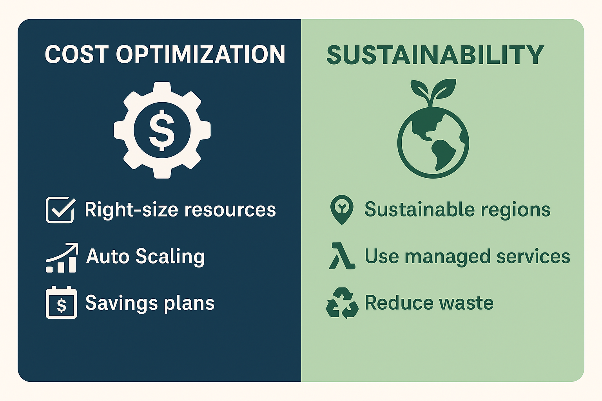

# Cost Optimization & Sustainability

> **Summary**: This lesson dives into the final two pillars of the AWS Well-Architected Framework: **Cost Optimization** and **Sustainability**. You’ll learn how to avoid waste, right-size your architecture, and reduce the environmental impact of cloud workloads — all key concerns for modern businesses and the CLF-C02 exam.

---

## 💰 Cost Optimization Pillar

This pillar is about **maximizing business value** while **minimizing unnecessary spend**.

### Core Practices:

- **Right-sizing resources** — don’t over-provision
- Use **Auto Scaling** to adjust with demand
- Turn off idle resources (EC2, RDS, etc.)
- Use **Savings Plans** or **Reserved Instances**
- Store infrequently accessed data in **S3 Glacier** or **Intelligent-Tiering**
- Use **S3 Lifecycle Policies** to automate storage class transitions

**Key AWS Services**:
- AWS Budgets, Cost Explorer
- Trusted Advisor
- EC2 Auto Scaling
- S3 Lifecycle Rules

---

## 🌱 Sustainability Pillar

The newest pillar — focused on **environmental responsibility**.

### Core Practices:

- Select **sustainable Regions** powered by renewable energy (e.g., us-west-1)
- Use **Graviton processors** for energy-efficient compute
- Design **serverless** or managed workloads (e.g., Lambda, Fargate)
- Optimize compute and storage usage (reduce idle time)
- Archive unused data with Glacier or offline storage

**AWS Green Initiatives**:
- AWS is on a path to 100% renewable energy usage
- Use the **Customer Carbon Footprint Tool** for reporting

> On the exam: you may see questions about “minimizing environmental impact” — that’s a clear signal for the **Sustainability** pillar.

---

---

## 🔎 Practice Questions

### 1. Which AWS feature helps reduce storage costs for infrequently accessed data?

A. S3 Lifecycle Policies
B. EC2 Auto Scaling
C. VPC Flow Logs
D. CloudTrail Logs

<strong>Show Answer</strong>

✅ **A. S3 Lifecycle Policies**  
They automate the movement of data to cheaper storage tiers like Glacier.

---

### 2. What’s one way to minimize environmental impact in an AWS workload?

A. Use Dedicated Hosts
B. Use Graviton processors
C. Avoid serverless services
D. Turn off CloudTrail

<strong>Show Answer</strong>

✅ **B. Use Graviton processors**  
Graviton is optimized for both performance and energy efficiency.

---

### 3. Which service provides insights into how much AWS costs and where savings can be made?

A. AWS IAM
B. AWS Shield
C. AWS Cost Explorer
D. AWS Config

<strong>Show Answer</strong>

✅ **C. AWS Cost Explorer**  
It shows usage patterns and spending trends to help control costs.

---

### 4. What does AWS recommend for archiving data with minimal ongoing cost?

A. S3 Standard
B. RDS Multi-AZ
C. S3 Glacier
D. S3 Intelligent-Tiering

<strong>Show Answer</strong>

✅ **C. S3 Glacier**  
It’s designed for long-term archival storage at very low cost.

---

### 5. Which of these aligns MOST with the Cost Optimization pillar?

A. Using AWS WAF to block threats
B. Deploying all services in one AZ
C. Turning off idle dev/test EC2 instances
D. Encrypting S3 data with SSE-KMS

<strong>Show Answer</strong>

✅ **C. Turning off idle EC2**  
This reduces unnecessary cost — a direct cost optimization strategy.

---

## ✅ Summary

You now understand:

* What the **Cost Optimization** pillar promotes: right-sizing, reducing idle resources, and storage efficiency
* How the **Sustainability** pillar encourages greener, more efficient AWS usage
* Which AWS services and exam phrases point to each pillar

---
