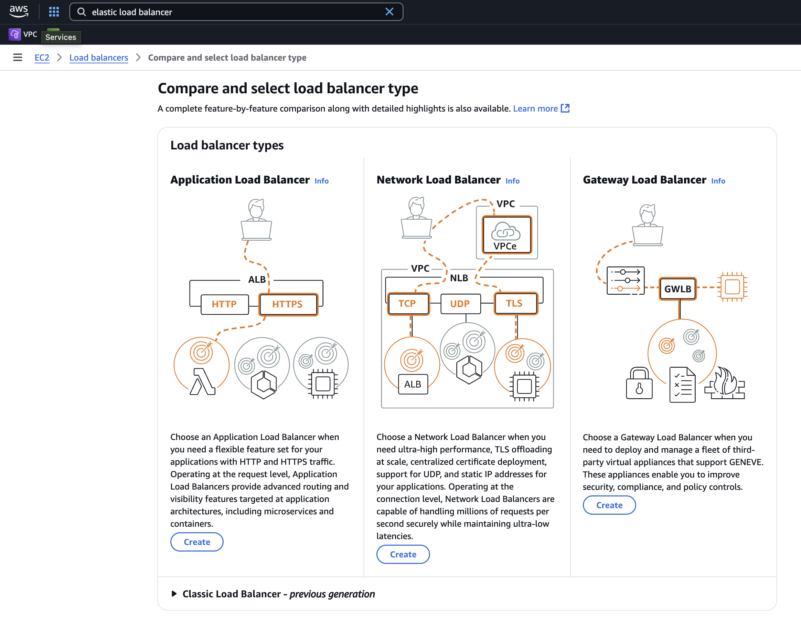

# Final Review Strategy

> **Summary**: You’ve covered all the major topics — now it’s time to sharpen your **exam mindset**. This lesson will help you prepare for the real CLF-C02 exam experience by reviewing **exam strategy**, tricky concepts, and the most important takeaways from the course. You’ll also get a curated glossary of **tested terms**, key reminders, and your final practice questions.

---

## 🧠 Exam Strategy: Think Like AWS

The AWS CCP exam tests **how AWS thinks** — not just definitions.

* **Choose the most secure option** (MFA, IAM roles, encryption).
* **Avoid overprovisioning** (right-size, use serverless or Spot).
* **Focus on resiliency and scaling** (Multi-AZ, auto scaling, managed services).
* **Trust AWS managed services** unless told otherwise.
* When in doubt: go with **least privilege, least cost, most secure**.

---

## Common Pitfalls and Tricky Topics

| Mistake                              | Better Thinking                                            |
| ------------------------------------ | ---------------------------------------------------------- |
| Choosing EC2 when Lambda works       | Use serverless when possible                               |
| Ignoring Shared Responsibility Model | Know what **you** secure vs what AWS does                  |
| Confusing EFS vs S3 vs EBS           | Know when to use block, object, or file                    |
| Forgetting about **Trusted Advisor** | Real-time best practice guidance                           |
| Choosing “Elastic Load Balancer”     | Use **Application**, **Network**, **Classic**, **Gateway** |

---

## Final Practice Questions!

### 1. Which AWS services should be considered for building applications in a fully serverless architecture? (Select 3)

A) Amazon EC2
B) AWS Lambda
C) AWS Fargate
D) Amazon Elastic Block Store
E) Amazon DynamoDB

<strong>Show Answer</strong>

✅ **B) Lambda**, **C) Fargate**, **E) DynamoDB**  
EC2 and EBS require server management — the others are serverless or managed compute/storage.

---

### 2. A company is using AWS Trusted Advisor for best practices. Which issues will it flag?

A) Upcoming user interface changes
B) Low utilization on EC2 instances
C) Open-access S3 buckets
D) Exposed IAM access keys
E) AWS service outages

<strong>Show Answer</strong>

✅ **B**, **C**, and **D**  
Trusted Advisor checks **cost**, **security**, **performance**, and more.

---

### 3. MediaStore Inc. needs filesystem-style access from EC2 to files stored in S3. Which service should they use?

A) Elastic File System
B) S3 File Gateway
C) EBS
D) Transit Gateway

<strong>Show Answer</strong>

✅ **B) S3 File Gateway**  
This provides a file-based interface to S3 buckets using SMB/NFS protocols.

---

### 4. What types of load balancers does AWS offer? (Select all that apply)

A) Elastic Load Balancer
B) Application Load Balancer
C) Network Load Balancer
D) Classic Load Balancer
E) Gateway Load Balancer

<strong>Show Answer</strong>

✅ **B, C, D, E**  
There is **no actual load balancer** called "Elastic Load Balancer" — it's a general phrase.

---

---

### 5. Which service should you choose to store semi-structured data with **single-digit millisecond** response times at any scale?

A) Amazon Aurora
B) Amazon Redshift
C) Amazon DynamoDB
D) Amazon S3

<strong>Show Answer</strong>

✅ **C) DynamoDB**  
It’s designed for key-value or document-based workloads at high speed.

---

### 6. Which AWS service allows **automated compliance tracking** of configuration changes across AWS resources?

A) AWS CloudTrail
B) Amazon Inspector
C) AWS Config
D) AWS Shield

<strong>Show Answer</strong>

✅ **C) AWS Config**  
AWS Config tracks **resource configuration history** and compliance.

---

### 7. A company wants to **track login attempts and API activity** across AWS accounts. Which service helps?

A) CloudWatch
B) IAM
C) Trusted Advisor
D) CloudTrail

<strong>Show Answer</strong>

✅ **D) CloudTrail**  
CloudTrail provides a log of **API calls and login events** for audit and compliance.

---

### 8. What benefit does **AWS Organizations** provide?

A) Enables VPC peering between accounts
B) Consolidates billing and applies policies to multiple accounts
C) Creates encrypted backups across regions
D) Automatically creates IAM roles

<strong>Show Answer</strong>

✅ **B) Consolidates billing and applies policies to multiple accounts**  
AWS Organizations lets you manage **multi-account structure and permissions** centrally.

---

### 9. A company needs a **dedicated physical server** for compliance. Which EC2 option fits?

A) On-Demand Instance
B) Spot Instance
C) Reserved Instance
D) Dedicated Host

<strong>Show Answer</strong>

✅ **D) Dedicated Host**  
Provides **hardware isolation** for licensing or compliance needs.

---

### 10. Which of the following helps reduce **data transfer costs** between services in the same region?

A) Use of Public IPs
B) Use of VPC Endpoints
C) Elastic Load Balancing
D) CloudFront

<strong>Show Answer</strong>

✅ **B) VPC Endpoints**  
VPC Endpoints allow **private communication**, reducing transfer costs.

---

### 11. What AWS support plan is **required** for access to a **Technical Account Manager (TAM)**?

A) Developer
B) Basic
C) Business
D) Enterprise

<strong>Show Answer</strong>

✅ **D) Enterprise**  
Only the Enterprise plan includes a **TAM for strategic guidance**.

---

### 12. Which AWS service can **automatically adjust compute capacity** to match demand?

A) Amazon ECS
B) AWS Auto Scaling
C) Amazon EC2
D) Amazon Inspector

<strong>Show Answer</strong>

✅ **B) AWS Auto Scaling**  
It dynamically adjusts EC2 instance counts based on policies or metrics.

---

### 13. What pricing model **requires no upfront commitment** and is best for unpredictable workloads?

A) Savings Plans
B) Spot Instances
C) Reserved Instances
D) On-Demand

<strong>Show Answer</strong>

✅ **D) On-Demand**  
You pay per use with **maximum flexibility**, though at a higher cost.

---

### 14. Which AWS service gives **best practice checks** for fault tolerance, security, and cost optimization?

A) CloudTrail
B) Trusted Advisor
C) Config
D) CloudWatch

<strong>Show Answer</strong>

✅ **B) Trusted Advisor**  
It offers real-time advice across **5 key categories**, including cost and performance.

Absolutely — here are **6 additional CLF-C02 questions (#15–20)** based on **commonly missed or tricky topics** from recent AWS CCP exams in 2024–2025. These are phrased in the **exam-style** format and focus on real-world decisions, service comparisons, and misunderstood features:

---

### 15. Which AWS service lets you **centrally manage permissions** across multiple AWS accounts?

A) IAM
B) IAM Identity Center
C) AWS Organizations
D) AWS Config

<strong>Show Answer</strong>

✅ **B) IAM Identity Center**  
IAM Identity Center (formerly AWS SSO) is used to centrally manage **user access** across multiple AWS accounts and applications.

---

### 16. Which AWS storage option is best for **long-term data archiving** that is rarely accessed?

A) Amazon S3 Standard
B) Amazon EFS
C) Amazon Glacier Flexible Retrieval
D) Amazon EBS

<strong>Show Answer</strong>

✅ **C) Amazon Glacier Flexible Retrieval**  
Designed for archival storage with low cost and **retrieval delays**, perfect for compliance or backup archives.

---

### 17. A company wants to **automate infrastructure deployment** using code. Which service should they use?

A) AWS Systems Manager
B) AWS CloudFormation
C) AWS Trusted Advisor
D) AWS Control Tower

<strong>Show Answer</strong>

✅ **B) AWS CloudFormation**  
It enables **infrastructure as code** — define your AWS resources in text (YAML/JSON) and deploy them repeatedly.

---

### 18. Which of the following **reduces latency** by serving content from edge locations?

A) Amazon VPC
B) AWS CloudTrail
C) Amazon Route 53
D) Amazon CloudFront

<strong>Show Answer</strong>

✅ **D) Amazon CloudFront**  
CloudFront is AWS’s **Content Delivery Network (CDN)** that delivers content via **edge locations** closer to the user.

---

### 19. What’s the **main difference** between Amazon RDS and DynamoDB?

A) DynamoDB is a CDN; RDS is a database
B) RDS supports relational data; DynamoDB supports NoSQL
C) RDS is serverless; DynamoDB is not
D) RDS only works with EC2

<strong>Show Answer</strong>

✅ **B) RDS supports relational data; DynamoDB supports NoSQL**  
This is a key classification tested on the exam — **structured vs unstructured data.**

---

### 20. Which AWS service allows **real-time monitoring** and can trigger alarms based on thresholds?

A) AWS Config
B) Amazon CloudWatch
C) AWS CloudTrail
D) AWS Lambda

<strong>Show Answer</strong>

✅ **B) Amazon CloudWatch**  
CloudWatch collects metrics, logs, and alarms — it’s the **go-to service for monitoring and alerting**.

---

## Final Assignment

**Take your full-length practice exam** and review any missed questions carefully. Track which topics caused hesitation and revisit those in the glossary below.

 [Practice Exam #4 (CLF-C02 Full-Length) copy into a browser if popup is blocked](https://learn.cloudtraining.net/courses/Ultimate-AWS-Certified-Cloud-Practitioner-Certification-CLF-C02-Full-Practice-Exam-6697ad693279f931c6c5c303?COUPON=CP00XLPSZ)

 [Post-exam Reflection Prompt](../assignments/4-exam_reflection_prompt.md)

---

## 📚 Core CCP Vocabulary

> *This is your cheat sheet. These terms are tested heavily. Know what each one does and when to use it.*

🟦 **Compute & Storage**

* **Amazon EC2** – Virtual servers
* **Amazon S3** – Object storage
* **Amazon EBS** – Block storage (like a hard drive)
* **Amazon EFS** – File storage across multiple EC2s
* **Amazon RDS** – Relational database service
* **Amazon DynamoDB** – NoSQL database
* **Amazon Lambda** – Serverless functions
* **AWS Fargate** – Serverless containers

🟩 **Networking & Content Delivery**

* **Amazon VPC** – Virtual network environment
* **Route 53** – DNS and domain routing
* **CloudFront** – CDN for fast global delivery
* **AWS Direct Connect** – Dedicated line to AWS
* **AWS VPN** – Encrypted tunnel to AWS
* **Transit Gateway** – Connect multiple VPCs and on-prem networks

🟨 **Security**

* **IAM** – Control access to AWS resources
* **MFA** – Two-factor authentication
* **Encryption (at rest/in transit)** – Data protection
* **AWS WAF** – Web Application Firewall
* **AWS Shield** – DDoS protection
* **AWS Macie** – Sensitive data discovery
* **AWS Inspector** – Vulnerability scanning

🟧 **Billing & Pricing**

* **Pricing Calculator** – Estimate costs
* **Cost Explorer** – Analyze historical spending
* **Budgets** – Set limits and get alerts
* **TCO Calculator** – Compare AWS vs on-prem costs
* **Savings Plans** – Flexible compute discount model
* **Reserved Instances / Spot / On-Demand** – EC2 pricing models

🟪 **Monitoring & Management**

* **CloudWatch** – Metrics, logs, alarms
* **CloudTrail** – API activity logging
* **Config** – Track configuration changes
* **Trusted Advisor** – Real-time best practice guidance

🟫 **Well-Architected & DR**

* **6 Pillars** – Operational Excellence, Security, Reliability, Performance Efficiency, Cost Optimization, Sustainability
* **Disaster Recovery** – Backup/Restore, Pilot Light, Warm Standby, Multi-Site

---

## ✅ Summary

You now have:

* A solid review of final exam traps and best practices
* A set of realistic multi-select questions and explanations
* A full CCP-specific glossary to scan before test day
* One last full-length practice exam to lock it all in

Remember: You’re not expected to memorize commands — you’re expected to recognize **the right AWS approach** in context.

**You got this. Let's go earn that CCP badge.**

---