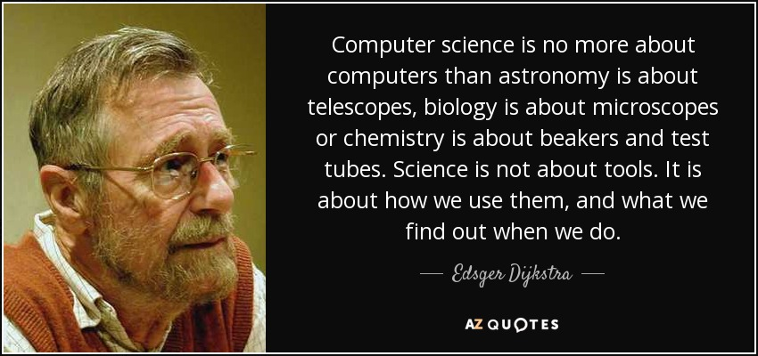

# Complexity Analysis: Time and Space

## An embarassment of riches - modern computing

These days computers are very powerful - they have lots of processing power and lots of memory (space for data). For most of the programs you write in this class your computer will be so powerful that it would be difficult to detect a difference between an extremely efficient program and an inefficient one (both doing the same thing).

It wasn't always this way. For decades, programmers always had to work against the limitations of processor power and memory.

And, as a professional software engineer these concerns are still relevant:

- Web app load times over low-bandwidth connections (which is a large percentage of the world).
- Applications or data at scale (Google processes over 99,000 searches *per second*).
- Embedded systems (IoT devices, etc).
- Energy efficiency.

## What is complexity analysis?

*Complexity analysis* is the term for how programmers think about the **perfomance** of a program:

1. How long (how much processing power, how many CPU cycles) does it take to run?
2. How much space (memory) does it take up?

In other words ...

1. Time
2. Space


### Things we care about - worst case perfomance

Programmers usually care about the **worst-case performance** of their programs, as that is when possible problems (like running out of memory!) can occur. We will discuss Big-O later but it encapsulates this idea of using worst-case performance to evaluate and compare programs.

### Things we don't care about - real numbers and details

Programmers usually don't care about best-case performance. Sometimes we may care about average-case perfomance.

Most importantly, when it comes to complexity analysis, we don't care about the **real value** (300 milliseconds, 20 bytes) for how much time/space a program uses.

We don't care about if Python performs a bit better than Javascript when searching arrays (I have no idea if this is true), as we don't care about **real numbers** for the purpose of analysis.



As a working software engineer evaluating real-world performance of your systems you absolutely will care about real numbers. But for an ideal, apples-to-apples comparison of **algorithms** --- different ways to write a program to solve a problem, we don't care.

But for today we are *computer scientists* -- tomorrow we will be *software engineers.* With that, let's carry on!

## Space complexity

This is analzying how much memory a program uses when it runs. **You generally will be not asked about space complexity in technical interviews**, and, generally speaking, people focus more on **time complexity.**

This is what we will do in this course. However space complexity is an important concept, and, if it does come up in a technical interview, it will probably be about **in-array replacement** -- modifying an array without creating a copy -- versus creating additional variables. Let's look at that now.

### Doubling each element in an array

#### Question: Can someone remind me of how an Array works in computer memory?

Remembering what we have learned about arrays, let's look at a common problem:

Given an array of integers of some arbitrary length *n*, such as `[1, 0, 14, 25, 3]` (where *n = 5* since the length of the array is 5), write a program to double the value of each element in the array.

Before we get started ...

#### Question: How much space does an array of *n* integers take up?**

#### Answer: How to estimate and make stuff up like a programmer ...

A great tool is to **make assumptions.**

Let's pretend that an integer takes up 1 byte (8 bits, such as `00010001` or `10101111` or `00001111`) of space. Let's also assume (the fancy word for "pretend") that we are not going to worry about fixed array sizes - an array of length 3 takes up 3 bytes of space, an array of length 3 million takes up 3 million bytes (3 megabytes) of space ([computers love powers of two](https://web.archive.org/web/20230929202158/https://cup-of-char.com/exploring-the-powers-of-2/)).

So our array of length *n* will always take up *n* bytes of space. Our program's space complexity can never get any smaller than that.

### Solution A: Using Additional Variables

Here is one way to solve that problem:

```python
def double_elements_new_array(arr):
    doubled = []
    for num in arr:
        doubled.append(num * 2)
    return doubled

# Example usage:
arr = [1, 2, 3, 4, 5]
print(double_elements_new_array(arr))
```

Remember - **we don't care about the details**. We don't care if in reality the Python interpreter needs to allocate *x* bytes of data every time a function is defined or a `for ... in` loop is used (I have no idea).

We care about the **ideal, abstracted** space complexity of our program. There is an array. It takes up space.


#### Question: What is the space complexity of the above solution?

#### Answer: 2 * n

Our array is length *n*. Each element *i* in the array takes up 1 byte. An array of length 5 takes 5 bytes. Our program implementation **creates a new array* and for each element *i* in the array, **doubles and inserts that element into the new array**.

So we have **two** arrays of the same length:

```python
arr = [0, 1, 2, 3]
doubled_arr = [0, 2, 4, 6]
```

#### Question: Does the size of a specific integer matter?

#### Answer: No. Why not?

*Because for the purposes of complexity analysis we have **made the assumption** that the computer always allocates 8 bytes for any integer and that that is the max amount of space an integer can take up.*

### Solution B: Solving in-place

Let's pretend you were asked this question during a technical interview. You solved it as above. Now, your interviewer says:

**"Great job! Can you improve the runtime perfomance, specifically w/regards space efficiency, of this program at all? Or is this the most efficient version of this program possible.**

As you may already know, and we are about to learn -- we can!

#### Question: How can we make this program use less memory (take up less space)?

#### Answer: Modify the array in-place

Here is a solution which does **not** create a new array or make copies. It modifies the value of each element of the array **in-place**, inside the array:

```python
def double_elements_in_place(arr):
    for i in range(len(arr)):
        arr[i] = arr[i] * 2
    return arr

# Example usage:
arr = [1, 2, 3, 4, 5]
print(double_elements_in_place(arr))
```

#### Question: What is the space complexity of this solution?

#### Answer

How much space does our new version of the "double the value of every integer in an array of length *n*" take up?

The answer is -- **n bytes**, as our assumption is that each integer element *i* takes up 1 byte (examples: `00000000` or `00000001`) of space.

Now your interviewer asks ...

#### Question: "Is this the most efficient implementation of this algorithm, with regards to space complexity?"

Yes - it is. Can we make this program take up any less space? No -- we cannot.

### Space Complexity - Summary

- We will not return to space complexity very often, but, it is valuable to have a basic understanding of it.
- Be prepared to know how to modify an array **in-place** for technical interview or coding challenge problems.
