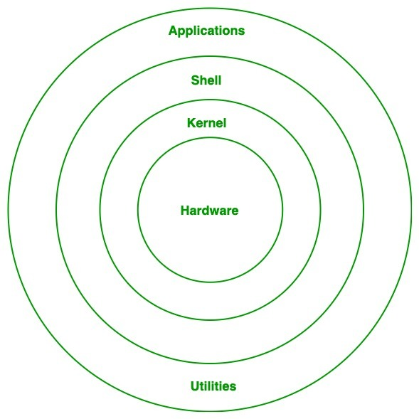
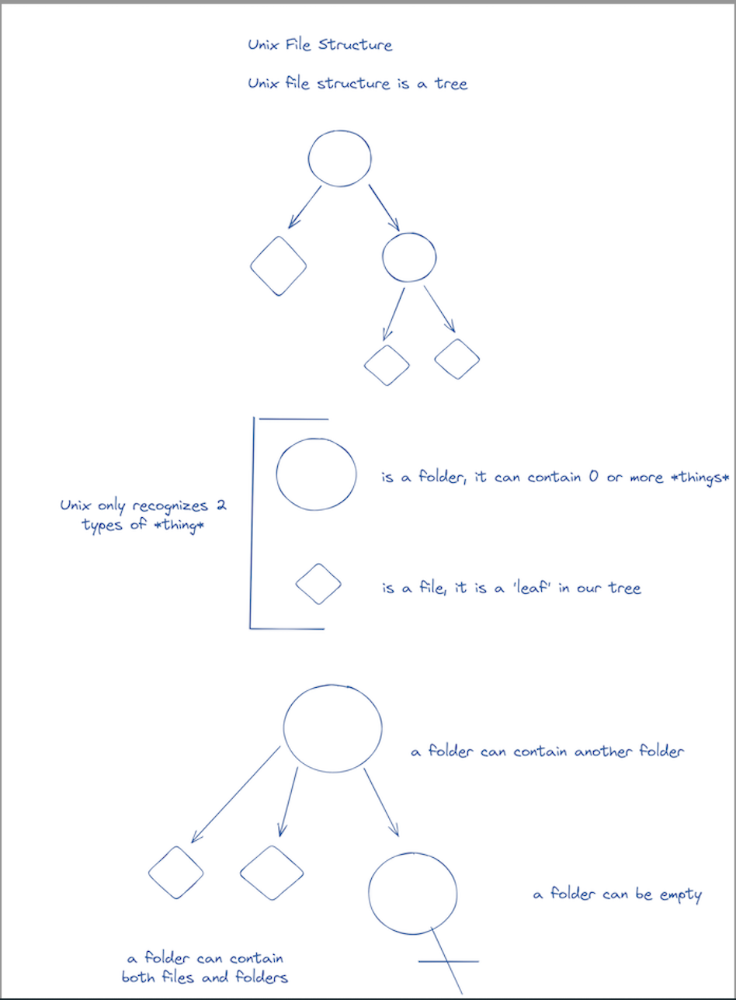
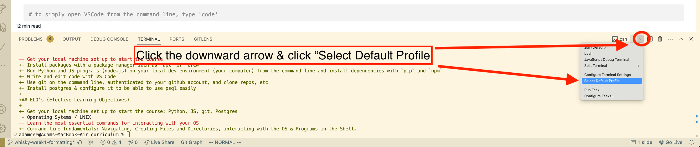
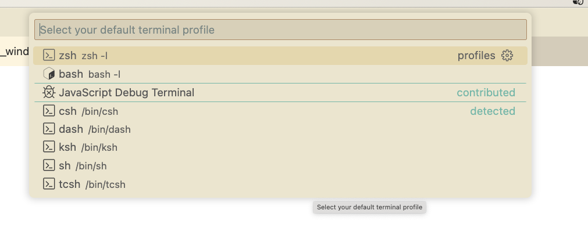

# Preparing Your Machine

## Introduction

Before we dive into writing code, we need to **prepare your development machine**. Software engineering requires a set of tools that allow you to write, test, and run applications consistently. In this lecture, we’ll install and configure the same tools used in professional environments. By the end of this setup, your computer will be ready for full-stack development.

The tools we’ll cover:

* A Unix-based environment (Mac, Linux, or WSL for Windows)
* Docker for running services in containers
* Visual Studio Code (VS Code) as our primary code editor
* Postman for testing APIs

---

## What is Unix

**Unix** is a family of operating systems built around the same core principles: simplicity, modularity, and stability. Most programming environments are based on Unix-like systems.

Why does this matter?

* Most servers in the real world run Linux (a Unix-like system).
* Programming tools and languages are designed with Unix commands in mind.
* Knowing Unix means you’ll be comfortable in nearly any software environment.

Whether you are on an actual Linux system, MacOS or Windows with WSL, we are going to refer to all of these environments as 'UNIX', or just 'the command line interface' ('cli' for short).

**So what is UNIX?** Without getting too deep into the weeds early on: **UNIX is an operating system architecture and set of tools that allows a user to interact with that operating system through a command line interface**. It is the lingua-franca of operating systems, i.e. it is the language you can expect (almost) any operating system to speak and allows you to interact with it in a predictable way.

### The Details

In reality, UNIX started as a specific OS invented at Bell Labs in the 1960s, by some of the same people who invented the C language. While proprietary, its source code was licensed to universities and corporations. However there was poor compatibility between different implementations, a common theme in the history of software development. Complicating things further, software used to be deeply coupled with hardware and made to fit an individual product, so even within a given company there wasn't a single OS that unified the experience across devices.

That changed in the 80s with the invention of the personal computer and Apple and Microsoft becoming the most significant players in that emerging market. MacOS based it's OS architecture on UNIX, whereas Microsoft went it's own way entirely with Windows and MSDOS. Then in the 90s Linux was invented as an open source OS and defined the core 'kernel' that all other Linux distributions (or 'flavors') are based on. Linux is odd in that sense in that it is open-source, so there isn't one Linux, there are a few popular 'flavors', but a million others that are just as legitimate, just not widely used. That means that in the modern age we have:

**Linux** - most closely based on UNIX, but may differ slightly based on the 'flavor' you go with (Ubuntu and Debian are the major flavors).

**MacOS** - very UNIX-_like_, but will differ in small ways. Really just a specific flavor of Linux but one that Apple uniquely controls and is closed-source as a result. Also Apple has a habit of making breaking updates whenever they please.

**Windows** - Windows is built on a fundamentally different architecture, and you will see this if you try to put UNIX commands into Command Prompt or Windows PowerShell - most will simply not be recognized (even basic ones like `ls`!) However this was such a pain point for developers on Windows that they eventually relented, and the modern solution is WSL - _Windows_ Subsystem for _Linux_. Essentially, if you are on Windows, the suggestion is to use WSL, which means you have an entire Linux OS (defaulting to the flavor Ubuntu) _within_ your Windows OS, and, with rare exceptions, it will work just like the flavor of Linux that your WSL environment uses.

The major take home is: no matter the OS we can all be on _basically_ the same environment, **_but_** there will always be small differences that will make the behavior of Windows/MacOS/Linux different, and even one version of MacOS (for example) will differ ever so slightly from another, and this is what makes environment setup so difficult, we simply can't anticipate every issue that you might encounter given all the permutations that determine what makes your environment unique.

#### Architecture

On a basic level, a computer can only run a single program at a time, so an OS is _the_ program your physical hardware is running, and by it's design it is an interface between the hardware and the user, allowing other programs to be run _on top_ of this main program. Think of the OS like a _scheduler_ - it's there to coordinate the sharing of hardware resources between multiple users and programs without requiring each one of those users/programs to know the intimate details of the hardware.

UNIX (or any OS) can therefore be thought of in terms of the following set of layers:



These are the essential components of your OS and the concentric circles represent what is built 'on top' of what. From the inside out, the 4 components are:

1. The **Hardware** - the literal hardware of your computer. It could be made by any manufacturer but to interact with it requires ...

2. The **Kernel** - So named because it is the essential layer that allows an OS to command your hardware to do things. You will generally never touch the kernel, despite it being necessary for the OS to function. Think of it like the engine of a car - it's how the entire thing works but the domain of an expert, while you the general user will usually only interact with ...

3. The **Shell**. So named because it wraps the kernel. This is how you interact with the underlying hardware at a level of abstraction that is 'safe' for the average user. The shell is a command-line (i.e. text based) interface and set of basic commands and programs that will allow you to do common tasks a computer user cares to accomplish. This is the layer we will focus on most of this lecture. But finally of course there is the last layer of ...

4. **Applications**. No OS would be complete without the ability to run arbitrary applications. The command 'python' is itself an application, one that can read and execute text documents that follow the Python programming syntax. An application is any program that isn't essential to the OS and therefore isn't built directly into the shell, but a modern shell generally provides an interface for downloading and running such applications.

Extending the car analogy we could say the 4 layers of a car are:

1. Hardware - the physical body of the car
2. Kernel - the engine and other essential pieces that the average user cannot work with/repair themselves
3. Shell - the steering wheel and gear shaft, how a normal user (who knows how to drive a car) interacts with the complex machine under-the-hood
4. Applications - the GPS or radio, not essential to the car, swappable with other similar products, but extends the car's functionality beyond it's out-of-the-box capabilities.

### Files and Folders

There are only two types of 'things' as far as a UNIX environment is concerned: files and folders.

- A `file` _is_ a _thing_. Depending on what kind of _thing_ it is it can be read from or written to or executed.
- A `folder` (also called a 'directory') can _contain_ 0 or more _things_, i.e. other files or folders.

As it turns out, these are the only two concepts you need to have a fully functional OS.



---

## macOS (BSD) vs Linux (GNU)

* **macOS** is based on **BSD Unix**, which gives it strong Unix compatibility. If you’re on a Mac, you already have access to a terminal that supports Unix commands.
* **Linux** (GNU/Linux) is the open-source cousin of Unix. Most servers, cloud systems, and development environments use Linux.
* While there are some differences (e.g., macOS uses BSD utilities, Linux uses GNU utilities), most commands you learn will work the same on both.

👉 In this bootcamp, we’ll treat **macOS and Linux as nearly interchangeable**. Windows requires a special setup, which we’ll cover next.

---

## WSL for Windows Users ONLY

### What is WSL

Windows Subsystem for Linux (**WSL**) is a feature in Windows that lets you run a Linux environment directly inside Windows without needing a separate computer or virtual machine. With WSL, you can use the same tools and commands as Mac/Linux users.

We’ll use **Ubuntu**, one of the most popular Linux distributions, for consistency across all students.

---

### Installing WSL

Follow these steps carefully if you’re on Windows:

#### **Open PowerShell as Administrator**

   * Click the Windows Start menu → type `powershell` → right-click → select **“Run as administrator.”**

#### **Enable WSL and Virtual Machine Platform**

   In the PowerShell window, type:

   ```powershell
   wsl --install
   ```

   This command:

   * Installs the **WSL feature**
   * Installs **Ubuntu** (by default)
   * Sets up your Linux environment

#### **Restart your computer** when prompted.

#### **First-time setup**

* After restart, Ubuntu will open in a new window.
* It will ask you to create a **username** and **password** for your Linux environment.
* These are separate from your Windows credentials. Write them down!

```bash
# username will need to be all lowercase
Enter new UNIX username: <username>
# Once you enter the name it will prompt for your password. Note that you will not see any feedback while typing, not even '****' type masking
New password:
Retype new password:
```

* If you see an output at this below than you have succesfully setup your WSL environment:

```bash
<username>@<computer_name> $
```

#### **Verify installation**

Open PowerShell or Windows Terminal and type:

```powershell
wsl --list --verbose
```

You should see something like:

```
NAME      STATE           VERSION
Ubuntu    Running         2
```

👉 Now you have a Linux environment inside Windows. Whenever you need to code, open **Ubuntu (WSL)** instead of the normal Windows Command Prompt. To configure the correct default shell open Windows Terminal and then select `'down arrow' -> Settings -> Startup -> Default Profile -> Ubuntu`

### zsh Shell

By default Ubuntu is using the shell called [bash](https://en.wikipedia.org/wiki/Bash_(Unix_shell)). This is the program that runs in your terminal. zsh is a newer shell program, very similar to bash, but with some amenities. zsh is also the default shell on MacOS, so we will install zsh and use it as our default so everyone is using the same shell.

You can run this command to see the shell currently being used. It should print `/bin/bash` or something similar with 'bash' in it:

```bash
echo $SHELL
```

#### Installing zsh

Use apt to install zsh:

```sh
sudo apt-get install zsh
```

Verify that zsh has been installed:

```sh
zsh --version
```

#### Set zsh as the default shell

Now we will configure Ubuntu to always use zsh. First get the path to where `zsh` lives on your filesystem`:

```sh
which zsh
```

It should print out something like:

```sh
/usr/bin/zsh
```

**Whatever that path is**, use it in this command below:

```sh
chsh -s <YOUR_PATH_TO_ZSH>
```

Now your default shell is zsh!

Close your terminal and/or any platform hosting your terminal (i.e. VScode) and re-open it. Confirm that when we opened the terminal, which started a new shell session, ubuntu used zsh:

```sh
echo $SHELL
```

It should print `/bin/zsh` or a similar path with 'zsh' in it.

---

## Docker

### What is Docker

**Docker** is a tool that lets you run applications inside **containers**. Think of a container as a “lightweight virtual computer” that holds everything your application needs to run (code, libraries, dependencies).

Why it matters:

* Ensures code runs the same way on every computer.
* Lets you run services like **databases, APIs, and backends** without installing them directly on your machine.
* This is how professional teams build and deploy software.

---

### Installing Docker Desktop

1. Go to the [Docker Desktop download page](https://www.docker.com/products/docker-desktop/).
2. Download the installer for your operating system (Mac, Windows, or Linux).
3. Run the installer and follow the on-screen instructions.
4. After installation, open Docker Desktop and make sure it’s running in the background.
5. Verify installation: open a terminal (or WSL on Windows) and run:

   ```bash
   docker --version
   ```

   You should see something like `Docker version 24.0.6`.

---

## Visual Studio Code

### What is Visual Studio Code

**Visual Studio Code (VS Code)** is our primary **code editor**. It’s lightweight, flexible, and supports plugins for nearly every programming language.

Why we use it:

* Built-in Git support
* Debugging tools
* Extensions for Python, JavaScript, Docker, and more
* Works on Windows, macOS, and Linux

---

### Installing VS Code

1. Go to [Visual Studio Code download page](https://code.visualstudio.com/).
2. Download the installer for your operating system.
3. Run the installer and open VS Code.
4. Verify installation: open VS Code and make sure you can create a new file (`File → New File`).

#### **MacOS Users**

* Ensure that you move VS Code from `Downloads` to `Apps`

##### Installing the `code` command

The `code` command will allow us to open files and directories within VS Code from any terminal instance. Unfortunately, it is not installed by default so we will need to perform a few simple steps. Once VS Code is installed, open up VS Code and follow these steps:

1. type onto the terminal `cmd + ⇧ + p` to open up the command palette
2. From there type search/type `Shell Command: Install 'code' command in PATH`

You'll receive a message stating the command was installed successfully.

---

### Recommended VS Code Extensions

#### 🐍 Python & Django

* **Python (ms-python.python)** – Core Python support including IntelliSense, debugging, and linting.
* **Pylance (ms-python.vscode-pylance)** – A fast and feature-rich Python language server for better autocomplete and type checking.
* **Jupyter (ms-toolsai.jupyter)** – Run and edit Jupyter Notebooks directly inside VS Code.
* **Django (batisteo.vscode-django)** – Provides syntax highlighting, snippets, and support for Django projects.
* **Python Indent (kevinrose.vsc-python-indent)** – Fixes indentation issues specific to Python code.
* **Auto Docstring (njpwerner.autodocstring)** – Automatically generates docstrings for Python functions and classes.
* **Python Test Adapter (littlefoxteam.vscode-python-test-adapter)** – Integrates Python test frameworks with VS Code.

---

#### ⚛️ Node & React

* **ESLint (dbaeumer.vscode-eslint)** – Helps identify and fix problems in JavaScript/TypeScript code.
* **Prettier (esbenp.prettier-vscode)** – Code formatter that keeps code style consistent.
* **JavaScript Snippets (xabikos.javascriptsnippets)** – Useful snippets to speed up writing JavaScript code.
* **ES7+ React Snippets (dsznajder.es7-react-js-snippets)** – Handy React and Redux snippets for fast component development.
* **Auto Rename Tag (formulahendry.auto-rename-tag)** – Automatically renames paired HTML/JSX tags.
* **Auto Close Tag (formulahendry.auto-close-tag)** – Automatically closes HTML/JSX tags as you type.
* **Babel JavaScript (mgmcdermott.vscode-language-babel)** – Better syntax highlighting for React/JSX.

---

#### 🌐 Live Server & Collaboration

* **Live Server (ritwickdey.liveserver)** – Launches a local development server with live reloading for HTML/CSS/JS.
* **Live Share (ms-vsliveshare.vsliveshare)** – Enables real-time collaboration by sharing your coding session with others.

---

#### 🗄️ PostgreSQL & Databases

* **SQLTools (mtxr.sqltools)** – SQL management tool with query support and database connections.
* **Database Client (microsoft.vscode-database)** – General-purpose database integration in VS Code.
* **PostgreSQL Client (cweijan.vscode-postgresql-client2)** – PostgreSQL-specific client for managing databases.

---

#### 🐳 Docker & APIs

* **Docker (ms-azuretools.vscode-docker)** – Manage Docker containers, images, and registries inside VS Code.
* **REST Client (humao.rest-client)** – Test RESTful APIs directly from VS Code without external tools.

---

#### 🌳 Git & Version Control

* **Git Graph (mhutchie.git-graph)** – Visualize Git commit history and branches.
* **GitLens (eamodio.gitlens)** – Enhances Git integration with blame annotations, history, and insights.

---

#### 🛠️ Utilities

* **Code Spell Checker (streetsidesoftware.code-spell-checker)** – Highlights common spelling errors in code and text.

---

### Windows Configure VS Code's Terminal to use WSL by Default

1. Go to the "Terminal" > "New Terminal" menu to open a new terminal.

2. Along the top right of the terminal, click the downward arrow next to the "+" symbol (see image below). This will give you a list of available terminals to choose from.
 

3. Choose "Select Default Profile". This will open the VS Code "Command Palette" and you will see all available terminals. There should be one named "Ubuntu" (Ubuntu running inside WSL), or, if you've installed & configured "Windows Terminal", "Windows Terminal". Choose either. **IMPORTANT: Your list of options may look different from the ones in this screenshot.**

 

---

## Postman

### What is Postman

**Postman** is a tool for testing and debugging **APIs**. Instead of writing code just to see if an endpoint works, Postman lets you send requests and inspect responses in a clean interface.

You’ll use it to:

* Test backend APIs (like Django REST)
* Experiment with authentication and headers
* Debug data sent between frontend and backend

---

### Installing Postman

1. Go to the [Postman download page](https://www.postman.com/downloads/).
2. Download the installer for your operating system.
3. Install and launch Postman.
4. Create a free account (optional but recommended).

---

## Overview

By completing this setup, you now have:

* A Unix-based development environment (macOS, Linux, or WSL on Windows)
* Docker for running containers
* VS Code for writing code
* Postman for testing APIs

This is your **developer toolkit**. With these tools ready, you’re equipped to start building applications just like professional software engineers.
