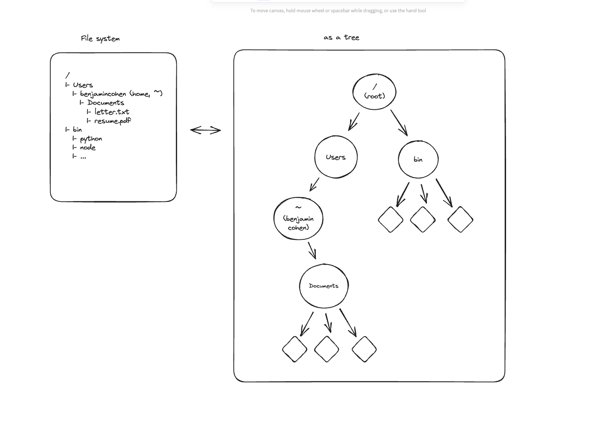
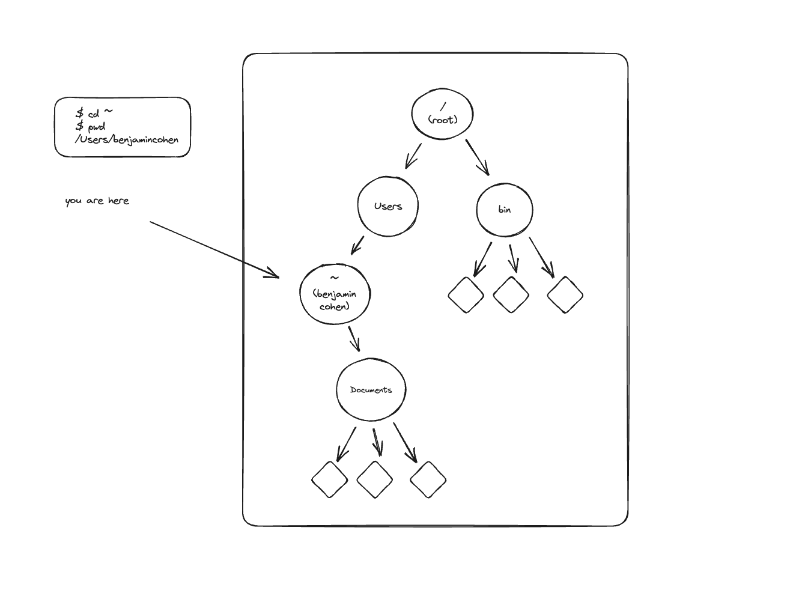
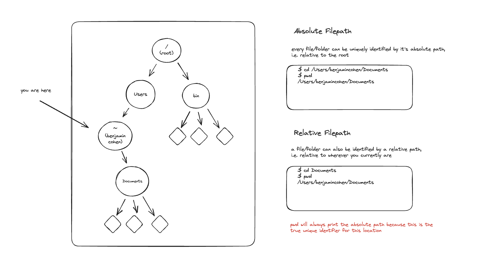

# Command Line Interface

## What is the Command Line Interface

The **Command Line Interface (CLI)** is a way of interacting with your computer by typing text commands instead of clicking buttons or icons.  
Think of it as a direct conversation with your computer: you tell it exactly what you want, and it gives you results right away.  

On Windows, MacOS, or Linux, the CLI is accessed through a program called a **terminal** or **shell**. Unlike the graphical interface (where you drag and drop files, or use menus), the CLI uses short text commands to perform tasks such as:

- Navigating folders and files  
- Creating, copying, or deleting files  
- Running programs  
- Managing system settings  

Why does this matter for developers?  
- The CLI is **fast and powerful** — many tasks can be done in seconds that might take much longer with a mouse.  
- It’s **universal** — whether you’re using Mac, Linux, or Windows (with WSL), the CLI gives you a common way to interact with your machine.  
- It’s **essential for programming** — tools like Git, Docker, Python, Node.js, and deployment scripts all rely heavily on command-line usage.  

At first, the CLI can feel intimidating because it doesn’t “look” user-friendly. But with practice, it becomes one of your most valuable tools as a software engineer.

## UNIX Commands

Many of the commands have difficult to remember acronyms. It's a product of history. At an earlier point in history computers had extremely limited memory and saving even a few characters was worth it. Also, you will be typing these commands _a lot_, so conciseness is appreciated over time, though as a beginner it can be daunting to remember what all these short commands each do.

### Folder Navigation (Essential)



In order to use the shell at all we need to know how to navigate it. Some essential navigation commands include:

- `pwd`

    - 'print working directory'. This will print (to the console) the full path (more on this later) of where you currently are. Most shells will include this info as part of a standard interface, but it isn't guaranteed, so it's useful to know about it as a standalone command.

- `ls`

    - 'list'. This lists everything in the current directory.

- `ls -a`

    - Same as `ls` but prints 'hidden' files too. By default any file with a '.' in front of it will be hidden by `ls`.
    - `-a` is our first example of a `flag`, i.e. a modifier to a command that changes its behavior. Flags generally start with a `-` and you can include more than one after a single `-`, so `ls -l -a` is equivalent to `ls -la`.
    - Try `ls -la`! This will print all files in the directory, including hidden ones, plus a bunch of extra info you won't understand yet.

- `cd <directory_name>`

    - 'change directory'. Like it sounds it changes directory, i.e. moves the user to a new folder. This command needs an _argument_ however! An argument is anything that comes after the command that doesn't start with a `-`. Unlike a flag, it doesn't modify the command, but rather is an _input_ to the command. Such as:
    - `cd /`. Move to `/`, the root of the entire file system.
    - `cd ~`. Move to `~`, the 'home' folder of the current user.
    - `cd ..`. Move one directory up in the hierarchy.
    - `cd .`. This won't do anything (seemingly), because `.` is shorthand for 'the current directory', which is not useful in the case of `cd` but it is useful in general to have a shorthand way of representing the current directory.



#### Absolute vs Relative

Absolute vs relative filepaths: When speaking of paths, we often speak of the absolute (or full) path to a file, and relative paths. An absolute path starts with a `/`, it is 'relative' to the root fo the entire filesystem, which is the same for all users of that system, so we call that 'absolute'. A relative path is one that starts with `~` or `.` or `..`. If a path starts with `~` it just means 'relative to the current user's home directory', which will be different for every user. If it starts with a `.` it means 'relative to the current directory', and if it starts with `..` that means 'relative to the current directory's parent'. In truth there is only the absolute path as far as the file system is concerned, but `~` and `.` and `..` act similarly to variables in a programming language - they hold a value that can change depending on the context they are evaluated within, but the result is always a full path.



### File Management (Essential)

- `mkdir <directory_name>`

    - Creates a new directory. By default this will be a child of the current directory. Needs an argument with the new directory's name. This new directory will be empty.
    - Ex: `mkdir my-new-folder`

- `touch <filename>`

    - Creaters a new file. By default this will be a child of the current directory. Needs an argument with the new file's name. This new file will be empty.
    - Ex: `touch my-new-file.txt`

> File extensions are meaningless! `.txt` is only a shorthand that allows an OS to guess what program might be appropriate to open a file with. File extensions don't truly mean anything at the shell level thought, so `my-new-file` and `my-new-file.xyz` are both valid file names, and will open/run correctly assuming you use the correct program to open/run them.

- `cp <source> <destination>`

    - Copies a _file_ from one directory to another.
    - Ex: `cp ./my-file.txt ../somewhere-else`
    - Note: you cannot copy a _folder_ (with things in it) by default, so you will want to use the `-r` flag. `-r` stands for recursively, so it will copy the folder, plus anything inside, to the new directory.
    - Ex: `cp -r ./my-folder ../somewhere-else`

- `mv <current_name> <new_name>`

    - 'moves' one file/folder to another, but this term is confusing, it really means 'rename'.
    - Ex: `mv file1.txt wacky-file-name.xyz`

- `rm <filename>`

    - 'Remove' a file.
    - `rm file1.txt` will remove `file1.txt` (assuming it exists).
    - `rm -r my-folder` will remove a folder with stuff in it (recursively).
    - `rm -rf my-folder` will remove a folder with something in it 'forcefully' i.e. without asking 'are you sure?' first.

> DO NOT TYPE THIS IN! `rm -rf /`. This will remove all files/folders, recursively and forcefully, starting at the root. In other words it will destroy your entire filesystem, no questions asked! This is included to demonstrate the power of these small commands, and the power you have as a user (and why such an idea as 'permissions' matters).

### Miscellaneous

- `sudo <command_name>`

    - 'super user do'. Understanding `sudo` deeply is an advanced topic that requires you to learn about 'user permissions', but a basic understanding of the command is necessary. The essence: some commands won't work if you don't have the right permissions, and `sudo` is a command that let's you temporarily elevate your permissions status to run such a command. Be careful anytime you need to use `sudo`, it's a sign you are likely doing something powerful and irreversable.

- `clear`

    - Clear the screen of content. `cmd+k` is a keyboard shortcut that does the same on MacOS.

- `ln -s <directory> <shortcut-name>`

    - This is how you make a 'symlink', the equivalent of a shortcut in UNIX
    - if I have a folder buried deeply in my filesystem but want to surface it more conveniently I can do that like so:

    ```sh
    ln -s ~/src/codeplatoon/uniform/curriculum ~/curriculum
    ```

    - this command would give me a 'shortcut' to the curriculum repo in my home directory without having to move it from where it really belongs

  > Note: if you move the location of the original folder, any symlink to it will no longer work. You can remove a symlink with `rm` like it was any other file, but it won't remove the original, just the shortcut

### Interrupts (Nice to Know)

This section is small but worth mentioning. An 'interrupt' is a way of communicating with the operating system to override it's current task (literally, to interrupt the running process).

- `<control-C>`

    - What do you do if you run a command and it's taking forever to finish? `<control-C>` sends an 'interrupt' signal to the shell telling it to quit the currently running operation.

- `<control-D>`
    - Similar to the above but more powerful. This sends an 'interrupt' signal to the OS to quit the currently running shell. Sometimes you will be running a shell within a shell and `<control-C>` won't be enough to cancel the current operation. This is a powerful (but dangerous) escape hatch. A general rule of thumb is: if the shell is 'stuck' in a frozen state and `<control-C>` isn't helping, try a `<control-D>`.

### File Navigation (Nice to Know but less relevant if you have access to VSCode)

You will use these less commonly as on a modern system you will have access to better ways to view and edit files (like VSCode)

- `head <filename>`

    - Display the first few lines of a file.

- `tail <filename>`

    - Display the last few lines of a file.

- `less <filename>`

    - Lets you see the contents of a file and navigate it like so:
    - `<spacebar>` moves down a page
    - `b` moves up a page
    - `q` quits

- `vim`

    - A text editor you will generally get by default. It's very powerful but awkward to use as a beginner. The basics for if you ever have to use it are:
    - press `i`. Enters 'insert' (write) mode
    - type some text content.
    - press `<esc>` to re-enter 'normal' mode
    - type `wq <filename>` to 'write, quit' and save the file with the filename provided
    - or type `q!` to quit without saving
    - Like I said, extremely awkward. Some love it but I avoid it like the plague.

### Operators (Non-essential)

- `*` aka wilcards

    - Often you will want to say 'match anything' and the wildcard symbol is how you do that.
    - Ex: I want to copy all files from one folder to another, so I type `cp my-folder/* ../temp`
    - Ex: Wildcards can be combined with regular characters, which is often useful for matching just files with a given extension, like: `cp my-folder/*.md ../temp`

- `>` and `>>`

    - `>` and `>>` are 'input redirection' operators.
    - These aren't exactly 'commands' but 'operators', and they are what make `echo` useful.
    - Ex: `echo "hello world" > hello.txt` will overwrite (or create) `hello.txt` with the echoed input
    - Ex: `echo "goodbye moon" >> hello.txt` will concatenate `hello.txt` with the echoed input

## Conclusion

The command line may seem like a step backward from the modern, polished interfaces we’re used to, but it’s actually the opposite: it gives you **precise control** over your computer.  
As a developer, you’ll rely on the CLI every single day — to move around your project files, install dependencies, run servers, manage databases, and more.  

Here are the key takeaways from this lecture:  
- The CLI is a **text-based interface** to control your computer.  
- You can use it to navigate folders, create and manage files, and run commands quickly.  
- Commands often look cryptic at first, but they follow consistent patterns (commands + flags + arguments).  
- With practice, the CLI will become second nature, saving you time and making you a more effective programmer.  

👉 Don’t worry if it feels uncomfortable at first. Just like learning a spoken language, fluency in the CLI comes from regular use and practice. Soon, you’ll find yourself preferring the terminal over the mouse for many development tasks!
