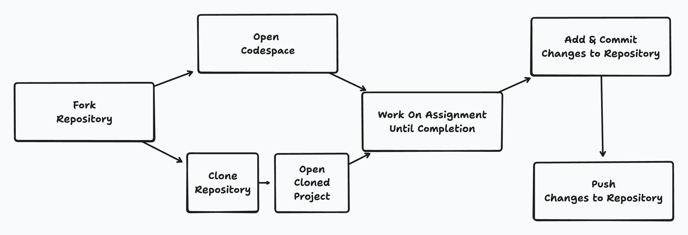

# Interacting with Assignments

## Introduction

As you work through this program, you’ll be completing coding assignments that help you practice new concepts. These assignments are designed to mirror how real-world developers collaborate on projects using GitHub. Don’t worry if you’ve never used Git or GitHub before—this lecture will walk you through everything you need to get started.

By the end of this lecture, you will know how to:

* Access assignments from GitHub.
* Work on them either locally or in GitHub Codespaces.
* Run tests to check your progress.
* Submit your work by pushing your changes to GitHub.

This process is the same workflow professional developers use every day.

---

## General Information

* All of our assignments live on **GitHub**, which means you’ll need to interact with them either through Git (on your computer) or directly through GitHub’s website.
* Every assignment comes with a **test suite** already set up for you (e.g., `pytest`, `unittest`, `jest`, or `cypress`). These tests allow you to check if your code is working as expected.
* While we will use a few Git commands in this lecture, don’t worry—we will cover them in much greater detail in future lectures. The goal here is to get you comfortable with the basics so you can start coding right away.

---

## Forking Assignments

You don’t work directly on the original assignment repository. Instead, you create your **own copy** of the assignment on GitHub. This process is called **forking**.

1. Go to the assignment repository link provided.
2. In the top-right corner of GitHub, click the **Fork** button.
3. This creates your personal copy of the repository under your GitHub account.

From now on, you’ll be working in **your fork**, not the original.

---

## Working on Assignments

You have two main ways to work on assignments:

1. **GitHub Codespaces** (in the browser).
2. **Local development** (on your computer by cloning the repo).

Both approaches are valid—you can choose whichever works best for you.

---

### Utilizing Codespaces

GitHub Codespaces lets you work on assignments **directly in the browser** without installing anything on your computer.

1. Go to your forked repository on GitHub.
2. Click the green **Code** button.
3. Select **Open with Codespaces** → **New codespace**.
4. GitHub will open a cloud-based editor with everything you need pre-installed.

Advantages of Codespaces:

* No setup required—it just works.
* Pre-configured dev environment (thanks to a dev container).
* Works on any computer with internet access.

---

### Using Git to Clone Assignment Repositories

If you’d rather work locally, you can **clone** your fork to your own computer:

1. On your forked repository page, click the green **Code** button.
2. Copy the HTTPS URL (it looks like `https://github.com/your-username/assignment-name.git`).
3. Open your terminal and run:

      ```
      git clone https://github.com/your-username/assignment-name.git
      ```

4. Move into the project folder:

      ```
      cd assignment-name
      ```

Now you have the assignment files on your computer, and you can open them with your preferred code editor.

---

## Submitting your Assignments

Assignments in this program are **not graded**. You get out of them what you put in. To grow as a developer, you should not only complete every assignment but also dig deeper—research concepts, try out variations, and make mistakes. That’s how real learning happens.

When you’re ready to save your work, you’ll need to **commit** your changes and **push** them to GitHub.

---

### Using Git to Add and Commit Changes to Assignments

Think of Git as a notebook where you save snapshots of your progress.

1. After editing your code, check which files have changed:

      ```
      git status
      ```

2. Add the files you want to save:

      ```
      git add .
      ```

      (the `.` adds all changes)

3. Commit your changes with a descriptive message:

      ```
      git commit -m "Complete assignment section 1"
      ```

---

### Using Git to Push Changes to Assignment Repositories

Committing saves your work locally. To submit your work, you need to **push** it to GitHub.

```bash
git push origin main
```

After pushing, your changes will appear in your forked repository on GitHub. That’s all you need to do for submission—no pull requests required.

---

## Conclusion

You now know the basic workflow for interacting with assignments:



1. **Fork** the assignment repo.
2. **Work** on it either in **Codespaces** or by **cloning locally**.
3. **Run tests** to check your progress.
4. **Commit and push** your changes to your fork.

This workflow will become second nature with practice, and you’ll revisit these Git/GitHub concepts in more depth throughout the program. For now, focus on following these steps so you can start coding and building your skills right away.
