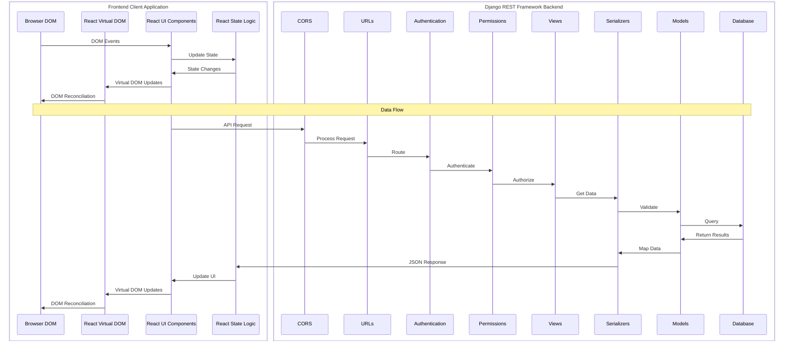

# Full Stack Flow Diagram

This is a [mermaid](https://mermaid.js.org/) sequence diagram showing how data flows from the client to the server, through the Django backend to the database, and back to the client (browser).

