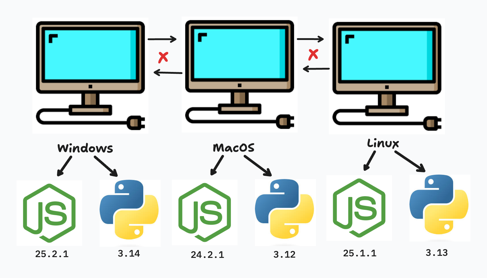
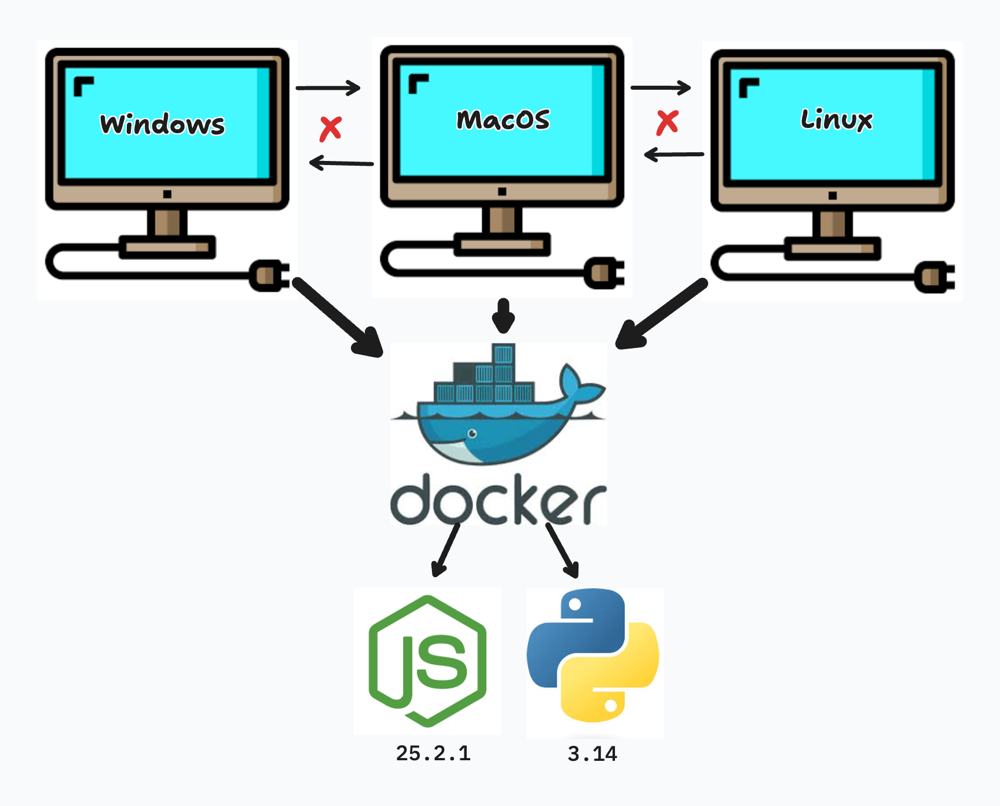
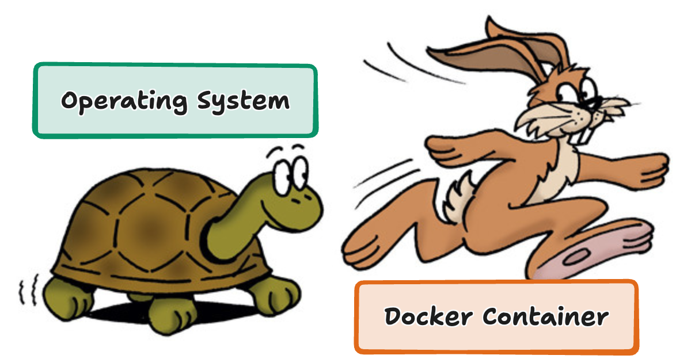
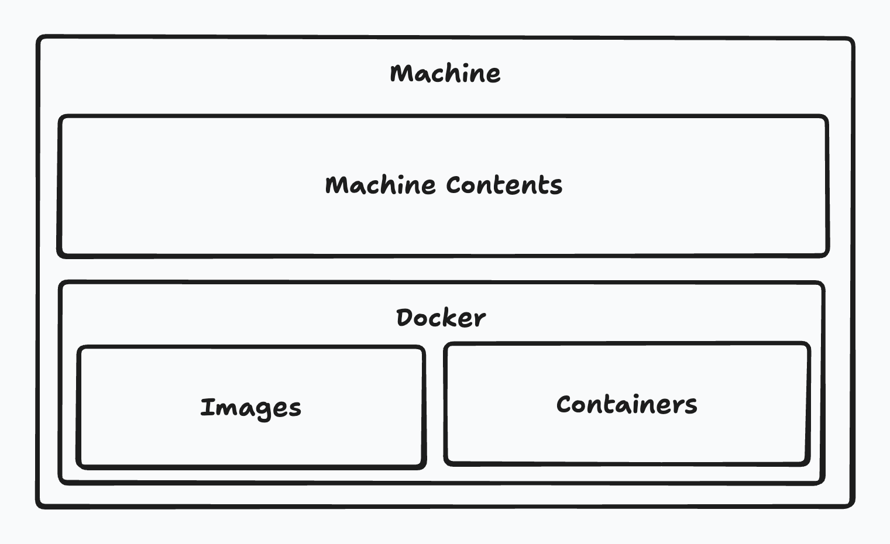
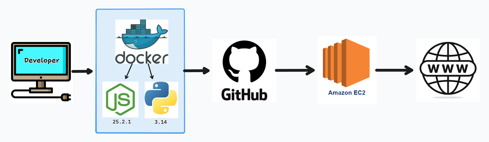

# Introduction to Docker

## Intro

In this lecture, we introduce Docker and the core ideas behind containerization. The goal is to build a strong **mental model** for what Docker is, why it exists, and how it fits into modern software engineering workflows.

By the end of this lecture, you should understand *what problem Docker solves*, *how it works at a high level*, and *why it has become a standard tool in professional tech stacks*.

---

## What Is Docker?

Docker is a platform that allows developers to **package applications and their dependencies** into standardized units called **containers**.

A Docker container includes:
- Application code
- Runtime
- System libraries
- Environment configuration

This ensures the application runs **consistently across different environments**, regardless of the underlying machine.

> **Key idea:**  
> *Docker makes “it works on my machine” irrelevant.*

---

## Why Was Docker Created?

Before Docker, developers commonly faced issues such as:
- Different OS versions across team members
- Inconsistent dependency versions
- Complex setup instructions
- Production behaving differently from local development



Naturally these issues caused a lot of time and money to be invested on debugging environment issues, fragile deployments, and difficulty onboarding new developers.

Docker was created as the answer to these issues by essentially giving developers the ability to *quickly and easily* generate the same exact development environment and dependencies for a project in a matter of seconds by interpreting them as code itself. Not only are these environments effective for setup but they are also portable enabling all developers to essentially copy and paste the environment within all machines working on the project and/or production environments.



---

## What Is a Docker Container?

The *lightweight easy to install and shareable environment* we keep referencing are called **Docker containers** and managed only by Docker itself. This means that they are created, deleted, edited, and hosted by Docker itself and only Docker controls their independent execution.

A Docker container typically includes:
- The application code
- Required runtime (e.g., Python, Node)
- Application dependencies and libraries
- Configuration and environment variables

---

## Containers vs “My Local Machine”



Unlike a virtual machine, a container is **not a full operating system**. Instead, it contains *only what is necessary* for the application to run.

This can become confusing so lets break this down a bit:

### My Local Machine

Your local machine holds the capabilities to install all development dependencies and generate a development environment on it's own but it is unique in the aspect of which `operating system` is within your machine. The issue again comes when sharing projects between engineers who hold two separate operating systems and possibly different versions of the tech-stack of a project. Your local machines operating systems comes with many different capabilities NOT isolated to the development of a project because it is meant to manage your ENTIRE machine.

### Docker Container

A Docker container lives within your local machine inside of the Docker background service. A a container holds a specific dictated environment with only the necessities to execute the technical task it was built for. That means it holds a dictated tech-stack with specific versions allowing it to be shareable with all developers who wish to work on the same task. Because it only holds what it needs, it is much faster and efficient than utilizing your machines os.

### Key Mental Model

> **A Docker container is a minimal, disposable environment created and run by Docker to execute a specific task using the host machine’s operating system.**

### Virtual Machines

You may have also heard of *Virtual Machines* like `wsl` for windows. We aren't going to go much into detail as to how they differ from containers but if you are interested here's a quick overview of key differences between them:

| Feature | Containers | Virtual Machines |
|------|-----------|------------------|
| OS | Share host OS kernel | Each VM has its own OS |
| Size | Lightweight (MBs) | Heavy (GBs) |
| Startup time | Seconds or less | Minutes |
| Resource usage | Low | High |
| Portability | Very high | Moderate |

**Mental model:**
- **Virtual Machines** virtualize *hardware*
- **Containers** virtualize *applications*

Docker containers are not “mini computers”—they are **isolated processes**.

---

## Installing Docker

Docker runs as a background service called the **Docker Engine**.



The exact installation process varies by operating system:

- **macOS / Windows:** Docker Desktop
- **Linux:** Docker Engine via package manager

But the process should be relatively simple just follow the instructions on for your appropriate OS:

- [MacOS](https://docs.docker.com/desktop/setup/install/mac-install/)
- [Windows](https://docs.docker.com/desktop/setup/install/windows-install/)
- [Linux](https://docs.docker.com/desktop/setup/install/linux/)

Once installed, your machine will have access to Docker commands within your terminal. Execute the following to confirm installation:

```bash
docker version
```

---

## Docker in Modern Tech Stacks



Docker has become an essential tool in modern software engineering because it standardizes development environments across teams and systems. By defining an application’s runtime and dependencies in code, Docker eliminates environment inconsistencies and significantly reduces setup time for new developers. This standardization improves deployment reliability by ensuring that the same environment used in development is carried through testing and production. Docker also integrates naturally with CI/CD pipelines, enabling automated builds, tests, and deployments, and it works seamlessly with cloud providers where containerized applications can be deployed at scale.

In practice, Docker is used across nearly every layer of a modern tech stack. Backend frameworks such as Django, Node.js, and Rails are frequently containerized to ensure consistent runtimes and dependencies. Frontend tooling can be run inside containers to avoid version conflicts, while databases are often containerized for local development and testing. Docker is also deeply integrated into CI/CD systems and is a foundational technology for cloud platforms such as AWS, GCP, and Azure. At scale, Docker containers are commonly managed by orchestration tools like Kubernetes.

In professional environments, Docker is rarely optional. It is considered required knowledge for software engineers, used on a daily basis during development and deployment, and present in nearly every production workflow. Understanding Docker is no longer a niche skill—it is a baseline expectation for working on modern software projects.

---

## How to Best Leverage Docker Containers

### Core Principles

**1. Keep containers small**
- Smaller images build faster
- Smaller images are more secure
- Fewer dependencies = fewer problems

**2. One responsibility per container (Single Responsibility Principle)**
- One app or service per container
- Avoid “everything in one container”

**3. Treat containers as disposable**
- Containers should be easy to destroy and recreate
- Do not rely on container state

**4. Configuration over customization**
- Use environment variables
- Avoid hard-coded values

> **Rule of thumb:**  
> If rebuilding your container is painful, your Docker setup needs improvement.

---

## Docker Hub

### What Is Docker Hub and Why Is It Important?

Docker Hub is Docker’s **centralized image registry**—a public (and private) repository where Docker images are stored, shared, and distributed.

Think of Docker Hub as:

* **GitHub for Docker images**
* A **marketplace of prebuilt environments**
* The **default source** Docker pulls from when you run a container

When you execute a command like:

```bash
docker run python
```

Docker does *not* magically know what “python” is. Instead, it:

1. Checks your local machine for the image
2. If not found, **pulls it from Docker Hub**

> **Key idea:**
> *Docker Hub is the reason Docker containers are reusable and shareable across teams and machines.*

Without Docker Hub, every developer would need to build every image from scratch.

---

### How to View Images You Can Reference for Your Own Images

Docker Hub hosts **thousands of prebuilt images** for common tools and technologies, including:

* Programming languages (Python, Node, Java)
* Databases (PostgreSQL, MySQL, Redis)
* Web servers (Nginx, Apache)
* Operating system bases (Ubuntu, Alpine)

You can browse these images at:

* [https://hub.docker.com](https://hub.docker.com)

Each image page typically includes:

* Available **tags** (versions)
* Documentation and usage examples
* The base OS used by the image
* Update frequency and maintenance status

These images are often used as **base images** in Dockerfiles:

```dockerfile
FROM python:3.12-slim
```

> **Mental model:**
> *You are not building environments from nothing—you are extending existing, well-defined images.*

This dramatically reduces setup time and error potential.

---

### Approved Images Are Recommended

Not all images on Docker Hub are equal.

Docker provides a category called **Official Images** (sometimes referred to as “approved” or “trusted”).

Official Images:

* Are maintained by Docker or the software maintainers
* Follow best practices
* Receive security updates
* Have clear documentation
* Are widely used in production environments

Examples:

* `python`
* `node`
* `postgres`
* `nginx`
* `redis`

> **Best practice:**
> *Always start with an official image unless you have a very specific reason not to.*

Using random community images can introduce:

* Security vulnerabilities
* Outdated dependencies
* Poor configuration choices

---

### Navigating Through Docker Hub

When viewing an image on Docker Hub, encourage students to look for the following sections:

#### 1. Tags

Tags represent **versions** of the image.

Example:

* `python:3.12`
* `python:3.12-slim`
* `python:3.12-alpine`

> **Important teaching moment:**
> `latest` does **not** mean “stable” or “best.”

Pin versions explicitly to avoid unexpected breaking changes.

---

#### 2. Description & Documentation

This section explains:

* What the image contains
* How it is intended to be used
* Common configuration patterns

Students should get used to reading this before using an image.

---

#### 3. Image Size

Smaller images:

* Download faster
* Build faster
* Have fewer attack surfaces

This reinforces the earlier principle:

> **Keep containers small**

---

#### 4. Pull Command

Every image page shows the exact command needed to pull it:

```bash
docker pull postgres:16
```

This is often the easiest way to verify that an image exists and works as expected.

---

### Key Mental Model to Reinforce

> **Docker Hub is not just a website—it is a shared ecosystem of standardized environments.**

By relying on Docker Hub:

* Teams avoid reinventing environments
* Applications become portable by default
* Development and production environments stay aligned

In real-world workflows, engineers spend far more time **choosing and configuring existing images** than creating new ones from scratch.

---

## Conclusion

Docker exists to solve a fundamental problem in software engineering: environment inconsistency. By introducing containerization, Docker allows developers to define, share, and reproduce application environments with confidence and speed. Rather than relying on individual machines and manual setup, Docker enables teams to work from a single, predictable source of truth.

At this stage, the most important takeaway is not memorizing commands, but understanding the mental model behind Docker containers. Containers are lightweight, disposable environments designed to run a specific task while borrowing the host machine’s operating system. This model is what makes Docker fast, portable, and reliable.

In the next lecture, we will move from theory to practice by writing Dockerfiles, building images, running containers, and interacting with them directly. Everything introduced conceptually in this lecture will be applied hands-on in the Docker workflow.
