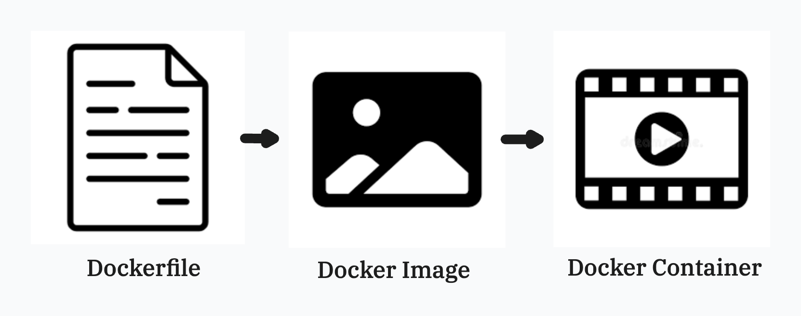
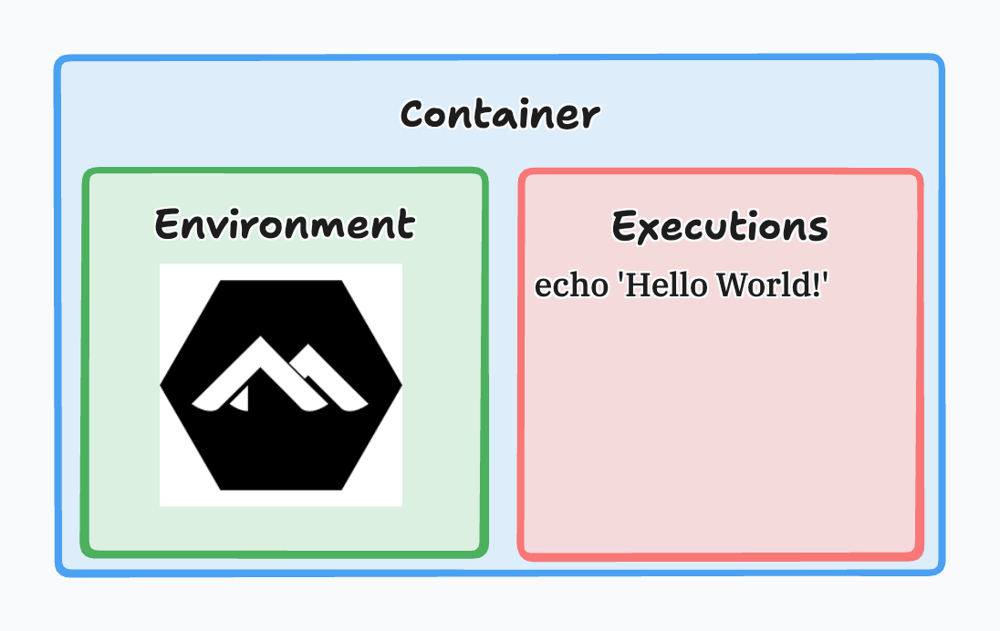
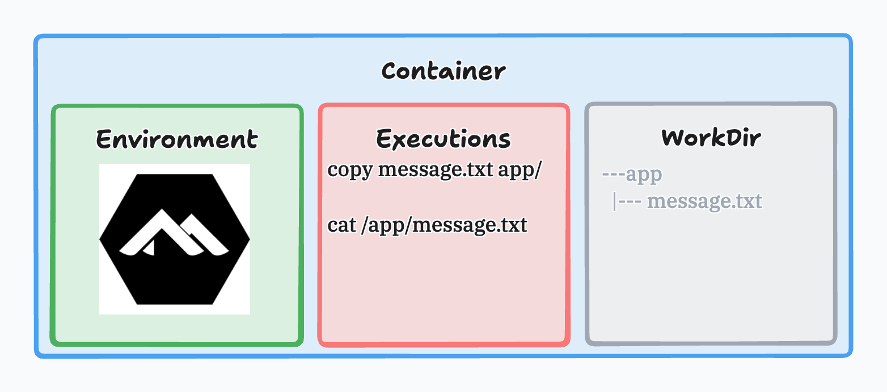

# Leveraging Docker

## Intro

In the previous lecture, we focused on *why* Docker exists and the mental model behind containers. In this lecture, we’ll shift from concepts to execution by learning the practical workflow that drives nearly every Docker-based project.

By the end of this lecture, you should be able to write a simple Dockerfile, build an image from it, run a container, inspect what’s happening inside that container, and connect your local machine’s files to a running container to support real development workflows. We’ll also wrap up by automating that workflow using a shell script so the process becomes repeatable and fast.

---

## The Docker Workflow: Dockerfile → Image → Container



A common mistake when learning Docker is to treat it like a single thing you “run.” In reality, Docker’s workflow is a pipeline with three distinct layers.

### Dockerfile

A **Dockerfile** is a plain text file that describes, through code, how to assemble an environment. It’s the “recipe” for what you want your runtime to look like. It contains instructions like what base environment to start from, what files to include, and what command should run when the container starts.

### Docker Image

A **Docker image** is the result of building that recipe. It’s a packaged snapshot that includes everything needed to run your application. You can think of an image as a blueprint or template. Images do not “do” anything by themselves—they are inert until you run them.

### Docker Container

A **Docker container** is what you get when you run an image. Containers are living runtime instances. They are the actual isolated processes Docker starts and manages. If images are blueprints, containers are the constructed buildings you can walk into and interact with.

> This separation matters because it explains why Docker feels reliable: we define the environment once (Dockerfile), build it into a reusable artifact (image), and run as many identical instances as we need (containers).

---

## Writing Your First Dockerfile: “Hello World!”

The fastest way to internalize Docker is to build a container that does one obvious, verifiable thing.

Create a folder for this lecture and add a file named `Dockerfile` (no extension):

```Dockerfile
FROM alpine:latest
CMD ["echo", "hello world!"]
```

This Dockerfile starts from `alpine`, which is a very small Linux distribution commonly used for lightweight containers. The `CMD` instruction defines the default command that will run when the container starts. In this case, we’re telling the container to print `hello world!` and then exit.

### Breaking it Down

Dockerfile, like anything else in programming, is NOT magic. Let's talk about the commands that we are using here and what it is we are describing. 

- `FROM`: This command tells the docker image about to be created that we would like to utilized an already published blueprint that you can find in [Docker Hub](https://hub.docker.com/). Docker will then grab the info from Docker Hub pull it down and then continue to execute the remaining steps within the file.

- `CMD`: This stands for *command* and it is a list of strings that will be executed upon running your container for the first time. (THERE CAN ONLY BE ONE)

### Building the Image

Now build the image:

```bash
docker build -t hello-docker .
```

The `-t` flag tags your image with a readable name (`hello-docker`). The dot (`.`) means “use the Dockerfile in the current directory, we will dive into how to execute files within different locations later on in the program once our projects begin to demand it, but for now this will be enough.

Well after you build this *image* you may ask yourself where is it stored. You can view all your existing docker images by running the following command on your terminal:

```bash
docker images
```

### Running the Container

Once the image is built, run it:

```bash
docker run hello-docker
```

This will actively generate a *container* that is managed by the Docker Engine. You should see:

```bash
hello world!
```

> This simple example demonstrates the entire workflow: the Dockerfile defined behavior, `docker build` created the image, and `docker run` created a container that executed the command.

### Container State

Now your *container* currently built within the Docker Engine holds one environment set up and one execution command within it and essentially looks as such:



---

## Copying a Text File Into an Image

Most real containers are not just a command, instead they contain files needed to do work. Let’s simulate that by creating a text file locally and copying it into the image during build.

Create a file named `message.txt` and place the following as it's content:

```txt
Hello from inside the container.
```

Then update your `Dockerfile` to hold it's own `app` directory and a copy of your current `message.txt` file:

```Dockerfile
FROM alpine:latest

WORKDIR /app
COPY message.txt /app/message.txt

CMD ["cat", "/app/message.txt"]
```

### Command Breakdown

Here we introduced three important ideas.

- `WORKDIR /app`: sets the working directory inside the container. This is where subsequent commands will operate unless otherwise specified. Know that within your container there is now a directory named `app`

- `COPY message.txt /app/message.txt`: takes a file from your local machine (within the same directory as your Dockerfile) and includes it inside the image.

    - alternatively you can say `COPY . /app/` which stands for copy ALL into app.

- It's important to annotate that instead of echoing text, we now run `cat` inside the container to print the contents of the file that was copied in.

### Build the Image and Run the Container

Rebuild the image under a different alias to generate a new image and not over-write the previous one:

```bash
docker build -t file-demo .
```

Run it:

```bash
docker run file-demo
```

> You should see the contents of your `message.txt` printed to the terminal. This is a key Docker moment: your file is now part of the image, meaning anyone who builds this image using the same Dockerfile gets the same file in the same location with the same environment and the same order of execution every time.

### Container State

Your *Container* now holds three key areas, **environment**, **working directory**, and **execution commands** and looks pretty much as such:



---

## Managing Images & Containers

As you work with Docker more frequently, it’s important to understand that Docker does **not automatically clean up after you**. Every time you build an image or run a container, Docker keeps track of those artifacts. Over time, this can lead to a large buildup of unused containers and outdated images taking up disk space and creating confusion.

A healthy Docker workflow includes regularly inspecting, removing, and intentionally managing containers and images. This section focuses on building that habit early.

---

## Managing Containers

When you run containers, Docker keeps a record of them whether they are currently running or not. However, by default, Docker only shows *active* containers.

To view **running containers only**, use:

```bash
docker ps
```

This command is useful when you want to see what is actively executing, but it can be misleading for beginners because stopped containers will not appear. Containers that have completed execution or were stopped manually still exist unless explicitly removed.

To view **all containers**, including stopped ones, run:

```bash
docker ps -a
```

This command is critical when debugging or cleaning up, as it reveals containers that are no longer running but still consuming system resources.

---

#### Removing Containers

Stopped containers do not automatically disappear. To remove a container, you must explicitly delete it using its name or ID:

```bash
docker rm container_name
```

If the container is still running, Docker will prevent removal. In that case, you must stop it first or force removal:

```bash
docker rm -f container_name
```

The `-f` flag stops and removes the container in one step. While useful, it should be used intentionally to avoid accidentally killing important processes.

---

#### Automatically Removing Containers on Exit

For short-lived or one-off containers (like scripts, tests, or simple demos), Docker provides a helpful flag that prevents container buildup entirely.

When starting a container, you can use the `--rm` flag:

```bash
docker run --rm image_name
```

With this flag, Docker automatically removes the container as soon as it finishes running. This is a best practice for containers that do not need to persist after execution and helps keep your system clean without manual intervention.

---

### Managing Images

Just like containers, Docker images accumulate over time. Every build can create a new image unless you intentionally overwrite an existing one.

When you build an image using the same tag as an existing image, Docker **overwrites the tag**, not the image history:

```bash
docker build -t my-image .
```

If `my-image` already exists, the tag will now point to the newly built image. Older image layers may still exist until Docker determines they are no longer referenced by any tags or containers.

To view all images on your system, run:

```bash
docker images
```

This command helps identify outdated or unused images that may be taking up disk space.

---

#### Deleting Images

To remove an image explicitly, use:

```bash
docker rmi image_name
```

If Docker refuses to delete the image, it’s usually because **one or more containers depend on it**. Docker protects you from deleting images that are still in use.

In this situation, the correct workflow is:

1. Stop the container(s) using the image
2. Remove the container(s)
3. Remove the image

For example:

```bash
docker rm -f container_name
docker rmi image_name
```

This reinforces an important Docker relationship: **containers depend on images**, and images cannot be removed while dependent containers exist.

---

## Automating the Workflow with a Shell Script

Once you understand the workflow, you’ll notice you keep repeating the same commands: build the image, remove the old container, and run the new container with mounts.

Automation is how we make this workflow reliable and fast.

Create a file named `run.sh`:

```bash
#!/usr/bin/env bash
set -e
# variables you may update to target the correct file
IMAGE_NAME="lecture2-demo"
CONTAINER_NAME="lecture2-container"
# this will rebuild the image within the docker engine
echo "Building image: $IMAGE_NAME"
docker build -t "$IMAGE_NAME" .
# this will run the container and automatically remove it upon completion
echo "Running container with bind mount..."
docker run --rm --name "$CONTAINER_NAME" "$IMAGE_NAME"
```

> **Note for Windows Users**
>
> This script requires a Bash-compatible shell. If you are on Windows, run it using WSL or Git Bash. PowerShell and Command Prompt are not supported for this script.

Now, we must give this shell script the proper permissions to make this executable with the following command:

```bash
chmod +x run.sh
```

Then run it:

```bash
./run.sh
```

This script reinforces a professional habit: Docker workflows are often repeated enough that teams codify them into scripts, Make files, or Compose files. Even though Compose is not required for this lecture, the mindset is the same: you reduce human error by turning common steps into a repeatable command.

---

## Conclusion

Leveraging Docker effectively means understanding and using its workflow intentionally. A Dockerfile defines an environment as code, building produces a reusable image, and running creates containers as isolated runtime instances. In this lecture, you learned how to create your first Dockerfile, copy files into images, and handle one of the most important practical realities of Docker: containers are disposable, but development requires iteration. With this foundation, you’re prepared to move into more realistic multi-container development setups and project workflows, where Docker becomes a daily tool for running applications consistently across development, testing, and deployment.

