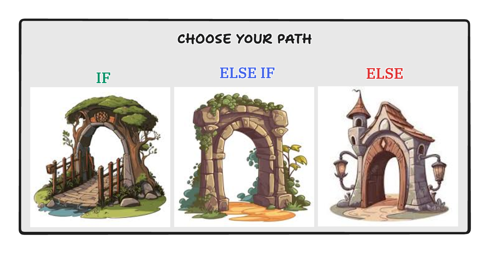
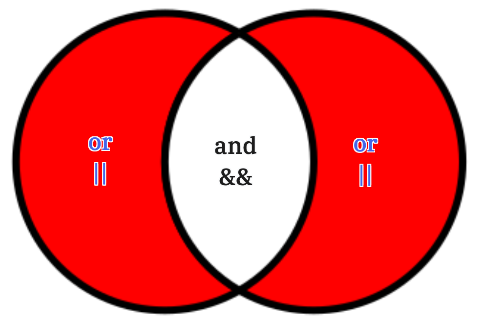
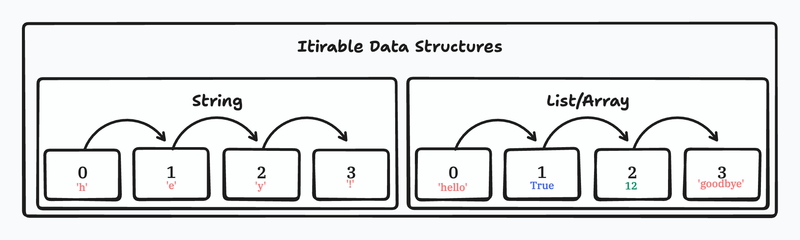
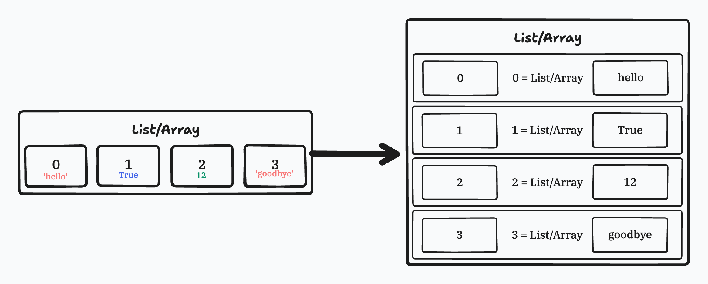
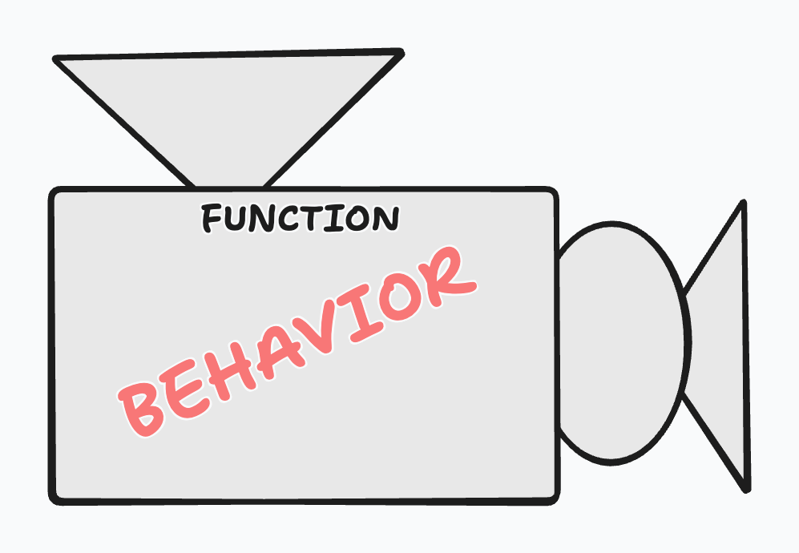
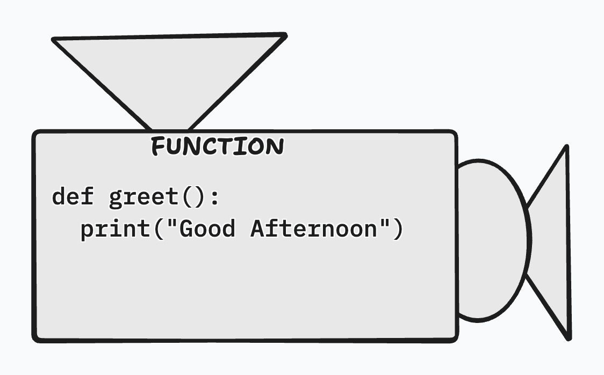
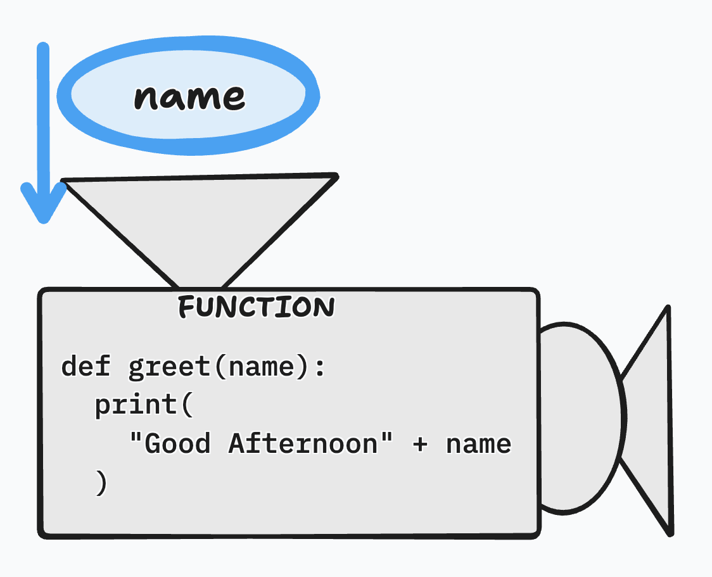
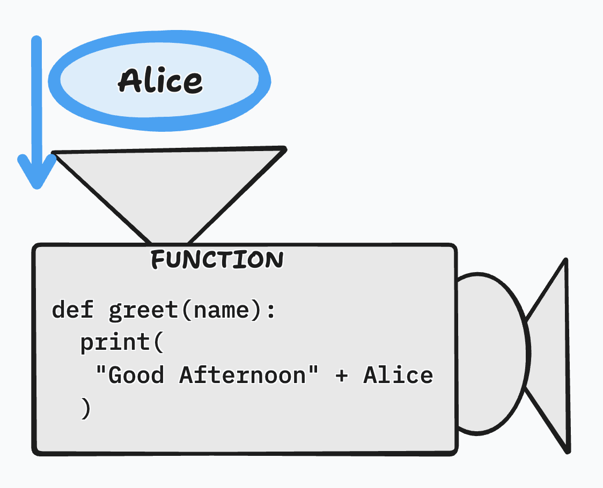
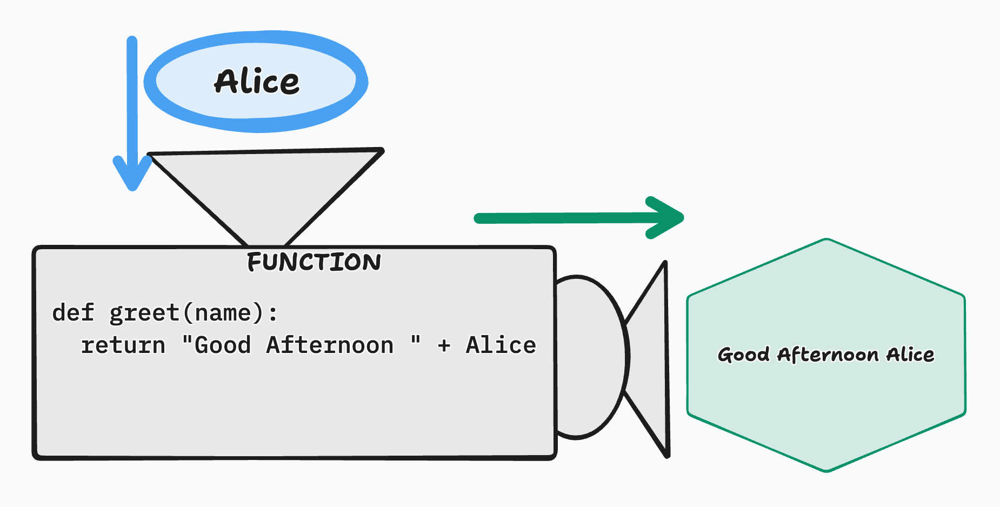

# Functional Programming

## Intro

As programs grow beyond simple scripts, we need structured ways to **control flow**, **transform data**, and **reuse logic**. Functional programming concepts give us those tools. While JavaScript and Python are not purely functional languages, they both heavily support **functional patterns** that are used daily in professional codebases.

In this lecture, we focus on **decision-making**, **iteration**, and **functions**—the building blocks that allow programs to react to data, repeat behavior, and encapsulate logic. These concepts are foundational and will appear everywhere: backend APIs, frontend applications, data processing pipelines, automation scripts, and technical interviews.

Rather than memorizing syntax, the goal is to understand **when and why** each construct is used.

---

## Comparison Operators

Comparison operators allow programs to **compare values** and produce a boolean result (`true/false`). These operators are most commonly used inside **conditional statements** and **loops**.

Common comparison operators in **both JavaScript and Python** include:

- Equality (`==` or `===` in JS)
- Inequality (`!=`)
- Greater than / Less than (`>`, `<`)
- Greater than or equal to / Less than or equal to (`>=`, `<=`)

**JavaScript Example:**

```js
let age = 18;
console.log(age >= 18);
```

**Python Example:**

```py
age = 18
print(age >= 18)
```

> **Scenario:**
> Comparison operators are used when validating user input, checking permissions, filtering data, or determining execution paths, essentially anytime you formulate a thought of "if this data..." you are likely going to need one of these operators.

---

## Conditional Statements



Conditional statements allow a program to **branch execution** based on conditions. They answer the question: *“If this is true, what should happen?”* Think of yourself in the middle of a workout in a busy gym. You want to do a leg exercise so you formulate a thought in your head along the lines of "If the leg extension machine is open I'll hit quads, if it's busy I'll see if the leg curl machine is open to hit hamstrings, and if neither of those are open I'll just squat since there's always a squat rack open." You do these conditionals in your everyday life, now we apply them to programming itself.

**JavaScript Example:**

```js
let score = 85;

if (score >= 90) {
  console.log("Pass with Honors");
} else if (score >= 70) {
  console.log("Pass");
} else {
  console.log("Fail");
}
```

**Python Example:**

```py
score = 85

if score >= 90:
    print("Pass with Honors")
elif score >= 70:
    print("Pass")
else:
    print("Fail")
```

> **Scenario:**
> Conditionals are everywhere—authentication checks, feature flags, error handling, game logic, and API responses.

### Multiple Conditions



Eventually you'll run into a situation where you'll want to check if multiple conditions can be met. In these scenarios we want to avoid writing nested conditionals so instead the languages give us a very useful way to check uf `both (and)` or `either (or)` conditions could be achieved.

**JavaScript Example demonstrating `AND` meaning `BOTH` conditions must be true**

```js
let age = 21
let hasId = True

if (age >=21 && hasId){
    console.log("This adult can drink");
} else if (age >= 18){
    console.log("This is an adult but can't drink");
} else {
    console.log("This person is a minor");
}
```

**Python Example demonstrating `OR` meaning `1 OF 2` conditions must be true**

```python
hungry = False
bored = True

if hungry or bored:
    print("cook a meal")
else:
    print("You don't need to eat")
```

---

## Iterations



There will be times in your programs where you'll want to conduct a specific behavior for each object within a data type. This behavior can be accomplished through iteration. Iteration allows a program to **repeat an action** over a sequence of data. This is critical for working with collections such as lists, arrays, strings, and objects.

---

### Iterating a List / Array or String

#### Iteration by Value

This is the most common and readable approach when you only care about the values. This means you only care about each individual content within the iterable data structure. You'll notice it's simple and straight forward and very commonly used within programming algorithms.

**JavaScript Example:**

```js
let colors = ["red", "green", "blue"];

for (let color of colors) {
  console.log(color);
}
```

**Python Example:**

```py
colors = ["red", "green", "blue"]

for color in colors:
    print(color)
```

*notice that in JavaScript it's a `for of` loop while in Python it is a `for in` loop*

> **Scenario:**
> Use this when transforming or inspecting each item in a collection.

---

#### Iteration by Index

Sometimes you need the **position** of an element, not just the value, meaning that instead of worrying about the content of the data structure you care about the numerical order (starting from 0) that the data structure holds.

**JavaScript Example**

```js
let colors = ["red", "green", "blue"]

for (let i=0; i < colors.length; i++){
    console.log(i, colors[i]);
}
```

lets break down this loop so we can truly understand what's happening:

- `let i = 0`: This is starting a variable named
- `i < colors.length`: Is the stopping condition, meaning this iteration will continue unless this condition evaluates to false
- `i++`: Is what will happen at the end of each iteration which in this case it's incrementing the value of *i* by 1.


**Python Example:**

```py
colors = ["red", "green", "blue"]

for idx in range(len(colors)):
    print(idx, colors[idx])
```

lets break down this loop so we can truly understand what's happening:

- `range()`: returns a sequence-like range object that produces numbers from 0 up to (but not including) the given value. Meaning `range(5)` would return `[0,1,2,3,4]` so in this case we will pass the *length* of the list as the parameter for range.

> **Scenario:**
> Index-based iteration is useful when modifying elements by position or synchronizing multiple lists.

---

### Iterating by Both Index and Value

For some algorithms you'll know right from the start that you'll want access to both the index and value of an iterable data structure and you could save yourself some typing by establishing an iteration method that will give you exactly that.

**JavaScript Example**

```js
let colors = ["red", "green", "blue"]

for (const [idx, color] of colors.entries()){
    console.log(idx, color);
}
```

**Python Example**

```py
colors = ["red", "green", "blue"]

for idx, color in enumerate(colors):
    print(idx, color)
```

Lets break down this block of code, both the `enumerate` and `entries` methods return a list/array of list/array's where each nested list/array holds both the index and value of the original data structure using the method. This way when we iterate through the parent list we simply just destructure each child list onto it's own variables.



> **Scenario:**
> This is preferred over manual index tracking for readability and safety.

---

### Iterating Through a Dictionary / Object

#### Iterating by Keys

**JavaScript Example:**

```js
let user = { name: "Alex", age: 30 };

for (let key in user) {
  console.log(key);
}
```

**Python Example:**

```py
user = {"name": "Alex", "age": 30}

for key in user:
    print(key)
```

---

#### Iterating by Keys and Values

**JavaScript Example:**

```js
for (let [key, value] of Object.entries(user)) {
  console.log(key, value);
}
```

**Python Example:**

```py
for key, value in user.items():
    print(key, value)
```

> **Scenario:**
> This pattern is common when processing structured data such as API responses or configuration files.

---

### While Loop (Use With Care)

A `while` loop continues execution **until a condition becomes false**.

**JavaScript Example:**

```js
let count = 0;

while (count < 3) {
  console.log(count);
  count++;
}
```

**Python Example:**

```py
count = 0

while count < 3:
    print(count)
    count += 1
```

> **Important:**
> `while` loops are powerful but risky. If the condition never becomes false, you create an **infinite loop**. They are best used when the number of iterations is not known ahead of time.

---

## Functions



In programming you are going to be writing code to accomplish a task, whether that's to read something, create something, or even mutate something there will usually be a purpose to you sitting behind your machine and writing code. Now sometimes our task may become a repetitive process and in programming we really like to follow the *Don't Repeat Yourself (DRY) Principle* so instead of writing the same lines of code that generate a behavior over and over again, we place them within *functions*.

Functions allow you to **encapsulate reusable logic**. They are one of the most important tools in programming. We will go over how functions work in both JavaScript and Python.

---

### Declaring a Function

The function *declaration* is where you write the function within your script for the first time. This is where all the behavior that you want to be repeated is also generated and when you take into consideration what kind of outcome you would like to produce.

**JavaScript Example: Keyword `function`**

```js
function greet() {
  console.log("Good Afternoon");
}
```

**Python Example: Keyword `def`**

```py
def greet():
    print("Good Afternoon")
```

> In Python rather than declaring a function you are *defining* a function hence the keyword `def`

Let's take a look at what our function looks like now from a visual perspective:



Notice at this stage our function is not taking in inputs nor providing any outputs it is simply conducting a behavior when called.

#### Parameters

We could evolve our function and have it take in inputs in order to work properly, and these inputs are referenced to as parameters in programming:

**JavaScript Example:**

```js
function greet(name) {
  console.log("Good Afternoon " + name);
}
```

**JavaScript Example:**

```py
def greet(name):
    print("Good Afternoon " + name)
```

Now our function is taking in parameters and needs them in order to execute appropriately:



> **Parameters** are placeholders.
> **Arguments** are the actual values passed in.

---

### Calling a Function

Calling a function is the step where a function is actually executed meaning the function behavior/body is now going into action and processed in descending order:

```js
greet("Alice")
```

Now our function is receiving the *argument* of `Alice` as the value for the parameter of *name* and our function call now looks as such:



> Really important note here is that we are seeing a value showing up on our terminal but that doesn't mean the function is actually returning a value. In order for a function to return a value we must explicitly tell it to do so.

---

### The Return Statement

The `return` statement sends a value **back to the caller** and **ends** the function execution. 

**JavaScript Example:**

```js
function greet(name) {
  return "Good Afternoon " + name;
}
```

**Python Example:**

```py
def greet(name):
    return "Good Afternoon " + name
```

> **Scenario:**
> Use `return` when your function must return a value from it's behaviors

Now our function takes in *arguments* and provides an *output* leaving our function to look as such:



---

### Short-Hand Functions

Functions that hold very simplistic behavior can be written in a shorthand format. For example:

#### Arrow Functions (JavaScript Only)

Arrow functions provide a **shorter syntax** and are commonly used in functional patterns.

```js
const multiply = (a, b) => a * b;
```

> **Scenario:**
> Arrow functions are heavily used in callbacks, array methods, and modern frontend code.

---

#### Lambda Functions (Python Only)

Lambda functions are **anonymous, one-line functions**.

```py
multiply = lambda a, b: a * b
```

> **Scenario:**
> Lambdas & Arrow functions are commonly used with `map`, `filter`, and sorting operations.

---

## Leveraging Built-In Functional Tools

Functional programming shines when working with iterable objects like lists/arrays/string.

---

### Filter / `filter()`

Filters elements based on a condition and is *CONSTRUCTIVE* meaning it generates a new iterable object and does not mutate the original data structure.

**JavaScript Example:**

```js
let nums = [1, 2, 3, 4];
let evens = nums.filter(n => n % 2 === 0);
```

**Python Example:**

```py
nums = [1, 2, 3, 4]
evens = list(filter(lambda n: n % 2 == 0, nums))
```

---

### Sorted / `sort()`

Sorts data in either numerical order from smallest to largest or alphabetical order starting with lowercase 'a' and ending with upper case 'Z'.

**JavaScript Example: Destructive**

```js
let nums = [3, 1, 4, 2];
nums.sort((a, b) => a - b);
```

> This method DOES mutate the original data structure so please ensure to keep that in mind.

**Python Example: Constructive**

```py
nums = [3, 1, 4, 2]
sorted_nums = sorted(nums)
```

> This method generates a new list

---

### Map / List Comprehension

Sometimes you'll want to create a list from a list with the outcome of mutating it's original values. You could write an entire *for* loop and manually mutate a pre-established output list, but more efficiently, you could utilize list comprehension or the map method to conduct this action.

**JavaScript Example:**

```js
let nums = [1,2,3,4]
let doubled = nums.map(n => n * 2);
```

**Python List Comprehension Example:**

```py
nums = [1,2,3,4]
doubled = [n * 2 for n in nums]
```

> **Scenario:**
> These patterns are heavily used in data processing, frontend state updates, and API response transformations.

---

## Conclusion

Functional programming concepts provide a powerful mental framework for writing clean, expressive, and maintainable code. Comparison operators and conditionals let programs make decisions, iteration allows them to process collections, and functions encapsulate logic into reusable units.

By learning these ideas in both JavaScript and Python, you build language-agnostic problem-solving skills that transfer across the entire software stack. These patterns will reappear constantly as you move into backend development, frontend frameworks, data processing, and technical interviews.
