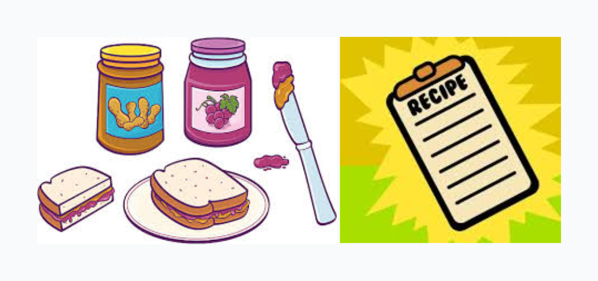
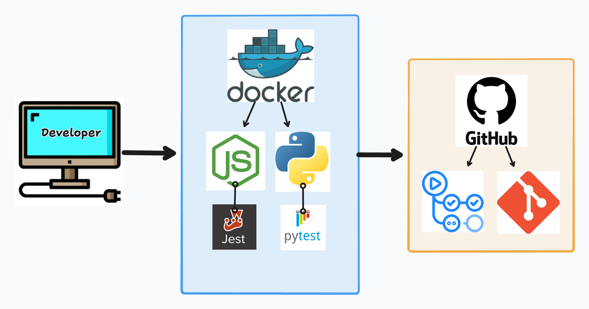
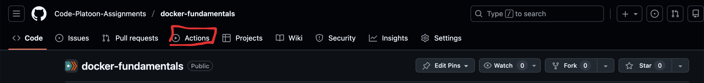
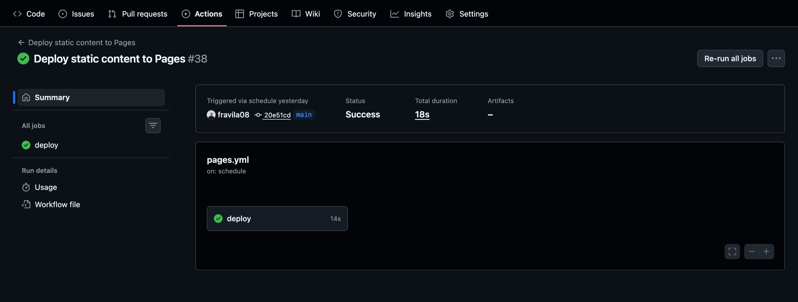

# Intro to Workflows

## Intro

As software projects grow, manually running commands like `npm test` or `pytest` before every code change quickly becomes error-prone and inconsistent. Developers forget steps, environments differ, and bugs slip through. Modern engineering teams solve this problem with **automation**.

**GitHub Actions** allows us to automate common development tasks—like running test suites—every time code changes. These automated processes are called **workflows**. Workflows form the foundation of **Continuous Integration (CI)**, a practice where code is automatically tested and validated as it is written.

In this lesson, we will introduce GitHub Actions workflows at a conceptual and practical level. Our goal is to understand **what workflows are**, **why they matter**, and **how to build and observe a simple one**. In the next lecture, we’ll build on this foundation to run Dockerized test suites inside workflows.

---

## What are GH Actions Workflows?



A **GitHub Actions workflow** is an *automated* process that runs in response to an **event** in a GitHub repository. Think about this as if you were programming a robot to accomplish a task every time an event happens rather than having *YOURSELF* be that robot and taking some of that busy work off your back in a clean, effective, and improving way.

At a high level, a workflow consists of 3 key concepts:

- **An event** that triggers it (e.g. pushing code, opening a pull request)
- **One or more jobs**, in other words, one or more tasks you want this imaginary robot to be able to accomplish for you.
- **Steps** inside each job that execute commands or actions.

A good example of this would be the <a href="https://youtu.be/cDA3_5982h8?si=YmKsp_W8l3H8Iy5s" target="_blank" rel="noopener noreferrer">EXACT INSTRUCTIONS CHALLENGE</a> where we will write exactly how to successfully build our environments, accomplish tasks, or deploy our applications. (i.e. the peanut butter and jelly sandwich )

Workflows are defined using **YAML** files and live inside your repository at:

```sh

.github/workflows/

```

Each workflow file describes:

- *When* it should run
- *What environment* it should run in
- *What commands or actions* should be executed

> **Mental model:**  
> **Event → Workflow → Job → Steps → Output**

---

## Why are Workflows important in today’s tech industry?

Workflows are critical because they enforce **consistency, reliability, and accountability** in software development.

Key benefits include:

- **Automated testing:** Tests run every time code changes, not just when someone remembers
- **Early bug detection:** Issues are caught before code reaches production
- **Team confidence:** Developers can refactor and collaborate without fear
- **Standardized environments:** Code is tested the same way for everyone
- **Faster feedback loops:** Failures are reported immediately

In professional environments, **code is rarely merged without automated checks passing**. Workflows are no longer optional—they are an industry expectation.

---

## Practical Application of Workflows in Today’s Industry



In real-world engineering teams, workflows are commonly used to:

- Run test suites on every **push** and **pull request**
- Block merges when tests fail
- Enforce formatting and linting rules
- Build and validate Docker images
- Deploy applications after successful tests

For example:

- A developer opens a pull request
- GitHub automatically runs tests to ensure new code won't break the current state of the project on Github
- The team reviews both the code *and* the test results
- Only passing code is merged

This process dramatically reduces regressions and production failures.

---

## Where to find public approved workflows?

Just like docker images, you don’t have to build every workflow from scratch. GitHub provides a large ecosystem of **community-maintained and officially supported actions** almost in the same way that Docker Hub provides images for developers to pull down.

Key places to explore:

- **[GitHub Actions Marketplace](https://github.com/marketplace?type=actions)**
  - Contains reusable actions and starter workflows
- **Official GitHub Actions**
  - Examples include:
    - `actions/checkout`
    - `actions/setup-node`
    - `actions/setup-python`

Using approved and well-maintained actions:
- Saves time
- Reduces configuration errors
- Follows industry best practices

> **Professional tip:**  
> Reuse trusted actions whenever possible instead of reinventing solutions.

---

## Building a “Hello World!” Workflow

Now let's put some of the information we've learned up to this point and actually generate our very first github workflow for our project.

1. Inside your repository, create the following directory structure:

```sh

.github/
└── workflows/
└── hello-world.yml

```

2. Add the following contents to `hello-world.yml`:

```yml
name: Hello World Workflow

on:
  push:

jobs:
  say-hello:
    runs-on: ubuntu-latest
    steps:
      - name: Print a message
        run: echo "Hello from GitHub Actions!"
```

This is a completely new form of commands than we've seen before. Although we've utilized *yml* files to write Dockerfiles in the past, the syntax is completely different now so lets break it down so we understand what's happening:

* `name: Hello World Workflow` → This is a completely exchangeable value. Typically you want to name your workflow after the task it is meant to accomplish.
* `on: push` → The workflow runs every time code is pushed and because we didn't define a branch it will be triggered by any branch as well.
* `jobs` → Defines a job named `say-hello` which again should be named after the sub-task the job is meant to accomplish.
* `runs-on` → Specifies the environment in which this code should be executed.
* `steps` → These are 1 or more labeled steps that are typically followed by `run` commands and it's executable code that will run within the environment.

This workflow doesn’t test anything yet—it simply proves that **automation is working**.

---

## The *Actions* Tab

Once a workflow exists, GitHub automatically runs it when triggered. Meaning Github will actually open a small *virtual machine* similar to a docker container that will simply follow the recipe that you've provided for it.

To view our workflows results simply open your github repository on the browser, **after pushing your code**, and look for a tap named `Actions` on the navigation tabs at the top of the repo. Once you find it, click it and open it.



Once you click on it you'll see a dashboard for all of your existing workflows that github is currently aware of. Click on the one we just created and it will route you to a different portal that where you can inspect the following: Job status (success or failure), Step-by-step output and Error messages if something fails



This is where developers can debug failing pipelines, confirm test success, and most importantly validate automation behavior

> **Important:**
> The Actions tab is the feedback loop that makes CI valuable.

---

## Executing Actions in Different Branches

Workflows are not limited to a single branch.

By default:

* A workflow triggered by `push` runs on **any branch**

This enables:

* Testing feature branches independently
* Validating pull requests before merging
* Preventing broken code from reaching `main`

Later, you can refine workflows to:

* Run only on specific branches
* Run differently for `main` vs feature branches
* Trigger on pull requests instead of pushes

For now, it’s enough to understand that **workflows follow your Git strategy**.

---

## Conclusion

GitHub Actions workflows allow us to move from **manual execution** to **automated validation**. They form the backbone of modern CI pipelines and ensure that code is tested consistently and reliably.

In this lesson, you learned:

* What GitHub Actions workflows are
* Why they are critical in professional development
* Where workflows live and how they are triggered
* How to build and run a simple workflow
* How to inspect results in the Actions tab

In the next lecture, we’ll take this foundation further by executing **Dockerized test suites inside workflows**, bringing together Docker, TDD, and CI into a single automated pipeline.
