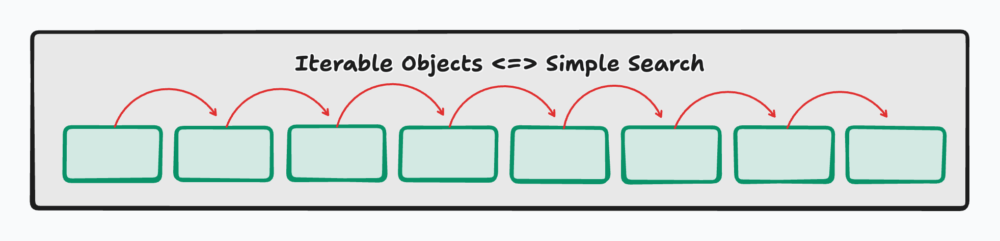
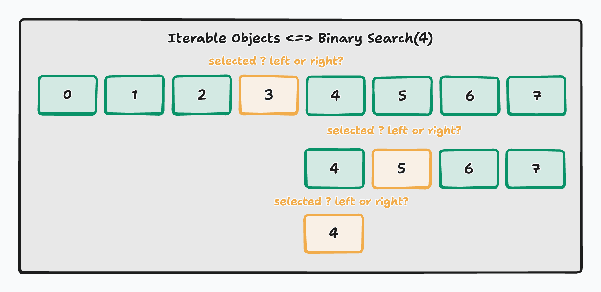

# Linear vs Binary Search

## Intro

As programs grow and data sets become larger, **how we search for data** becomes just as important as *what* data we store. Searching is one of the most fundamental problems in **Data Structures & Algorithms**, and the approach you choose can dramatically affect performance.

In this lecture, we’ll compare **Linear Search** and **Binary Search**, understand how they work, when to use each, and why algorithmic efficiency matters in real-world applications and technical interviews.

---

## What is Linear Search?



**Linear Search** (also called *sequential search*) is the simplest searching algorithm:

- Meaning that it start at the **first element** and begins to iterate through the object one object at a time. 
- At each iteration it checks the element **one by one**
- Stop when the target is found or the list ends

Very easy to apply and will accomplish the task of looking for an object there's really nothing wrong with this approach as far as outcome but there is as far as efficiency. If the iterable object was ridiculously massive and you were looking for a value that happens to be at the very end of the list your algorithm would take quite a bit of time in finding it.

```python
def linear_search(iter_obj, target):
    for item in iter_obj:
        if item == target:
            return True
    return False
```

Something really important to note is that this searching algorithm would function properly with or without sorted data since it would check each an every element in a sequential order.

---

### Linear Search is Inefficient

While easy to write, linear search becomes inefficient as data grows since in the worst-case scenario where the element you are looking for is **last** or **not present** your algorithm would have to take the same number of iterations as the length of the iterable object in order to  come up with an outcome.

In time complexity this is known as **O(n)** meaning the number of operations is equal to the length of list. We will discuss Big-O more in depth later on but keep this in consideration when thinking about algorithms.

| Data Size       | Checks Needed (Worst Case) |
| --------------- | -------------------------- |
| 10 items        | 10 checks                  |
| 1,000 items     | 1,000 checks               |
| 1,000,000 items | 1,000,000 checks           |

---

## Binary Search: The Solution



**Binary Search** dramatically improves efficiency—but holds a huge prerequisite where the iterable object *MUST* be sorted in order to work efficiently.


This algorithm accomplishes this goal by applying a divide and conquer application. Imagine searching for a name in a phone book, you open the book to about the middle of the page. You realize that the initial you are looking for is to the left of the phone book, so you take the whole left side and open it at the middle again. Meaning the workflow is:

```sh
find the middle
is the middle the value I'm looking for
if not is the middle higher of less than the value I'm looking for
if higher than value go left
if lower than the value go right
```

by conducting this behavior we are essentially cutting the number of operations by half each time we iterate through the object.

---

### Applying Binary Search in Python

```python
def binary_search(arr, target):
    left, right = 0, len(arr) - 1

    while left <= right:
        mid = (left + right) // 2 # find the middle

        if arr[mid] == target: # is this my tgt?
            return True
        elif target < arr[mid]: # if mid is higher than my tgt I need to look left
            right = mid - 1 # look through the left side of the ds
        else:
            left = mid + 1 # otherwise look through the right side of the ds
    return False # if not present within the ds 
```

This means that in the worst-case, the search space is cut **in half** every step, and will find an outcome far more efficiently than linear search. This is know as **O(log n)** in Big-O complexity.

---

## Linear vs Binary Search

| Scenario              | Use Linear Search  | Use Binary Search       |
| --------------------- | ------------------ | ----------------------- |
| Data is unsorted      | ✅ Yes              | ❌ No                    |
| Data is sorted        | ⚠️ Works, but slow | ✅ Best choice           |
| Small data sets       | ✅ Acceptable       | ✅ Acceptable            |
| Large data sets       | ❌ Inefficient      | ✅ Efficient             |
| One-time search       | ✅ Simple           | ⚠️ Requires sorted data |
| Frequent searches     | ❌ Costly           | ✅ Ideal                 |
| Interview performance | ❌ Weak choice      | ✅ Strong choice         |

---

## Conclusion

Linear and binary search solve the **same problem**, but with vastly different performance characteristics.**Linear Search** is simple, flexible, but poor at scalability. While **Binary Search** is fast, efficient, but requires sorted data in order to work efficiently.

Understanding when to use each is a foundational skill in writing performant code, designing scalable systems, and succeeding in technical interviews.

## [Assignments](./assignments.md)