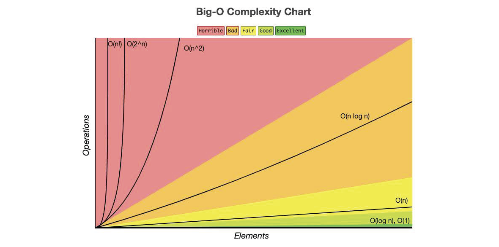

# Understanding Big-O

## Intro

As developers, we often ask questions like:

- *Is this solution fast enough?*
- *How will this behave when the data gets really large?*
- *Why does one algorithm feel instant while another feels painfully slow?*
- *How much extra memory does this solution need?*

**Big-O notation** gives us a language to answer those questions.

In this lecture, we will focus on **understanding what Big-O is**, **what it measures**, and—most importantly—**how to quickly identify both the time complexity and space complexity of an algorithm by looking at its structure**. This skill is foundational for writing scalable code and is a core expectation in technical interviews.

---

## What is Big-O Analysis?



**Big-O notation** describes the **growth rate** of an algorithm as the size of the input increases.

Most of the time, when people first learn Big-O, they focus on **time complexity**.

**Time complexity** asks:

> “As the input gets bigger, how much more work does this algorithm do?”

But Big-O can also describe **space complexity**.

**Space complexity** asks:

> “As the input gets bigger, how much extra memory does this algorithm need?”

So when we analyze an algorithm, we usually want to think about two separate things:

| Type of Complexity | What it Measures |
| ------------------ | ---------------- |
| Time Complexity    | How the number of operations grows |
| Space Complexity   | How the extra memory usage grows |

Big-O does **not** measure exact execution time or exact memory usage.  
It measures how performance **scales**.

Main aspects of measuring *Big-O* are: thinking about **worst-case scenarios** for an algorithm while ignoring constants and small optimizations, but still focusing on how runtime or memory grows as `n` (input size) grows.

For time complexity, we ask:

> “If my input doubles, how much more work does my algorithm do?”

For space complexity, we ask:

> “If my input doubles, how much more extra memory does my algorithm need?”

Big-O allows us to compare algorithms **independently of hardware, language, or implementation details**.

---

### A Quick Note on Extra Space

When we talk about **space complexity**, we usually care about **extra space** created by the algorithm.

For example, if a function receives a list as an argument, we usually do not count the original input list itself as extra space. That list already existed before the function started running.

Instead, we ask:

- Did we create a new list?
- Did we create a dictionary?
- Did we create a set?
- Did recursion add calls to the call stack?
- Does the amount of extra memory grow as the input grows?

Example:

```python
# O(1) extra space
# We only create one variable, no matter how large arr is.
def get_first_item(arr):
    first = arr[0]
    return first
```

```python
# O(n) extra space
# We create a new list that grows with the size of arr.
def copy_list(arr):
    new_arr = []
    for item in arr:
        new_arr.append(item)
    return new_arr
```

Both examples may be simple, but they show the main idea:

> Time complexity is about the amount of work.  
> Space complexity is about the amount of extra memory.

---

### Understanding Logarithms

Logarithms appear frequently in Big-O—especially with efficient algorithms like binary search.

A **logarithm** answers the question:

> “How many times can I divide this number in half before I reach 1?”

Example:

- `log₂(8) = 3` → because `8 → 4 → 2 → 1`

In algorithms, **logarithmic time** means the problem size is reduced **dramatically** each step. That is why divide-and-conquer approaches are so powerful and encouraged within programming.

Logarithms can also show up in **space complexity** when recursion is involved. If a recursive algorithm cuts the problem in half each time, it may only add `log n` calls to the call stack.

---

## Big-O In Action

Let’s walk through the most common Big-O complexities you’ll encounter, what they look like in code, and how to recognize them quickly.

Again, the point of this lesson is not for you to memorize every algorithm. The goal is to look for key factors like loops, nested loops, recursive calls, extra data structures, or division of an iterable data structure at each step to quickly recognize both the **time complexity** and **space complexity** of an algorithm.

---

### O(1) — Constant Time

**Time Definition:**  
The algorithm always takes the same amount of time, regardless of input size. Accessing iterable data by index is a constant time operation, just like accessing a value of a dictionary by its key is also constant time.

**Space Definition:**  
The algorithm only uses a fixed amount of extra memory. It does not create a new data structure that grows with the input.

```python
def get_first_item(arr):
    return arr[0]
```

#### Complexity

| Type  | Big-O |
| ----- | ----- |
| Time  | O(1)  |
| Space | O(1)  |

#### Why?

The function does one direct lookup. It does not matter if the list has 10 items or 10 million items.

It also does not create a new list, dictionary, set, or recursive call stack. It just returns one value.

#### Identifiers

* Direct access
* No loops
* No recursion
* No growing data structures

✅ Fastest possible time complexity  
✅ Ideal for performance-critical operations

---

### O(n) — Linear Time

**Time Definition:**  
Runtime grows directly with input size. This means that if my input size is 1,000, then the number of operations that need to happen is roughly 1,000.

**Space Definition:**  
Space depends on whether we create extra memory that grows with the input.

This example has **O(n) time** but **O(1) space**:

```python
def linear_search(arr, target):
    for item in arr:
        if item == target:
            return True
    return False
```

#### Complexity

| Type  | Big-O |
| ----- | ----- |
| Time  | O(n)  |
| Space | O(1)  |

#### Why?

The function may need to look at every item in the list, so the time grows with the size of `arr`.

But it does not create a new list or other growing data structure. It only uses a few variables, so the extra space stays constant.

Now compare that to this example:

```python
def double_values(arr):
    doubled = []

    for item in arr:
        doubled.append(item * 2)

    return doubled
```

#### Complexity

| Type  | Big-O |
| ----- | ----- |
| Time  | O(n)  |
| Space | O(n)  |

#### Why?

We loop through every item, so the time is `O(n)`.

We also create a new list called `doubled`. If `arr` has 10 items, `doubled` has 10 items. If `arr` has 1,000 items, `doubled` has 1,000 items. That means the extra space grows with the input.

#### Identifiers

* Single loop usually means `O(n)` time
* Creating a new list based on the input usually means `O(n)` space
* Searching without creating a new data structure is usually `O(1)` space

---

### O(log n) — Logarithmic Time

**Time Definition:**  
Runtime grows slowly as input size increases. This usually happens with divide-and-conquer behavior where at each iteration we cut the search area in half.

**Space Definition:**  
For an iterative binary search, the space complexity is usually `O(1)` because we only update a few variables.

```python
def binary_search(arr, target):
    left, right = 0, len(arr) - 1

    while left <= right:
        mid = (left + right) // 2

        if arr[mid] == target:
            return True
        elif target < arr[mid]:
            right = mid - 1
        else:
            left = mid + 1

    return False
```

#### Complexity

| Type  | Big-O    |
| ----- | -------- |
| Time  | O(log n) |
| Space | O(1)     |

#### Why?

The time is `O(log n)` because every loop cuts the search area in half.

Example with 8 items:

```text
8 items
4 items
2 items
1 item
```

That is much faster than checking every item one at a time.

The space is `O(1)` because we only use a few variables: `left`, `right`, and `mid`. We are not creating a new list each time.

#### Recursive Binary Search

If we write binary search recursively, the time is still `O(log n)`, but the space changes because recursive calls are stored on the call stack.

```python
def binary_search_recursive(arr, target, left, right):
    if left > right:
        return False

    mid = (left + right) // 2

    if arr[mid] == target:
        return True
    elif target < arr[mid]:
        return binary_search_recursive(arr, target, left, mid - 1)
    else:
        return binary_search_recursive(arr, target, mid + 1, right)
```

#### Complexity

| Type  | Big-O    |
| ----- | -------- |
| Time  | O(log n) |
| Space | O(log n) |

#### Why?

The time is still `O(log n)` because we still cut the problem in half each time.

The space is `O(log n)` because every recursive function call gets added to the call stack. Since the problem is cut in half each time, the stack grows to about `log n` calls.

#### Identifiers

* Dividing input in half
* Binary search
* Tree traversal
* Recursive halving often creates `O(log n)` call stack space

✅ Extremely efficient  
⚠️ Usually requires sorted data

---

### O(n log n) — Linearithmic Time

**Time Definition:**  
Combines linear work with logarithmic splitting. This often appears in efficient sorting algorithms where the data is split apart and then processed or combined.

**Space Definition:**  
Space depends heavily on the implementation. Some algorithms create new lists while splitting or merging, while others sort more directly in place.

Common examples are algorithms like `Merge Sort` or `Quick Sort`. Let's take a look at this simple version of *Quick Sort*:

```python
def quicksort(arr):
    if len(arr) <= 1:
        return arr

    pivot = arr[len(arr) // 2]
    left = [x for x in arr if x < pivot]
    middle = [x for x in arr if x == pivot]
    right = [x for x in arr if x > pivot]

    return quicksort(left) + middle + quicksort(right)


data = [3, 6, 8, 10, 1, 2, 1]
print(quicksort(data))
```

You can see the division of the iterable object between `left`, `middle`, and `right`, and then the concept of recursion within the return statement itself.

#### Complexity

| Type  | Big-O                                  |
| ----- | -------------------------------------- |
| Time  | O(n log n) average, O(n²) worst case   |
| Space | O(n) in this simple list-based version |

#### Why?

The average time complexity is `O(n log n)` because we repeatedly split the list and do work across the items at each level.

However, this particular version creates new lists:

```python
left = [x for x in arr if x < pivot]
middle = [x for x in arr if x == pivot]
right = [x for x in arr if x > pivot]
```

Those lists grow based on the input size, so this version uses `O(n)` extra space.

That is an important interview and real-world detail:

> Two solutions can have the same time complexity but different space complexity.

#### Identifiers

* Divide-and-conquer algorithms
* Recursive splitting + iteration
* Sorting algorithms like quicksort and merge sort
* New lists during splitting usually increase space complexity

```python
# Conceptual example
split data → process halves → combine results
```

> `O(n log n)` is often the best achievable time complexity for comparison-based sorting.

---

### O(n²) — Quadratic Time

**Time Definition:**  
Runtime grows with the square of the input size. Meaning that for every item, we may loop over every item again. If the input size is 100, then the operations needed could be around 10,000.

**Space Definition:**  
Nested loops do not automatically mean high space complexity. Space complexity depends on what memory we create inside the algorithm.

```python
def print_pairs(arr):
    for i in arr:
        for j in arr:
            print(i, j)
```

#### Complexity

| Type  | Big-O |
| ----- | ----- |
| Time  | O(n²) |
| Space | O(1)  |

#### Why?

The time is `O(n²)` because for every `i`, we loop through every `j`.

If the list has 10 items, we print 100 pairs. If the list has 100 items, we print 10,000 pairs.

The space is still `O(1)` because we are not storing all of those pairs. We are just printing them.

Now compare that to this version:

```python
def create_pairs(arr):
    pairs = []

    for i in arr:
        for j in arr:
            pairs.append((i, j))

    return pairs
```

#### Complexity

| Type  | Big-O |
| ----- | ----- |
| Time  | O(n²) |
| Space | O(n²) |

#### Why?

The time is `O(n²)` because we still have nested loops.

The space is also `O(n²)` because we are storing every pair in the `pairs` list. If there are 10,000 pairs, the list has to hold 10,000 pairs.

#### Identifiers

* Nested loops over the same dataset usually mean `O(n²)` time
* Storing every combination can also mean `O(n²)` space
* Printing or checking pairs without storing them may still be `O(1)` space

⚠️ Becomes slow very quickly  
❌ Poor scalability

---

### O(2ⁿ) — Exponential Time

**Time Definition:**  
Runtime doubles with each additional input. This is really inefficient. If the input size gets large, the number of operations grows dramatically.

**Space Definition:**  
Recursive branching can also use a lot of stack space, depending on how deep the recursion goes and whether we store the generated results.

```python
def fibonacci(n):
    if n <= 1:
        return n

    return fibonacci(n - 1) + fibonacci(n - 2)
```

#### Complexity

| Type  | Big-O |
| ----- | ----- |
| Time  | O(2ⁿ) |
| Space | O(n)  |

#### Why?

The time is `O(2ⁿ)` because each call branches into two more calls:

```text
fib(n)
├── fib(n - 1)
└── fib(n - 2)
```

This causes the function to recalculate the same values repeatedly.

The space is `O(n)` because the deepest chain of recursive calls can go from `n` down to `0`. Even though there are many total calls, the call stack only holds one path of active calls at a time.

#### Identifiers

* Recursive calls branching multiple times
* Recalculating the same values repeatedly
* Recursion usually adds call stack space

❌ Extremely inefficient  
❌ Not viable for large inputs

---

### O(n!) — Factorial Time

**Time Definition:**  
Runtime grows faster than exponential time.

A common example would be an algorithm that attempts to generate all permutations of a list.

**Space Definition:**  
If we store all permutations, the space complexity can also become extremely large because the output itself is enormous.

```python
# Conceptual example
# Generate every possible ordering of the items.
```

#### Complexity

| Type  | Big-O                             |
| ----- | --------------------------------- |
| Time  | O(n!)                             |
| Space | Often O(n!) if storing all results |

#### Why?

If you have 3 items, there are 6 possible orderings.

```text
3! = 3 × 2 × 1 = 6
```

If you have 5 items, there are 120 possible orderings.

```text
5! = 5 × 4 × 3 × 2 × 1 = 120
```

The number of possibilities grows very quickly.

#### Identifiers

* Algorithms that try **every possible ordering**
* Brute force solutions to permutation problems
* Storing all permutations can create huge space usage

❌ Worst practical complexity  
❌ Only usable for very small inputs

---

## Quick Identification Cheat Sheet

| Pattern in Code                  | Likely Time Complexity | Common Space Complexity |
| -------------------------------- | ---------------------- | ----------------------- |
| Direct access, no loops          | O(1)                   | O(1)                    |
| One loop, no new growing data    | O(n)                   | O(1)                    |
| One loop building a new list     | O(n)                   | O(n)                    |
| Loop with halving                | O(log n)               | O(1)                    |
| Recursive halving                | O(log n)               | O(log n)                |
| Loop + halving                   | O(n log n)             | Depends on implementation |
| Nested loops, no storage         | O(n²)                  | O(1)                    |
| Nested loops storing pairs       | O(n²)                  | O(n²)                   |
| Recursive branching              | O(2ⁿ)                  | Often O(n) call stack   |
| All permutations                 | O(n!)                  | Often O(n!) if stored   |

---

## Final Pattern To Remember

When you are trying to identify Big-O, ask two separate questions:

### 1. Time Complexity

> “How many operations happen as the input grows?”

Look for:

* loops
* nested loops
* repeated searching
* splitting the input
* recursive branching

### 2. Space Complexity

> “How much extra memory gets created as the input grows?”

Look for:

* new lists
* new dictionaries
* new sets
* stored combinations or pairs
* recursive call stack growth

Do not assume time and space are always the same. They often are not.

For example:

```python
def linear_search(arr, target):
    for item in arr:
        if item == target:
            return True
    return False
```

This is:

```text
Time:  O(n)
Space: O(1)
```

But this:

```python
def copy_list(arr):
    result = []

    for item in arr:
        result.append(item)

    return result
```

is:

```text
Time:  O(n)
Space: O(n)
```

Both loop through the list once, but only one creates a new list that grows with the input.

---

## Conclusion

Big-O analysis helps us think beyond “does this work?” and ask:

> “Will this still work **at scale**?”

In this lesson you learned about Big-O notation, how to quickly look at different algorithms, and how to recognize an algorithm's Big-O complexity by identifying key coding patterns.

You also learned that Big-O is not only about speed. We can use it to analyze both:

```text
Time:  How much work does this algorithm do?
Space: How much extra memory does this algorithm need?
```

As we continue deeper into Data Structures & Algorithms, **Big-O will be the lens through which we evaluate every solution**—both in real-world systems and technical interviews.

## [Assignments](./assignments.md)