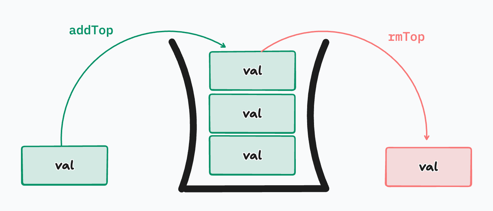
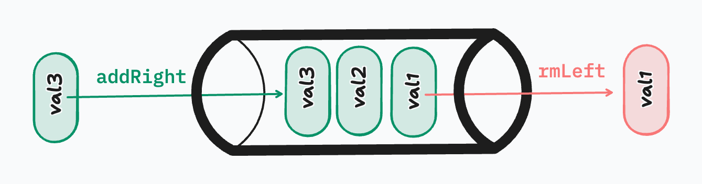

# Stacks and Queues

## Intro

As programs become more interactive and stateful, we often need ways to **control the order in which data is processed**. Sometimes the *most recent* thing should be handled first, and other times the *oldest* thing should go first. These two patterns show up constantly in software systems, from browser navigation to background job processing.

**Stacks** and **Queues** are data structures designed specifically to solve these ordering problems. They are not just academic concepts—developers rely on them daily, whether explicitly or implicitly, and they appear frequently in technical interviews because they test both reasoning and implementation skills.

In this lecture, we will focus on understanding **why stacks and queues exist**, how they behave, and how to implement them cleanly in Python.

---

## Why Stacks and Queues

Stacks and queues exist because **not all data should be accessed randomly**. In many real-world scenarios, data must be processed in a strict order, and violating that order would break expected behavior.

For example, when you press the “undo” button in a text editor, you expect the **last action you took** to be undone first—not the first action you ever made. Conversely, when requests arrive at a server, you usually want to process them in the **order they were received**, not based on which one was added last.

Stacks and queues enforce these rules by **restricting how data is added and removed**, which is what makes them powerful. Instead of asking “what data do I want?”, you ask “what data is next according to the rules?”

---

## Stacks (FILO)



A **stack** follows the principle **First In, Last Out (FILO)**—sometimes also called **Last In, First Out (LIFO)**. This means the most recent item added to the stack is always the first one to be removed.

A helpful mental model is a stack of plates. You place plates on top one at a time, and when you need a plate, you take the one from the top. You never remove a plate from the middle or the bottom.

Stacks are commonly used in:

- Undo/redo functionality
- Function call management (the call stack)
- Backtracking algorithms
- Syntax parsing

---

### Creating a Stack Class in Python

To implement a stack, we need to enforce one simple rule: **only the top of the stack is accessible**. Internally, we can use a list, but we never allow arbitrary access.

```python
class Stack:
    def __init__(self):
        self._items = []
```

This list represents the stack, but it is treated as a private implementation detail. All interaction happens through methods.

---

#### Stack addTop Method

Adding to a stack always happens at the **top**. Conceptually, this is called a **push** operation.

```python
    def addTop(self, item):
        self._items.append(item)
```

Every new item becomes the new top of the stack.

---

#### Stack removeTop Method

Removing from a stack also happens at the **top**. This is called a **pop** operation.

```python
    def removeTop(self):
        if not self._items:
            raise Exception("Stack is empty")
        return self._items.pop()
```

This ensures that the **most recently added item** is always the one removed first.

---

#### Stack peek Method

Sometimes we want to see what’s on top of the stack without removing it. This is where `peek` comes in.

```python
    def peek(self):
        if not self._items:
            raise Exception("Stack is empty")
        return self._items[-1]
```

Peek is useful when decisions depend on what’s next, but the stack state must remain unchanged.

---

## Queues (FIFO)



While stacks prioritize the most recent data, **queues** prioritize fairness and order. A queue follows the **First In, First Out (FIFO)** principle, meaning the first item added is the first one removed.

A good analogy is a line at a coffee shop. Customers are served in the order they arrive, and letting someone skip the line would break expectations.

Queues are commonly used in:

* Task scheduling
* Request handling
* Message brokers
* Breadth-first search algorithms

---

### Creating a Queue Class in Python

A queue also restricts access, but differently from a stack. Items are added at one end and removed from the other.

```python
class Queue:
    def __init__(self):
        self._items = []
```

---

#### Queue addRight Method

Adding to a queue happens at the **right end**, representing the back of the line.

```python
    def addRight(self, item):
        self._items.append(item)
```

Each new item joins the queue behind existing items.

---

#### Queue removeLeft Method

Removing from a queue happens from the **left end**, representing the front of the line.

```python
    def removeLeft(self):
        if not self._items:
            raise Exception("Queue is empty")
        return self._items.pop(0)
```

This ensures that items are processed in the same order they arrived.

---

#### Queue peek Method

Peek allows us to see who is next in line without removing them.

```python
    def peek(self):
        if not self._items:
            raise Exception("Queue is empty")
        return self._items[0]
```

This is useful for systems that need to inspect upcoming work before executing it.

---

## Stacks vs Queues

Stacks and queues solve different problems, even though they may look similar at first glance. A stack is ideal when **recency matters**, such as undoing actions or backtracking through decisions. A queue is ideal when **order matters**, such as processing jobs or handling requests.

The key difference lies in **which item gets processed next**:

* Stacks prioritize *the newest*
* Queues prioritize *the oldest*

Understanding this distinction is crucial when choosing the right data structure for a problem.

---

## Conclusion

Stacks and queues are foundational data structures that appear everywhere in computer science and real-world systems. They teach an important lesson: **how data is accessed is just as important as how it is stored**.

In this lecture, you learned why stacks and queues exist, how their ordering rules differ, how to implement both in Python, and when each structure is appropriate.

As we continue into more advanced data structures and algorithms, stacks and queues will repeatedly resurface—sometimes directly, and sometimes hidden beneath higher-level abstractions. Mastering them now builds confidence and intuition for everything that comes next.

## [Assignments](./assignments.md)