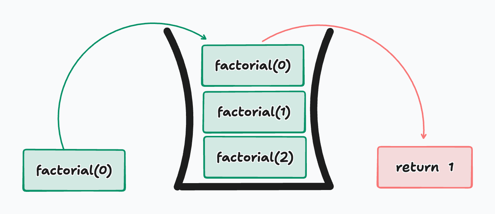

# Recursion

## Intro

As programs grow in complexity, certain problems begin to repeat the same pattern over and over again—just at a smaller scale each time. Instead of solving these problems with long loops and manual state tracking, developers often turn to a powerful technique called **recursion**.

Recursion allows a function to **solve a problem by calling itself**, breaking a large task into smaller, more manageable versions of the same task. While recursion can feel abstract at first, it is one of the most natural ways to express problems involving repetition, hierarchy, and divide-and-conquer strategies.

In this lecture, we will focus on understanding *what recursion is*, *how it works under the hood*, and *why it exists alongside loops rather than replacing them*.

---

## What is Recursion

Recursion is a programming technique where a **function calls itself** in order to solve a problem. Instead of repeating logic with a loop, recursion relies on the idea that a problem can be defined in terms of **a smaller version of itself**.

Every recursive solution is built on two fundamental ideas:
1. A way to **reduce the problem**
2. A way to **stop**

Without both, recursion will never finish executing.

A simple example of a recursive definition is factorial:

> “The factorial of a number is that number multiplied by the factorial of the number before it.”

This definition naturally describes itself in terms of itself—which is exactly what recursion does in code.

---

### Recursion and While Loops Commonalities

Recursion and loops often solve the **same types of problems**, and in many cases, anything you can write with recursion can also be written with a loop.

Both approaches: repeat work, move toward a stopping condition, and require careful control to avoid infinite execution.

A `while` loop repeats by manually updating a variable. Recursion repeats by passing a **modified argument** into the next function call.

The key difference is *how state is managed*:
- Loops manage state explicitly with variables
- Recursion manages state implicitly through function calls

This difference is why recursion can sometimes feel harder to trace—but also why it can be much cleaner for certain problems.

---

### Identifying the Stopping Condition

Every recursive function **must have a stopping condition**, often called a **base case**. The base case tells the function when to stop calling itself.

Without a base case, the function will keep calling itself which means the *call stack* will grow indefinitely, and eventually the program will crash due to execution time being exceeded.

For example, in a factorial function, the base case is typically when the input reaches `0` or `1`.

```python
def factorial(n):
    if n == 0:
        return 1
```

This line is critical. It is the moment recursion ends and results begin returning back up the call chain.

---

### Applying Recursion

Once a base case is defined, the rest of the function focuses on **reducing the problem**.

```python

def factorial(n):
  answer = 1
  while n:
    answer *= n
    n -= 1
  return answer

def factorial(n):
    if n == 0:
        return 1
    return n * factorial(n - 1)
```

Each function call reduces the value of `n` by `1`, moving closer to the base case. The function does not solve the entire problem at once—it trusts that the smaller version of the problem will be solved correctly.

This mindset is essential for writing recursive code:

> “Assume the recursive call works. Focus on how this step connects to the next.”

---

### The Call Stack



Every time a function is called, Python places it on the **call stack**. This stack keeps track of:

* The function call
* Its parameters
* Where execution should return

With recursion, multiple calls to the same function exist on the stack at once, each waiting for the next one to finish.

For example, calling `factorial(3)` results in:

* `factorial(3)` waiting on `factorial(2)`
* `factorial(2)` waiting on `factorial(1)`
* `factorial(1)` waiting on `factorial(0)`

Once the base case is reached, the stack begins to **unwind**, returning values back up the chain.

This behavior closely mirrors how a **stack data structure** works, which is why recursion and stacks are so deeply connected.

---

## Why Recursion

Recursion exists because some problems are **naturally recursive**. These problems are often difficult to express cleanly with loops, but simple and intuitive with recursion.

Common use cases include:

* Tree and graph traversal
* Divide-and-conquer algorithms
* Backtracking problems
* Parsing nested structures

Recursion also forces developers to think in terms of **problem reduction**, which is a core skill in algorithmic problem-solving and technical interviews.

That said, recursion is not always the best choice. It can be harder to debug, may use more memory due to the call stack, and can sometimes be replaced with a simpler iterative solution.

The key is not choosing recursion everywhere—but recognizing **when it makes the problem clearer**.

---

## Binary Search

Binary Search is an algorithm we've seen a few times now. Let's take a look at it again where the stopping condition is if left is less than right or if we have found our target:

```python
def binary_search(arr, target):
    left, right = 0, len(arr) - 1

    while left <= right:
        mid = (left + right) // 2

        if arr[mid] == target:
            return True
        elif target < arr[mid]:
            right = mid - 1
        else:
            left = mid + 1
    return False
```

Let's see it play out recursively now, it's important to notice the functionality is still the same, the number of operations is also the same, the difference is a bit of cleaner syntax:

```python
def binary_search(arr, target, left, right):
    if left <= right:
        return False
    elif arr[mid] == target:
        return True
    elif target < arr[mid]:
        return binary_search(arr, target, left, mid - 1)
    else:
        return binary_search(arr, target, mid + 1, right)
```

---

## Conclusion

Recursion is a powerful technique built on a simple idea: **a problem can be solved by solving smaller versions of itself**.

In this lecture, you learned:

* What recursion is and how it works
* How recursion relates to loops
* The importance of base cases
* How the call stack supports recursive execution
* Why recursion is essential in data structures and algorithms

As we move forward, recursion will become a recurring tool—especially when working with trees, graphs, and advanced algorithmic patterns. Mastering it now will make those future topics far more approachable.

## [Assignments](./assignments.md)
