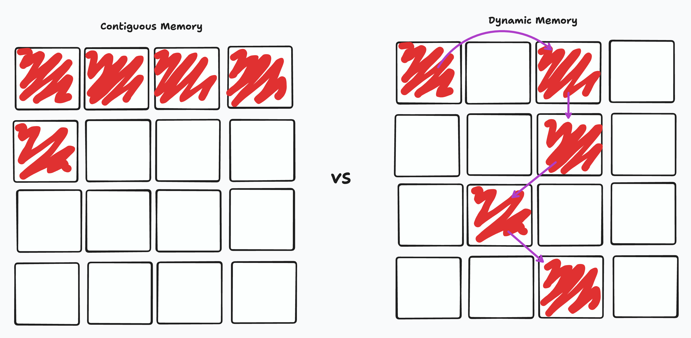
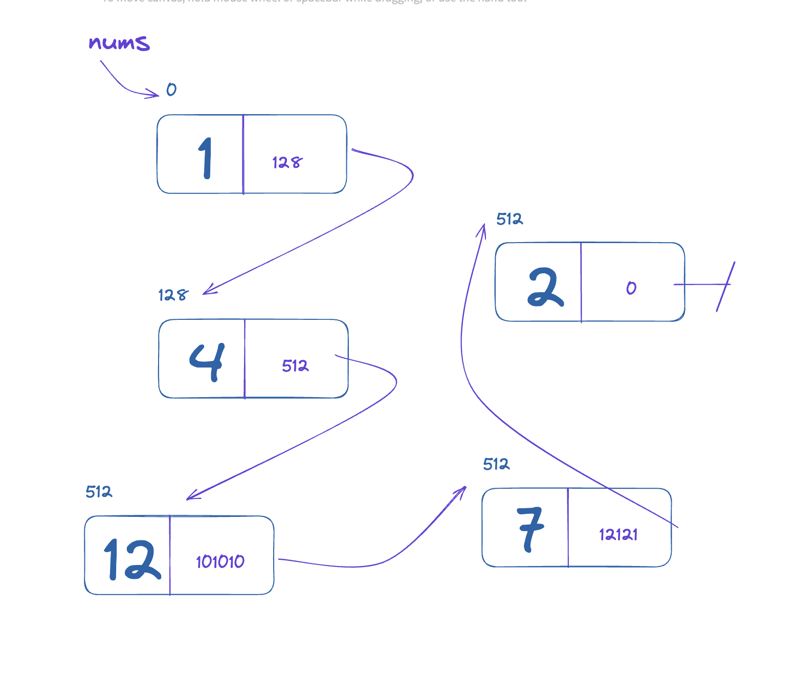

# Computer Memory and Linked Lists

## Intro

As we begin working with larger and more complex data structures, understanding **how computer memory works** becomes crucial. Not all data is stored or accessed the same way, and these differences directly affect the performance and design of the structures we implement. In this lecture, we will explore the fundamentals of computer memory, the concept of linked lists, and how to implement them in Python. By understanding memory behavior, students will be better prepared to design efficient programs and tackle algorithmic challenges.

---

## Computer Memory

At a basic level, computer memory can be thought of as a large collection of storage cells, each with a unique address. How we allocate and access memory can make a huge difference in performance and flexibility.

### Contiguous Memory

Some data structures, like arrays or Python lists, are stored in **contiguous memory blocks**. This means that every element resides next to its neighbors in a single, unbroken stretch of memory. Contiguous memory has advantages, especially in terms of speed. Accessing any element by its index is extremely fast because the computer can calculate its location directly. However, it comes with a limitation: resizing an array often requires creating a new block of memory and copying all elements over, which can be costly for large data sets.

### Dynamic Memory

Dynamic memory, on the other hand, allows data to be stored **non-contiguously**, meaning each element can exist anywhere in memory, linked together with pointers. This approach is more flexible because the structure can grow or shrink without reallocating an entire block. However, accessing elements can be slightly slower since the computer must follow references or pointers to reach the next element.

### Contiguous vs Dynamic Memory



The tradeoff between contiguous and dynamic memory boils down to **speed vs flexibility**. Contiguous memory is fast for direct access but rigid, while dynamic memory is flexible but requires more careful navigation. Linked lists take advantage of dynamic memory, offering a structure that grows and shrinks gracefully while allowing insertion and deletion operations without shifting other elements.

---

## Linked Lists in Python

A **linked list** is a collection of elements where each element, called a **node**, contains both the data and a reference to the next node in the list. Unlike arrays, linked lists are stored in dynamic memory, which allows them to expand or contract efficiently. Each node’s reference acts as a pointer to the next element, chaining the nodes together. This design makes certain operations, like inserting or removing nodes, far more efficient than performing the same operations in a contiguous array.

### Linked Lists in Computer Memory



When stored in memory, each node of a linked list can reside anywhere. The `head` of the list acts as the entry point. From there, each node points to the next, forming a chain. Traversing a linked list involves following these pointers sequentially from the head until the end is reached. This is conceptually similar to following a path through a trail where each signpost leads to the next.

### Creating a Linked List Node

In Python, a node can be implemented as a simple class with two attributes: the value it holds, and a pointer to the next node.

```python
class Node:
    def __init__(self, value):
        self.value = value
        self.next = None
    
    def __repr__(self):
      return f"VAL: {self.value} | NEXT: {self.next}"
```

Here, `value` stores the data, and `next` initially points to nothing (`None`), indicating that this node does not yet link to another.

### Creating the Linked List Class

The linked list itself is a class that maintains a reference to the first node, called the `head`. The head serves as the anchor for all operations, including iteration, insertion, and removal. Without it, the list would have no entry point.

```python
class LinkedList:
    def __init__(self, head:Node|None = None):
        self.head = head

    def __repr__(self):
      return f"{self.head}"
```

### Linked List `addNode` Method

Adding a node can be done at the end of the list by iterating to the last node and updating its `next` pointer to reference the new node. If the list is empty, the new node becomes the head.

```python
def add_node(self, value):
    new_node = Node(value)
    if self.head is None:
        self.head = new_node
        return
    current = self.head
    while current.next:
        current = current.next
    current.next = new_node
```

Let's use this method now for a Linked List:

```python
values = [0,2,3,4,5,6]
ll = LinkedList()

for val in values:
  ll.addNode(val)

print(ll)
```

### Linked List `iterate` Method

Traversing a linked list requires starting at the head and following each `next` pointer until the end. This allows us to inspect or process each node sequentially.

```python
def iterate(self):
    current = self.head
    while current is not None:
        print(current.value)
        current = current.next
```

### Linked List `rmNode` Method

Removing a node involves adjusting pointers so that the node to remove is skipped in the chain. Special care must be taken when removing the head node, since this changes the entry point of the list.

```python
def remove_node(self, value):
    current = self.head
    if current is None:
        return
    if current.value == value:
        self.head = current.next
        return
    while current.next:
        if current.next.value == value:
            current.next = current.next.next
            return
        current = current.next
```

Through this method, the chain of nodes remains intact even after removing an element, preserving the flexibility of dynamic memory.

---

## Conclusion

Linked lists highlight the power of **dynamic memory management** in programming. By separating each element into its own node and connecting nodes via pointers, they allow flexible growth, efficient insertion, and deletion without the overhead of moving other elements. Understanding the relationship between memory and data structures is critical—not only for designing efficient programs but also for interpreting performance trade-offs in technical interviews and real-world applications.

In this lecture, you learned how memory allocation affects data structure design, how linked lists are structured in memory, and how to implement core linked list operations in Python. With this foundation, you are now ready to explore more complex structures like **doubly linked lists, circular linked lists, and eventually trees**.
