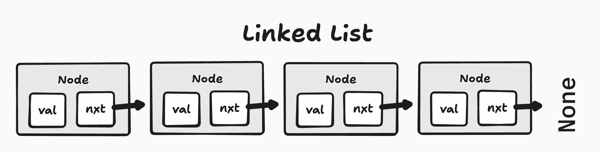
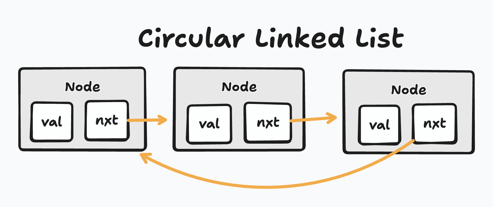
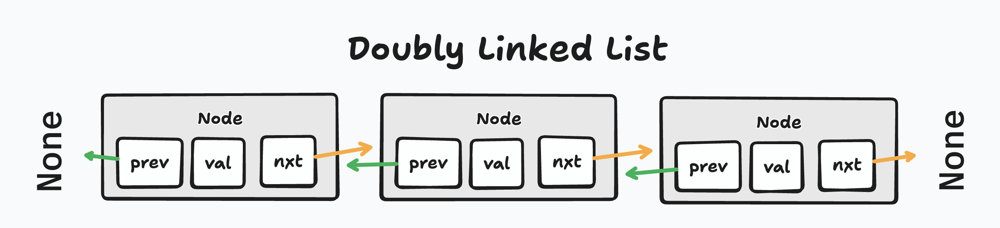

# Doubly & Circular Linked Lists

## Intro

In the last lecture, we explored **singly linked lists**, where each node points only to the next node in the sequence. While these structures are flexible and dynamic, there are scenarios where navigating backward or connecting the tail back to the head provides significant advantages. In this lecture, we will extend our knowledge by exploring **circular linked lists** and **doubly linked lists**, understanding how they differ from conventional linked lists, and when each is most useful in real-world programming.

---

## Singly Linked Lists



Before diving into advanced structures, let’s briefly revisit **singly linked lists**. In a conventional linked list, each node contains a value and a pointer to the next node. Nodes are connected sequentially, and traversal always starts at the head. Adding nodes typically involves iterating to the tail and updating the `next` reference, while removing nodes requires carefully redirecting pointers to skip the node being removed. These lists work well for operations where only forward traversal is necessary, and dynamic memory allocation allows nodes to be added or removed without shifting other elements.

### LinkedList Node

A conventional node in Python is defined simply with a value and a `next` reference:

```python
class Node:
    def __init__(self, value):
        self.value = value
        self.next = None
```

### addNode Method

Adding a node in a singly linked list involves finding the tail node and updating its `next` pointer to point to the new node:

```python
def add_node(self, value):
    new_node = Node(value)
    if not self.head:
        self.head = new_node
        return
    current = self.head
    while current.next:
        current = current.next
    current.next = new_node
```

This simple structure is often sufficient, but its limitation is the inability to traverse backward, and operations that require knowledge of previous nodes become cumbersome.

---

## Circular Linked List



A **circular linked list** solves part of this limitation by connecting the tail node back to the head. This creates a **loop** that allows continuous traversal of the list without needing to restart at the head manually. Circular lists are particularly useful for applications that require repeated iteration over a dataset, such as task scheduling, round-robin systems, or buffers in network programming.

### addNode Method

In a circular linked list, adding a node involves checking if the list is empty. If so, the new node points to itself. Otherwise, the tail node’s `next` pointer is updated to reference the new node, and the new node points back to the head:

```python
def add_node(self, value):
    new_node = Node(value)
    if not self.head:
        self.head = new_node
        new_node.next = self.head
        return
    current = self.head
    while current.next != self.head:
        current = current.next
    current.next = new_node
    new_node.next = self.head
```

This creates a **loop**, allowing traversal to wrap around seamlessly.

---

## Doubly Linked Lists



A **doubly linked list** takes linked list flexibility even further by giving each node a `prev` pointer in addition to `next`. This allows bidirectional traversal: you can move forward or backward through the list. This is valuable in scenarios such as undo-redo systems, navigation history in browsers, or when removing nodes in the middle of the list efficiently, as you no longer need to traverse from the head to locate the previous node.

### List Node with both Next and Prev

In Python, a doubly linked list node contains a value, a pointer to the next node, and a pointer to the previous node:

```python
class DNode:
    def __init__(self, value):
        self.value = value
        self.next = None
        self.prev = None
```

Adding a node in a doubly linked list requires updating both `next` and `prev` references so that the list maintains bidirectional connectivity:

```python
def add_node(self, value):
    new_node = DNode(value)
    if not self.head:
        self.head = new_node
        return
    current = self.head
    while current.next:
        current = current.next
    current.next = new_node
    new_node.prev = current
```

With both references in place, traversal and removal become more flexible and efficient.

---

## Conventional Uses

Choosing between a singly, circular, or doubly linked list depends on the problem requirements. Each structure has its own strengths and tradeoffs:

| Linked List Type     | Use Cases                                                            |
| -------------------- | -------------------------------------------------------------------- |
| Singly Linked List   | Simple lists, stacks, lightweight forward traversal                  |
| Circular Linked List | Round-robin scheduling, continuous iteration, circular buffers       |
| Doubly Linked List   | Undo/redo functionality, bidirectional traversal, efficient deletion |

Understanding these distinctions allows developers to select the right tool for a task, balancing memory overhead, traversal needs, and operational complexity.

---

## Conclusion

Circular and doubly linked lists are natural extensions of conventional singly linked lists. Circular lists create loops for continuous traversal, while doubly linked lists enable backward movement and more efficient node manipulation. Recognizing which type of list to implement—and why—helps engineers design data structures that are not only correct but optimized for their intended use case. Mastery of these variations is essential for building complex data structures, designing algorithms efficiently, and excelling in technical interviews.
