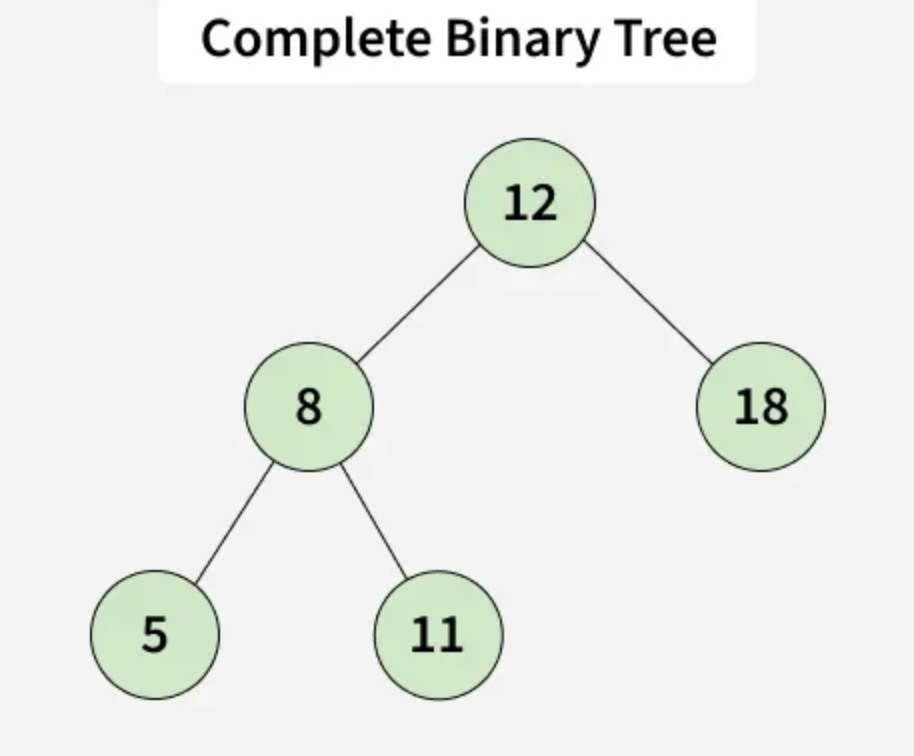
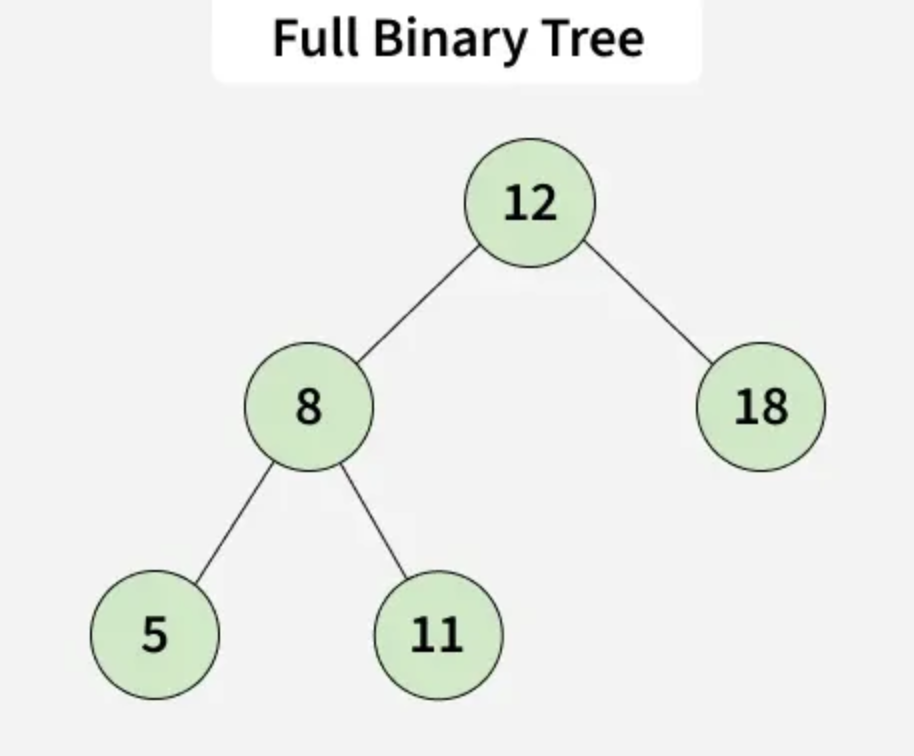
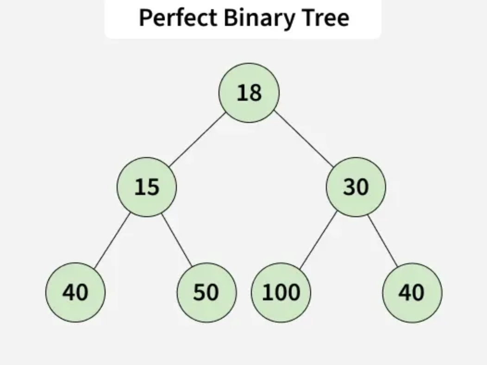
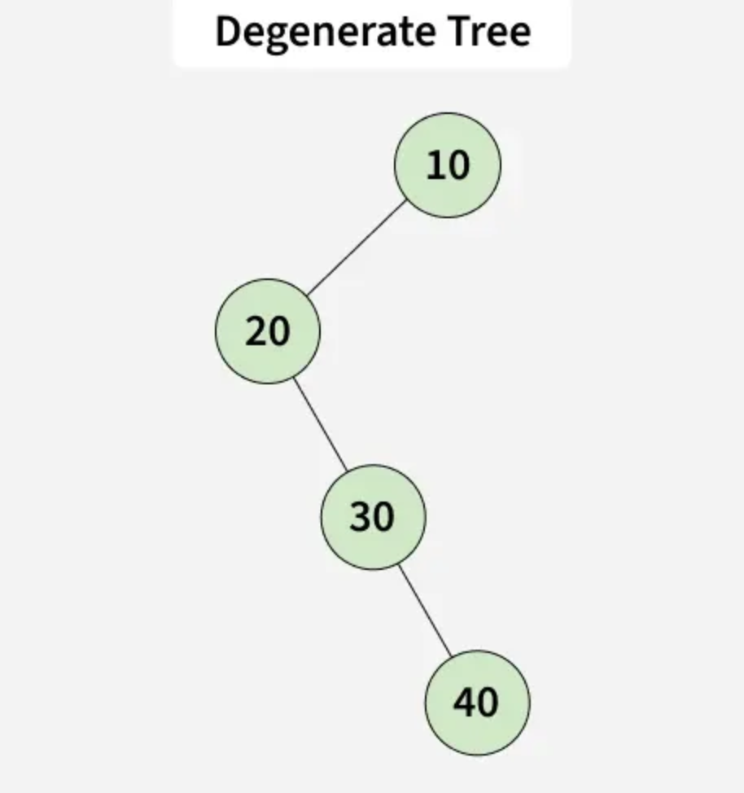

# Binary Trees in Python

## Intro

In the previous lectures, we explored linear data structures like linked lists, stacks, and queues. While these structures allow sequential access to elements, many problems require a **hierarchical organization of data**. This is where **trees** become essential. Trees are non-linear data structures that represent relationships between elements in a parent-child hierarchy. Among them, **binary trees** are one of the most widely used due to their efficiency and simplicity. In this lecture, we will explore the structure of binary trees, implement them in Python, and understand their various types.

---

## What is a Binary Tree



A **binary tree** is a hierarchical structure in which each node has at most **two children**, commonly referred to as the **left child** and the **right child**. Each node contains data and links to its children, and the topmost node of the tree is called the **root**. Binary trees are used in a wide range of applications, including searching, sorting, expression parsing, and even implementing more complex data structures like heaps and binary search trees.

---

### What is a TreeNode

A binary tree is composed of **nodes**. Each node holds a value and references to its children. These nodes form the building blocks of the tree. Without nodes, a tree cannot exist.

#### Creating a TreeNode in Python

In Python, a node in a binary tree can be represented with a simple class:

```python
class TreeNode:
    def __init__(self, value):
        self.value = value
        self.left = None
        self.right = None
    
    def __repr__(self):
        return f"VAL: {self.value} | LEFT: {self.left} | Right: {self.right}"
```

Here, `value` stores the data, while `left` and `right` point to the node’s children. If a child does not exist, the reference remains `None`.

---

### Creating a BinaryTree Class

To manage the binary tree as a whole, we can create a `BinaryTree` class. This class typically stores a reference to the **root node**, which is the entry point into the tree:

```python
class BinarySearchTree:
    def __init__(self, root:TreeNode|None = None):
        self.root = root

    def __repr__(self):
        return f"{self.root}"
```

#### What is `root` for a Binary Tree

The `root` node represents the **topmost element** of the tree. All other nodes are either descendants of the root or the root itself. Any traversal, insertion, or search operation begins at the root. Without a root, a tree is considered empty.

---

## Types of Binary Trees

Binary trees can take different forms depending on how nodes are arranged. Understanding these types helps in choosing the right tree structure for a particular problem.

### Full Binary Tree



A **full binary tree** is one where **every node has either 0 or 2 children**. There are no nodes with only one child. Full trees are often used in decision trees and expression parsing.

### Complete Binary Tree


A **complete binary tree** is filled on all levels **except possibly the last**, which is filled **from left to right**. This structure is commonly used in heap implementations, as it ensures minimal height and balanced insertion.

### Perfect Binary Tree



A **perfect binary tree** is both **full and complete**. Every internal node has exactly two children, and all leaf nodes are at the same level. Perfect trees provide an ideal scenario for algorithms that require balanced trees, like binary search trees.

### Degenerate / Skewed Tree



A **degenerate tree**, also called a **skewed tree**, occurs when each internal node has only **one child**. The tree essentially resembles a **linked list**. Skewed trees often arise from unbalanced insertion sequences and should be avoided when efficiency is a concern.

## Binary Search Trees (BST)

While all Binary Search Trees are binary trees, **not all binary trees are Binary Search Trees**. A **Binary Search Tree (BST)** introduces a strict ordering rule that allows for **efficient searching, insertion, and deletion**.

In a Binary Search Tree, every node follows this invariant:

- All values in the **left subtree** are *less than* the node’s value  
- All values in the **right subtree** are *greater than* the node’s value  

This rule applies **recursively** to every subtree. Because of this structure, a BST allows us to eliminate half of the remaining tree at every step when searching—similar to binary search on a sorted list.

BSTs are foundational to many real-world systems, including databases, indexing engines, and memory allocators.

---

### Why Binary Search Trees Matter

The key advantage of a BST is **efficiency through structure**. When balanced, searching, inserting, and deleting values can all be done in **O(log n)** time. This is a massive improvement over linear structures like lists or linked lists, which require **O(n)** time for the same operations.

However, this performance depends on the tree remaining reasonably balanced. If values are inserted in sorted order, a BST can degrade into a skewed tree and lose its performance benefits—something we will address later when discussing self-balancing trees.

---

### Adding a TreeNode Method to a BST

Adding nodes to a binary tree depends on the rules you want to follow (e.g., binary search tree rules, complete tree rules). At its core, adding a node involves checking whether the left or right child is available and recursively placing the new node in the correct location:

```python
    def add_node(self, value):
        new_node = TreeNode(value)
        if not self.root:
            self.root = new_node
            return

        def _insert(current, new_node):
            if new_node.value < current.value:
                if current.left is None:
                    current.left = new_node
                else:
                    _insert(current.left, new_node)
            else:
                if current.right is None:
                    current.right = new_node
                else:
                    _insert(current.right, new_node)

        _insert(self.root, new_node)
```

This example demonstrates insertion for a **binary search tree**, where the left child is always less than the parent and the right child is greater. Understanding this pattern is crucial for more advanced tree operations like searching, deletion, and traversal.

---

## Conclusion

Binary trees form the foundation for many **efficient data structures** and algorithms. By understanding **TreeNodes**, the **root**, and the **different types of binary trees**, students gain the ability to model hierarchical relationships and build more complex structures. Mastery of binary trees is essential for tackling **searching and sorting problems, recursion, and algorithmic challenges** encountered in technical interviews and real-world software development.
