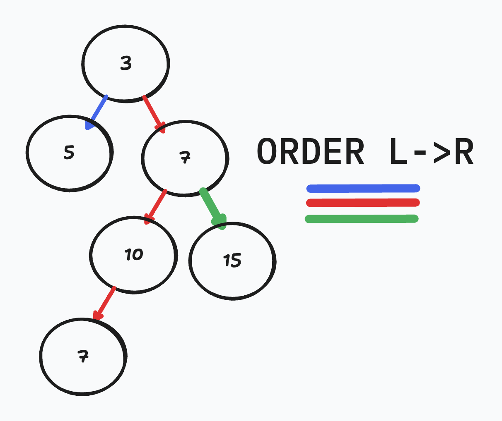
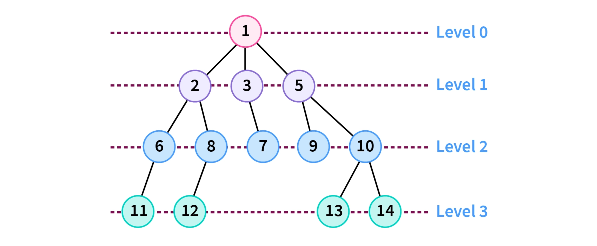

# DFS & BFS

## Intro

Once data is organized into a tree, the next critical question becomes: **how do we move through it?**  
Traversal is not about *what* data we store, but *how we explore it*. Two of the most important traversal strategies in computer science are **Depth First Search (DFS)** and **Breadth First Search (BFS)**.

These traversal techniques are not limited to trees—they extend to graphs, file systems, AI pathfinding, and even social networks. Understanding *how* and *why* DFS and BFS work builds intuition that carries across many domains in software engineering.

---

## Binary Search Trees

Before discussing traversal strategies, we need a consistent structure to traverse. Below is the Binary Search Tree implementation we will be working with throughout this lecture.

```python
class TreeNode:
    def __init__(self, value):
        self.value = value
        self.left = None
        self.right = None
    
    def __repr__(self):
        return f"VAL: {self.value} | LEFT: {self.left} | Right: {self.right}"

class BinarySearchTree:
    def __init__(self, root: TreeNode | None = None):
        self.root = root

    def __repr__(self):
        return f"{self.root}"

    def add_node(self, value):
        new_node = TreeNode(value)
        if not self.root:
            self.root = new_node
            return

        def _insert(current, new_node):
            if new_node.value < current.value:
                if current.left is None:
                    current.left = new_node
                else:
                    _insert(current.left, new_node)
            else:
                if current.right is None:
                    current.right = new_node
                else:
                    _insert(current.right, new_node)

        _insert(self.root, new_node)
```

This tree structure gives us a root entry point, left and right child references, and a predictable ordering—making it ideal for demonstrating traversal strategies.

---

## Searching Through the Tree

Searching through a tree is fundamentally different from searching through a list. There is no single “next” element. Instead, traversal requires **decisions** at each node.

Before writing code, it’s important to think conceptually about what traversal requires:

When visiting a node, we must decide:

* When should the node be processed?
* Which child should be explored next?
* Should we fully explore one branch before moving to another?
* What data structure helps us remember where to go next?

The answers to these questions define the traversal strategy.

DFS and BFS differ not in *what* they visit, but **the order in which they visit nodes** and **how they keep track of progress**.

---

## Depth First Search (DFS) — Stack through Recursion



Depth First Search explores a tree by going **as deep as possible along one branch before backtracking**. This mirrors the natural behavior of recursion, making DFS an excellent fit for recursive implementations.

Conceptually, DFS works by:

* Visiting a node
* Recursively exploring one child subtree
* Only after finishing that subtree does it move to the next

The call stack implicitly keeps track of where the algorithm has been and where it should return next.

---

### DFS Traversal Example (In-Order)

```python
def dfs_in_order(node):
    if not node:
        return

    dfs_in_order(node.left)
    print(node.value)
    dfs_in_order(node.right)
```

This example demonstrates **in-order traversal**, which is especially meaningful for Binary Search Trees because it processes values in **sorted order**.

DFS can also be implemented as pre-order or post-order traversal depending on *when* the node is processed relative to its children.

DFS excels when the solution is likely deep in the tree or when memory usage needs to be minimized, since recursion only stores a single path at a time.

---

## Breadth First Search (BFS) — Queue



Breadth First Search takes a fundamentally different approach. Instead of diving deep, BFS explores the tree **level by level**, visiting all nodes at one depth before moving to the next.

This traversal requires an explicit data structure to keep track of which nodes should be visited next. A **queue** is the natural choice, since it preserves the order in which nodes are discovered.

Conceptually, BFS works by:

* Visiting the root first
* Visiting all children of the root
* Then all grandchildren
* Continuing outward level by level

---

### BFS Traversal Example

```python
def bfs(root):
    if not root:
        return

    queue = Queue([root])

    while queue._items:
        current = queue.popleft()
        print(current.value)

        if current.left:
            queue.append(current.left)
        if current.right:
            queue.append(current.right)
```

Unlike DFS, BFS does not rely on recursion. Instead, it uses a queue to explicitly manage traversal order. This makes BFS particularly useful when **the shortest path** or **closest match** matters.

---

## DFS vs BFS

| Scenario / Goal                        | DFS                        | BFS                          |
| -------------------------------------- | -------------------------- | ---------------------------- |
| Traversal order                        | Deep before wide           | Level by level               |
| Primary data structure                 | Call stack (recursion)     | Queue                        |
| Memory usage                           | Lower (single path stored) | Higher (stores entire level) |
| Works well for deep solutions          | ✅ Yes                      | ❌ Not ideal                  |
| Finds shortest path in unweighted tree | ❌ No                       | ✅ Yes                        |
| Easy recursive implementation          | ✅ Very                     | ❌ No                         |
| Used in BST sorted traversal           | ✅ In-order DFS             | ❌ Not applicable             |
| Common interview usage                 | ✅ Very common              | ✅ Very common                |

---

## Conclusion

DFS and BFS are not competing algorithms—they are **tools for different jobs**. DFS emphasizes depth, recursion, and minimal memory usage, making it ideal for structural exploration and ordered traversal. BFS emphasizes proximity and fairness, ensuring that nodes are explored in the order they are discovered.

Understanding *how* these traversals work and *why* they behave differently is more important than memorizing code. Once the traversal strategy is clear, the implementation becomes a natural extension of the idea.

Mastery of DFS and BFS unlocks the ability to reason about trees, graphs, recursion, and performance—skills that are foundational to both real-world systems and technical interviews.
