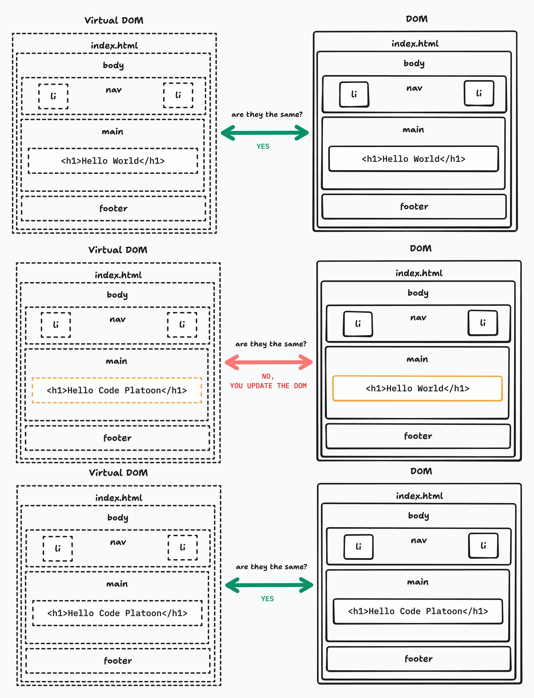
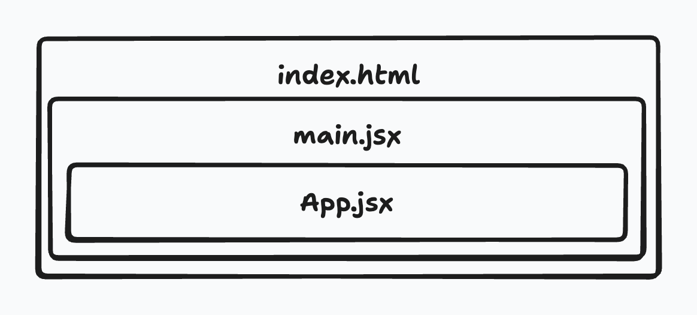

# Intro to React + Vite

## Intro

In this lecture, students are introduced to React as a modern front-end library and Vite as a fast development toolchain that supports it. The purpose of this lesson is not to teach React state management or hooks, but to help students understand how React fits into the evolution of front-end development and how it differs from vanilla JavaScript DOM manipulation. By the end of this lecture, students should understand how a React application starts, how JSX is rendered in the browser, and how React organizes UI logic compared to traditional approaches.

---

### What is React?

React is a JavaScript library for building user interfaces. Rather than manually querying and manipulating DOM nodes, React encourages developers to describe what the UI should look like based on data, and then lets React handle updating the DOM when that data changes. React is component-based, meaning applications are broken into small, reusable pieces of UI that can be composed together to form complex interfaces.

At its core, React is still JavaScript running in the browser. It does not replace HTML, CSS, or JavaScript, but instead provides a structured way to combine them. Understanding React effectively requires understanding what problems it solves compared to vanilla DOM manipulation.

---

### What is Vite?

Vite is a modern build tool and development server designed to provide extremely fast startup and hot-reload times for front-end projects. Traditional tooling like Webpack can be slow to configure and start, especially for beginners. Vite leverages native ES modules in the browser during development, which allows it to serve files almost instantly.

When paired with React, Vite provides a lightweight and developer-friendly way to scaffold, run, and build applications without hiding what is happening under the hood.

---

### React Virtual DOM vs Vanilla JS

In vanilla JavaScript, developers directly interact with the real DOM by selecting elements, creating nodes, appending children, and updating styles or text. This gives fine-grained control but can quickly become complex and error-prone as applications grow.

React introduces the concept of a Virtual DOM, which is an in-memory representation of the UI. Instead of directly modifying the browser’s DOM, React calculates the difference between the previous UI state and the new UI state, then applies the minimal set of changes needed. This approach improves performance and creates a predictable rendering model, especially for applications with frequent updates.

#### How it Works

Think of the Virtual DOM as a copy that's consistently being compared against the DOM and updating it by injecting or removing components from the DOM.



---

## React + Vite Project

### Starting a Project with `npm`

A React + Vite project begins by using `npm` to scaffold the application. This process generates a project structure with all required dependencies and configuration files. Rather than writing setup code manually, developers rely on tooling to establish a standardized environment that mirrors professional workflows.

The important takeaway is not memorizing commands, but understanding that `npm` manages dependencies and scripts, and Vite acts as the development server and bundler.

#### Creating the Project

You can create your project by executing one of the following:

```bash
npm create vite <nameOfProject>
```

This creates a directory where your React + Vite Project will be stored.

**or**

```bash
npm create vite .
```

This will create your React + Vite Project within the directory where this command was executed.

Now within your project you must install your dependencies by running:

```bash
npm install
```

---

## Docker and React

This time we will utilize Docker to continuously host our React project meaning that the created container will have to continuously run within the Docker Engine. This causes a couple of new concepts that we will have to tackle:

- How do I link a port within the Docker Network to my OS port?
- Is there configuration that must be added to my Project in order for it to be hosted within multiple layers of the Docker Network?
- If once a Docker Image is created the Docker Container holds stale files of your project, so how do we update them within the Container without having to recreate the image every time we make an update to our application?

### Preparing the Vite Project

Due to the Docker Engines nature there are multiple layers prior to exposing a port. Because of this we have to tell our vite project to host the development server at every parent level. We do so by editing `package.json` *scripts* section to hold the `--host` flag to the `dev` command:

```json
"scripts": {
  "dev": "vite --host"
}
```

### The Dockerfile

The *Dockerfile* itself doesn't differ too much from what we've seen in the past:

```Dockerfile
FROM node:18

WORKDIR /app

COPY . .

RUN npm install

EXPOSE 5173

CMD ["npm", "run", "dev"]
```

You can see some familiar actions here:

- set up a *node* environment
- create an *app* directory within the Docker Container
- copy our project from our *os* onto the *app* directory within the *container*
- install dependencies 
- **expose the development server port**
- run the server

We can build this image as we have before but the running command will look very different.

### Running the Container

Here is how you should run your container moving forward:

```bash
docker run \
  --rm \
  -p 5173:5173 \
  -v $(pwd):/app \
  -v /app/node_modules \
  --name react-container \
  my-vite-image
```

Lets break it down to ensure we understand what's going on:

- `--rm`: We don't want to over populate our Docker Engine by holding a bunch of containers that aren't active. By nature Docker keeps containers unless explicitly told to remove them. By adding the *--rm* we are explicitly telling docker to remove this container once the container stops running.
- `-p 5173:5173`: This will *link* our machines port 5173 to the Docker Networks port 5173 allowing us to see our Vite application.
- `-v $(pwd):/app` & `-v /app/node_modules`: This are the new commands we have never seen before. This is called *mounting* and this is where we are creating a link between our current directory where our project lives and the app directory within the Docker Container. This means anytime our project and it's dependencies are updated locally so are they within the container. 
- `--name react-container`: this gives the container a name that we can reference in case we want to stop the container. You can view this by running `docker ps`

---

## React Project Breakdown

#### `package.json`

The `package.json` file defines the project’s metadata, dependencies, and scripts. It tells `npm` which libraries are required and how to start, build, or test the application. This file acts as the central configuration for the project.

---

#### `.gitignore`

The `.gitignore` file specifies which files and directories should not be tracked by Git. In React projects, this typically includes dependency folders and build artifacts that can be regenerated automatically. This ensures that our git history doesn't get overly packed with unnecessary file and directory updates that `npm` already manages for us. 

---

#### `node_modules`

The `node_modules` directory contains all installed dependencies. These files are not written by developers directly and should never be committed to version control. Understanding this folder helps students reason about dependency management and project size.

---

#### `index.html`

Unlike traditional HTML projects where most markup lives in the HTML file, React applications use `index.html` primarily as an entry point. It contains a root element where the React application will be injected. This file rarely changes once the project is created. Make no mistake, when your application renders on the Browser it starts by asking for this file, the rest of your React app is then injected.

---

#### `src` Directory

The `src` directory contains the application’s source code. This is where developers spend most of their time writing JavaScript and JSX. React components, styles, and helper functions live here.

---

#### `App.jsx`

`App.jsx` represents the main application component. It defines the structure of the UI using JSX, which looks like HTML but is actually JavaScript. This file demonstrates how React components return markup that describes what should appear on the screen.

---

#### `main.jsx`

`main.jsx` is the true entry point of the React application. It connects React to the DOM by telling React where to render the application. This file is responsible for mounting the `App` component into the root element defined in `index.html`.

---

## How Does the Browser Render App.jsx



When the application starts, the browser loads `index.html`, which includes a script pointing to `main.jsx`. React then executes JavaScript that creates a Virtual DOM representation of `App.jsx`. React compares this virtual representation to the real DOM and renders the necessary elements into the root node. From this point forward, React controls updates to that section of the DOM.

This process highlights that React does not replace the browser or the DOM; it orchestrates how updates occur.

---

## React Features

### Calling Variables Within JSX HTML

JSX allows JavaScript expressions to be embedded directly inside markup using curly braces. This enables developers to dynamically render values without manually selecting or updating DOM elements.

```jsx
function App() {
  let message = "Hello Buffalo";

  return (
    <>
      <p>{message}</p>
    </>
  );
}

export default App;
```

---

### Calling Functions Within JSX HTML

Functions can be invoked within JSX to compute values or return markup. This allows UI logic to live alongside the structure it affects, improving readability and maintainability compared to scattered DOM manipulation.

```jsx
function App() {
  let message = "Hello Buffalo";

  const sayHello = () => "Hello from func";

  return (
    <>
      <p>{message}</p>
      <p>{sayHello()}</p>
    </>
  );
}

export default App;
```

---

### `!class` it’s `className`

Because JSX is JavaScript, certain HTML keywords are reserved. The `class` attribute is replaced with `className` to avoid conflicts with JavaScript syntax. This reinforces that JSX is not HTML, but a JavaScript syntax extension.

```css
.myText{
  font-size: 50px;
}
```

```jsx
function App() {
  let message = "Hello Buffalo";
  const sayHello = () => "Hello from func";

  return (
    <>
      <p className="myText">{message}</p>
      <p>{sayHello()}</p>
    </>
  );
}

export default App;
```

---

### Inline Styling `{{}}`

Inline styles in JSX are written as JavaScript objects rather than strings. This double-curly syntax reflects that styles are passed as data, not raw text, and further demonstrates how React treats UI configuration as JavaScript-driven.

```jsx
function App() {
  let message = "Hello Buffalo";
  const sayHello = () => "Hello from func";

  return (
    <>
      <p className="myText" style={{color:"red"}}>{message}</p>
      <p>{sayHello()}</p>
    </>
  );
}

export default App;
```

---

## Conclusion

This lecture establishes React as a structured, declarative alternative to direct DOM manipulation while reinforcing that React is still built on core web technologies. By understanding how React applications are created, rendered, and organized, students gain the context needed to appreciate hooks, state management, and component lifecycles in later lessons. The emphasis here is on understanding the *why* behind React, not just the *how*, ensuring students transition from vanilla development to React with confidence and clarity.
