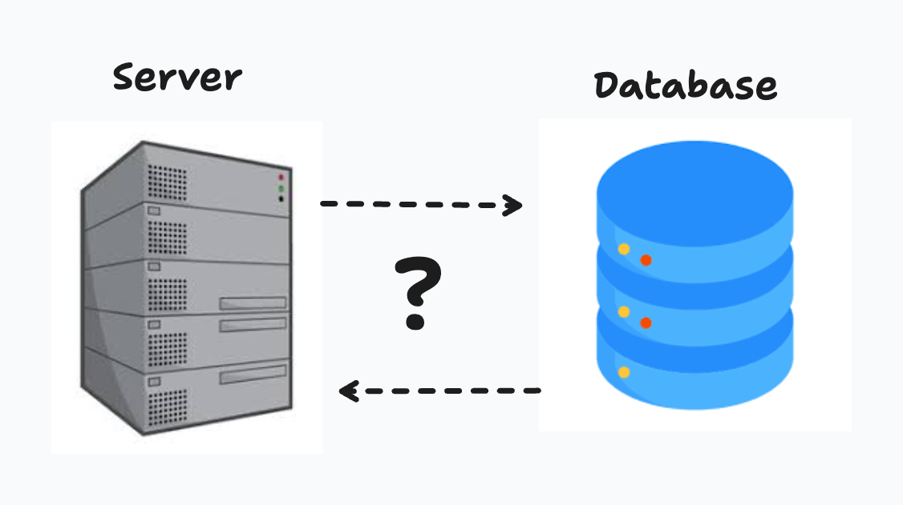
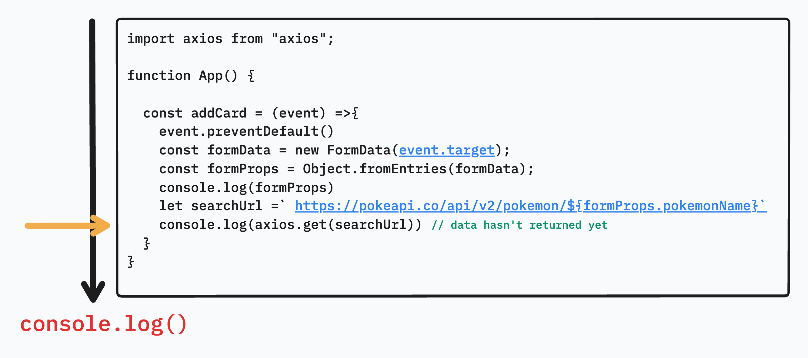
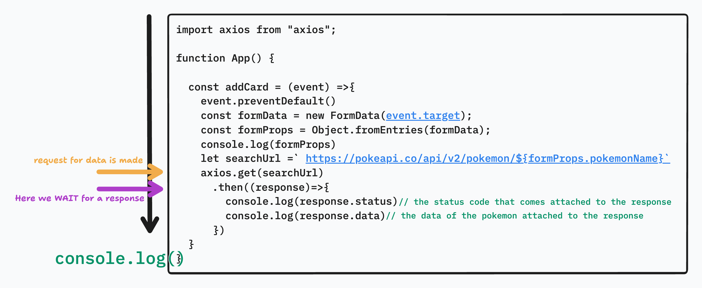

# Asynchronous Requests

## Intro

Modern front-end applications are rarely static. They depend on data that lives somewhere else, often on a server that the application must communicate with over the network. In this lecture, we focus on how front-end applications make requests for data, why those requests must be asynchronous, and how JavaScript handles waiting for data without freezing the user interface.

At this stage, the goal is conceptual understanding and mechanical familiarity with asynchronous requests. We intentionally avoid React state and hooks. Instead, we rely on vanilla JavaScript patterns and direct DOM manipulation so students can clearly see how data flows from a server into the UI.

---

## What are Requests


A request is a message sent from a client, usually a browser, to a server asking for something. That “something” might be data, confirmation that data was saved, or permission to access a resource. Requests travel over HTTP and include information such as the destination, the type of action being performed, and sometimes data that the server needs to process.

From the front-end perspective, making a request means asking an external system for information that the browser does not already have.

---

## Why do Front-End Applications Depend on Requests

Front-end applications depend on requests because browsers do not store application data long-term or securely. User accounts, application content, and shared resources must live on a server so they can be accessed by many users and remain consistent across sessions and devices.

Any time an application displays user-specific data, pulls content from a database, or interacts with third-party services, it must rely on requests. This dependency is what connects the front end to the back end and turns static pages into dynamic applications.

---

## What is Asynchronous

JavaScript runs on a single thread, meaning it can only do one thing at a time. If JavaScript waited synchronously for a request to complete, the entire application would freeze until the server responded. To prevent this, requests are handled asynchronously.

Asynchronous code allows JavaScript to start a task, move on to other work, and then come back to handle the result once it is ready. This is what keeps user interfaces responsive even when network requests take time.

**synchronous**


Think about a synchronous function as a conversation it would be rude to respond to a person prior to them completing their statement. Therefor we wait until they complete their statement and then formulate our thought and deliver our own statement. No one talks over another we just have a synchronous flowing conversation.

**asynchronous**


We can think about asynchronous like doing chores and doing laundry. We accomplish multiple tasks at once, we put the laundry in the washing machine and while the washer is going through it's cycle, we may dust the house and vacuum the floors. Then when the washer is done, we move the laundry(data) from the washer to the drier. While the drier is going through it's cycle we may mop the floors, etc. and once the drier is done we take the clothes(data), fold them and place them in the appropriate location.

---

### Breaking Down Promises

When we make an asynchronous request the program needs a placeholder for where information will be represented later on. This is called a *Promise*.

A promise represents a value that does not exist yet but will exist in the future. When a request is made, JavaScript immediately receives a promise instead of the actual data. That promise can eventually be fulfilled with data, rejected with an error, or settled once the operation completes.

Understanding promises is critical because most request-based APIs in JavaScript are promise-based. Promises give us a structured way to describe what should happen after data arrives, without blocking the rest of the application.

---

### Common Issues with Requests

Requests can fail for many reasons, including network outages, invalid endpoints, server errors, or malformed data. Even successful requests can take longer than expected. Because of this uncertainty, front-end code must always assume that requests might fail or be delayed and handle those cases gracefully.

This is why error handling and cleanup logic are essential parts of working with asynchronous code.

---

### What is the API Server Doing That Forces the Front-End to “Pause”



When a front-end sends a request, the API server may be performing several time-consuming tasks. These tasks can include validating the request, querying a database, performing calculations, or communicating with other services. Each of these steps takes time, and the front-end has no control over how long they take.

Asynchronous behavior exists specifically to accommodate this delay without degrading the user experience.

---

## What is Axios

Axios is a JavaScript library that simplifies making HTTP requests. While browsers provide built-in tools like `fetch`, Axios offers a cleaner syntax, automatic JSON handling, and better defaults for error handling.

Axios does not change how HTTP works. It simply provides a more developer-friendly interface for making requests and working with responses.

---

### Installing Axios

Axios is installed as a project dependency using `npm`. Once installed, it can be imported into JavaScript files and used to make requests from anywhere in the application.

The important takeaway is that Axios becomes just another tool in the JavaScript environment, not something special or separate from the language itself.

```bash
npm install axios
```

---

## The PokeAPI

The <a href="https://pokeapi.co/" target="_blank" rel="noopener noreferrer">PokeAPI</a> is a public API that provides structured Pokémon data. It is commonly used for learning because it is free, well-documented, and returns consistent JSON responses.

Using a real API helps reinforce that front-end applications often rely on third-party services and must adapt to the structure of external data.

---

### Exploring the API

When exploring an API, the first step is understanding the shape of the data it returns. The PokeAPI returns deeply nested JSON objects that include names, images, types, and statistics.

Before writing any code, developers should inspect API responses to understand which properties are available and which ones are relevant to the UI they want to build.

<a href="https://pokeapi.co/docs/v2" target="_blank" rel="noopener noreferrer">MAKE SURE TO READ THE DOCS</a>

---

## Interacting with the PokeAPI to Create a PokeCard

In this section, we will utilize a React project with Axios to fetch data and vanilla JavaScript to update the DOM. Rather than relying on React state, we manually create and inject elements into the page when data is received.

The goal is to make the asynchronous flow explicit and visible.

---

### App.jsx

```jsx
function App() {
  
  const addCard = (event) =>{
    event.preventDefault()
    const formData = new FormData(event.target);
    const formProps = Object.fromEntries(formData);
    console.log(formProps)
  }

  return (
    <>
      <div className="cardHolder">
        
      </div>
      <form onSubmit={(event)=>addCard(event)}>
        <input name="pokemonName" type="text" placeholder="Pokemon Name" />
        <button type="submit">Add Card</button>
      </form>
    </>
  );
}

export default App;
```

When you run this on the browser and submit the form with content you'll see an object being logged onto the browsers console with that looks as such:

```js
{"pokemonName":"Pikachu"}
```

We are going to use this form to capture user data and then request the pokemon data from the PokeAPI.

---

### Utilizing `.get().then().catch().finally()`

Axios requests return promises, which allows us to chain behavior using `.then`, `.catch`, and `.finally`. This pattern makes it clear what happens when data arrives, when an error occurs, and when the request lifecycle ends.

We will start by simply importing *axios* and making the request to the PokeAPI for data.

```jsx
import axios from "axios";

function App() {

  const addCard = (event) =>{
    event.preventDefault()
    const formData = new FormData(event.target);
    const formProps = Object.fromEntries(formData);
    console.log(formProps)
    let searchUrl = `https://pokeapi.co/api/v2/pokemon/${formProps.pokemonName}`

    console.log(axios.get(searchUrl))
  }
}
```

When you run this on the browser you'll see that there is a *Promise* object that is logged onto your console with a *pending* state. Here's what's happening:



Now let's take it a step further and add the `.then()` method to ensure we *wait* for a response from the server.

```jsx
const addCard = (event) =>{
  event.preventDefault()
  const formData = new FormData(event.target);
  const formProps = Object.fromEntries(formData);
  console.log(formProps)
  let searchUrl = `https://pokeapi.co/api/v2/pokemon/${formProps.pokemonName}`
  axios.get(searchUrl)
    .then((response)=>{
      console.log(response.status)
      console.log(response.data)
    })
}
```



Now as we stated before, we need to assume that there will come a time where the request will fail and in order to account for that we have the `.catch()` method to properly handle an failed response. Additionally we have a `.finally()` to close out the request process in case there's follow on logic we need to apply.

```js
  const addCard = (event) =>{
    event.preventDefault()
    const formData = new FormData(event.target);
    const formProps = Object.fromEntries(formData);
    console.log(formProps)
    let searchUrl = `https://pokeapi.co/api/v2/pokemon/${formProps.pokemonName}`
    axios.get(searchUrl)
      .then((response)=>{
        console.log(response.status)
        console.log(response.data)
      })
      .catch((error) => {
        console.error("Request failed:", error);
      })
      .finally(() => {
        console.log("Request completed");
      });
  }
```

Now that we are properly making a request we can easily add JavaScript to manipulate the DOM and add some Pokemon cards to our user interface.

---

### generateCard Function

```jsx
  const generateCard = (data) => {
    const container = document.querySelector("#cardHolder")
    const card = document.createElement("div");
    const name = document.createElement("h2");
    const img = document.createElement("img");
    name.textContent = data.name;
    img.src = data.sprites.front_default;

    card.appendChild(name);
    card.appendChild(img);
    container.appendChild(card);
  }
```

Now this function will create a div with the appropriate data from the PokeAPI, all we need to do is call the function once we receive a response from the PokeAPI.

```jsx
  const addCard = (event) =>{
    event.preventDefault()
    const formData = new FormData(event.target);
    const formProps = Object.fromEntries(formData);
    console.log(formProps)
    let searchUrl = `https://pokeapi.co/api/v2/pokemon/${formProps.pokemonName}`
    axios.get(searchUrl)
      .then((response)=>{
        generateCard(response.data)
      })
      .catch((error) => {
        console.error("Request failed:", error);
      })
      .finally(() => {
        console.log("Request completed");
      });
  }
```

---

### Utilizing `async` & `await`

The `async` and `await` syntax provides a cleaner way to write asynchronous code that looks synchronous while still behaving asynchronously. Under the hood, promises are still being used and processed. The only real difference is visual as in only within syntax but not in the way data is being processed.

```js
import axios from "axios";

  const addCard = async(event) =>{
    event.preventDefault()
    try{
      const formData = new FormData(event.target);
      const formProps = Object.fromEntries(formData);
      let searchUrl = `https://pokeapi.co/api/v2/pokemon/${formProps.pokemonName}`
      let response = await axios.get(searchUrl)
      generateCard(response.data)
    } catch(err) {
      console.error(err)
    }
  }
```

This approach emphasizes readability while preserving the same asynchronous behavior. The browser still does not block, and the UI remains responsive while the request is in progress.

---

## Conclusion

Asynchronous requests are the foundation of modern front-end development. They allow applications to communicate with servers, retrieve data, and update the UI without freezing the browser. By working directly with promises, Axios, and DOM manipulation, students gain a clear understanding of how data moves from an API into the interface.

This lecture establishes the mental model needed to later introduce React hooks and state management. Once students understand how asynchronous data works at a fundamental level, abstractions like `useEffect` and `useState` become far more intuitive rather than magical.
